# Section 3: Why Reactive Programming? 

Why Reactive Programming?

# What I Learned.

# Why Reactive Programming - Part 1?

    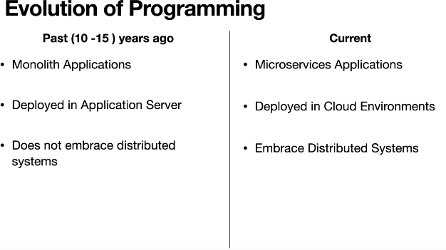

- This is today, how application is today.

    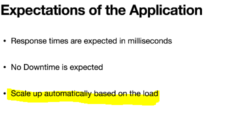

 

    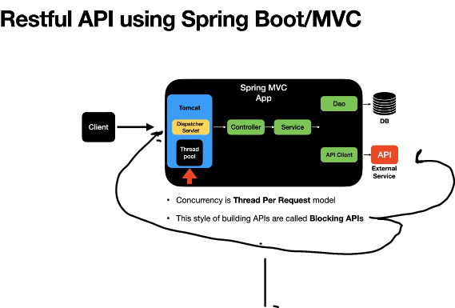

1. This type of API blocking API. Thread will be assignment for query when requested from server software.

    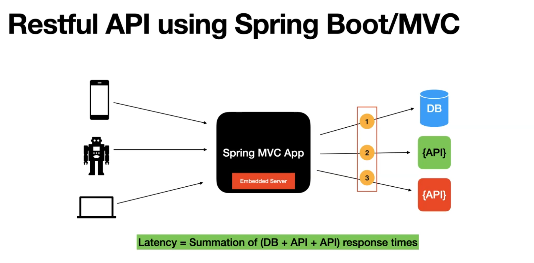

- Let's see what limitations **Spring MVC** has.

    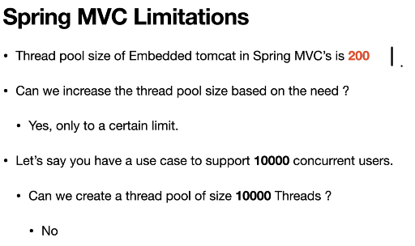

1. There is default limit for thread pool size **200**.

- Let's see why there is no infinite amount of threads.

    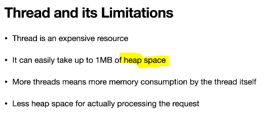

 

    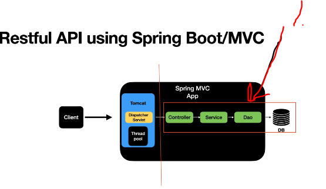

1. We can also reduce latency of the app, by improving communication inside our app.

# Why Reactive Programming - Part 2?

- To make Java calls work in parallel we can use.
    - Callbacks.
    - Futures.

    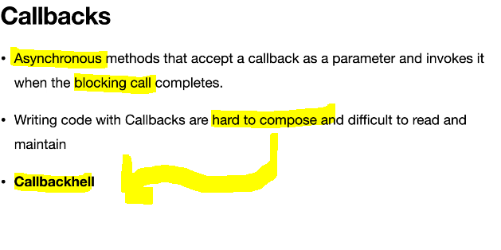

 

    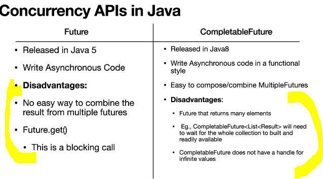

 

    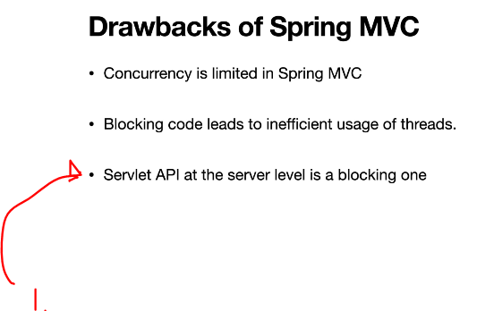

1. Even thought you write efficient code, **Servlet API** will be the bottleneck.

- **Reactive programming** will come to solve this problem.

    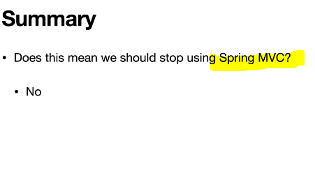

1. This does not mean that Spring MVC is still bad.

