# Section 04: Introduction to Reactive Programming: 

Introduction to Reactive Programming.

# What I Learned,

# What is Reactive Programming?

    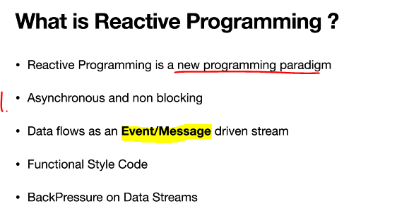

1. Any code we write will be **Asynchronous** and **non-blocking**.

    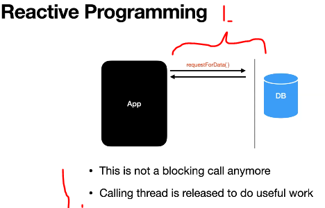

1. As soon as app request serer for data, database return call imminently.
    - This is **not** blocking call anymore, thread is released for other business.

    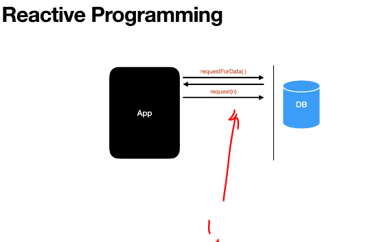

1. **App** tells to **database** that it's ready for data. 

    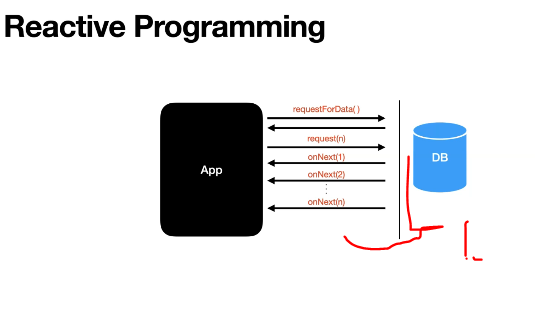

1. After request in made, data is sent in the form of the reactor stream.

    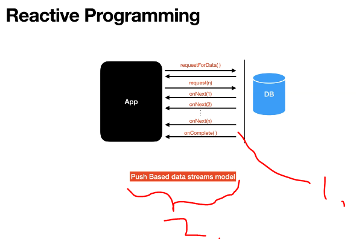

1. When all data is send to **App**. It will send **onComplete**.
2. Push Based data streams model. Data is **pushed** **source** to **caller**.

- Keep in mind these streams are not the same as **Stream API in Java 8**.

    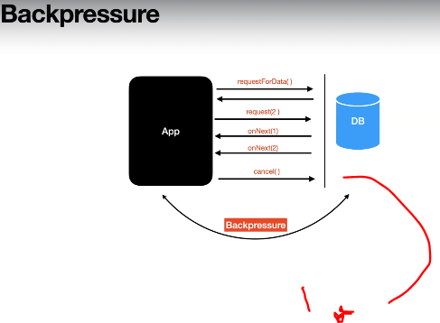

1. When **source** don't need data anymore. It can cancel the data. Here example two data number. 

    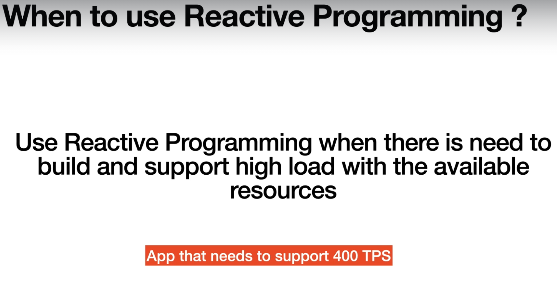

 

    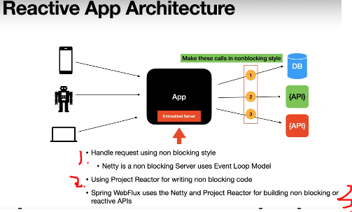

1. **Netty** can handle requests in **non blocking style**. It is based on **Event Loop Model**.
2. Code also needs to be in **non-blocking** way.
3. Spring WebFlux uses **Netty** as default and **Project reactor**.

# Introduction to Reactive Streams.

- Reactive Streams are foundation for Reactive programming.

    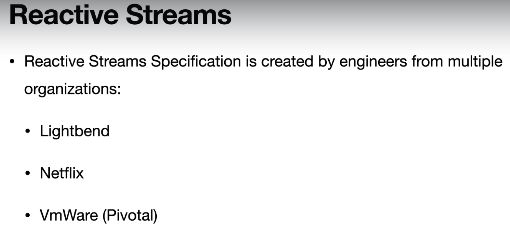

 

    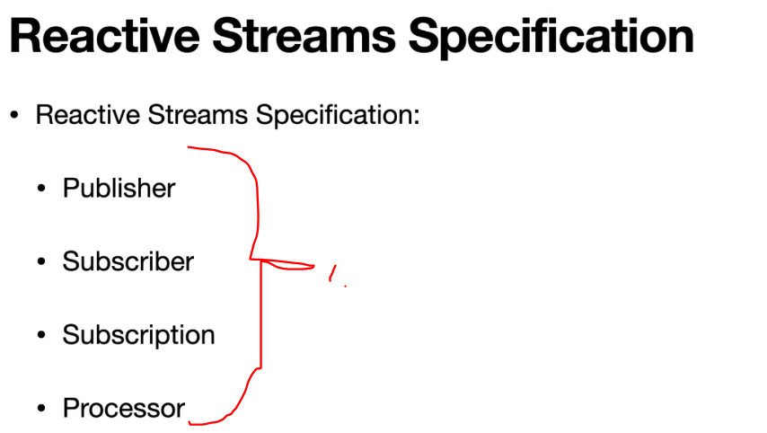

1. Specification has 4 interfaces.

    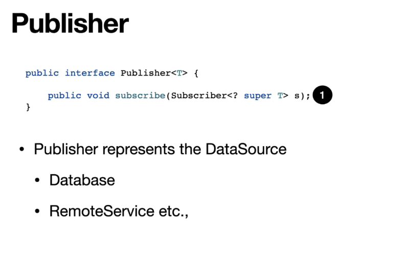

 

    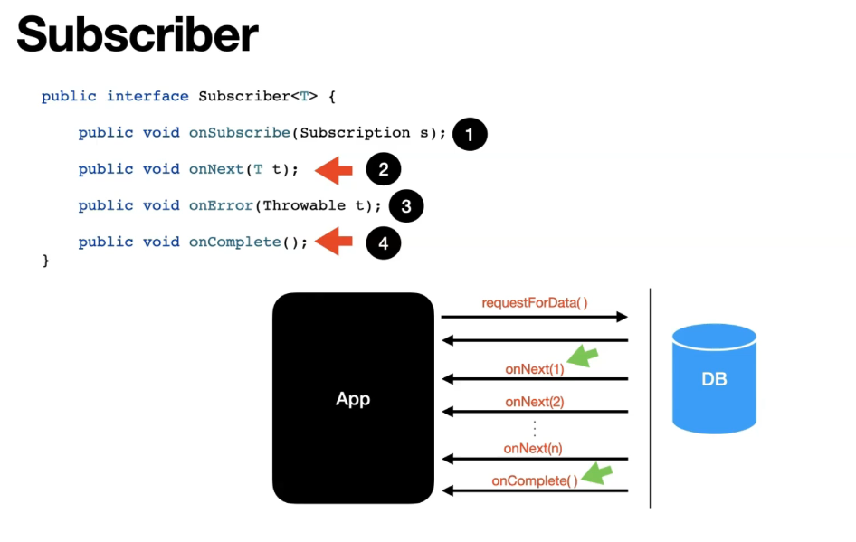

 

    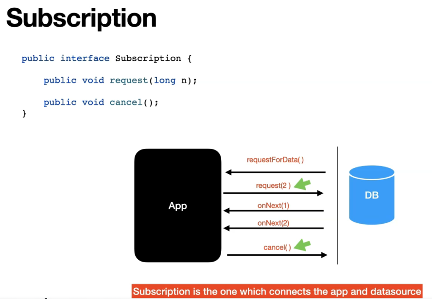

 

    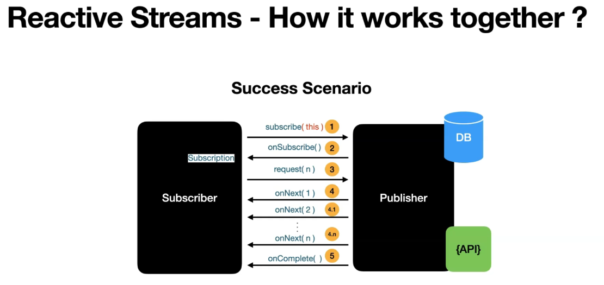

 

    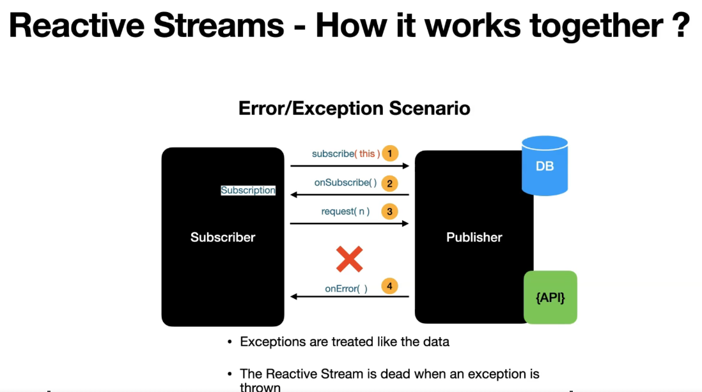

 

    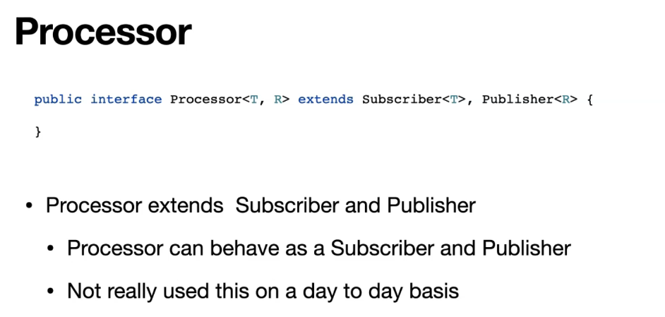

 

    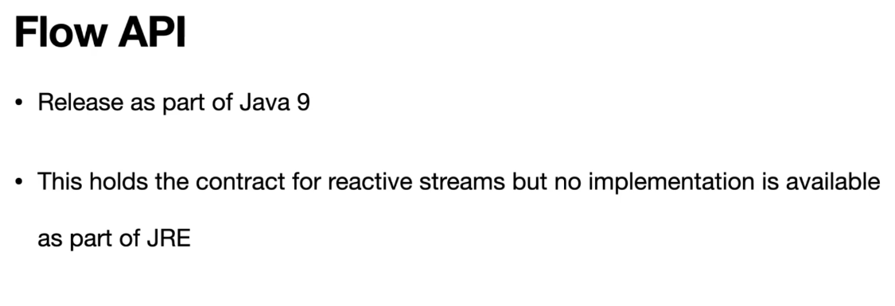

