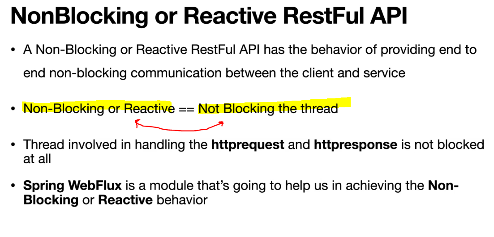
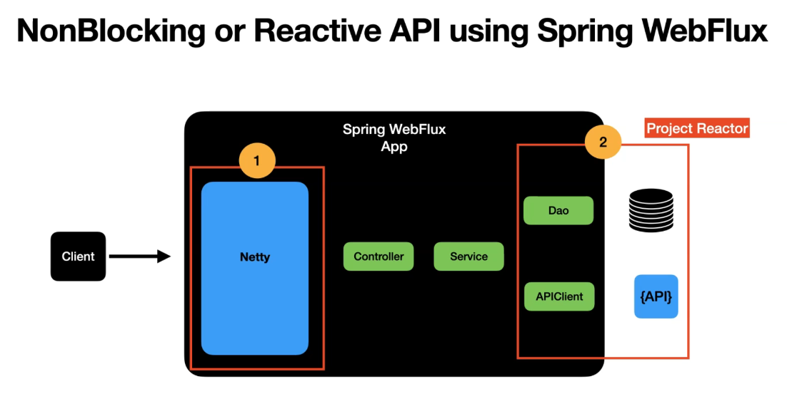

# Section 5: Introduction to Spring WebFlux

Introduction to Spring WebFlux.

# What I Learned

# 9. Non-Blocking(Reactive) RestFul API using Spring WebFlux

- **Non-blocking** means that requests thread are not blocked when there is **request** or **response**.

1. **Netty** is important to enabled in server level.
2. Other point that needs to be addressed by non-blocking. Is database and APIClient. This is taken care by **Project Reactor**.