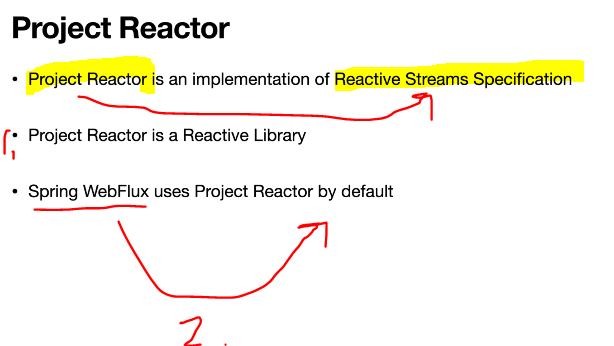
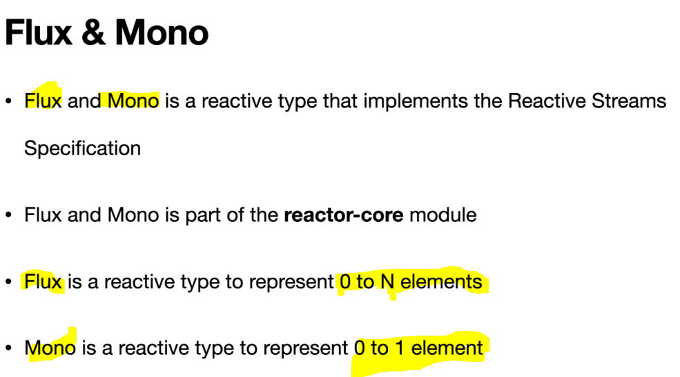
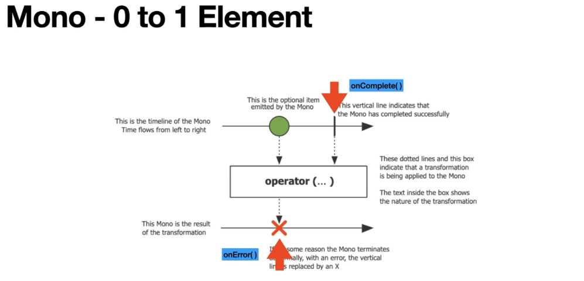

# Section 6: Getting Started with Project Reactor.

Getting Started with Project Reactor.

# What I Learned

# 10. Introduction to Project Reactor.

1. Any Library that implements **Reactive Stream Specification** is called **Reactive library**.
2. **Spring WebFlux** is using **Project Reactor** by default.

- [Link](https://projectreactor.io/).

-  Reactor Core is the main one, fundamentals.

# 11. Reactor Reactive Types - Flux and Mono.

1. Data is here.
2. Operations here.
3. Results here.

- Mono represents single elements.

- [Flux Documentation](https://projectreactor.io/docs/core/release/api/reactor/core/publisher/Flux.html).

- [Mono Documentation](https://projectreactor.io/docs/core/release/api/reactor/core/publisher/Mono.html).
