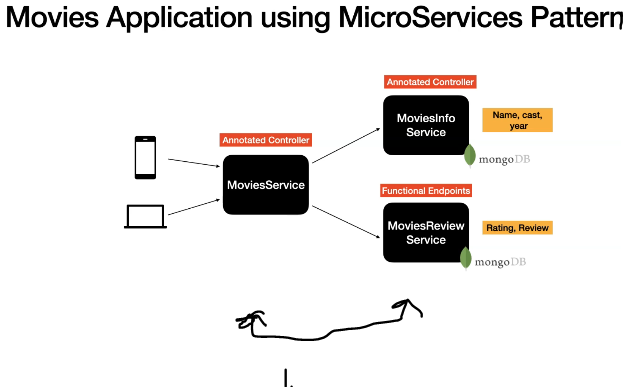

# Section 9: Introduction to Spring WebFlux

 Introduction to Spring WebFlux.

# What I Learned

# 33. Introduction to Spring WebFlux.

- Spring WebFlux [Web on Reactive Stack](https://docs.spring.io/spring-framework/docs/6.0.2/reference/html/web-reactive.html)
    - You can use this while proceeding with this course.

- **Functional Endpoint** or **Annotation approach** to build endpoints. 

# 34. What are we going to build in this Course?

1. Its common to brake down Services into **smaller ones** and **one big service** should handle all the smaller calls.