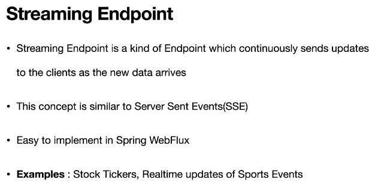
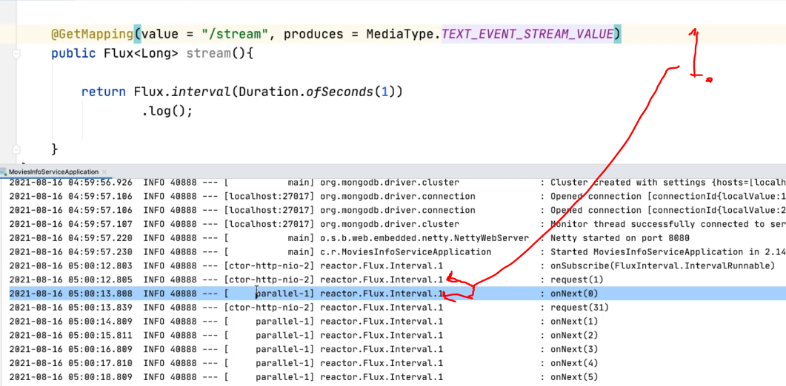

# Section 11: Simple Non Blocking RESTFUL API using Annotated Controller Approach:

Simple Non Blocking RESTFUL API using Annotated Controller Approach.

# What I Learned.

# Build a Simple Non Blocking API - Flux.

- When we write endpoint to return something. It will be by nature returning **asynchronous and non-blocking** rector type.

```
   @GetMapping("/flux")
    public Flux<Integer> flux() {
    	return Flux.just(1,2,3);
    }
    
```

# Build a simple Non Blocking API - Mono.

```
    @GetMapping("/mono")
    public Mono<String> helloWorldMono() {
    	return Mono.just("Hello World");
    }
```

# Build Infinite Streams API (SSE).

<div align="center">
  
</div>

- We are streaming data every second.

```
  @GetMapping(value = "/stream", produces = MediaType.TEXT_EVENT_STREAM_VALUE)
    public Flux<Long> stream() {
    	return Flux.interval(Duration.ofSeconds(1)).log();
    }
    
```

<div align="center">
  
</div>

1. **Request thread** and **Data handling thread** is made in separated treads. As **non-blocking**.

- This way implement nowadays thanks to **Spring of Flux**. This was much harder in old days.