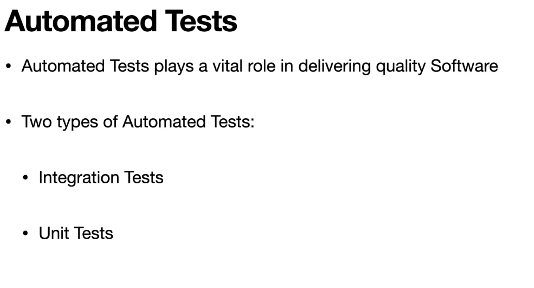
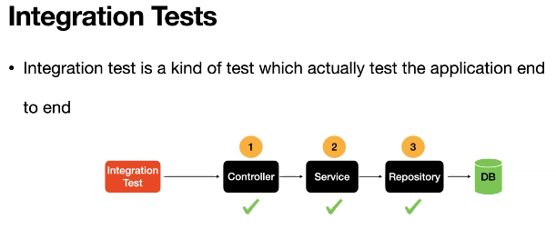
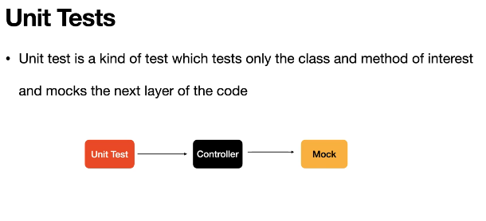

# Section 12: Automated Tests using JUnit5 and @WebFluxTest.

Automated Tests using JUnit5 and @WebFluxTest.

# What I Learned.

# Introduction to Automated Tests.

<div align="center">
    
</div>

<br>

<div align="center">
    
</div>

<br>

<div align="center">
    
</div>

1. Integration test interacts from Controller layer to the Repository layer.

<div align="center">
    
</div>

- Different folders for:
    - Integration tests.
    - Unit tests.

# Testing Spring Webflux Endpoint using@WebFlux Test Annotation.

- For simple **Controller** classes we don't need usually write integration test just good unit tests.

- We are using such to implement test.

```
@WebFluxTest(controllers = FluxAndMonoController.class)
@AutoConfigureWebTestClient

@Autowired
WebTestClient webTestClient;

```

- We are using **WebTestClient** for talking to endpoints.

```
    @Test
    void flux() {

        webTestClient.
                get()
                .uri("/flux")
                .exchange()
                .expectStatus()
                .is2xxSuccessful()
                .expectBodyList(Integer.class)
                .hasSize(3);
    }
```

# Different Approaches of Testing an Endpoint.

```

    @Test
    void flux_approach2() {

        var flux = webTestClient.
                get()
                .uri("/flux")
                .exchange()
                .expectStatus()
                .is2xxSuccessful()
                .returnResult(Integer.class)
                .getResponseBody();

        StepVerifier.create(flux)
                .expectNext(1,2,3)
                .verifyComplete();
    }
```

- Other way checking endpoint rector types.

```
 @Test
    void flux_approach3() {

        webTestClient.
                get()
                .uri("/flux")
                .exchange()
                .expectStatus()
                .is2xxSuccessful()
                .expectBodyList(Integer.class)
                .consumeWith(listEntityExchangeResult -> {

                    var responseBody = listEntityExchangeResult.getResponseBody();
                    assert (Objects.requireNonNull(responseBody).size() == 3);

                });
    }
```

# JUnit Test for the Mono Endpoint.

- Testing **Mono** endpoint.

```
    @Test
    void mono() {

        webTestClient.
                get()
                .uri("/mono")
                .exchange()
                .expectStatus()
                .is2xxSuccessful()
                .expectBody(String.class)
                .consumeWith(stringEntityExchangeResult -> {
                    var responseBody = stringEntityExchangeResult.getResponseBody();
                    assertEquals("hello-world", responseBody);

                });
    }
```

# JUnit Test Streaming Endpoint - SSE.

- Test for streaming endpoint.

```
    @Test
    void stream() {

        var flux = webTestClient.
                get()
                .uri("/stream")
                .exchange()
                .expectStatus()
                .is2xxSuccessful()
                .returnResult(Long.class)
                .getResponseBody();

        StepVerifier.create(flux)
                .expectNext(0L, 1L,2L,3L)
                .thenCancel()
        .verify();
    }
```