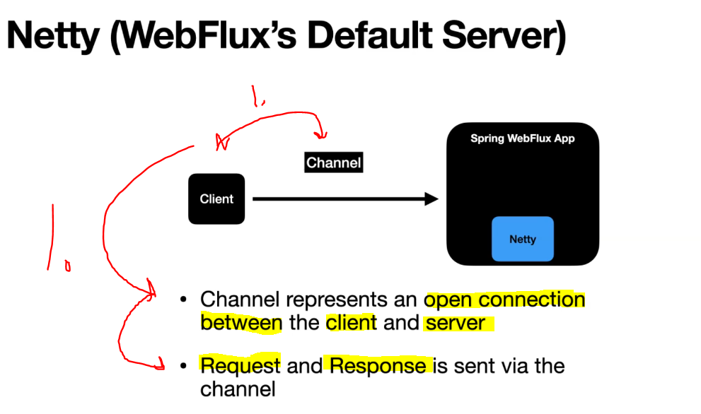
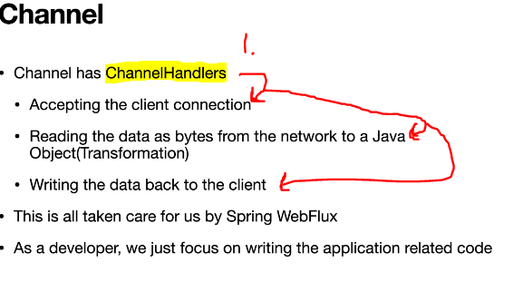
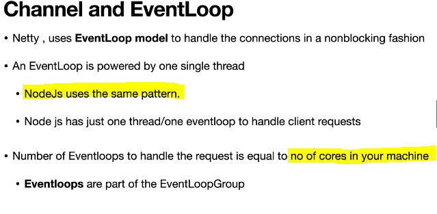
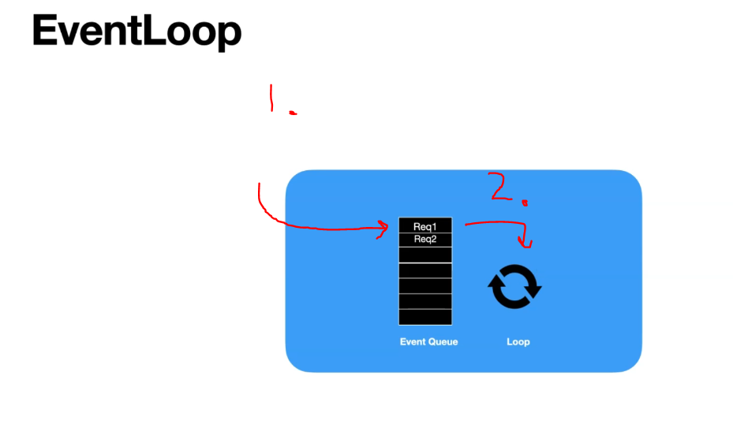
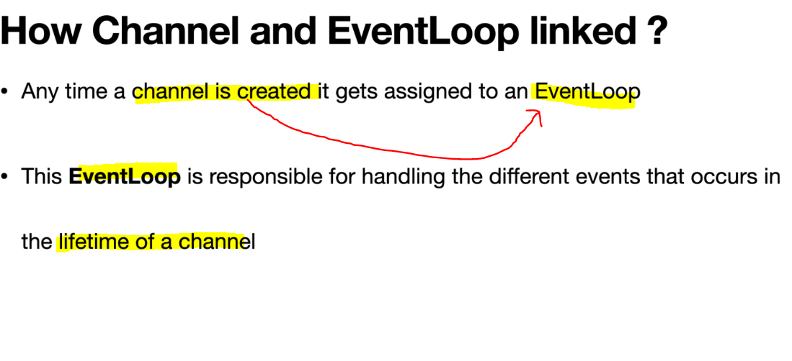
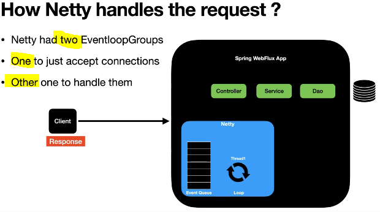

# Section 19: Spring WebFlux Under the Hood - Netty and Threading Model.

Spring WebFlux Under the Hood - Netty and Threading Model.

# What I Learned.

# How Netty works with Spring Webflux?

- End to end non-blocking nature of API.
    - There is **mainly two** parts that needs to addressed.
        1. **Netty** non-block server.
        2. Where communicate with external sources.

- We need to make sure that **threads** are not blocked in aether of these two interactions **1.** or **2.**.

    

- There are different threads involved when query is made towards the **Netty**.

- Channel in **Netty** terms is connection between client and server.

# How does Netty handle the Request?

    

1. When client is making request server, **channel** is open!

 

    

1. In channels **ChannelHandler** takes acre of internal works, such as:
    - Accepting client connection.
    - Reading data for POJO.
    - Writing data back to client.

    

 

    

1. **Requests** are going into Event Queue.
2. **Requests** are pulled from **Event Queue** as in order where they got in and executed.

 

    

 

    

1. **ChannelUnregistered** channel is **created**, but not registered with the **Eventloop**.
2. **ChannelRegistered** channel is registered with the **Eventloop**.
3. **ChannelActive** Channel is active and can send and receive data.
4. **ChannelInActive** Channel not connected to the client anymore and ready to be closed.

- These are handled by **Spring WebFlux**.

    

