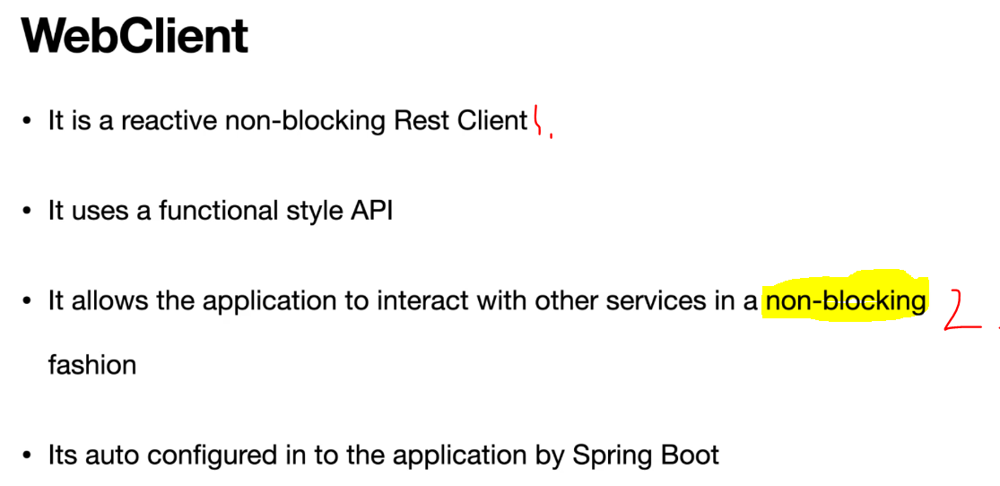

# Chapter 26: MoviesService - Rest Service connects the MovieInfo and MovieReview Service.

MoviesService - Rest Service connects the MovieInfo and MovieReview Service.

# What I Learned.

# Overview of the Application.

<div align="center">
    
</div>

- We are going build **MoviesService** and we are going use **WebClient**.

- In **Microservices** architecture its common to build different services that communicate with other services.

# MoviesController.java

```
package com.reactivespring.controller;

import java.util.List;

import org.springframework.http.MediaType;
import org.springframework.web.bind.annotation.GetMapping;
import org.springframework.web.bind.annotation.PathVariable;
import org.springframework.web.bind.annotation.RequestMapping;
import org.springframework.web.bind.annotation.RestController;

import com.reactivespring.client.MoviesInfoRestClient;
import com.reactivespring.client.ReviewsRestClient;
import com.reactivespring.domain.Movie;
import com.reactivespring.domain.MovieInfo;
import com.reactivespring.domain.Review;

import reactor.core.publisher.Flux;
import reactor.core.publisher.Mono;

@RestController
@RequestMapping("/v1/movies")
public class MoviesController {

    private MoviesInfoRestClient moviesInfoRestClient;
    private ReviewsRestClient reviewsRestClient;

    public MoviesController(MoviesInfoRestClient moviesInfoRestClient, ReviewsRestClient reviewsRestClient) {
        this.moviesInfoRestClient = moviesInfoRestClient;
        this.reviewsRestClient = reviewsRestClient;
    }

    @GetMapping("/{id}")
    public Mono<Movie> retrieveMovieById(@PathVariable("id") String movieId) {

        return moviesInfoRestClient.retrieMovieInfo(movieId)
            .flatMap(movieInfo -> {

                Mono<List<Review>> reviewListMono = reviewsRestClient.retrieveReviews(movieId)
                    .collectList();
                
                return reviewListMono.map(reviews -> new Movie(movieInfo, reviews));
            });
    }

    @GetMapping(value = "/stream", produces = MediaType.APPLICATION_NDJSON_VALUE)
    public Flux<MovieInfo> retrieveMovieInfos() {

        return moviesInfoRestClient.retrieMovieInfoStream();
    }
}

```

# Introduction to Spring WebClient & Configure WebClient.

<div align="center">
    
</div>

1. One of benefit of this, is that its **non-blocking**.
2. It allows non-blocking communication. 

- Read if you want. [WebClient](https://docs.spring.io/spring-framework/reference/web/webflux-webclient.html).

- We need to config **WebClient**.
    - By initialization of **WebClient**.


# WebClientConfig.java

```
@Configuration
public class WebClientConfig {

    @Bean
    public WebClient webClient(WebClient.Builder builder) {
        return builder.build();
    }
}
```

# Build the NonBlocking REST Client for MovieInfoService using Spring WebClient.


- We need to inject url from properties file with following code.

```
Value("${restClient.moviesInfoUrl}")
private String moviesInfoUrl;
```

- Below is where is values are injected from.
    - We are hardcoding URL values to this **yml.**.

# application.yml

```
spring:
    application:
        name: movies-service
    profiles:
        active: local
restClient:
    moviesInfoUrl: http://${MOVIES_INFO_HOST:localhost}:8080/v1/movieinfos
    reviewsUrl: http://${MOVIES_REVIEWS_HOST:localhost}:8081/v1/reviews
server:
    port: 8082

```

<div align="center">
    
</div>

1. We can **Inject** value form this **.yml** file.

- Now we will coact the path URL and calling the endpoint.

```
 return webClient
            .get()
            .uri(url, movieId)
            .retrieve()
            .bodyToMono(MovieInfo.class)
            .log();
```

# Build the NonBlocking REST Client for ReviewService using Spring WebClient.


- We can build URI with different builders.
    - **UriComponentsBuilder** from Spring library.
    - **UriBuilder** from Java library.

- We're going to use such **UriComponentsBuilder** and be using **WebClient**.

```
@Component
@Slf4j
public class ReviewsRestClient {

    private WebClient webClient;

    @Value("${restClient.reviewsUrl}")
    private String reviewsUrl;

    public ReviewsRestClient(WebClient webClient) {
        this.webClient = webClient;
    }

    public Flux<Review> retrieveReviews(String movieId) {

        String url = UriComponentsBuilder.fromHttpUrl(reviewsUrl)
            .queryParam("movieInfoId", movieId)
            .buildAndExpand().toString();

        return webClient
            .get()
            .uri(url)
            .retrieve()
            .bodyToFlux(Review.class)
    }
```

# Combine the MoviesInfoRestClient and ReviewRestClient.

<div align="center">
    
</div>

- You can see that **Movie** is having multiple **reviews**.

# MoviesController.java

```
@RestController
@RequestMapping("/v1/movies")
public class MoviesController {

    private MoviesInfoRestClient moviesInfoRestClient;
    private ReviewsRestClient reviewsRestClient;

    public MoviesController(MoviesInfoRestClient moviesInfoRestClient, ReviewsRestClient reviewsRestClient) {
        this.moviesInfoRestClient = moviesInfoRestClient;
        this.reviewsRestClient = reviewsRestClient;
    }

    @GetMapping("/{id}")
    public Mono<Movie> retrieveMovieById(@PathVariable("id") String movieId) {

        return moviesInfoRestClient.retrieMovieInfo(movieId)
            .flatMap(movieInfo -> {
                Mono<List<Review>> reviewListMono = reviewsRestClient.retrieveReviews(movieId)
                    .collectList();
                return reviewListMono.map(reviews -> new Movie(movieInfo, reviews));
            });
    }

    @GetMapping(value = "/stream", produces = MediaType.APPLICATION_NDJSON_VALUE)
    public Flux<MovieInfo> retrieveMovieInfos() {

        return moviesInfoRestClient.retrieMovieInfoStream();
    }
}

```
