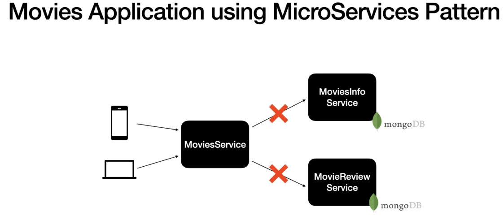
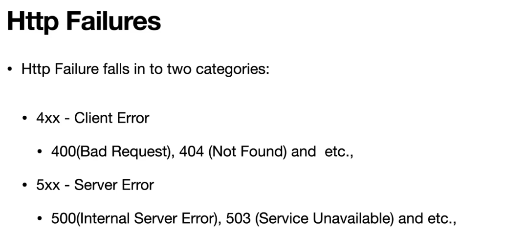

# Section 27: Handling Network Exceptions in WebClient.

Handling Network Exceptions in WebClient.

# What I Learned.

# Network Exceptions in Service to Service Communications.

<div align="center">
    
</div>

- Services can fall for HTTP failures, its common these are throwing executions.

<div align="center">
    
</div>

- There is two main **Http** failures.

# Handling 4XX in MoviesInfoService in WebClient.

- Handling exceptions.

```
    @GetMapping("/movieinfos/{id}")
    public Mono<ResponseEntity<MovieInfo>> getMovieInfoById(@PathVariable String id) {
        
        return moviesInfoService.getMovieInfoById(id)
            .map(ResponseEntity.ok()::body)
            .switchIfEmpty(Mono.just(ResponseEntity.notFound().build()));
    }
```

- Making Error handling in **Micro Service**.

```
 public Mono<MovieInfo> retrieMovieInfo(String movieId) {
        
        String url = moviesInfoUrl.concat("/{id}");
        
        return webClient
            .get()
            .uri(url, movieId)
            .retrieve()
            .onStatus(HttpStatus::is4xxClientError, clientResponse -> {

                log.info("Status code is : {}", clientResponse.statusCode().value());
                if (clientResponse.statusCode().equals(HttpStatus.NOT_FOUND)) {
                    return Mono.error(new MovieInfoClientException(
                        "There is no MovieInfo Available for the passed Id : " + movieId,
                        clientResponse.statusCode().value()));
                }

                return clientResponse.bodyToMono(String.class)
                    .flatMap(responseMessage -> {
                        return Mono.error(new MovieInfoClientException(responseMessage, clientResponse.statusCode().value()));
                    });
            })
            .onStatus(HttpStatus::is5xxServerError, clientResponse -> {

                log.info("Status code is : {}", clientResponse.statusCode().value());
                
                return clientResponse.bodyToMono(String.class)
                    .flatMap(responseMessage -> {
                        return Mono.error(new MoviesInfoServerException("Server Exception in MoviesInfoService " + responseMessage));
                    });
            })
            .bodyToMono(MovieInfo.class)
            .retryWhen(RetryUtil.retrySpec())
            .log();
    }
```

- We handle error exceptions here:

```
         .onStatus(HttpStatus::is4xxClientError, clientResponse -> {

                log.info("Status code is : {}", clientResponse.statusCode().value());
                if (clientResponse.statusCode().equals(HttpStatus.NOT_FOUND)) {
                    return Mono.error(new MovieInfoClientException(
                        "There is no MovieInfo Available for the passed Id : " + movieId,
                        clientResponse.statusCode().value()));
                }

                return clientResponse.bodyToMono(String.class)
                    .flatMap(responseMessage -> {
                        return Mono.error(new MovieInfoClientException(responseMessage, clientResponse.statusCode().value()));
                    });
            })
```

- We can attach error handling to **services itself** and to the the service which will be calling the other service as **Global error handler**. 

# Handling 5xx in MoviesInfoService in WebClient.

- We can implement microservice specific error messages.

```
        .onStatus(HttpStatus::is5xxServerError, clientResponse -> {

                log.info("Status code is : {}", clientResponse.statusCode().value());
                
                return clientResponse.bodyToMono(String.class)
                    .flatMap(responseMessage -> {
                        return Mono.error(new MoviesInfoServerException("Server Exception in MoviesInfoService " + responseMessage));
                    });
            })
```

- This `5xxx` error will be not shown in some cases, if micro service is down. It will not go into this exceptions handling block. This will be difficult to test with manually.

- There is the way to test microservices with other microservices, with integration testing.
    - We will bring **Microservice** down and test the exception handling.

# Implement the 4XX and 5XX error handling in ReviewsClient.

```
package com.reactivespring.client;

import org.springframework.beans.factory.annotation.Value;
import org.springframework.http.HttpStatus;
import org.springframework.stereotype.Component;
import org.springframework.web.reactive.function.client.WebClient;
import org.springframework.web.util.UriComponentsBuilder;

import com.reactivespring.domain.Review;
import com.reactivespring.exception.ReviewsClientException;
import com.reactivespring.exception.ReviewsServerException;
import com.reactivespring.util.RetryUtil;

import lombok.extern.slf4j.Slf4j;
import reactor.core.publisher.Flux;
import reactor.core.publisher.Mono;

@Component
@Slf4j
public class ReviewsRestClient {

    private WebClient webClient;

    @Value("${restClient.reviewsUrl}")
    private String reviewsUrl;

    public ReviewsRestClient(WebClient webClient) {
        this.webClient = webClient;
    }

    public Flux<Review> retrieveReviews(String movieId) {

        String url = UriComponentsBuilder.fromHttpUrl(reviewsUrl)
            .queryParam("movieInfoId", movieId)
            .buildAndExpand().toString();

        return webClient
            .get()
            .uri(url)
            .retrieve()
            .onStatus(HttpStatus::is4xxClientError, clientResponse -> {

                log.info("Status code is : {}", clientResponse.statusCode().value());
                if (clientResponse.statusCode().equals(HttpStatus.NOT_FOUND)) {
                    return Mono.empty();
                }

                return clientResponse.bodyToMono(String.class)
                    .flatMap(responseMessage -> {
                        return Mono.error(new ReviewsClientException(responseMessage));
                    });
            })
            .onStatus(HttpStatus::is5xxServerError, clientResponse -> {

                log.info("Status code is : {}", clientResponse.statusCode().value());
                
                return clientResponse.bodyToMono(String.class)
                    .flatMap(responseMessage -> {
                        return Mono.error(new ReviewsServerException("Server Exception in ReviewsService " + responseMessage));
                    });
            })
            .bodyToFlux(Review.class)
            .retryWhen(RetryUtil.retrySpec());
    }
}

```

- You can see that **Movie** that don't have reviews, does not return error.