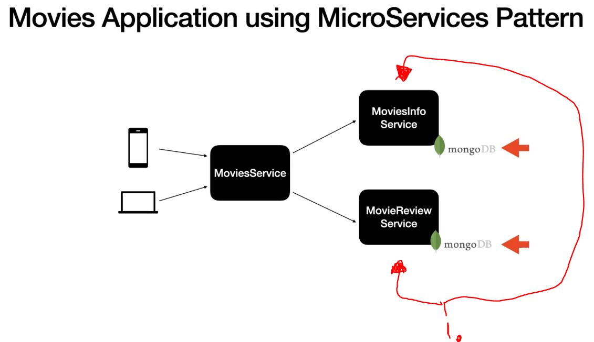
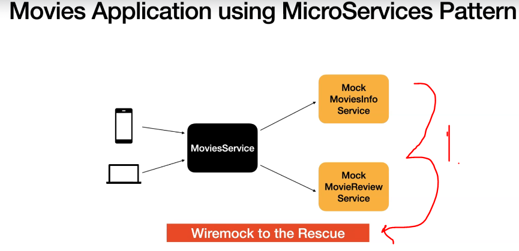
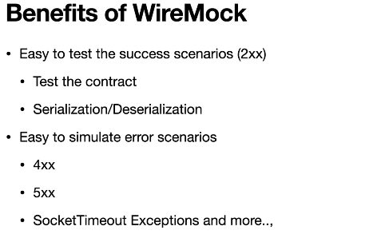
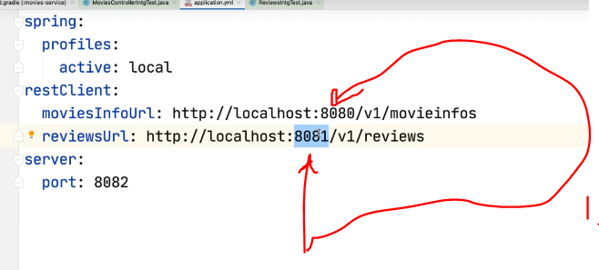

# Section 28: Integration Testing External Services using WireMock.

Integration Testing External Services using WireMock.

# What I Learned.

# Introduction to WireMock.

<div align="center">
    
</div>

1. These needs to be mocked, when we want to integrate test **MoviesService**.

<div align="center">
    
</div>

1. We can mock these ones with **WireMock**.
    - HTTP mocking library **WireMock**.

<div align="center">
    
</div>

- We can easy to test network exceptions and more.   
    - Previously we needed to bring our service to down to test this microservice.
    - This can be impossible if we are testing against **external API:s**.

- **WireMock** is a tool used for **mocking HTTP services**.
    - In contrast, **SpringBootTest** will load full context fo the application.

# SetUp Wiremock in Integration Tests.

- We need to import **WireMock**.

```
<dependency>
			<groupId>org.springframework.cloud</groupId>
			<artifactId>spring-cloud-starter-contract-stub-runner</artifactId>
			<scope>test</scope>
</dependency>

```

# MoviesControllerIntgTest.java

```
package com.reactivespring;

import org.junit.jupiter.api.Test;
import org.springframework.beans.factory.annotation.Autowired;
import org.springframework.boot.test.autoconfigure.web.reactive.AutoConfigureWebTestClient;
import org.springframework.boot.test.context.SpringBootTest;
import org.springframework.cloud.contract.wiremock.AutoConfigureWireMock;
import org.springframework.test.context.ActiveProfiles;
import org.springframework.test.context.TestPropertySource;
import org.springframework.test.web.reactive.server.WebTestClient;

import com.github.tomakehurst.wiremock.client.WireMock;
import com.reactivespring.domain.Movie;

import static com.github.tomakehurst.wiremock.client.WireMock.aResponse;
import static com.github.tomakehurst.wiremock.client.WireMock.get;
import static com.github.tomakehurst.wiremock.client.WireMock.getRequestedFor;
import static com.github.tomakehurst.wiremock.client.WireMock.stubFor;
import static com.github.tomakehurst.wiremock.client.WireMock.urlEqualTo;
import static com.github.tomakehurst.wiremock.client.WireMock.urlPathEqualTo;
import static com.github.tomakehurst.wiremock.client.WireMock.urlPathMatching;
import static org.junit.jupiter.api.Assertions.assertEquals;

import java.util.Objects;

@SpringBootTest(webEnvironment = SpringBootTest.WebEnvironment.RANDOM_PORT)
@ActiveProfiles("test")
@AutoConfigureWebTestClient
@AutoConfigureWireMock(port = 8084)
@TestPropertySource(
    properties = {
        "restClient.moviesInfoUrl=http://localhost:8084/v1/movieinfos",
        "restClient.reviewsUrl=http://localhost:8084/v1/reviews"
    }
)
public class MoviesControllerIntgTest {

    @Autowired
    WebTestClient webTestClient;

    @Test
    void retrieveMovieById() {

        //given
        String movieId = "abc";

        stubFor(get(urlEqualTo("/v1/movieinfos/" + movieId))
            .willReturn(aResponse()
                .withHeader("Content-Type", "application/json")
                .withBodyFile("movieinfo.json")));
        
        stubFor(get(urlPathEqualTo("/v1/reviews"))
            .willReturn(aResponse()
                .withHeader("Content-Type", "application/json")
                .withBodyFile("reviews.json")));

        //when
        webTestClient
            .get()
            .uri("/v1/movies/{id}", movieId)
            .exchange()
            .expectStatus().isOk()
            .expectBody(Movie.class)
            .consumeWith(movieEntityExchangeResult -> {
                Movie movie = movieEntityExchangeResult.getResponseBody();
                assert Objects.requireNonNull(movie).getReviewList().size() == 2;
                assertEquals("Batman Begins", movie.getMovieInfo().getName());
            });

    }

    @Test
    void retrieveMovieById_404() {

        //given
        String movieId = "abc";

        stubFor(get(urlEqualTo("/v1/movieinfos/" + movieId))
            .willReturn(aResponse()
                .withStatus(404)));
        
        //when
        webTestClient
            .get()
            .uri("/v1/movies/{id}", movieId)
            .exchange()
            .expectStatus()
            .is4xxClientError()
            .expectBody(String.class)
            .isEqualTo("There is no MovieInfo Available for the passed Id : abc");

        WireMock.verify(1, getRequestedFor(urlEqualTo("/v1/movieinfos/" + movieId)));
    }

    @Test
    void retrieveMovieById_reviews_404() {

        //given
        String movieId = "abc";

        stubFor(get(urlEqualTo("/v1/movieinfos/" + movieId))
            .willReturn(aResponse()
                .withHeader("Content-Type", "application/json")
                .withBodyFile("movieinfo.json")));
        
        stubFor(get(urlPathEqualTo("/v1/reviews"))
            .willReturn(aResponse()
                .withStatus(404)));

        //when
        webTestClient
            .get()
            .uri("/v1/movies/{id}", movieId)
            .exchange()
            .expectStatus().isOk()
            .expectBody(Movie.class)
            .consumeWith(movieEntityExchangeResult -> {
                Movie movie = movieEntityExchangeResult.getResponseBody();
                assert Objects.requireNonNull(movie).getReviewList().size() == 0;
                assertEquals("Batman Begins", movie.getMovieInfo().getName());
            });
    }

    @Test
    void retrieveMovieById_5XX() {

        //given
        String movieId = "abc";

        stubFor(get(urlEqualTo("/v1/movieinfos/" + movieId))
            .willReturn(aResponse()
                .withStatus(500)
                .withBody("MovieInfo Service Unavailable")));
        
        //when
        webTestClient
            .get()
            .uri("/v1/movies/{id}", movieId)
            .exchange()
            .expectStatus()
            .is5xxServerError()
            .expectBody(String.class)
            .isEqualTo("Server Exception in MoviesInfoService MovieInfo Service Unavailable");
        
        WireMock.verify(4, getRequestedFor(urlEqualTo("/v1/movieinfos/" + movieId)));
    }
    
    @Test
    void retrieveMovieById_reviews_5XX() {

        //given
        String movieId = "abc";

        stubFor(get(urlEqualTo("/v1/movieinfos/" + movieId))
            .willReturn(aResponse()
                .withHeader("Content-Type", "application/json")
                .withBodyFile("movieinfo.json")));
        
        stubFor(get(urlPathEqualTo("/v1/reviews"))
            .willReturn(aResponse()
                .withStatus(500)
                .withBody("Review Service Not Available")));
        
        //when
        webTestClient
            .get()
            .uri("/v1/movies/{id}", movieId)
            .exchange()
            .expectStatus()
            .is5xxServerError()
            .expectBody(String.class)
            .isEqualTo("Server Exception in ReviewsService Review Service Not Available");
        
        WireMock.verify(4, getRequestedFor(urlPathMatching("/v1/reviews*")));
    }
}
```

- We will override our server IP-address and ports for integration testing. 



1. These two are read port numbers will be override with following.

```
@AutoConfigureWireMock(port = 8084) //Setting up for these ports.
@TestPropertySource(
    properties = {
        "restClient.moviesInfoUrl=http://localhost:8084/v1/movieinfos",
        "restClient.reviewsUrl=http://localhost:8084/v1/reviews"
    }
```

# Stubs for MoviesInfoService and ReviewService.

- In **WireMock** `stubFor()` is for HTTP call.

- Returning `.json` from stubbed API call.

```
        stubFor(get(urlEqualTo("/v1/movieinfos/" + movieId))
            .willReturn(aResponse()
                .withHeader("Content-Type", "application/json")
                .withBodyFile("movieinfo.json")));
        
        stubFor(get(urlPathEqualTo("/v1/reviews"))
            .willReturn(aResponse()
                .withHeader("Content-Type", "application/json")
                .withBodyFile("reviews.json")));
```

- `.json` file from resources folder. This folder in **WireMock** is commonly called `__files`, my case it was `resources/__files`.

# movieinfo.json

```
{
    "movieInfoId": "1",
    "name": "Batman Begins",
    "year": 2005,
    "cast": [
        "Christian Bale",
        "Michael Cane"
    ],
    "release_date": "2005-06-15"
}
```

- Integration test case.

```
 @Test
    void retrieveMovieById() {

        //given
        String movieId = "abc";

        stubFor(get(urlEqualTo("/v1/movieinfos/" + movieId))
            .willReturn(aResponse()
                .withHeader("Content-Type", "application/json")
                .withBodyFile("movieinfo.json")));
        
        stubFor(get(urlPathEqualTo("/v1/reviews"))
            .willReturn(aResponse()
                .withHeader("Content-Type", "application/json")
                .withBodyFile("reviews.json")));

        //when
        webTestClient
            .get()
            .uri("/v1/movies/{id}", movieId)
            .exchange()
            .expectStatus().isOk()
            .expectBody(Movie.class)
            .consumeWith(movieEntityExchangeResult -> {
                Movie movie = movieEntityExchangeResult.getResponseBody();
                assert Objects.requireNonNull(movie).getReviewList().size() == 2;
                assertEquals("Batman Begins", movie.getMovieInfo().getName());
            });

    }
```

# Simulate 4xx Errors in Wiremock.

```

    @Test
    void retrieveMovieById_404() {

        //given
        String movieId = "abc";

        stubFor(get(urlEqualTo("/v1/movieinfos/" + movieId))
            .willReturn(aResponse()
                .withStatus(404)));
        
        //when
        webTestClient
            .get()
            .uri("/v1/movies/{id}", movieId)
            .exchange()
            .expectStatus()
            .is4xxClientError()
            .expectBody(String.class)
            .isEqualTo("There is no MovieInfo Available for the passed Id : abc");

        WireMock.verify(1, getRequestedFor(urlEqualTo("/v1/movieinfos/" + movieId)));
    }

```

- Test case for review.

```

    @Test
    void retrieveMovieById_reviews_404() {

        //given
        String movieId = "abc";

        stubFor(get(urlEqualTo("/v1/movieinfos/" + movieId))
            .willReturn(aResponse()
                .withHeader("Content-Type", "application/json")
                .withBodyFile("movieinfo.json")));
        
        stubFor(get(urlPathEqualTo("/v1/reviews"))
            .willReturn(aResponse()
                .withStatus(404)));

        //when
        webTestClient
            .get()
            .uri("/v1/movies/{id}", movieId)
            .exchange()
            .expectStatus().isOk()
            .expectBody(Movie.class)
            .consumeWith(movieEntityExchangeResult -> {
                Movie movie = movieEntityExchangeResult.getResponseBody();
                assert Objects.requireNonNull(movie).getReviewList().size() == 0;
                assertEquals("Batman Begins", movie.getMovieInfo().getName());
            });
    }

```

# Simulate 5xx Errors in Wiremock.

- WireMock can simulate many error scenarios.
    - Time out example.

``

    @Test
    void retrieveMovieById_5XX() {

        //given
        String movieId = "abc";

        stubFor(get(urlEqualTo("/v1/movieinfos/" + movieId))
            .willReturn(aResponse()
                .withStatus(500)
                .withBody("MovieInfo Service Unavailable")));
        
        //when
        webTestClient
            .get()
            .uri("/v1/movies/{id}", movieId)
            .exchange()
            .expectStatus()
            .is5xxServerError()
            .expectBody(String.class)
            .isEqualTo("Server Exception in MoviesInfoService MovieInfo Service Unavailable");
        
        WireMock.verify(4, getRequestedFor(urlEqualTo("/v1/movieinfos/" + movieId)));
    }
    
    @Test
    void retrieveMovieById_reviews_5XX() {

        //given
        String movieId = "abc";

        stubFor(get(urlEqualTo("/v1/movieinfos/" + movieId))
            .willReturn(aResponse()
                .withHeader("Content-Type", "application/json")
                .withBodyFile("movieinfo.json")));
        
        stubFor(get(urlPathEqualTo("/v1/reviews"))
            .willReturn(aResponse()
                .withStatus(500)
                .withBody("Review Service Not Available")));
        
        //when
        webTestClient
            .get()
            .uri("/v1/movies/{id}", movieId)
            .exchange()
            .expectStatus()
            .is5xxServerError()
            .expectBody(String.class)
            .isEqualTo("Server Exception in ReviewsService Review Service Not Available");
        
        WireMock.verify(4, getRequestedFor(urlPathMatching("/v1/reviews*")));
    }`
```