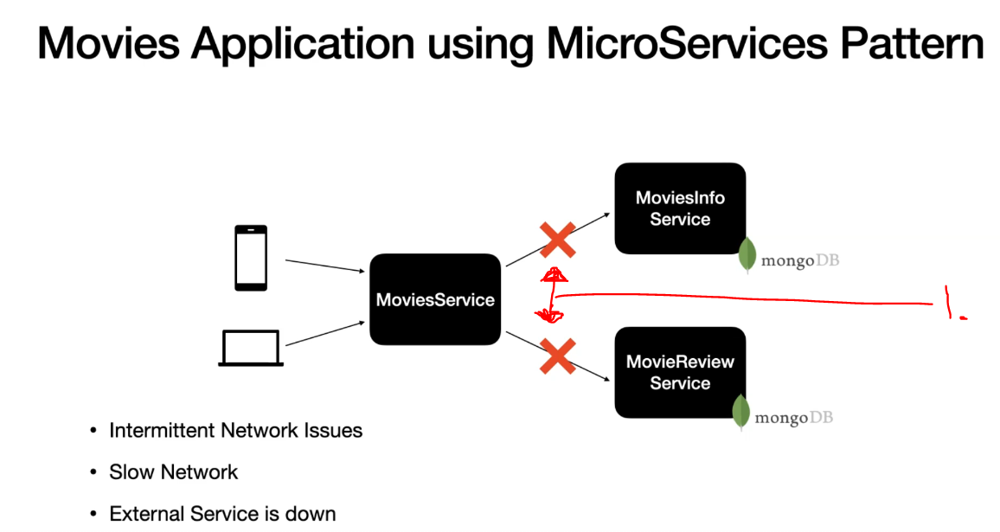
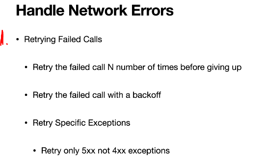

# Section 29: Retrying Failed HTTP Calls.

Retrying Failed HTTP Calls

# What I Learned.

# Why Retry failed HTTP calls?

<div align="center">
    
</div>

1. We need to make these ones resilient  and handle these failures.

<div align="center">
    
</div>

1. Recommend pattern is **retry pattern**. 

# Retry failed Http calls using retry().

- Verifying calling with **WireMock**.

- `WireMock.verify(4, getRequestedFor(urlEqualTo("/v1/movieinfos/" + movieId)));`.

# Retry failed Http calls using retrySpec() - With BackOff before Retry Attempt

- Problem with `retry()`, it will immediately invoke after each time.  
    - Retry with `BackOff`

- Examples with `.retryWhen(RetryUtil.retrySpec());`.


# Retry failed Http calls using retrySpec() - Retrying Specific Exceptions.

```
    public static Retry retrySpec() {

        return  Retry.fixedDelay(3, Duration.ofSeconds(1))
            .filter(ex -> ex instanceof MoviesInfoServerException ||
                ex instanceof ReviewsServerException)
            .onRetryExhaustedThrow((retryBackoffSpec, retrySignal) -> Exceptions.propagate(retrySignal.failure()));
    }
```

- We are using `.onRetryExhaustedThrow`, we are throwing exception to caller.

- We don't want throw exceptions always, for example when **404** is returned.

```
            .filter(ex -> ex instanceof MoviesInfoServerException ||
                ex instanceof ReviewsServerException)
```

- We can re-try with specific exceptions.

 # Reusing the retry logic across different Rest Clients

- We are implementing re-try pattern for every Rest client. 