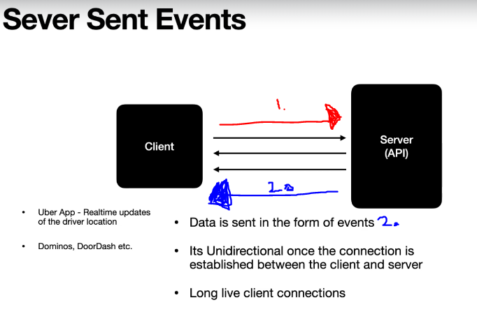

# Section 30: Server Sent Events (SSE).

Server Sent Events (SSE).

# What I Learned.

# 110. Catching up on Server Sent Events (SSE),



1. Request is sent.
2. Data is sent in data of streams.

- **SSE** Server Side Events.

# 111. Introduction to Sinks

- **Publisher** and **Subscriber** at same time.

- **Processors** and **Sinks**.

- **Sinks** allow manually activate **reactor stream event**.
    - This event will be **MovieInfo**.

- [Sinks](https://projectreactor.io/docs/core/release/reference/#sinks).

# 112. Sinks - Hands On.

- We are emitting and `replaying` all the events to subscriber. 

```
        //given
        Sinks.Many<Integer> replaySink = Sinks.many().replay().all();
```

- We are emitting values, with FailureHandler.

```
        //when
        replaySink.emitNext(1, Sinks.EmitFailureHandler.FAIL_FAST);
        replaySink.emitNext(2, Sinks.EmitFailureHandler.FAIL_FAST);

```

- We can access these values with following.

```
 //then
 Flux<Integer> integerFlux = replaySink.asFlux();
```

- And we will just print the values.

```
        integerFlux1.subscribe(i -> {
            System.out.println("Subscriber 2 : " + i);
        });
```

- As long you listen the the events(example with `asFlux()`).
    - The subscribers are receiving the events.


- Full test for **sink**.


```
    @Test
    void sink() {

        //given
        Sinks.Many<Integer> replaySink = Sinks.many().replay().all();

        //when
        replaySink.emitNext(1, Sinks.EmitFailureHandler.FAIL_FAST);
        replaySink.emitNext(2, Sinks.EmitFailureHandler.FAIL_FAST);

        //then
        Flux<Integer> integerFlux = replaySink.asFlux();
        integerFlux.subscribe(i -> {
            System.out.println("Subscriber 1 : " + i);
        });

        Flux<Integer> integerFlux1 = replaySink.asFlux();
        integerFlux1.subscribe(i -> {
            System.out.println("Subscriber 2 : " + i);
        });

        replaySink.tryEmitNext(3);
    }

```

- With **multicast** events are received only after they are subscribed.   

```

    void sinks_multicast() {

        //given
        Many<Integer> multicast = Sinks.many().multicast().onBackpressureBuffer();

        //when
        multicast.emitNext(1, Sinks.EmitFailureHandler.FAIL_FAST);
        multicast.emitNext(2, Sinks.EmitFailureHandler.FAIL_FAST);

        Flux<Integer> integeFlux = multicast.asFlux();
        integeFlux.subscribe(i -> {
            System.out.println("Subscriber 1 : " + i);
        });

        Flux<Integer> integeFlux1 = multicast.asFlux();
        integeFlux1.subscribe(i -> {
            System.out.println("Subscriber 2 : " + i);
        });

        multicast.emitNext(3, Sinks.EmitFailureHandler.FAIL_FAST);
    }

```

- Full test with **unicast**.

```

    @Test
    void sinks_unicast() {

        //given
        Many<Integer> unicast = Sinks.many().unicast().onBackpressureBuffer();

        //when
        unicast.emitNext(1, Sinks.EmitFailureHandler.FAIL_FAST);
        unicast.emitNext(2, Sinks.EmitFailureHandler.FAIL_FAST);

        Flux<Integer> integeFlux = unicast.asFlux();
        integeFlux.subscribe(i -> {
            System.out.println("Subscriber 1 : " + i);
        });

        Flux<Integer> integeFlux1 = unicast.asFlux();
        integeFlux1.subscribe(i -> {
            System.out.println("Subscriber 2 : " + i);
        });

        unicast.emitNext(3, Sinks.EmitFailureHandler.FAIL_FAST);
    }

```

- For **unicast** you can only have one subscriber.

# 113. Build a Streaming Endpoint in MoviesInfoService.

- Whenever we are going to `addMovie()` we are emitting to the sink.

- The end point code.

```
    @PostMapping("/movieinfos")
    @ResponseStatus(HttpStatus.CREATED)
    public Mono<MovieInfo> addMovieInfo(@RequestBody @Valid MovieInfo movieInfo) {
        
        return moviesInfoService.addMovieInfo(movieInfo)
            .doOnNext(savedInfo -> moviesInfoSink.tryEmitNext(savedInfo));
    }

```

- And the declaration in the **Controller**.

```
    Sinks.Many<MovieInfo> moviesInfoSink = Sinks.many().replay().all();
```

- We are making endpoint for returning the **Flux** as event stream.
    - **Streaming end points**, SSE.

```
    @GetMapping(value = "/movieinfos/stream", produces = MediaType.APPLICATION_NDJSON_VALUE)
    public Flux<MovieInfo> getMoviesFlux() {
        
        return moviesInfoSink.asFlux();
    }

```

# 114. Integration Test for the Streaming Endpoint.

- We are writing integration test for **stream** end point.

```
        Flux<MovieInfo> moviesStreamFlux = webTestClient
            .get()
            .uri(MOVIES_INFO_URL + "/stream")
            .exchange()
            .expectStatus()
            .is2xxSuccessful()
            .returnResult(MovieInfo.class)
            .getResponseBody();

        StepVerifier.create(moviesStreamFlux)
            .assertNext(movieInfo1 -> {
                assert movieInfo1.getMovieInfoId() != null;
            })
            .thenCancel()
            .verify();
    }
```

# 115. Build a Streaming Endpoint in MoviesReviewService.

- We are adding router `.GET` streaming endpoint. 

```
    @Bean
    public RouterFunction<ServerResponse> reviewsRoute(ReviewHandler reviewHandler) {
        
        return route()
            .nest(path("/v1/reviews"), builder -> {
                builder
                    .POST("",request -> reviewHandler.addReview(request))
                    .GET("",request -> reviewHandler.getReviews(request))
                    .PUT("/{id}", request -> reviewHandler.updateReview(request))
                    .DELETE("/{id}", request -> reviewHandler.deleteReview(request))
                    .GET("/stream", request -> reviewHandler.getReviewsStream(request));
            })
            .GET("/v1/helloworld", (request -> ServerResponse.ok().bodyValue("helloworld")))
            .build();
    }
```

- Adding the endpoint. 

```
    public Mono<ServerResponse> getReviewsStream(ServerRequest request) {
        
        return ServerResponse.ok()
            .contentType(MediaType.APPLICATION_NDJSON)
            .body(reviewSink.asFlux(), Review.class)
            .log();
    }
```
# 116. Build a Streaming Client using WebClent in MoviesService.

- Streaming endpoint.

```
public Flux<MovieInfo> retrieMovieInfoStream() {
        
        String url = moviesInfoUrl.concat("/stream");

        return webClient
            .get()
            .uri(url)
            .retrieve()
            .onStatus(HttpStatus::is4xxClientError, clientResponse -> {

                log.info("Status code is : {}", clientResponse.statusCode().value());
             
                return clientResponse.bodyToMono(String.class)
                    .flatMap(responseMessage -> {
                        return Mono.error(new MovieInfoClientException(responseMessage, clientResponse.statusCode().value()));
                    });
            })
            .onStatus(HttpStatus::is5xxServerError, clientResponse -> {

                log.info("Status code is : {}", clientResponse.statusCode().value());
                
                return clientResponse.bodyToMono(String.class)
                    .flatMap(responseMessage -> {
                        return Mono.error(new MoviesInfoServerException("Server Exception in MoviesInfoService " + responseMessage));
                    });
            })
            .bodyToFlux(MovieInfo.class)
            .retryWhen(RetryUtil.retrySpec())
            .log();
    }
```

- And the endpoint.

```
    @GetMapping(value = "/stream", produces = MediaType.APPLICATION_NDJSON_VALUE)
    public Flux<MovieInfo> retrieveMovieInfos() {

        return moviesInfoRestClient.retrieMovieInfoStream();
    }
```

- We have microservice, which invokes streaming another service thought REST client.