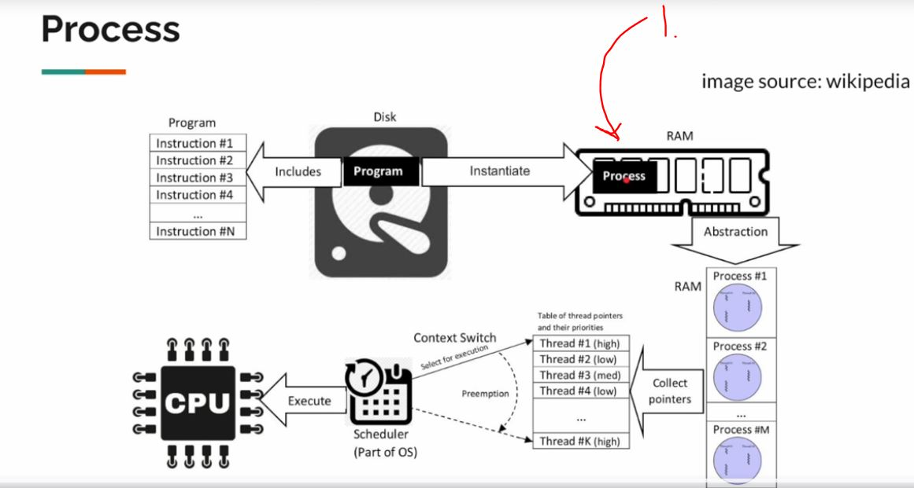
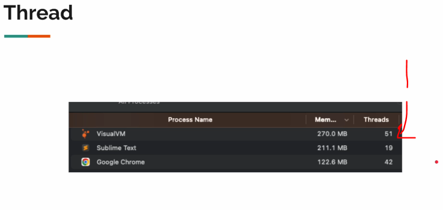
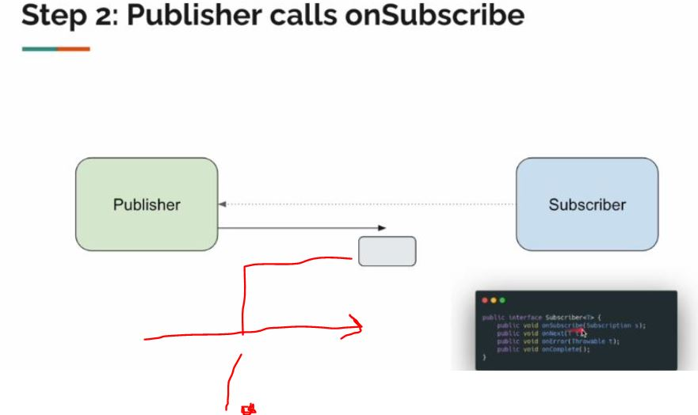
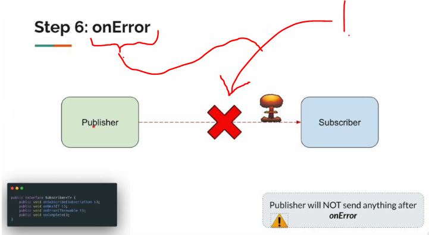
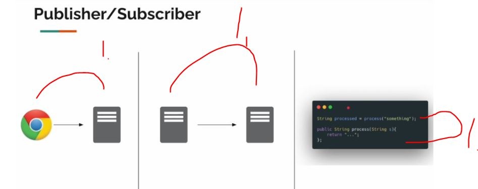
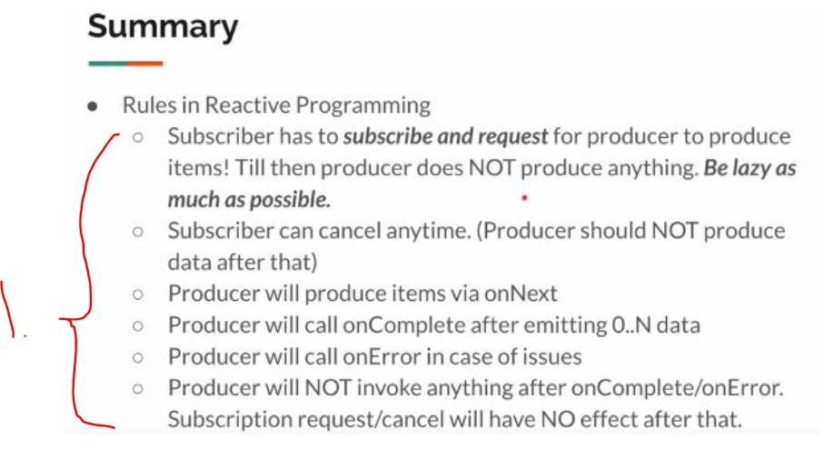

# Section 01: Introduction.

Introduction.

# What I learned.

# Before You Enroll...

- This is having lot of hands on.

    

- This is for you, if you are working on **Microservices**.

- This will be Slow-paced Course.

    

1.  Mastering **Reactive programming** comes mastering these concepts.
    - These **cannot** be solved by traditional programming.

    

- Before we start coding, we get comfortable first.

# [THEORY] - Process / Thread / CPU / RAM / Scheduler.

    

1. Instance of program is loaded into **memory**. This is executed in **CPU**. Process is **heavy weight**.

    

    

- **Threads** whiting process and it can **share** the memory space.

    

1. You can see that **Process** has **Threads**.

    

1. Your OS has scheduler, it will assign threads to the **CPU**.

    

1. **Scheduler** keeps **switching** threads for process times. We call this **context switch**.
    - Old thread **state** will be stored.

2. We call these threads, **OS threads** or **kernel threads**.

    

1. **Java Thread** is just wrapped to **OS Thread**.

    

1. `2.` These needs to be stored in **Stack Memory**.

    

1. **Heap** stores what objects what we dynamically crate like **ArrayList**, **Method References** etc...
2. Local variables etc. Every Thread is having own **Stack memory**.
3. **Java** will assign different memory size for thread in different context.

    

1. We should be using threads and CPU efficiently.

# [THEORY] - IO Models.
 
- Different types of **Inbound** in **Outbound**.

     

    

1. This was the old way.
2. **Reactive Programming** is model to **simplify** thus non-blocking communication.
3. I will **call** **company**, they will tell "give your number and we will call u back".
    - I give my friends number, so **I** and **my friend** **non-block** or **free to do other tasks**.
        - **My friend** would get a call when **company** would be 
        free.

# [THEORY] - Communication Patterns.

- Do I need to use **Reactive Programming**.

    

1. For **One** and **One** Response. If this is simple case, no need to get with complicated with **reactive programming**.

    

- We can achieve additional 4 different patterns with **Reactive Programming**.

1. We send request for making pizza. 
    - We get **stream** like answers, pizza is in making.
    - Pizza is being delivered.
- We send **one** request and getting.

2. Messages are sent as stream to remote server.

    

    

1. **Reactive programming** 

# [THEORY] - What Is Reactive Programming?

    

 
 - Back pressure is important also.

    

    

    

1. **Reactive Programming** is for **IO** calls.

# [THEORY] - Reactive Streams Specification.

    

- **Reactive programming** is based on **Observer Pattern**.

- Example **Twitter/X**. One example below:

1. We write comment or re-tweet in **Twitter/X**.
2. My Flowers can see and **react** to written comments. 

- Just **Observer** and **React** for changes.
    - This in high end image.

    

- These interfaces models how communication will work.

1. `Subscriber` **subscribes** to the `Publisher`. Like in **Twitter/X**, user follows the user to get for latest tweets.
2. Relationship is represents as **Subscription** object.
3. If `Subscriber` wants **request** more updates from `Publisher`.  

- **Twitter/X** is good example for representing this scenario where you have `Subscription` and `Publisher` relationship in **reactive specification**.

    

1. **Processor** is acting like **Subscriber** and **Publisher**.

    

1. This user would be **Processor**.
2. `1.` would be acting as **Subscriber** for the the number **2**.
3. `1.` would be acting as **Publisher** for the `3.` the **two** subscribers.

- There will be **Publisher** in the top.
- There can be multiple **Processors** on middle.
- There will be **Subscriber** in the bottom.

    

1. There will be **Publisher**.
2. There can be multiple **Processors**.
3. There will be **Subscriber**
4. **Subscribes** which one is top.

    

1. Reactor specification is having multiple implementations.

# [THEORY] - Publisher/Subscriber Communication - Step By Step.

# This concept is very important!

    

1. There is **two** instances!  ***Subscriber** wants updates from **Publisher**. 

    

1. When **publisher** accepts the **Subscriber** object, it handles the **publisher** object to the **Subscriber**.

    

1. **Subscriber** talks to the **Publisher** via **Subscription object**.

    

1. Using **Subscription** object **Subscriber** gets items one by one to the **Subscriber**.
    - It will give only the **request amount** or less.

    

- **Publisher** has no items to send, it will invoke `onComplete()`.

    

- If **Publisher**, is having error returning items to **Subscriber**.

    

    

    

1. We model this using **classes**.

# Summary.

    

1. If we use **non-blocking** communication, we just need **one Thread**.

    

1. **Reactive Programming** is having more communication pattern.

    

