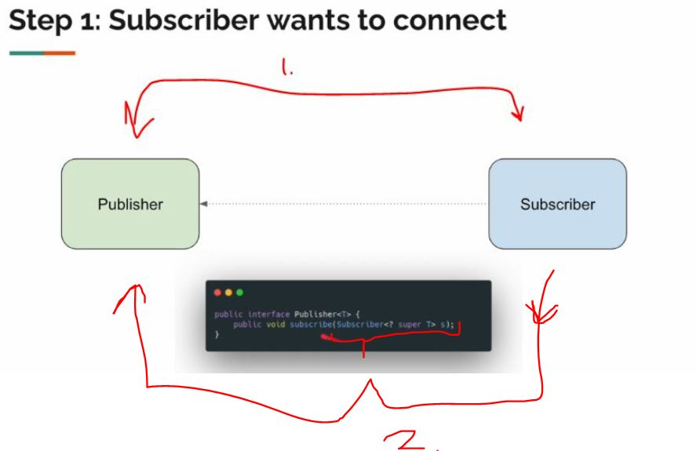
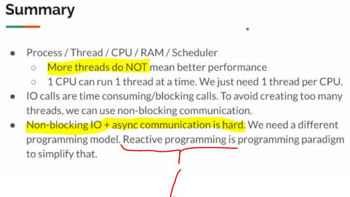

# Section 01: Introduction.

Introduction.

# What I learned.

# Before You Enroll...

- This is having lot of hands on.

<div align="center">
    
</div>

- This is for you, if you are working on **Microservices**.

- This will be slow paced course.

<div align="center">
    
</div>

1.  Mastering **Reactive Programming** comes mastering these concepts.
    - These **cannot** be solved by traditional programming.

<div align="center">
    
</div>

- Before we start coding, we get comfortable first.

# [THEORY] - Process / Thread / CPU / RAM / Scheduler.

<div align="center">
    
</div>

1. Instance of program is loaded into **memory**. This is executed in **CPU**. Process is **heavy weight**.

<div align="center">
    
</div>

<div align="center">
    
</div>

- **Threads** whiting process and it can **share** the memory space.

<div align="center">
    
</div>

1. You can see that **Process** has **Threads**.

<div align="center">
    
</div>

1. Your OS has scheduler, it will assign threads to the **CPU**.

<div align="center">
    
</div>

1. **Scheduler** keeps **switching** threads for process times. We call this **context switch**.
    - Old thread **state** will be stored.

2. We call these threads, **OS threads** or **kernel threads**.

<div align="center">
    
</div>

1. **Java Thread** is just wrapped to **OS Thread**.

<div align="center">
    
</div>

1. `2.` These needs to be stored in **Stack Memory**.

<div align="center">
    
</div>

1. **Heap** stores what objects what we dynamically crate like **ArrayList**, **Method References** etc...
2. Local variables etc. Every Thread is having own **Stack memory**.
3. **Java** will assign different memory size for thread in different context.

<div align="center">
    
</div>

1. We should be using threads and CPU efficiently.

> [!IMPORTANT]
> ⚠️ **Reactive Programming** is to simplify this IO model. ⚠️

# [THEORY] - IO Models.
 
- Different types of **Inbound** in **Outbound**.

<div align="center">
     
</div>

<div align="center">
    
</div>

1. This was the old way.
2. **Reactive Programming** is model to **simplify** thus non-blocking communication.
3. I will **call** **company**, they will tell "give your number and we will call u back".
    - I give my friends number, so **I** and **my friend** **non-block** or **free to do other tasks**.
        - **My friend** would get a call when **company** would be 
        free.

# [THEORY] - Communication Patterns.

 
<div align="center">
    
</div>

1. Do I need to use **Reactive Programming**, if we have **Virtual Threads**?
    - Below for thought process, which could be helpful.
        - This could be case when, if you **virtual threads** are not enough. 

<div align="center">
    
</div>

1. If the **Request** and **Response** is sufficient for your needs, then the **Virtual Threads** are more than enough.
    - Then no need to complicate things with **Reactive Programming**.

<div align="center">
    
</div>

- But, the **main** difference is that we can achieve additional 4 different patterns with **Reactive Programming**.

<div align="center">
    
</div>

1. **First one** is **Request** and **Response**.
    - Send **Request** and get **Response**.
2. **Second one** is **Request** and **Streaming Response**.
    - Send **Request** get multiple **Responses**.
3. **Third one** is the **Streaming Request** and **Response**.
     - We send **one requests**, which contains a **stream of messages**.
        - Example. Apple Watch, which sends **hearth rate** to the server.
4. **Fourth one** is the **Bidirectional Streaming**.
    - This two application can stream to each other.
        - Example. **WebSocket**

<div align="center">
    
</div>

- In **practice**, this will be tied, to how we will be using the **Mono**'s and **Flux**'s in the code!
    - 1️⃣ `Mono` → `Mono` : **request** → **response**.
    - 2️⃣ `Mono` → `Flux` : **request** → **streaming response**.
    - 3️⃣ `Flux` → `Mono` : **streaming request** → **response**.
    - 4️⃣ `Flux` → `Flux` : **bidirectional streaming**.

- Example in code:

`````Java
// 1. Request → Response
@GetMapping("/user/{id}")
Mono<User> getUser(@PathVariable String id) { ... }

// 2. Request → Streaming Response
@GetMapping(value = "/prices", produces = MediaType.TEXT_EVENT_STREAM_VALUE)
Flux<Price> streamPrices() { ... }
+
// 3. Streaming Request → Response
@PostMapping("/aggregate")
Mono<Result> uploadData(@RequestBody Flux<Input> data) { ... }

// 4. Bidirectional Streaming (WebSocket or RSocket)
@MessageMapping("chat")
Flux<Message> chat(Flux<Message> incoming) { ... }
````

# [THEORY] - What Is Reactive Programming?

<div align="center">
    
</div>

1. There will be coming multiple **requests**!
    - **Client** will be sending the lot of streams of data.
2. **Request** and **Response** is not enough!

<div align="center">
    
</div>

1. There is **Specification** for the **Reactive Programming model**.

<div align="center">
    
</div>

1. **Reactive Programming paradigm** is designed to *process stream of messages in a non-blocking and asynchronous manner*, all this while *handling backpressure*.
    - Non-blocking.
    - Back pressure.
    - Asynchronous.
    - Stream of data.

<div align="center">
    
</div>

1. **C** was supporting to be robust and scalable.
    - Example, there were no **Data Structures** in **C** by default.
2. **Java** did not have tools to **simplify** the non-blocking async IO calls!!

<div align="center">
    
</div>

<div align="center">
    
</div>

1. **Reactive Programming** is for **IO** calls.
    -  In **Java** the Reactive frameworks simplify asynchronous `I/O`.
2. **Reactive Programming** complements **OOP** programming style! 

# [THEORY] - Reactive Streams Specification.

<div align="center">
    
</div>

- **Reactive programming** is based on **Observer Pattern**.
    - Example **Twitter/X**, this is below:

1. We write comment or re-tweet. In example in **Twitter/X**.
2. My Flowers can see this and **react** to written comments. 

- Just **Observer** and **React** for changes.
    - This in big picture.

- Here will be the example if the, why we would need the **Reactive Programming**.

<div align="center">
    
</div>

1. We need service to call service.
2. There will be the following **business logic**

<div align="center">
    
</div>

1. The **Exel** cells **reacts** to the others cells!
    - This is same kind of reactiveness comes from **Reactive Programming**.

<div align="center">
    
</div>

- These interfaces models how communication will work.

1. `Subscriber` **subscribes** to the `Publisher`. Like in **Twitter/X**, user follows the user to get for latest tweets.
2. Relationship is represents as **Subscription** object.
3. If `Subscriber` wants **request** more updates from `Publisher`.  

- **Twitter/X** is good example for representing this scenario where you have `Subscription` and `Publisher` relationship in **reactive specification**.

<div align="center">
    
</div>

1. **Processor** is acting like **Subscriber** and **Publisher**.

<div align="center">
    
</div>

1. This user would be **Processor**.
2. `1.` would be acting as **Subscriber** for the number **2**.
3. `1.` would be acting as **Publisher** for the `3.` the **two** subscribers.

- There will be **Publisher** in the top.
- There can be multiple **Processors** on middle.
- There will be **Subscriber** in the bottom.

<div align="center">
    
</div>

1. There will be **Publisher**.
2. There can be multiple **Processors**.
3. There will be **Subscriber**
4. **Subscribes** which one is top.

<div align="center">
    
</div>

1. Reactor specification is having multiple implementations.

# [THEORY] - Publisher/Subscriber Communication - Step By Step.

> [!IMPORTANT]  
> ⚠️ This concept is very important! ⚠️

<div align="center">
    
</div>

1. There is **two** instances!
    - **Subscriber**. 
    - **Publisher**. 
2. The **Subscriber** will be passed to the **Publisher**.
    - We would be implementing the **subscribe(...)** on the **Publisher** class.

<div align="center">
    
</div>

1. When **Publisher** **accepts** the **Subscriber** object, it handles the **Subscription object** to the **Subscriber**.
    - We are giving the Subscription object to the Subscriber via the `onSubscribe()` method.

<div align="center">
    
</div>

1. **Subscriber** talks to the **Publisher** via **Subscription object**.

<div align="center">
    
</div>

1. Using **Subscription** object from **Subscriber** gets items one by one using the `.onNext(T t)`.
    - It will get **three** different the **items**.

> [!IMPORTANT]  
> ⚠️ Notice that the requested amount will be **three** items! Nothing more! ⚠️

<div align="center">
    
</div>

- When **Publisher** has **no items** to send, it **can** invoke `onComplete()`.

<div align="center">
    
</div>

- If **Publisher**, is having error returning items to **Subscriber**.

1. We have the following **Error** handling implementations for the `.onError()`
    - `onErrorResume()`.
    - `.onErrorReturn()`.
    - `.onErrorContinue()`.

<div align="center">
    
</div>

1. Following signals can be sent to the **Subscriber**!
    - `onNext(T t)`: A data element is available.
    - `onComplete()`: The sequence has finished successfully.
    - `onError(Throwable t)`: The sequence has failed (a terminal event).

<div align="center">
    
</div>

<div align="center">
    
</div>

1. In **Reactive paradigm model** we use 
    - **Subscriber** and **Consumer**.
        - Anything that can ask for the **data**, can be called **Publisher** and **Subscriber**.

- In **Reflection** in **OOP**, we use **classes**!

# Summary.

<div align="center">
    
</div>

1. Non-blocking IO + async commutation is hard!
    - That's why we have the **Reactive Programming**!

<div align="center">
    
</div>

1. **Reactive Programming** is having **mixes** of different communication patterns!

<div align="center">
    
</div>

1. **Rules in Reactive Programming**:
    - Subscriber has to subscribe and request for producer to produce items! Till then producer does NOT produce anything. Be lazy as much as possible.
    - Subscriber can cancel anytime. (Producer should NOT produce data after that)
    - Producer will produce items via `.onNext()`.
    - Producer will call `.onComplete()` after emitting `0..N` data.
    - Producer will call `.onError()` in case of issues.
    - Producer will NOT invoke anything after `onComplete`/`onError`.
    - Subscription request/cancel will have NO effect after that.


