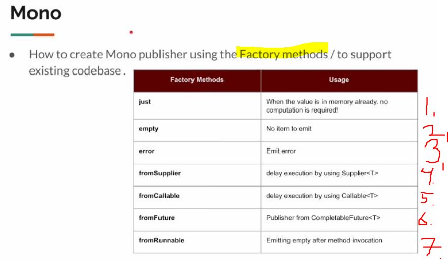
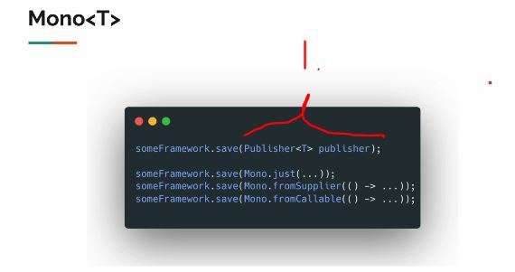
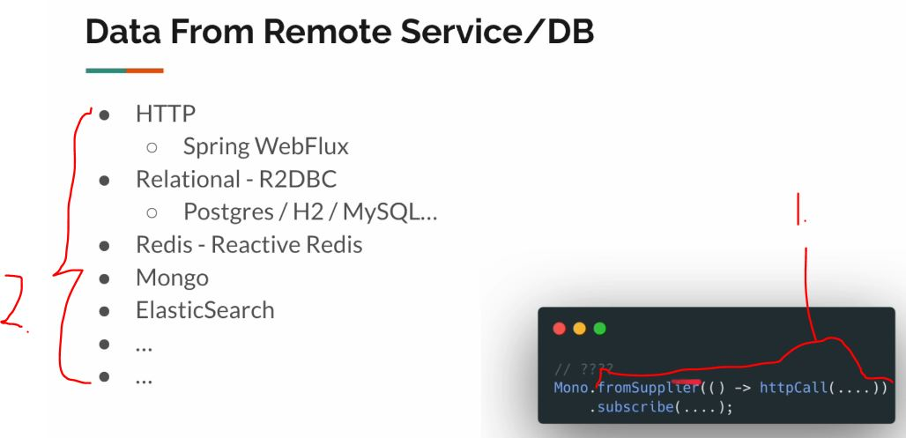
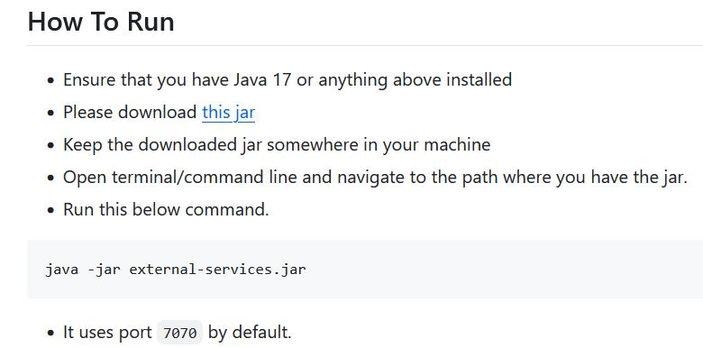
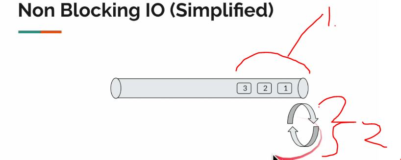

# Section 02: Mono.

Mono.

# What I learned.

# [Resource] - Source Code / Maven Dependencies.

- [Original Repository](https://github.com/vinsguru/java-reactive-programming-course).

- Use following to set repo:
- [POM](https://github.com/vinsguru/java-reactive-programming-course/blob/master/01-reactive-programming-playground/pom.xml#L11-L80).

````
<?xml version="1.0" encoding="UTF-8"?>
<project xmlns="http://maven.apache.org/POM/4.0.0"
         xmlns:xsi="http://www.w3.org/2001/XMLSchema-instance"
         xsi:schemaLocation="http://maven.apache.org/POM/4.0.0 http://maven.apache.org/xsd/maven-4.0.0.xsd">
    <modelVersion>4.0.0</modelVersion>

    <groupId>com.vinsguru</groupId>
    <artifactId>reactive-programming-playground</artifactId>
    <version>1.0-SNAPSHOT</version>

    <properties>
        <java.version>21</java.version>
        <project.build.sourceEncoding>UTF-8</project.build.sourceEncoding>
        <reactor.version>2024.0.1</reactor.version>
        <logback.version>1.5.12</logback.version>
        <faker.version>1.0.2</faker.version>
        <junit.version>5.11.3</junit.version>
    </properties>
    <dependencies>
        <dependency>
            <groupId>io.projectreactor</groupId>
            <artifactId>reactor-core</artifactId>
        </dependency>
        <dependency>
            <groupId>io.projectreactor.netty</groupId>
            <artifactId>reactor-netty-core</artifactId>
        </dependency>
        <dependency>
            <groupId>io.projectreactor.netty</groupId>
            <artifactId>reactor-netty-http</artifactId>
        </dependency>
        <dependency>
            <groupId>ch.qos.logback</groupId>
            <artifactId>logback-classic</artifactId>
            <version>${logback.version}</version>
        </dependency>
        <dependency>
            <groupId>com.github.javafaker</groupId>
            <artifactId>javafaker</artifactId>
            <version>${faker.version}</version>
        </dependency>
        <!-- test dependencies -->
        <dependency>
            <groupId>org.junit.jupiter</groupId>
            <artifactId>junit-jupiter-engine</artifactId>
            <version>${junit.version}</version>
            <scope>test</scope>
        </dependency>
        <!-- step-verifier -->
        <dependency>
            <groupId>io.projectreactor</groupId>
            <artifactId>reactor-test</artifactId>
            <scope>test</scope>
        </dependency>
    </dependencies>

    <dependencyManagement>
        <dependencies>
            <dependency>
                <groupId>io.projectreactor</groupId>
                <artifactId>reactor-bom</artifactId>
                <version>${reactor.version}</version>
                <type>pom</type>
                <scope>import</scope>
            </dependency>
        </dependencies>
    </dependencyManagement>

    <build>
        <plugins>
            <plugin>
                <groupId>org.apache.maven.plugins</groupId>
                <artifactId>maven-compiler-plugin</artifactId>
                <configuration>
                    <source>21</source>
                    <target>21</target>
                </configuration>
            </plugin>
        </plugins>
    </build>

</project>
````

- [Logback](https://github.com/vinsguru/java-reactive-programming-course/blob/master/01-reactive-programming-playground/src/main/resources/logback.xml).

````
<!-- http://dev.cs.ovgu.de/java/logback/manual/layouts.html -->
<configuration>
    <appender name="STDOUT" class="ch.qos.logback.core.ConsoleAppender">
        <encoder>
            <pattern>%d{HH:mm:ss.SSS} %-5level [%15.15t] %cyan(%-30.30logger{30}) : %m%n</pattern>
        </encoder>
    </appender>
    <logger name="io.netty.resolver.dns.DnsServerAddressStreamProviders" level="OFF"/>
    <root level="INFO">
        <appender-ref ref="STDOUT" />
    </root>
</configuration>
````

# Project Setup.

- We are going to **Maven**, **IntelliJ** and **Java21**.

<div align="center">
    
</div>

# Publisher/Subscriber Implementation - Part 1.

<div align="center">
    
</div>

1. We **Don't** implement these ourselves in normal case!
    - We will be doing to gain understanding!

<div align="center">
    
</div>

1. We will be implementing:
    - `public void onComplete()`.
    - `public void onError(Throwable throwable)`.
    - `public void onNext(String email)`.
    - `public void onSubscribe(Subscription subscription)`.

````
package org.java.reactive.sec01.subscriber;

import org.reactivestreams.Subscriber;
import org.reactivestreams.Subscription;
import org.slf4j.Logger;
import org.slf4j.LoggerFactory;

public class SubscriberImpl implements Subscriber<String> {

    private static final Logger log = LoggerFactory.getLogger(SubscriberImpl.class);
    private Subscription subscription;

    public Subscription getSubscription() {
        return subscription;
    }

    @Override
    public void onSubscribe(Subscription subscription) {
        this.subscription = subscription;
    }

    @Override
    public void onNext(String email) {
        log.info("received: {}", email);
    }

    @Override
    public void onError(Throwable throwable) {
        log.error("error", throwable);
    }

    @Override
    public void onComplete() {
        log.info("completed!");
    }
}
````

<div align="center">
    
</div>

- `1.` We are defining the **Publisher**.
    - We are implementing the:
        - `public void subscribe(Subscriber<? super String> subscriber)`.
            - This will accept the **Subscriber**, so we could be passing the caller the **Subscription** object!

<div align="center">
    
</div>

- `2.` We are creating the **Subscription object** and passing to the **Subscriber**.

- We are implementing the **Publisher** `1.` below:

````
package org.java.reactive.sec01.publisher;

import org.reactivestreams.Publisher;
import org.reactivestreams.Subscriber;

public class PublisherImpl implements Publisher<String> {

    @Override
    public void subscribe(Subscriber<? super String> subscriber) {
        var subscription = new SubscriptionImpl(subscriber); // This will be passed as Subscription object!
        subscriber.onSubscribe(subscription);
    }

}
````

<div align="center">
    
</div>

<div align="center">
    
</div>

1. We are implanting the `SubscriptionImpl`, this is with the:
    - `public void request(long requested)`.
    - `public void cancel()`.

````
package org.java.reactive.sec01.publisher;

import org.reactivestreams.Subscriber;
import org.reactivestreams.Subscription;
import org.slf4j.Logger;
import org.slf4j.LoggerFactory;

public class SubscriptionImpl implements Subscription {

    private static final Logger log = LoggerFactory.getLogger(SubscriptionImpl.class);

    // We are holding the subscription.
    private final Subscriber<? super String> subscriber;

    public SubscriptionImpl(Subscriber<? super String> subscriber){
        this.subscriber = subscriber;
    }

    @Override
    public void request(long requested) {
    }

    @Override
    public void cancel() {
    }

}
````

# Publisher/Subscriber Implementation - Part 2.

- The `request(long requested)`. We are **producing** item using **Faker**.

````
    @Override
    public void request(long requested) {
        if(isCancelled){
            return;
        }

        log.info("subscriber has requested {} items", requested);
        if(requested > MAX_ITEMS){
            this.subscriber.onError(new RuntimeException("validation failed"));
            this.isCancelled = true;

            return;
        }
        for (int i = 0; i < requested && count < MAX_ITEMS; i++) {
            count++;
            this.subscriber.onNext(this.faker.internet().emailAddress());
        }
        if(count == MAX_ITEMS){
            log.info("no more data to produce");
            this.subscriber.onComplete();
            this.isCancelled = true;
        }
    }
````

- The `cancel()`.

````

    @Override
    public void cancel() {
        log.info("subscriber has cancelled");
        this.isCancelled = true;
    }

````

- The current **Subscription**:

````
package org.java.reactive.sec01.publisher;

import com.github.javafaker.Faker;
import org.reactivestreams.Subscriber;
import org.reactivestreams.Subscription;
import org.slf4j.Logger;
import org.slf4j.LoggerFactory;

public class SubscriptionImpl implements Subscription {

    private static final Logger log = LoggerFactory.getLogger(SubscriptionImpl.class);
    private static final int MAX_ITEMS = 10;
    private final Faker faker;
    // We are holding the subscription.
    private final Subscriber<? super String> subscriber;

    private boolean isCancelled;
    private int count = 0;

    public SubscriptionImpl(Subscriber<? super String> subscriber){
        this.subscriber = subscriber;
        this.faker = Faker.instance();
    }

    @Override
    public void request(long requested) {
        if(isCancelled){
            return;
        }

        log.info("subscriber has requested {} items", requested);
        if(requested > MAX_ITEMS){
            this.subscriber.onError(new RuntimeException("validation failed"));
            this.isCancelled = true;

            return;
        }
        for (int i = 0; i < requested && count < MAX_ITEMS; i++) {
            count++;
            this.subscriber.onNext(this.faker.internet().emailAddress());
        }
        if(count == MAX_ITEMS){
            log.info("no more data to produce");
            this.subscriber.onComplete();
            this.isCancelled = true;
        }
    }

    @Override
    public void cancel() {
        log.info("subscriber has cancelled");
        this.isCancelled = true;
    }

}
````

# Publisher/Subscriber Demo.


- We are testing the `1.` publisher does not produce data unless subscriber requests for it:

````
private static void demo1() {
    var publisher = new PublisherImpl();
    var subscriber = new SubscriberImpl();
    publisher.subscribe(subscriber);
    }
````

- Nothing should happen!

- We are testing the `2.` publisher will produce only <= subscriber requested items. Publisher can also produce 0 items!:

````

 private static void demo2() throws InterruptedException {
    var publisher = new PublisherImpl();
    var subscriber = new SubscriberImpl();
    publisher.subscribe(subscriber);
    subscriber.getSubscription().request(3);
    Thread.sleep(Duration.ofSeconds(2));
    subscriber.getSubscription().request(3);
    Thread.sleep(Duration.ofSeconds(2));
    subscriber.getSubscription().request(3);
    Thread.sleep(Duration.ofSeconds(2));
    subscriber.getSubscription().request(3);
    Thread.sleep(Duration.ofSeconds(2));
    subscriber.getSubscription().request(3);
    }
````

- It can provide data:

````
23:18:28.396 INFO  [           main] o.j.r.s.p.SubscriptionImpl     : subscriber has requested 3 items
23:18:28.747 INFO  [           main] o.j.r.s.s.SubscriberImpl       : received: nyla.turner@yahoo.com
23:18:28.748 INFO  [           main] o.j.r.s.s.SubscriberImpl       : received: jorge.spencer@gmail.com
23:18:28.749 INFO  [           main] o.j.r.s.s.SubscriberImpl       : received: shayna.nicolas@yahoo.com
23:18:30.763 INFO  [           main] o.j.r.s.p.SubscriptionImpl     : subscriber has requested 3 items
23:18:30.763 INFO  [           main] o.j.r.s.s.SubscriberImpl       : received: thurman.trantow@hotmail.com
23:18:30.764 INFO  [           main] o.j.r.s.s.SubscriberImpl       : received: spencer.runolfsson@hotmail.com
23:18:30.764 INFO  [           main] o.j.r.s.s.SubscriberImpl       : received: margarite.wehner@gmail.com
23:18:32.766 INFO  [           main] o.j.r.s.p.SubscriptionImpl     : subscriber has requested 3 items
23:18:32.767 INFO  [           main] o.j.r.s.s.SubscriberImpl       : received: donya.lubowitz@yahoo.com
23:18:32.767 INFO  [           main] o.j.r.s.s.SubscriberImpl       : received: qiana.tromp@yahoo.com
23:18:32.768 INFO  [           main] o.j.r.s.s.SubscriberImpl       : received: reagan.rath@hotmail.com
23:18:34.769 INFO  [           main] o.j.r.s.p.SubscriptionImpl     : subscriber has requested 3 items
23:18:34.769 INFO  [           main] o.j.r.s.s.SubscriberImpl       : received: briana.hegmann@hotmail.com
23:18:34.769 INFO  [           main] o.j.r.s.p.SubscriptionImpl     : no more data to produce
23:18:34.769 INFO  [           main] o.j.r.s.s.SubscriberImpl       : completed!
````

- The case: publisher can also produce 0 items!:
    - When we set `private static final int MAX_ITEMS = 0;`.

````

````

- Todo tee tämä loppuun.

# Mono / Flux - Introduction.

<div align="center">
    
</div>

- **Reactive Stream** is the specification and **Project Reactor** is the library.
    - **Project Reactor** would be the same as the **Hibernate** for the **JPA**.

<div align="center">
    
</div>

1. The **Project reactor** provides **two** different implementation of the
**Publisher<T>**.

<div align="center">
    
</div>

1. `Mono` can **emit** `0` or `1` item!
    - There can be case when there are **no items** to **emit**, then there will be the `onComplete()`.

<div align="center">
    
</div>

1. **Flux** can emit **multiple data**.
2. There can be **error** emitted at **any point** in the stream, when the emission is being happened!

# Why We Need Mono!

> [!TIP]
> Why we need to have **different** Mono and the Flux, if the Flux have the necessary things!

- Simple answer, it's **convenient**.

<div align="center">
    
</div>

1. The **database** can return one or more data.
    - **Traditional way**, they have `Optional<Customer>`
    - **Reactive Stream way**, they have `Mono<Customer>`.

2. The same for the **many elements**, there will be 
    - **A Traditional way**, they have `List<Cusomer>`
    - **Reactive Stream way**, they have `Flux<Customer>`.

<div align="center">
    
</div>

1. There will be many different methods in the `Flux`.
2. Example for handling the multiple data, **back pressure**.
3. The `Mono` is great for **simple cases**. 
    - For this case there can be **one value**, if its coming.
    - Request and response pattern.

# Stream Lazy Behavior.


- Like in below example, the **Java 8** streams are lazy. 
    - `.toList(); // This will be resolved as soon as there is terminal operator.`
        - This is one example of the terminal operator.

````
package org.java.reactive.sec02;


import org.slf4j.Logger;
import org.slf4j.LoggerFactory;

import java.util.stream.Stream;

public class Lec01LazyStream {
    private static final Logger log = LoggerFactory.getLogger(Lec01LazyStream.class);

    public static void main(String[] args) {

        // This is not reactive programming
        // Streams are Lazy.
        Stream.of("One", "Two")
                .peek(action -> log.info(" received : {}", action))
                .toList(); // This will be resolved as soon as there is terminal operator.
    }
}

````

- This same concept applies to the **Reactor Streams**, there will be no result, until there is **subscription**.  
    - Reactive Streams are **lazy**.

<div align="center">
    
</div>

# Mono Just.

- `Mono.just<T value>` is the factory method for creating the exactly creating **Mono** of **one item**.

- This will **emit** the **value**, once **Publisher subscribes** for this **publisher**.
    - As following `Mono<String> mono = Mono.just("First");`.
        - This does not be any specific type. Example: `Mono.just(1); // Mono.just can be publisher of any type.`.

<div align="center">
    
</div>

1. The logging would **not work** the `First`, since the publisher has not been **subscribed**.

- To get the logging working, we need to subscribe to the **Reactive Stream**.
    - Also notice, we are using our own **Reactive Stream** implementation with the **Project Reactor**. 

````
Mono<String> mono = Mono.just("First");
var subscriber = new SubscriberImpl();
mono.subscribe(subscriber);

subscriber.getSubscription().request(3);
````

- We can use the **Project Reactors** methods for logging, as following:

````
Mono<String> mono = Mono.just("First");
mono.subscribe(t -> System.out.println(t));
````

> [!NOTE]  
> In **Reactive World** we need to think in terms `Publisher`'s and `Subscriver`'s.

- `Mono.just()` is a **convenient** way to create a reactive Publisher
    - We need start passing these to **Reactive methods**.

# Mono Subscribe - Overloaded Methods.

<div align="center">
    
</div>

1. Two points to figure out:
    - There was no `completed` message this time?
    - We only `.subscribed()`, we did not `.request()`.

- We can use overloaded methods to solve these:

````
       mono.subscribe(
                i -> log.info("received: {}", i),
                err -> log.error("error", err),
                () -> log.info("Completed"),
                subscription -> subscription.request(1)
                );
````

- With following, we **transform** every data that is **emitted** by this **publisher**. 

````
        var mono = Mono.just(1)
                .map(i -> i + "a");

        mono.subscribe(
                i -> log.info("received: {}", i),
                err -> log.error("error", err),
                () -> log.info("Completed"),
                subscription -> subscription.request(1)
                );
````

- This will log:

````
00:03:03.101 INFO  [           main] o.j.r.sec02.Lec03MonoSubscribe : received: 1a
00:03:03.106 INFO  [           main] o.j.r.sec02.Lec03MonoSubscribe : Completed
````

- Illustrating the error handling also works:

````
        var mono = Mono.just(1)
                .map(i -> i / 0);

        mono.subscribe(
                i -> log.info("received: {}", i),
                err -> log.error("error", err),
                () -> log.info("Completed"),
                subscription -> subscription.request(1)
                );
````

# Creating Default Subscriber.

- There can be multiple subscribers.

- Below **default Subscriber**.

````
package org.java.reactive.common;

import org.reactivestreams.Subscriber;
import org.reactivestreams.Subscription;
import org.slf4j.Logger;
import org.slf4j.LoggerFactory;

public class DefaultSubscriber<T> implements Subscriber<T> {

    private static final Logger log = LoggerFactory.getLogger(DefaultSubscriber.class);
    private final String name;

    public DefaultSubscriber(String name) {
        this.name = name;
    }

    @Override
    public void onSubscribe(Subscription subscription) {
        subscription.request(Long.MAX_VALUE);
        
    }

    @Override
    public void onNext(T item) {
        log.info("{} received: {}", this.name, item);
    }

    @Override
    public void onError(Throwable throwable) {
        log.error("{} error", this.name, throwable);
    }

    @Override
    public void onComplete() {
        log.info("{} received complete!", this.name);
    }

}
````

- The util class:

````
package org.java.reactive.common;

import com.github.javafaker.Faker;
import org.reactivestreams.Subscriber;
import org.slf4j.Logger;
import org.slf4j.LoggerFactory;
import reactor.core.publisher.Flux;

import java.time.Duration;
import java.util.function.UnaryOperator;

public class Util {

    private static final Logger log = LoggerFactory.getLogger(Util.class);
    private static final Faker faker = Faker.instance();

    public static <T> Subscriber<T> subscriber(){
        return new DefaultSubscriber<>("");
    }

    public static <T> Subscriber<T> subscriber(String name){
        return new DefaultSubscriber<>(name);
    }

    public static Faker faker(){
        return faker;
    }

    public static void sleepSeconds(int seconds){
        try {
            Thread.sleep(Duration.ofSeconds(seconds));
        } catch (InterruptedException e) {
            throw new RuntimeException(e);
        }
    }


    public static void sleep(Duration duration){
        try {
            Thread.sleep(duration);
        } catch (InterruptedException e) {
            throw new RuntimeException(e);
        }
    }

    public static <T> UnaryOperator<Flux<T>> fluxLogger(String name){
        return flux -> flux
                .doOnSubscribe(s -> log.info("subscribing to {}", name))
                .doOnCancel(() -> log.info("cancelling {}", name))
                .doOnComplete(() -> log.info("{} completed", name));
    }

}
````

# Mono - Empty / Error.

- We are going to make publisher that will emit empty value.

- Below the example creating **Empty** and **Error** Publishers.

````
package org.java.reactive.sec02;


import org.java.reactive.common.Util;
import org.slf4j.Logger;
import org.slf4j.LoggerFactory;
import reactor.core.publisher.Mono;

public class Lec04MonoEmptyError {

    private static final Logger log = LoggerFactory.getLogger(Lec04MonoEmptyError.class);

    public static void main(String[] args) {
        getUsername(3)
                .subscribe(Util.subscriber());
    }

    private static Mono<String> getUsername(int userId)
    {
        return switch (userId)
        {
            case 1 -> Mono.just("same");
            case 2 -> Mono.empty(); // normally we would say null.
            default -> Mono.error(new RuntimeException("Invalid input")); // This block when there is error.
        };
    }
}
````

- Using **empty** or **error**.
    - Returning some value in **Reactive Streams**
        - `Mono.just("same");`.
    - The way how we say the `null` in **Reactive Streams**.
        - `Mono.empty(); // normally we would say null.`
    - The normal way how we will be **throwing the errors** inside **Reactive Streams**
        - `Mono.error(new RuntimeException("Invalid input")); // This block when there is error.`.

# On Error Dropped - Problem.

- We have following:

````
getUsername(3)
    .subscribe(s -> System.out.println(s));
````

- If there is **no error handlers** defined when there will be error, there will be `onErrorDropped` thrown!

````
19:03:04.502 ERROR [           main] r.core.publisher.Operators     : Operator called default onErrorDropped
reactor.core.Exceptions$ErrorCallbackNotImplemented: java.lang.RuntimeException: Invalid input
Caused by: java.lang.RuntimeException: Invalid input
````

- Project Reactor wants error handler!

# Mono - From Supplier.

- In **Reactive Programming** in general, we want work as **lazy** as possible, meaning the data should be coming only when the data is needed!

| Method | Evaluation | When Value is Computed |
|---------|-------------|-------------------------|
| `Mono.just(value)` | **Eager** | **Immediately**, when the Mono is created |
| `Mono.fromSupplier(() -> value)` | **Lazy** | Only **when** a **subscriber** subscribes |

- Remember the **Supplier** does **not take** arguments and does **not return** result.

- Example where the values are known when ran:

````
    public static void main(String[] args) {
         var list = List.of(1,2,3);
         // Since list on memory.
        // This will be calculated immiteadetly, there can be also the case when the data will be later to be know, then use the subcriber.
        // Mono.just(sum(list))
        // .subscribe(Util.subscriber());
    }

    private  static int sum(List<Integer> list)
    {
        log.info("finding the sum of {}", list);
        return list.stream().mapToInt(a -> a).sum();
    }
````

- We can also make it so, when the result is ready with following:

````
package org.java.reactive.sec02;

import org.java.reactive.common.Util;
import org.slf4j.Logger;
import org.slf4j.LoggerFactory;
import reactor.core.publisher.Mono;

import java.util.List;

public class Lec05MonoFromSupplier {

    /*
        To delay the execution using supplied / callable.
     */
    private static final Logger log = LoggerFactory.getLogger(Lec05MonoFromSupplier.class);

    public static void main(String[] args) {
        var list = List.of(1,2,3);

        // This will yield value, when someone is subscribed.
        Mono.fromSupplier(() -> sum(list))
                .subscribe(Util.subscriber());
    }

    private  static int sum(List<Integer> list)
    {
        log.info("finding the sum of {}", list);
        return list.stream().mapToInt(a -> a).sum();
    }
}
````

# Mono - From Callable.

- Interface `Callable<V>`.
    - We can see that `Exception` is **thrown** form the method.
    - **Callable** can be used wrapper for some **task**!

````
/*
 * DO NOT ALTER OR REMOVE COPYRIGHT NOTICES OR THIS FILE HEADER.
 *
 * This code is free software; you can redistribute it and/or modify it
 * under the terms of the GNU General Public License version 2 only, as
 * published by the Free Software Foundation.  Oracle designates this
 * particular file as subject to the "Classpath" exception as provided
 * by Oracle in the LICENSE file that accompanied this code.
 *
 * This code is distributed in the hope that it will be useful, but WITHOUT
 * ANY WARRANTY; without even the implied warranty of MERCHANTABILITY or
 * FITNESS FOR A PARTICULAR PURPOSE.  See the GNU General Public License
 * version 2 for more details (a copy is included in the LICENSE file that
 * accompanied this code).
 *
 * You should have received a copy of the GNU General Public License version
 * 2 along with this work; if not, write to the Free Software Foundation,
 * Inc., 51 Franklin St, Fifth Floor, Boston, MA 02110-1301 USA.
 *
 * Please contact Oracle, 500 Oracle Parkway, Redwood Shores, CA 94065 USA
 * or visit www.oracle.com if you need additional information or have any
 * questions.
 */

/*
 * This file is available under and governed by the GNU General Public
 * License version 2 only, as published by the Free Software Foundation.
 * However, the following notice accompanied the original version of this
 * file:
 *
 * Written by Doug Lea with assistance from members of JCP JSR-166
 * Expert Group and released to the public domain, as explained at
 * http://creativecommons.org/publicdomain/zero/1.0/
 */

package java.util.concurrent;

/**
 * A task that returns a result and may throw an exception.
 * Implementors define a single method with no arguments called
 * {@code call}.
 *
 * <p>The {@code Callable} interface is similar to {@link
 * java.lang.Runnable}, in that both are designed for classes whose
 * instances are potentially executed by another thread.  A
 * {@code Runnable}, however, does not return a result and cannot
 * throw a checked exception.
 *
 * <p>The {@link Executors} class contains utility methods to
 * convert from other common forms to {@code Callable} classes.
 *
 * @see Executor
 * @since 1.5
 * @author Doug Lea
 * @param <V> the result type of method {@code call}
 */
@FunctionalInterface
public interface Callable<V> {
    /**
     * Computes a result, or throws an exception if unable to do so.
     *
     * @return computed result
     * @throws Exception if unable to compute a result
     */
    V call() throws Exception;
}
````

## ☕ Java `Callable<V>` Interface.

### 🧩 Overview.

The `Callable` interface is part of the **`java.util.concurrent`** package.  
It represents a task that can be **executed asynchronously** and **returns a result**.

It’s similar to `Runnable`, but with two key differences:

1. It **returns a value**.
2. It **can throw checked exceptions**.

````java
@FunctionalInterface
public interface Callable<V> {
    V call() throws Exception;
}

    V → The result type returned by this callable.

    call() → The method to be implemented, can throw any exception.
````

- `Callable<V>` has **throws** exception.

- With, `Mono.fromSupplier` we need to catch the exception.

````
package org.java.reactive.sec02;


import org.java.reactive.common.Util;
import org.slf4j.Logger;
import org.slf4j.LoggerFactory;
import reactor.core.publisher.Mono;

import java.util.List;

public class Lec06MonoFromCallable {
    /*
        To delay the execution using supplied / callable.
     */
    private static final Logger log = LoggerFactory.getLogger(Lec06MonoFromCallable.class);

    public static void main(String[] args) {
        var list = List.of(1,2,3);
        Mono.fromSupplier(() -> {
                    try {
                        return sum(list);
                    } catch (Exception e) {
                        throw new RuntimeException(e);
                    }
                })
                .subscribe(Util.subscriber());
    }

    private  static int sum(List<Integer> list) throws Exception
    {
        log.info("finding the sum of {}", list);
        return list.stream().mapToInt(a -> a).sum();
    }
}
````

# Mono - From Runnable.

- We can use **Runnable** for the logging in the **reactive programming**, when constructing the reactive chains.

- The main differences using the `Supplier`, `Callable` and `Runnable`.

| Type | Returns a value? | Can throw checked exceptions? | Typical Use | Reactive Wrapper | Emits | Return Type |
|------|------------------|-------------------------------|--------------|------------------|--------|--------------|
| **Supplier<T>** | ✅ Yes | ❌ No | Return a value (no checked exception) | `Mono.fromSupplier()` | Emits the value from `get()` | `Mono<T>` |
| **Callable<T>** | ✅ Yes | ✅ Yes | Return a value and may throw exceptions | `Mono.fromCallable()` | Emits the value or an error | `Mono<T>` |
| **Runnable** | ❌ No | ❌ No | Perform a side-effect (void) | `Mono.fromRunnable()` | Emits **completion only** | `Mono<Void>` |


- Example of in usage:
    - See the usage `private  static void notifyBusiness(int productId)`.
        - Also, `return Mono.fromRunnable(()-> notifyBusiness(productId));`. 

````
package org.java.reactive.sec02;


import org.java.reactive.common.Util;
import org.slf4j.Logger;
import org.slf4j.LoggerFactory;
import reactor.core.publisher.Mono;

public class Lec07MonoFromRunnable {

    private static final Logger log = LoggerFactory.getLogger(Lec07MonoFromRunnable.class);

    /*
     Emitting empty after some method invocation.
     */
    public static void main(String[] args) {

    getProductName(2)
            .subscribe(Util.subscriber());

    }


    private static Mono<String> getProductName(int productId)
    {
        if (productId == 1)
        {
            return Mono.fromSupplier(() -> Util.faker().commerce().productName());
        }
        // Returning empty is not always the best from the business side.
        // return Mono.empty();
        // we can use Runnable for logging
        return Mono.fromRunnable(()-> notifyBusiness(productId));
    }


    /*
    Rather than returning, we can notify with following method.
     */
    private  static void notifyBusiness(int productId)
    {
        log.info("notifying business on unlivable product {} ", productId);
    }

}
````

# Mono - From Future.

- Do this after Vanilla multithreading chapter.

# Publisher - Create Vs Execute.

- The executions is not happening until the `.subscribe`. 

````
package org.java.reactive.sec02;

import org.java.reactive.common.Util;
import org.slf4j.Logger;
import org.slf4j.LoggerFactory;
import reactor.core.publisher.Mono;

/*
    Creating publisher is a lightweight operation.
    Executing time-consuming business logic can be delayed
 */

public class Lec09PublisherCreateVsExecution {

    private static final Logger log = LoggerFactory.getLogger(Lec09PublisherCreateVsExecution.class);

    public static void main(String[] args) {
        getName();
//                .subscribe(Util.subscriber());
    }

    private static Mono<String> getName(){

        log.info("entered the method");
        
        return Mono.fromSupplier(() -> {
            log.info("generating name");
            Util.sleepSeconds(3);
            return Util.faker().name().firstName();
        });
    }

}
````

# Mono - Defer.

- In **general,** we have the following list for the **lazy** and **instant methods**:

### 💤 Lazy Methods.

| Method | Execution Timing | Description |
|--------|------------------|--------------|
| `Mono.fromSupplier(Supplier<T>)` | Lazy (on subscription) | The supplier is **not executed** until someone subscribes. |
| `Mono.fromCallable(Callable<T>)` | Lazy | The callable runs **only when subscribed**. |
| `Mono.fromRunnable(Runnable)` | Lazy | The runnable executes **only on subscription**, no return value. |
| `Mono.defer(Supplier<Mono<T>>)` | Lazy | Defers the creation of the Mono itself until subscription. |
| `Flux.defer(Supplier<Flux<T>>)` | Lazy | Same as above but for Flux. |
| `Mono.justOrEmpty(T)` | Lazy | Emits the value only when subscribed. |
| `Mono.fromFuture(CompletableFuture<T>)` | Lazy (starts on subscription) | The future’s computation begins when subscribed. |
| `Flux.range(int start, int count)` | Lazy | The range is generated on subscription. |
| `Flux.fromIterable(Iterable<T>)` | Lazy | Iteration begins on subscription. |

---

### ⚡ Instant (Eager) Methods.

| Method | Execution Timing | Description |
|--------|------------------|--------------|
| `Mono.just(T)` | Instant | The value is **created immediately**, though emitted lazily when subscribed. |
| `Flux.just(T...)` | Instant | The values are captured immediately. |
| `Mono.error(Throwable)` | Instant | The error is created instantly, though emitted lazily. |
| `Mono.empty()` | Instant | The empty Mono exists immediately. |
| `Mono.never()` | Instant | Creates a Mono that never emits, immediately. |
| `Flux.empty()` | Instant | Eagerly creates an empty Flux. |
| `Flux.never()` | Instant | Eagerly creates a never-emitting Flux. |

---

### 💡 Summary.

- **Lazy methods** delay computation or object creation until `subscribe()`.

- **Instant methods** create or capture their data immediately, even though emission still waits for subscription.

# What About Data From Remote Service?  

<div align="center">
    
</div>

1. When the value is in memory already, no computation is required! 
2. No item to emit.
3. Emit error. 
4. Delay execution by using `Supplier<T>`.
5. Delay execution by using `Callable<T>`.
6. Publisher from `CompletableFuture<T>`.
7. Emitting empty after method invocation.

<div align="center">
    
</div>

1. The principle is following:
    - There will be some data providing **publishers** here.

<div align="center">
    
</div>

1. `Mono.fromSupplier()` and remote calls like HTTP or database access are not asynchronous together — unless you explicitly make them so.
2. There is other drives/tools needed for the embrace the **reactiveness**.

# [Resource] - External Services.

- Do the following for the **External Services**:
    - The project is from [here](https://github.com/vinsguru/java-reactive-programming-course/blob/master/02-external-services/external-services-instructions.md).

<div align="center">
    
</div>

# External Services.


- We can run the service, with the following:

````
java -jar external-services.jar
````

- After running the `.jar`, the service will be hosted in the: `http://localhost:7070`.

- We introduced to the API what to call.

# Non-Blocking IO Client.

- We are using **Reactor Netty** for the IO non-blocking query.

- Normally the **Reactor Netty** will be creating **One** thread per **CPU**! 
    - Modern laptops will be having many cores in one PC.
        - We will be having **one** thread in action.

- This will do the **abstract** version:

````
package org.java.reactive.common;

import reactor.netty.http.client.HttpClient;
import reactor.netty.resources.LoopResources;

public abstract class AbstractHttpClient {

    private static final String BASE_URL = "http://localhost:7070";
    protected HttpClient httpClient;

    public AbstractHttpClient() {
        var loopResources = LoopResources.create("ScoopiDoo", 1 , true);

        // We can provide the other attributes in the HttpClient.create() section.
        this.httpClient = HttpClient.create().runOn(loopResources).baseUrl(BASE_URL);

    }
}
````

- `LoopResources` is a Reactor Netty utility class that manages event loop threads. These threads are the backbone of all non-blocking network IO in Reactor Netty.

- Client here as it was:

````
package org.java.reactive.sec02;

import org.java.reactive.common.AbstractHttpClient;
import reactor.core.publisher.Mono;

public class ExternalServiceClient extends AbstractHttpClient {

    /*
        Correction: When the method is invoked, we create a Mono which
        is capable of sending a request. But the actual HTTP request is sent, only when it is subscribed.
     */

    public Mono<String> getProductName(int productId) {
        return this.httpClient
                .get() // for Get.
                .uri("/demo01/product" + productId) // The Base URI, will be getted.
                .responseContent() // Will be getting as Flux<ByteBuf>.
                .asString() // We need to tell that its Flux of the String.
                .next(); // We create the Flux to Mono, with the First Mono.
    }
}
````

- When using with the **Reactor Netty Client** the following will `.responseContent()` will return **Flux** of `Flux<ByteBuf>`.
    - We don't need to **worrying** about deserializing of different **Objects**

<div align="center">
    
</div>

1. Calling happens only when the `.subscribe` is called!

# Non-Blocking IO Demo.

> [!TIP]
> Normally, we would not be **needing** the `sleep()`, since this serves as blocking call! 

- The Below code won't be logging, because the main thread exists imminently.

````
package org.java.reactive.sec02;

import org.java.reactive.common.Util;
import org.slf4j.Logger;
import org.slf4j.LoggerFactory;

/*
    To demo non-blocking IO
    Ensure that the external service is up and running!
 */
public class Lec11NonBlockingIO {

    private static final Logger log = LoggerFactory.getLogger(Lec11NonBlockingIO.class);

    public static void main(String[] args) {

        var client = new ExternalServiceClient();

        log.info("starting");

        client.getProductName(1)
                .subscribe(Util.subscriber());
    }

}
````

- We get the answer with the folllowing:

````
package org.java.reactive.sec02;

import org.java.reactive.common.Util;
import org.slf4j.Logger;
import org.slf4j.LoggerFactory;

/*
    To demo non-blocking IO
    Ensure that the external service is up and running!
 */
public class Lec11NonBlockingIO {

    private static final Logger log = LoggerFactory.getLogger(Lec11NonBlockingIO.class);

    public static void main(String[] args) {

        var client = new ExternalServiceClient();

        log.info("starting");

        client.getProductName(1)
                .subscribe(Util.subscriber());

        Util.sleepSeconds(2);
    }
}
````

- The result:

````
SLF4J(I): Connected with provider of type [ch.qos.logback.classic.spi.LogbackServiceProvider]
19:00:55.961 INFO  [           main] o.j.r.sec02.Lec11NonBlockingIO : starting
19:00:56.638 INFO  [ScoopiDoo-nio-1] o.j.r.common.DefaultSubscriber :  received: {"timestamp":"2025-10-25T16:00:56.536+00:00","path":"/demo01/product1","status":404,"error":"Not Found","requestId":"1200b601-1"}
19:00:56.641 INFO  [ScoopiDoo-nio-1] o.j.r.common.DefaultSubscriber :  received complete!
````

- We can see that, all these are executed by one **Thread**:
    - `ScoopiDoo-nio-1`.
````
19:09:01.744 INFO  [           main] o.j.r.sec02.Lec11NonBlockingIO : starting
19:09:02.299 INFO  [ScoopiDoo-nio-1] o.j.r.common.DefaultSubscriber :  received: {"timestamp":"2025-10-25T16:09:02.188+00:00","path":"/demo01/product1","status":404,"error":"Not Found","requestId":"267a4633-2"}
19:09:02.304 INFO  [ScoopiDoo-nio-1] o.j.r.common.DefaultSubscriber :  received complete!
19:09:02.306 INFO  [ScoopiDoo-nio-1] o.j.r.common.DefaultSubscriber :  received: {"timestamp":"2025-10-25T16:09:02.193+00:00","path":"/demo01/product1","status":404,"error":"Not Found","requestId":"97ccd6f6-3"}
19:09:02.307 INFO  [ScoopiDoo-nio-1] o.j.r.common.DefaultSubscriber :  received complete!
19:09:02.307 INFO  [ScoopiDoo-nio-1] o.j.r.common.DefaultSubscriber :  received: {"timestamp":"2025-10-25T16:09:02.194+00:00","path":"/demo01/product2","status":404,"error":"Not Found","requestId":"3acc479b-4"}
19:09:02.307 INFO  [ScoopiDoo-nio-1] o.j.r.common.DefaultSubscriber :  received complete!
19:09:02.308 INFO  [ScoopiDoo-nio-1] o.j.r.common.DefaultSubscriber :  received: {"timestamp":"2025-10-25T16:09:02.194+00:00","path":"/demo01/product3","status":404,"error":"Not Found","requestId":"3f75395a-5"}
19:09:02.308 INFO  [ScoopiDoo-nio-1] o.j.r.common.DefaultSubscriber :  received complete!
19:09:02.309 INFO  [ScoopiDoo-nio-1] o.j.r.common.DefaultSubscriber :  received: {"timestamp":"2025-10-25T16:09:02.195+00:00","path":"/demo01/product4","status":404,"error":"Not Found","requestId":"73e16cf2-6"}
19:09:02.309 INFO  [ScoopiDoo-nio-1] o.j.r.common.DefaultSubscriber :  received complete!
19:09:02.309 INFO  [ScoopiDoo-nio-1] o.j.r.common.DefaultSubscriber :  received: {"timestamp":"2025-10-25T16:09:02.196+00:00","path":"/demo01/product5","status":404,"error":"Not Found","requestId":"84d4d5e2-7"}
19:09:02.309 INFO  [ScoopiDoo-nio-1] o.j.r.common.DefaultSubscriber :  received complete!
19:09:02.310 INFO  [ScoopiDoo-nio-1] o.j.r.common.DefaultSubscriber :  received: {"timestamp":"2025-10-25T16:09:02.206+00:00","path":"/demo01/product6","status":404,"error":"Not Found","requestId":"24f545ee-9"}
19:09:02.310 INFO  [ScoopiDoo-nio-1] o.j.r.common.DefaultSubscriber :  received complete!
19:09:02.311 INFO  [ScoopiDoo-nio-1] o.j.r.common.DefaultSubscriber :  received: {"timestamp":"2025-10-25T16:09:02.200+00:00","path":"/demo01/product7","status":404,"error":"Not Found","requestId":"df8365c3-8"}
19:09:02.311 INFO  [ScoopiDoo-nio-1] o.j.r.common.DefaultSubscriber :  received complete!
19:09:02.312 INFO  [ScoopiDoo-nio-1] o.j.r.common.DefaultSubscriber :  received: {"timestamp":"2025-10-25T16:09:02.201+00:00","path":"/demo01/product8","status":404,"error":"Not Found","requestId":"6a23936e-10"}
19:09:02.312 INFO  [ScoopiDoo-nio-1] o.j.r.common.DefaultSubscriber :  received complete!
19:09:02.312 INFO  [ScoopiDoo-nio-1] o.j.r.common.DefaultSubscriber :  received: {"timestamp":"2025-10-25T16:09:02.204+00:00","path":"/demo01/product9","status":404,"error":"Not Found","requestId":"5c434532-13"}
19:09:02.313 INFO  [ScoopiDoo-nio-1] o.j.r.common.DefaultSubscriber :  received complete!
19:09:02.313 INFO  [ScoopiDoo-nio-1] o.j.r.common.DefaultSubscriber :  received: {"timestamp":"2025-10-25T16:09:02.207+00:00","path":"/demo01/product10","status":404,"error":"Not Found","requestId":"83dc24a7-14"}
19:09:02.313 INFO  [ScoopiDoo-nio-1] o.j.r.common.DefaultSubscriber :  received complete!
19:09:02.314 INFO  [ScoopiDoo-nio-1] o.j.r.common.DefaultSubscriber :  received: {"timestamp":"2025-10-25T16:09:02.204+00:00","path":"/demo01/product11","status":404,"error":"Not Found","requestId":"ecee7120-11"}
19:09:02.314 INFO  [ScoopiDoo-nio-1] o.j.r.common.DefaultSubscriber :  received complete!
19:09:02.314 INFO  [ScoopiDoo-nio-1] o.j.r.common.DefaultSubscriber :  received: {"timestamp":"2025-10-25T16:09:02.204+00:00","path":"/demo01/product12","status":404,"error":"Not Found","requestId":"0417e62f-12"}
19:09:02.314 INFO  [ScoopiDoo-nio-1] o.j.r.common.DefaultSubscriber :  received complete!
19:09:02.315 INFO  [ScoopiDoo-nio-1] o.j.r.common.DefaultSubscriber :  received: {"timestamp":"2025-10-25T16:09:02.209+00:00","path":"/demo01/product13","status":404,"error":"Not Found","requestId":"65456867-15"}
19:09:02.315 INFO  [ScoopiDoo-nio-1] o.j.r.common.DefaultSubscriber :  received complete!
19:09:02.315 INFO  [ScoopiDoo-nio-1] o.j.r.common.DefaultSubscriber :  received: {"timestamp":"2025-10-25T16:09:02.211+00:00","path":"/demo01/product14","status":404,"error":"Not Found","requestId":"9ebedd12-18"}
19:09:02.316 INFO  [ScoopiDoo-nio-1] o.j.r.common.DefaultSubscriber :  received complete!
19:09:02.316 INFO  [ScoopiDoo-nio-1] o.j.r.common.DefaultSubscriber :  received: {"timestamp":"2025-10-25T16:09:02.212+00:00","path":"/demo01/product15","status":404,"error":"Not Found","requestId":"dd9aaaf4-16"}
19:09:02.317 INFO  [ScoopiDoo-nio-1] o.j.r.common.DefaultSubscriber :  received complete!
19:09:02.317 INFO  [ScoopiDoo-nio-1] o.j.r.common.DefaultSubscriber :  received: {"timestamp":"2025-10-25T16:09:02.211+00:00","path":"/demo01/product16","status":404,"error":"Not Found","requestId":"18548de1-17"}
19:09:02.317 INFO  [ScoopiDoo-nio-1] o.j.r.common.DefaultSubscriber :  received complete!
19:09:02.318 INFO  [ScoopiDoo-nio-1] o.j.r.common.DefaultSubscriber :  received: {"timestamp":"2025-10-25T16:09:02.213+00:00","path":"/demo01/product17","status":404,"error":"Not Found","requestId":"c31712e6-19"}
19:09:02.318 INFO  [ScoopiDoo-nio-1] o.j.r.common.DefaultSubscriber :  received complete!
19:09:02.319 INFO  [ScoopiDoo-nio-1] o.j.r.common.DefaultSubscriber :  received: {"timestamp":"2025-10-25T16:09:02.218+00:00","path":"/demo01/product18","status":404,"error":"Not Found","requestId":"7a7de676-21"}
19:09:02.319 INFO  [ScoopiDoo-nio-1] o.j.r.common.DefaultSubscriber :  received complete!
19:09:02.319 INFO  [ScoopiDoo-nio-1] o.j.r.common.DefaultSubscriber :  received: {"timestamp":"2025-10-25T16:09:02.214+00:00","path":"/demo01/product19","status":404,"error":"Not Found","requestId":"4518471d-20"}
19:09:02.319 INFO  [ScoopiDoo-nio-1] o.j.r.common.DefaultSubscriber :  received complete!
19:09:02.320 INFO  [ScoopiDoo-nio-1] o.j.r.common.DefaultSubscriber :  received: {"timestamp":"2025-10-25T16:09:02.216+00:00","path":"/demo01/product20","status":404,"error":"Not Found","requestId":"776fc63c-22"}
19:09:02.320 INFO  [ScoopiDoo-nio-1] o.j.r.common.DefaultSubscriber :  received complete!
19:09:02.321 INFO  [ScoopiDoo-nio-1] o.j.r.common.DefaultSubscriber :  received: {"timestamp":"2025-10-25T16:09:02.223+00:00","path":"/demo01/product21","status":404,"error":"Not Found","requestId":"deee8525-25"}
19:09:02.321 INFO  [ScoopiDoo-nio-1] o.j.r.common.DefaultSubscriber :  received complete!
19:09:02.322 INFO  [ScoopiDoo-nio-1] o.j.r.common.DefaultSubscriber :  received: {"timestamp":"2025-10-25T16:09:02.221+00:00","path":"/demo01/product22","status":404,"error":"Not Found","requestId":"8054cb55-26"}
19:09:02.322 INFO  [ScoopiDoo-nio-1] o.j.r.common.DefaultSubscriber :  received complete!
19:09:02.323 INFO  [ScoopiDoo-nio-1] o.j.r.common.DefaultSubscriber :  received: {"timestamp":"2025-10-25T16:09:02.220+00:00","path":"/demo01/product23","status":404,"error":"Not Found","requestId":"65165f1f-23"}
19:09:02.323 INFO  [ScoopiDoo-nio-1] o.j.r.common.DefaultSubscriber :  received complete!
19:09:02.324 INFO  [ScoopiDoo-nio-1] o.j.r.common.DefaultSubscriber :  received: {"timestamp":"2025-10-25T16:09:02.218+00:00","path":"/demo01/product24","status":404,"error":"Not Found","requestId":"b8d0b057-24"}
19:09:02.324 INFO  [ScoopiDoo-nio-1] o.j.r.common.DefaultSubscriber :  received complete!
19:09:02.324 INFO  [ScoopiDoo-nio-1] o.j.r.common.DefaultSubscriber :  received: {"timestamp":"2025-10-25T16:09:02.225+00:00","path":"/demo01/product25","status":404,"error":"Not Found","requestId":"d5dd04fb-27"}
19:09:02.324 INFO  [ScoopiDoo-nio-1] o.j.r.common.DefaultSubscriber :  received complete!
19:09:02.325 INFO  [ScoopiDoo-nio-1] o.j.r.common.DefaultSubscriber :  received: {"timestamp":"2025-10-25T16:09:02.226+00:00","path":"/demo01/product26","status":404,"error":"Not Found","requestId":"8dfae4f9-28"}
19:09:02.325 INFO  [ScoopiDoo-nio-1] o.j.r.common.DefaultSubscriber :  received complete!
19:09:02.325 INFO  [ScoopiDoo-nio-1] o.j.r.common.DefaultSubscriber :  received: {"timestamp":"2025-10-25T16:09:02.226+00:00","path":"/demo01/product27","status":404,"error":"Not Found","requestId":"02abc3e9-29"}
19:09:02.325 INFO  [ScoopiDoo-nio-1] o.j.r.common.DefaultSubscriber :  received complete!
19:09:02.326 INFO  [ScoopiDoo-nio-1] o.j.r.common.DefaultSubscriber :  received: {"timestamp":"2025-10-25T16:09:02.227+00:00","path":"/demo01/product28","status":404,"error":"Not Found","requestId":"6038f877-30"}
19:09:02.326 INFO  [ScoopiDoo-nio-1] o.j.r.common.DefaultSubscriber :  received complete!
19:09:02.326 INFO  [ScoopiDoo-nio-1] o.j.r.common.DefaultSubscriber :  received: {"timestamp":"2025-10-25T16:09:02.232+00:00","path":"/demo01/product29","status":404,"error":"Not Found","requestId":"c7f183b3-31"}
19:09:02.326 INFO  [ScoopiDoo-nio-1] o.j.r.common.DefaultSubscriber :  received complete!
19:09:02.327 INFO  [ScoopiDoo-nio-1] o.j.r.common.DefaultSubscriber :  received: {"timestamp":"2025-10-25T16:09:02.234+00:00","path":"/demo01/product30","status":404,"error":"Not Found","requestId":"7c74db3b-33"}
19:09:02.327 INFO  [ScoopiDoo-nio-1] o.j.r.common.DefaultSubscriber :  received complete!
19:09:02.327 INFO  [ScoopiDoo-nio-1] o.j.r.common.DefaultSubscriber :  received: {"timestamp":"2025-10-25T16:09:02.234+00:00","path":"/demo01/product31","status":404,"error":"Not Found","requestId":"4120a0c5-32"}
19:09:02.327 INFO  [ScoopiDoo-nio-1] o.j.r.common.DefaultSubscriber :  received complete!
19:09:02.328 INFO  [ScoopiDoo-nio-1] o.j.r.common.DefaultSubscriber :  received: {"timestamp":"2025-10-25T16:09:02.234+00:00","path":"/demo01/product32","status":404,"error":"Not Found","requestId":"384fb67d-34"}
19:09:02.328 INFO  [ScoopiDoo-nio-1] o.j.r.common.DefaultSubscriber :  received complete!
19:09:02.328 INFO  [ScoopiDoo-nio-1] o.j.r.common.DefaultSubscriber :  received: {"timestamp":"2025-10-25T16:09:02.239+00:00","path":"/demo01/product33","status":404,"error":"Not Found","requestId":"9cdb06ba-37"}
19:09:02.328 INFO  [ScoopiDoo-nio-1] o.j.r.common.DefaultSubscriber :  received complete!
19:09:02.329 INFO  [ScoopiDoo-nio-1] o.j.r.common.DefaultSubscriber :  received: {"timestamp":"2025-10-25T16:09:02.241+00:00","path":"/demo01/product34","status":404,"error":"Not Found","requestId":"77d90012-36"}
19:09:02.329 INFO  [ScoopiDoo-nio-1] o.j.r.common.DefaultSubscriber :  received complete!
19:09:02.330 INFO  [ScoopiDoo-nio-1] o.j.r.common.DefaultSubscriber :  received: {"timestamp":"2025-10-25T16:09:02.239+00:00","path":"/demo01/product35","status":404,"error":"Not Found","requestId":"8bad9694-35"}
19:09:02.330 INFO  [ScoopiDoo-nio-1] o.j.r.common.DefaultSubscriber :  received complete!
19:09:02.330 INFO  [ScoopiDoo-nio-1] o.j.r.common.DefaultSubscriber :  received: {"timestamp":"2025-10-25T16:09:02.240+00:00","path":"/demo01/product36","status":404,"error":"Not Found","requestId":"c8c2706c-38"}
19:09:02.330 INFO  [ScoopiDoo-nio-1] o.j.r.common.DefaultSubscriber :  received complete!
19:09:02.331 INFO  [ScoopiDoo-nio-1] o.j.r.common.DefaultSubscriber :  received: {"timestamp":"2025-10-25T16:09:02.245+00:00","path":"/demo01/product37","status":404,"error":"Not Found","requestId":"a20056ad-39"}
19:09:02.331 INFO  [ScoopiDoo-nio-1] o.j.r.common.DefaultSubscriber :  received complete!
19:09:02.332 INFO  [ScoopiDoo-nio-1] o.j.r.common.DefaultSubscriber :  received: {"timestamp":"2025-10-25T16:09:02.248+00:00","path":"/demo01/product38","status":404,"error":"Not Found","requestId":"935a9e58-41"}
19:09:02.332 INFO  [ScoopiDoo-nio-1] o.j.r.common.DefaultSubscriber :  received complete!
19:09:02.333 INFO  [ScoopiDoo-nio-1] o.j.r.common.DefaultSubscriber :  received: {"timestamp":"2025-10-25T16:09:02.248+00:00","path":"/demo01/product39","status":404,"error":"Not Found","requestId":"24e54491-42"}
19:09:02.333 INFO  [ScoopiDoo-nio-1] o.j.r.common.DefaultSubscriber :  received complete!
19:09:02.334 INFO  [ScoopiDoo-nio-1] o.j.r.common.DefaultSubscriber :  received: {"timestamp":"2025-10-25T16:09:02.247+00:00","path":"/demo01/product40","status":404,"error":"Not Found","requestId":"450ffd37-40"}
19:09:02.334 INFO  [ScoopiDoo-nio-1] o.j.r.common.DefaultSubscriber :  received complete!
19:09:02.335 INFO  [ScoopiDoo-nio-1] o.j.r.common.DefaultSubscriber :  received: {"timestamp":"2025-10-25T16:09:02.251+00:00","path":"/demo01/product41","status":404,"error":"Not Found","requestId":"3e49803a-44"}
19:09:02.335 INFO  [ScoopiDoo-nio-1] o.j.r.common.DefaultSubscriber :  received complete!
19:09:02.335 INFO  [ScoopiDoo-nio-1] o.j.r.common.DefaultSubscriber :  received: {"timestamp":"2025-10-25T16:09:02.255+00:00","path":"/demo01/product42","status":404,"error":"Not Found","requestId":"1df212f5-46"}
19:09:02.335 INFO  [ScoopiDoo-nio-1] o.j.r.common.DefaultSubscriber :  received complete!
19:09:02.336 INFO  [ScoopiDoo-nio-1] o.j.r.common.DefaultSubscriber :  received: {"timestamp":"2025-10-25T16:09:02.248+00:00","path":"/demo01/product43","status":404,"error":"Not Found","requestId":"f046e3e5-43"}
19:09:02.336 INFO  [ScoopiDoo-nio-1] o.j.r.common.DefaultSubscriber :  received complete!
19:09:02.336 INFO  [ScoopiDoo-nio-1] o.j.r.common.DefaultSubscriber :  received: {"timestamp":"2025-10-25T16:09:02.255+00:00","path":"/demo01/product44","status":404,"error":"Not Found","requestId":"00370d01-45"}
19:09:02.336 INFO  [ScoopiDoo-nio-1] o.j.r.common.DefaultSubscriber :  received complete!
19:09:02.337 INFO  [ScoopiDoo-nio-1] o.j.r.common.DefaultSubscriber :  received: {"timestamp":"2025-10-25T16:09:02.255+00:00","path":"/demo01/product45","status":404,"error":"Not Found","requestId":"989e7829-47"}
19:09:02.337 INFO  [ScoopiDoo-nio-1] o.j.r.common.DefaultSubscriber :  received complete!
19:09:02.338 INFO  [ScoopiDoo-nio-1] o.j.r.common.DefaultSubscriber :  received: {"timestamp":"2025-10-25T16:09:02.268+00:00","path":"/demo01/product46","status":404,"error":"Not Found","requestId":"7e96fefc-48"}
19:09:02.338 INFO  [ScoopiDoo-nio-1] o.j.r.common.DefaultSubscriber :  received complete!
19:09:02.338 INFO  [ScoopiDoo-nio-1] o.j.r.common.DefaultSubscriber :  received: {"timestamp":"2025-10-25T16:09:02.270+00:00","path":"/demo01/product47","status":404,"error":"Not Found","requestId":"8e5beacb-49"}
19:09:02.338 INFO  [ScoopiDoo-nio-1] o.j.r.common.DefaultSubscriber :  received complete!
19:09:02.339 INFO  [ScoopiDoo-nio-1] o.j.r.common.DefaultSubscriber :  received: {"timestamp":"2025-10-25T16:09:02.266+00:00","path":"/demo01/product48","status":404,"error":"Not Found","requestId":"ca7f1494-50"}
19:09:02.339 INFO  [ScoopiDoo-nio-1] o.j.r.common.DefaultSubscriber :  received complete!
19:09:02.339 INFO  [ScoopiDoo-nio-1] o.j.r.common.DefaultSubscriber :  received: {"timestamp":"2025-10-25T16:09:02.274+00:00","path":"/demo01/product49","status":404,"error":"Not Found","requestId":"9c080258-51"}
19:09:02.339 INFO  [ScoopiDoo-nio-1] o.j.r.common.DefaultSubscriber :  received complete!
19:09:02.340 INFO  [ScoopiDoo-nio-1] o.j.r.common.DefaultSubscriber :  received: {"timestamp":"2025-10-25T16:09:02.271+00:00","path":"/demo01/product50","status":404,"error":"Not Found","requestId":"12507168-54"}
19:09:02.340 INFO  [ScoopiDoo-nio-1] o.j.r.common.DefaultSubscriber :  received complete!
19:09:02.341 INFO  [ScoopiDoo-nio-1] o.j.r.common.DefaultSubscriber :  received: {"timestamp":"2025-10-25T16:09:02.268+00:00","path":"/demo01/product51","status":404,"error":"Not Found","requestId":"da2e062c-52"}
19:09:02.341 INFO  [ScoopiDoo-nio-1] o.j.r.common.DefaultSubscriber :  received complete!
19:09:02.341 INFO  [ScoopiDoo-nio-1] o.j.r.common.DefaultSubscriber :  received: {"timestamp":"2025-10-25T16:09:02.270+00:00","path":"/demo01/product52","status":404,"error":"Not Found","requestId":"3760951d-53"}
19:09:02.342 INFO  [ScoopiDoo-nio-1] o.j.r.common.DefaultSubscriber :  received complete!
19:09:02.401 INFO  [ScoopiDoo-nio-1] o.j.r.common.DefaultSubscriber :  received: {"timestamp":"2025-10-25T16:09:02.346+00:00","path":"/demo01/product53","status":404,"error":"Not Found","requestId":"8901efae-55"}
19:09:02.401 INFO  [ScoopiDoo-nio-1] o.j.r.common.DefaultSubscriber :  received complete!
19:09:02.402 INFO  [ScoopiDoo-nio-1] o.j.r.common.DefaultSubscriber :  received: {"timestamp":"2025-10-25T16:09:02.345+00:00","path":"/demo01/product54","status":404,"error":"Not Found","requestId":"8281c7fe-56"}
19:09:02.402 INFO  [ScoopiDoo-nio-1] o.j.r.common.DefaultSubscriber :  received complete!
19:09:02.402 INFO  [ScoopiDoo-nio-1] o.j.r.common.DefaultSubscriber :  received: {"timestamp":"2025-10-25T16:09:02.349+00:00","path":"/demo01/product55","status":404,"error":"Not Found","requestId":"c5569cfe-57"}
19:09:02.402 INFO  [ScoopiDoo-nio-1] o.j.r.common.DefaultSubscriber :  received complete!
19:09:02.403 INFO  [ScoopiDoo-nio-1] o.j.r.common.DefaultSubscriber :  received: {"timestamp":"2025-10-25T16:09:02.345+00:00","path":"/demo01/product56","status":404,"error":"Not Found","requestId":"8be533ce-58"}
19:09:02.403 INFO  [ScoopiDoo-nio-1] o.j.r.common.DefaultSubscriber :  received complete!
19:09:02.404 INFO  [ScoopiDoo-nio-1] o.j.r.common.DefaultSubscriber :  received: {"timestamp":"2025-10-25T16:09:02.347+00:00","path":"/demo01/product57","status":404,"error":"Not Found","requestId":"cb5c79f1-59"}
19:09:02.404 INFO  [ScoopiDoo-nio-1] o.j.r.common.DefaultSubscriber :  received complete!
19:09:02.405 INFO  [ScoopiDoo-nio-1] o.j.r.common.DefaultSubscriber :  received: {"timestamp":"2025-10-25T16:09:02.349+00:00","path":"/demo01/product58","status":404,"error":"Not Found","requestId":"cb026139-60"}
19:09:02.405 INFO  [ScoopiDoo-nio-1] o.j.r.common.DefaultSubscriber :  received complete!
19:09:02.405 INFO  [ScoopiDoo-nio-1] o.j.r.common.DefaultSubscriber :  received: {"timestamp":"2025-10-25T16:09:02.348+00:00","path":"/demo01/product59","status":404,"error":"Not Found","requestId":"bbb6e262-61"}
19:09:02.405 INFO  [ScoopiDoo-nio-1] o.j.r.common.DefaultSubscriber :  received complete!
19:09:02.406 INFO  [ScoopiDoo-nio-1] o.j.r.common.DefaultSubscriber :  received: {"timestamp":"2025-10-25T16:09:02.350+00:00","path":"/demo01/product60","status":404,"error":"Not Found","requestId":"6e292cc1-62"}
19:09:02.406 INFO  [ScoopiDoo-nio-1] o.j.r.common.DefaultSubscriber :  received complete!
19:09:02.407 INFO  [ScoopiDoo-nio-1] o.j.r.common.DefaultSubscriber :  received: {"timestamp":"2025-10-25T16:09:02.351+00:00","path":"/demo01/product61","status":404,"error":"Not Found","requestId":"b2509b69-63"}
19:09:02.407 INFO  [ScoopiDoo-nio-1] o.j.r.common.DefaultSubscriber :  received complete!
19:09:02.408 INFO  [ScoopiDoo-nio-1] o.j.r.common.DefaultSubscriber :  received: {"timestamp":"2025-10-25T16:09:02.353+00:00","path":"/demo01/product62","status":404,"error":"Not Found","requestId":"46ad3be3-64"}
19:09:02.408 INFO  [ScoopiDoo-nio-1] o.j.r.common.DefaultSubscriber :  received complete!
19:09:02.409 INFO  [ScoopiDoo-nio-1] o.j.r.common.DefaultSubscriber :  received: {"timestamp":"2025-10-25T16:09:02.355+00:00","path":"/demo01/product63","status":404,"error":"Not Found","requestId":"841c6148-65"}
19:09:02.409 INFO  [ScoopiDoo-nio-1] o.j.r.common.DefaultSubscriber :  received complete!
19:09:02.410 INFO  [ScoopiDoo-nio-1] o.j.r.common.DefaultSubscriber :  received: {"timestamp":"2025-10-25T16:09:02.356+00:00","path":"/demo01/product64","status":404,"error":"Not Found","requestId":"8c64b18c-66"}
19:09:02.411 INFO  [ScoopiDoo-nio-1] o.j.r.common.DefaultSubscriber :  received complete!
19:09:02.412 INFO  [ScoopiDoo-nio-1] o.j.r.common.DefaultSubscriber :  received: {"timestamp":"2025-10-25T16:09:02.356+00:00","path":"/demo01/product65","status":404,"error":"Not Found","requestId":"1a2f6c74-67"}
19:09:02.412 INFO  [ScoopiDoo-nio-1] o.j.r.common.DefaultSubscriber :  received complete!
19:09:02.413 INFO  [ScoopiDoo-nio-1] o.j.r.common.DefaultSubscriber :  received: {"timestamp":"2025-10-25T16:09:02.358+00:00","path":"/demo01/product66","status":404,"error":"Not Found","requestId":"b89fc5c2-68"}
19:09:02.413 INFO  [ScoopiDoo-nio-1] o.j.r.common.DefaultSubscriber :  received complete!
19:09:02.413 INFO  [ScoopiDoo-nio-1] o.j.r.common.DefaultSubscriber :  received: {"timestamp":"2025-10-25T16:09:02.359+00:00","path":"/demo01/product67","status":404,"error":"Not Found","requestId":"924d8338-69"}
19:09:02.414 INFO  [ScoopiDoo-nio-1] o.j.r.common.DefaultSubscriber :  received complete!
19:09:02.414 INFO  [ScoopiDoo-nio-1] o.j.r.common.DefaultSubscriber :  received: {"timestamp":"2025-10-25T16:09:02.360+00:00","path":"/demo01/product68","status":404,"error":"Not Found","requestId":"a2e6f9a6-70"}
19:09:02.414 INFO  [ScoopiDoo-nio-1] o.j.r.common.DefaultSubscriber :  received complete!
19:09:02.415 INFO  [ScoopiDoo-nio-1] o.j.r.common.DefaultSubscriber :  received: {"timestamp":"2025-10-25T16:09:02.361+00:00","path":"/demo01/product69","status":404,"error":"Not Found","requestId":"fd4ee072-71"}
19:09:02.415 INFO  [ScoopiDoo-nio-1] o.j.r.common.DefaultSubscriber :  received complete!
19:09:02.416 INFO  [ScoopiDoo-nio-1] o.j.r.common.DefaultSubscriber :  received: {"timestamp":"2025-10-25T16:09:02.361+00:00","path":"/demo01/product70","status":404,"error":"Not Found","requestId":"efeac8c4-72"}
19:09:02.416 INFO  [ScoopiDoo-nio-1] o.j.r.common.DefaultSubscriber :  received complete!
19:09:02.417 INFO  [ScoopiDoo-nio-1] o.j.r.common.DefaultSubscriber :  received: {"timestamp":"2025-10-25T16:09:02.364+00:00","path":"/demo01/product71","status":404,"error":"Not Found","requestId":"6ca175d1-73"}
19:09:02.417 INFO  [ScoopiDoo-nio-1] o.j.r.common.DefaultSubscriber :  received complete!
19:09:02.418 INFO  [ScoopiDoo-nio-1] o.j.r.common.DefaultSubscriber :  received: {"timestamp":"2025-10-25T16:09:02.364+00:00","path":"/demo01/product72","status":404,"error":"Not Found","requestId":"11fd2775-74"}
19:09:02.418 INFO  [ScoopiDoo-nio-1] o.j.r.common.DefaultSubscriber :  received complete!
19:09:02.419 INFO  [ScoopiDoo-nio-1] o.j.r.common.DefaultSubscriber :  received: {"timestamp":"2025-10-25T16:09:02.365+00:00","path":"/demo01/product73","status":404,"error":"Not Found","requestId":"418fc008-75"}
19:09:02.419 INFO  [ScoopiDoo-nio-1] o.j.r.common.DefaultSubscriber :  received complete!
19:09:02.420 INFO  [ScoopiDoo-nio-1] o.j.r.common.DefaultSubscriber :  received: {"timestamp":"2025-10-25T16:09:02.366+00:00","path":"/demo01/product74","status":404,"error":"Not Found","requestId":"d598cb0b-76"}
19:09:02.420 INFO  [ScoopiDoo-nio-1] o.j.r.common.DefaultSubscriber :  received complete!
19:09:02.421 INFO  [ScoopiDoo-nio-1] o.j.r.common.DefaultSubscriber :  received: {"timestamp":"2025-10-25T16:09:02.369+00:00","path":"/demo01/product75","status":404,"error":"Not Found","requestId":"43d8899d-77"}
19:09:02.421 INFO  [ScoopiDoo-nio-1] o.j.r.common.DefaultSubscriber :  received complete!
19:09:02.421 INFO  [ScoopiDoo-nio-1] o.j.r.common.DefaultSubscriber :  received: {"timestamp":"2025-10-25T16:09:02.371+00:00","path":"/demo01/product76","status":404,"error":"Not Found","requestId":"85ea79bc-78"}
19:09:02.422 INFO  [ScoopiDoo-nio-1] o.j.r.common.DefaultSubscriber :  received complete!
19:09:02.422 INFO  [ScoopiDoo-nio-1] o.j.r.common.DefaultSubscriber :  received: {"timestamp":"2025-10-25T16:09:02.370+00:00","path":"/demo01/product77","status":404,"error":"Not Found","requestId":"aeea4924-79"}
19:09:02.422 INFO  [ScoopiDoo-nio-1] o.j.r.common.DefaultSubscriber :  received complete!
19:09:02.423 INFO  [ScoopiDoo-nio-1] o.j.r.common.DefaultSubscriber :  received: {"timestamp":"2025-10-25T16:09:02.371+00:00","path":"/demo01/product78","status":404,"error":"Not Found","requestId":"f5585b13-80"}
19:09:02.423 INFO  [ScoopiDoo-nio-1] o.j.r.common.DefaultSubscriber :  received complete!
19:09:02.424 INFO  [ScoopiDoo-nio-1] o.j.r.common.DefaultSubscriber :  received: {"timestamp":"2025-10-25T16:09:02.371+00:00","path":"/demo01/product79","status":404,"error":"Not Found","requestId":"7895e22c-81"}
19:09:02.424 INFO  [ScoopiDoo-nio-1] o.j.r.common.DefaultSubscriber :  received complete!
19:09:02.424 INFO  [ScoopiDoo-nio-1] o.j.r.common.DefaultSubscriber :  received: {"timestamp":"2025-10-25T16:09:02.374+00:00","path":"/demo01/product80","status":404,"error":"Not Found","requestId":"69762abd-82"}
19:09:02.424 INFO  [ScoopiDoo-nio-1] o.j.r.common.DefaultSubscriber :  received complete!
19:09:02.425 INFO  [ScoopiDoo-nio-1] o.j.r.common.DefaultSubscriber :  received: {"timestamp":"2025-10-25T16:09:02.375+00:00","path":"/demo01/product81","status":404,"error":"Not Found","requestId":"aa3eb5c5-83"}
19:09:02.426 INFO  [ScoopiDoo-nio-1] o.j.r.common.DefaultSubscriber :  received complete!
19:09:02.426 INFO  [ScoopiDoo-nio-1] o.j.r.common.DefaultSubscriber :  received: {"timestamp":"2025-10-25T16:09:02.376+00:00","path":"/demo01/product82","status":404,"error":"Not Found","requestId":"3b1ad001-84"}
19:09:02.426 INFO  [ScoopiDoo-nio-1] o.j.r.common.DefaultSubscriber :  received complete!
19:09:02.427 INFO  [ScoopiDoo-nio-1] o.j.r.common.DefaultSubscriber :  received: {"timestamp":"2025-10-25T16:09:02.376+00:00","path":"/demo01/product83","status":404,"error":"Not Found","requestId":"dc6e847a-85"}
19:09:02.427 INFO  [ScoopiDoo-nio-1] o.j.r.common.DefaultSubscriber :  received complete!
19:09:02.427 INFO  [ScoopiDoo-nio-1] o.j.r.common.DefaultSubscriber :  received: {"timestamp":"2025-10-25T16:09:02.379+00:00","path":"/demo01/product84","status":404,"error":"Not Found","requestId":"89cec535-86"}
19:09:02.427 INFO  [ScoopiDoo-nio-1] o.j.r.common.DefaultSubscriber :  received complete!
19:09:02.428 INFO  [ScoopiDoo-nio-1] o.j.r.common.DefaultSubscriber :  received: {"timestamp":"2025-10-25T16:09:02.381+00:00","path":"/demo01/product85","status":404,"error":"Not Found","requestId":"e4c15ee5-87"}
19:09:02.428 INFO  [ScoopiDoo-nio-1] o.j.r.common.DefaultSubscriber :  received complete!
19:09:02.429 INFO  [ScoopiDoo-nio-1] o.j.r.common.DefaultSubscriber :  received: {"timestamp":"2025-10-25T16:09:02.382+00:00","path":"/demo01/product86","status":404,"error":"Not Found","requestId":"75d7b65f-88"}
19:09:02.429 INFO  [ScoopiDoo-nio-1] o.j.r.common.DefaultSubscriber :  received complete!
19:09:02.429 INFO  [ScoopiDoo-nio-1] o.j.r.common.DefaultSubscriber :  received: {"timestamp":"2025-10-25T16:09:02.382+00:00","path":"/demo01/product87","status":404,"error":"Not Found","requestId":"64bd1266-89"}
19:09:02.429 INFO  [ScoopiDoo-nio-1] o.j.r.common.DefaultSubscriber :  received complete!
19:09:02.430 INFO  [ScoopiDoo-nio-1] o.j.r.common.DefaultSubscriber :  received: {"timestamp":"2025-10-25T16:09:02.384+00:00","path":"/demo01/product88","status":404,"error":"Not Found","requestId":"42b44e32-90"}
19:09:02.430 INFO  [ScoopiDoo-nio-1] o.j.r.common.DefaultSubscriber :  received complete!
19:09:02.431 INFO  [ScoopiDoo-nio-1] o.j.r.common.DefaultSubscriber :  received: {"timestamp":"2025-10-25T16:09:02.385+00:00","path":"/demo01/product89","status":404,"error":"Not Found","requestId":"7af2ca59-91"}
19:09:02.431 INFO  [ScoopiDoo-nio-1] o.j.r.common.DefaultSubscriber :  received complete!
19:09:02.431 INFO  [ScoopiDoo-nio-1] o.j.r.common.DefaultSubscriber :  received: {"timestamp":"2025-10-25T16:09:02.386+00:00","path":"/demo01/product90","status":404,"error":"Not Found","requestId":"0a00e765-92"}
19:09:02.432 INFO  [ScoopiDoo-nio-1] o.j.r.common.DefaultSubscriber :  received complete!
19:09:02.432 INFO  [ScoopiDoo-nio-1] o.j.r.common.DefaultSubscriber :  received: {"timestamp":"2025-10-25T16:09:02.390+00:00","path":"/demo01/product91","status":404,"error":"Not Found","requestId":"0cf460d9-96"}
19:09:02.432 INFO  [ScoopiDoo-nio-1] o.j.r.common.DefaultSubscriber :  received complete!
19:09:02.433 INFO  [ScoopiDoo-nio-1] o.j.r.common.DefaultSubscriber :  received: {"timestamp":"2025-10-25T16:09:02.389+00:00","path":"/demo01/product92","status":404,"error":"Not Found","requestId":"3033d259-93"}
19:09:02.433 INFO  [ScoopiDoo-nio-1] o.j.r.common.DefaultSubscriber :  received complete!
19:09:02.434 INFO  [ScoopiDoo-nio-1] o.j.r.common.DefaultSubscriber :  received: {"timestamp":"2025-10-25T16:09:02.390+00:00","path":"/demo01/product93","status":404,"error":"Not Found","requestId":"4e3bbd11-94"}
19:09:02.434 INFO  [ScoopiDoo-nio-1] o.j.r.common.DefaultSubscriber :  received complete!
19:09:02.434 INFO  [ScoopiDoo-nio-1] o.j.r.common.DefaultSubscriber :  received: {"timestamp":"2025-10-25T16:09:02.390+00:00","path":"/demo01/product94","status":404,"error":"Not Found","requestId":"04bcffa2-95"}
19:09:02.434 INFO  [ScoopiDoo-nio-1] o.j.r.common.DefaultSubscriber :  received complete!
19:09:02.435 INFO  [ScoopiDoo-nio-1] o.j.r.common.DefaultSubscriber :  received: {"timestamp":"2025-10-25T16:09:02.394+00:00","path":"/demo01/product95","status":404,"error":"Not Found","requestId":"926f4c44-97"}
19:09:02.435 INFO  [ScoopiDoo-nio-1] o.j.r.common.DefaultSubscriber :  received complete!
19:09:02.436 INFO  [ScoopiDoo-nio-1] o.j.r.common.DefaultSubscriber :  received: {"timestamp":"2025-10-25T16:09:02.395+00:00","path":"/demo01/product96","status":404,"error":"Not Found","requestId":"79da80d6-98"}
19:09:02.436 INFO  [ScoopiDoo-nio-1] o.j.r.common.DefaultSubscriber :  received complete!
19:09:02.437 INFO  [ScoopiDoo-nio-1] o.j.r.common.DefaultSubscriber :  received: {"timestamp":"2025-10-25T16:09:02.396+00:00","path":"/demo01/product97","status":404,"error":"Not Found","requestId":"d626ef45-99"}
19:09:02.437 INFO  [ScoopiDoo-nio-1] o.j.r.common.DefaultSubscriber :  received complete!
19:09:02.437 INFO  [ScoopiDoo-nio-1] o.j.r.common.DefaultSubscriber :  received: {"timestamp":"2025-10-25T16:09:02.398+00:00","path":"/demo01/product98","status":404,"error":"Not Found","requestId":"ff3ef87d-100"}
19:09:02.437 INFO  [ScoopiDoo-nio-1] o.j.r.common.DefaultSubscriber :  received complete!
19:09:02.438 INFO  [ScoopiDoo-nio-1] o.j.r.common.DefaultSubscriber :  received: {"timestamp":"2025-10-25T16:09:02.398+00:00","path":"/demo01/product99","status":404,"error":"Not Found","requestId":"41b31049-101"}
19:09:02.438 INFO  [ScoopiDoo-nio-1] o.j.r.common.DefaultSubscriber :  received complete!
19:09:02.438 INFO  [ScoopiDoo-nio-1] o.j.r.common.DefaultSubscriber :  received: {"timestamp":"2025-10-25T16:09:02.399+00:00","path":"/demo01/product100","status":404,"error":"Not Found","requestId":"4a02f656-102"}
19:09:02.438 INFO  [ScoopiDoo-nio-1] o.j.r.common.DefaultSubscriber :  received complete!
````

# ***FAQ*** - How Event Loop Works.

<div align="center">
    
</div>

1. When giving **Reactor Netty** these `tasks` or `queries`, these will go the **queue**. 
2. **Event Loop thread** is constantly looking task in the


# ***FAQ*** - Why We Should NOT Use Block.

# Why Reactive Netty?

# ***Assignment***.

# Assignment Solution.

# What About Unit Testing?

# Summary.

# Quiz 2: Quiz.