# Section 02: Mono.

Mono.

# What I learned.

# [Resource] - Source Code / Maven Dependencies.

- [Original Repository](https://github.com/vinsguru/java-reactive-programming-course).

- Use following to set repo:
- [POM](https://github.com/vinsguru/java-reactive-programming-course/blob/master/01-reactive-programming-playground/pom.xml#L11-L80).

````
<?xml version="1.0" encoding="UTF-8"?>
<project xmlns="http://maven.apache.org/POM/4.0.0"
         xmlns:xsi="http://www.w3.org/2001/XMLSchema-instance"
         xsi:schemaLocation="http://maven.apache.org/POM/4.0.0 http://maven.apache.org/xsd/maven-4.0.0.xsd">
    <modelVersion>4.0.0</modelVersion>

    <groupId>com.vinsguru</groupId>
    <artifactId>reactive-programming-playground</artifactId>
    <version>1.0-SNAPSHOT</version>

    <properties>
        <java.version>21</java.version>
        <project.build.sourceEncoding>UTF-8</project.build.sourceEncoding>
        <reactor.version>2024.0.1</reactor.version>
        <logback.version>1.5.12</logback.version>
        <faker.version>1.0.2</faker.version>
        <junit.version>5.11.3</junit.version>
    </properties>
    <dependencies>
        <dependency>
            <groupId>io.projectreactor</groupId>
            <artifactId>reactor-core</artifactId>
        </dependency>
        <dependency>
            <groupId>io.projectreactor.netty</groupId>
            <artifactId>reactor-netty-core</artifactId>
        </dependency>
        <dependency>
            <groupId>io.projectreactor.netty</groupId>
            <artifactId>reactor-netty-http</artifactId>
        </dependency>
        <dependency>
            <groupId>ch.qos.logback</groupId>
            <artifactId>logback-classic</artifactId>
            <version>${logback.version}</version>
        </dependency>
        <dependency>
            <groupId>com.github.javafaker</groupId>
            <artifactId>javafaker</artifactId>
            <version>${faker.version}</version>
        </dependency>
        <!-- test dependencies -->
        <dependency>
            <groupId>org.junit.jupiter</groupId>
            <artifactId>junit-jupiter-engine</artifactId>
            <version>${junit.version}</version>
            <scope>test</scope>
        </dependency>
        <!-- step-verifier -->
        <dependency>
            <groupId>io.projectreactor</groupId>
            <artifactId>reactor-test</artifactId>
            <scope>test</scope>
        </dependency>
    </dependencies>

    <dependencyManagement>
        <dependencies>
            <dependency>
                <groupId>io.projectreactor</groupId>
                <artifactId>reactor-bom</artifactId>
                <version>${reactor.version}</version>
                <type>pom</type>
                <scope>import</scope>
            </dependency>
        </dependencies>
    </dependencyManagement>

    <build>
        <plugins>
            <plugin>
                <groupId>org.apache.maven.plugins</groupId>
                <artifactId>maven-compiler-plugin</artifactId>
                <configuration>
                    <source>21</source>
                    <target>21</target>
                </configuration>
            </plugin>
        </plugins>
    </build>

</project>
````

- [Logback](https://github.com/vinsguru/java-reactive-programming-course/blob/master/01-reactive-programming-playground/src/main/resources/logback.xml).

````
<!-- http://dev.cs.ovgu.de/java/logback/manual/layouts.html -->
<configuration>
    <appender name="STDOUT" class="ch.qos.logback.core.ConsoleAppender">
        <encoder>
            <pattern>%d{HH:mm:ss.SSS} %-5level [%15.15t] %cyan(%-30.30logger{30}) : %m%n</pattern>
        </encoder>
    </appender>
    <logger name="io.netty.resolver.dns.DnsServerAddressStreamProviders" level="OFF"/>
    <root level="INFO">
        <appender-ref ref="STDOUT" />
    </root>
</configuration>
````

# Project Setup.

- We are going to **Maven**, **IntelliJ** and **Java21**.

<div align="center">
    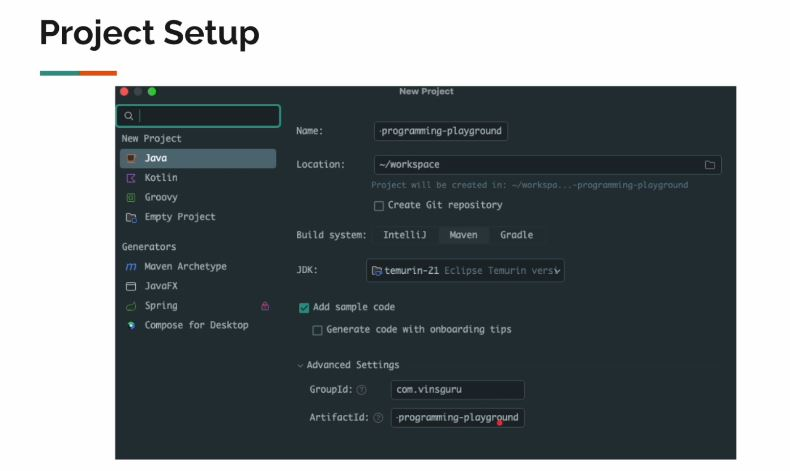
</div>

# Publisher/Subscriber Implementation - Part 1.

<div align="center">
    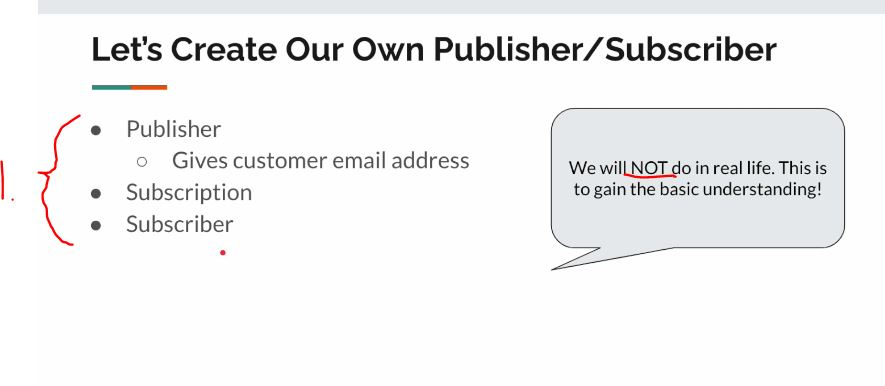
</div>

1. We **Don't** implement these ourselves in normal case!
    - We will be doing to gain understanding!

<div align="center">
    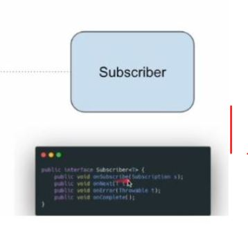
</div>

1. We will be implementing:
    - `public void onComplete()`.
    - `public void onError(Throwable throwable)`.
    - `public void onNext(String email)`.
    - `public void onSubscribe(Subscription subscription)`.

````
package org.java.reactive.sec01.subscriber;

import org.reactivestreams.Subscriber;
import org.reactivestreams.Subscription;
import org.slf4j.Logger;
import org.slf4j.LoggerFactory;

public class SubscriberImpl implements Subscriber<String> {

    private static final Logger log = LoggerFactory.getLogger(SubscriberImpl.class);
    private Subscription subscription;

    public Subscription getSubscription() {
        return subscription;
    }

    @Override
    public void onSubscribe(Subscription subscription) {
        this.subscription = subscription;
    }

    @Override
    public void onNext(String email) {
        log.info("received: {}", email);
    }

    @Override
    public void onError(Throwable throwable) {
        log.error("error", throwable);
    }

    @Override
    public void onComplete() {
        log.info("completed!");
    }
}
````

<div align="center">
    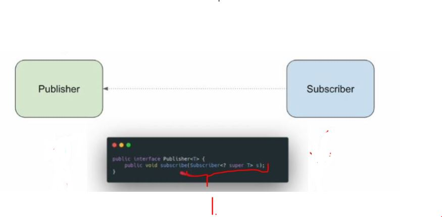
</div>

- `1.` We are defining the **Publisher**.
    - We are implementing the:
        - `public void subscribe(Subscriber<? super String> subscriber)`.
            - This will accept the **Subscriber**, so we could be passing the caller the **Subscription** object!

<div align="center">
    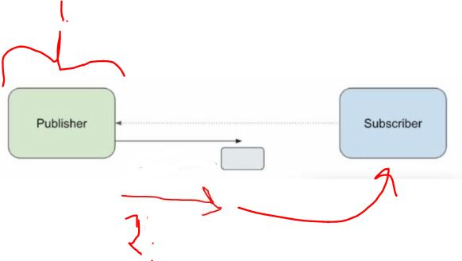
</div>

- `2.` We are creating the **Subscription object** and passing to the **Subscriber**.

- We are implementing the **Publisher** `1.` below:

````
package org.java.reactive.sec01.publisher;

import org.reactivestreams.Publisher;
import org.reactivestreams.Subscriber;

public class PublisherImpl implements Publisher<String> {

    @Override
    public void subscribe(Subscriber<? super String> subscriber) {
        var subscription = new SubscriptionImpl(subscriber); // This will be passed as Subscription object!
        subscriber.onSubscribe(subscription);
    }

}
````

<div align="center">
    
</div>

<div align="center">
    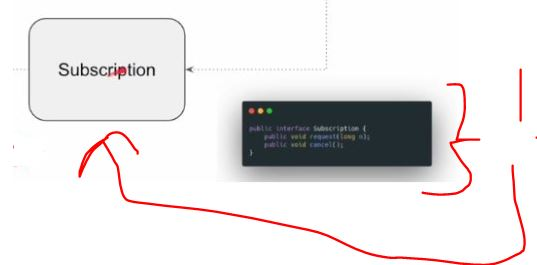
</div>

1. We are implanting the `SubscriptionImpl`, this is with the:
    - `public void request(long requested)`.
    - `public void cancel()`.

````
package org.java.reactive.sec01.publisher;

import org.reactivestreams.Subscriber;
import org.reactivestreams.Subscription;
import org.slf4j.Logger;
import org.slf4j.LoggerFactory;

public class SubscriptionImpl implements Subscription {

    private static final Logger log = LoggerFactory.getLogger(SubscriptionImpl.class);

    // We are holding the subscription.
    private final Subscriber<? super String> subscriber;

    public SubscriptionImpl(Subscriber<? super String> subscriber){
        this.subscriber = subscriber;
    }

    @Override
    public void request(long requested) {
    }

    @Override
    public void cancel() {
    }

}
````

# Publisher/Subscriber Implementation - Part 2.

- The `request(long requested)`. We are **producing** item using **Faker**.

````
    @Override
    public void request(long requested) {
        if(isCancelled){
            return;
        }

        log.info("subscriber has requested {} items", requested);
        if(requested > MAX_ITEMS){
            this.subscriber.onError(new RuntimeException("validation failed"));
            this.isCancelled = true;

            return;
        }
        for (int i = 0; i < requested && count < MAX_ITEMS; i++) {
            count++;
            this.subscriber.onNext(this.faker.internet().emailAddress());
        }
        if(count == MAX_ITEMS){
            log.info("no more data to produce");
            this.subscriber.onComplete();
            this.isCancelled = true;
        }
    }
````

- The `cancel()`.

````

    @Override
    public void cancel() {
        log.info("subscriber has cancelled");
        this.isCancelled = true;
    }

````

- The currently **Subscription**:

````
package org.java.reactive.sec01.publisher;

import com.github.javafaker.Faker;
import org.reactivestreams.Subscriber;
import org.reactivestreams.Subscription;
import org.slf4j.Logger;
import org.slf4j.LoggerFactory;

public class SubscriptionImpl implements Subscription {

    private static final Logger log = LoggerFactory.getLogger(SubscriptionImpl.class);
    private static final int MAX_ITEMS = 10;
    private final Faker faker;
    // We are holding the subscription.
    private final Subscriber<? super String> subscriber;

    private boolean isCancelled;
    private int count = 0;

    public SubscriptionImpl(Subscriber<? super String> subscriber){
        this.subscriber = subscriber;
        this.faker = Faker.instance();
    }

    @Override
    public void request(long requested) {
        if(isCancelled){
            return;
        }

        log.info("subscriber has requested {} items", requested);
        if(requested > MAX_ITEMS){
            this.subscriber.onError(new RuntimeException("validation failed"));
            this.isCancelled = true;

            return;
        }
        for (int i = 0; i < requested && count < MAX_ITEMS; i++) {
            count++;
            this.subscriber.onNext(this.faker.internet().emailAddress());
        }
        if(count == MAX_ITEMS){
            log.info("no more data to produce");
            this.subscriber.onComplete();
            this.isCancelled = true;
        }
    }

    @Override
    public void cancel() {
        log.info("subscriber has cancelled");
        this.isCancelled = true;
    }

}
````

# Publisher/Subscriber Demo.


- We are testing the `1.` publisher does not produce data unless subscriber requests for it:

````
private static void demo1() {
    var publisher = new PublisherImpl();
    var subscriber = new SubscriberImpl();
    publisher.subscribe(subscriber);
    }
````

- Nothing should happen!

- We are testing the `2.` publisher will produce only <= subscriber requested items. publisher can also produce 0 items!:

````

 private static void demo2() throws InterruptedException {
    var publisher = new PublisherImpl();
    var subscriber = new SubscriberImpl();
    publisher.subscribe(subscriber);
    subscriber.getSubscription().request(3);
    Thread.sleep(Duration.ofSeconds(2));
    subscriber.getSubscription().request(3);
    Thread.sleep(Duration.ofSeconds(2));
    subscriber.getSubscription().request(3);
    Thread.sleep(Duration.ofSeconds(2));
    subscriber.getSubscription().request(3);
    Thread.sleep(Duration.ofSeconds(2));
    subscriber.getSubscription().request(3);
    }
````

- It can provide data:

````
23:18:28.396 INFO  [           main] o.j.r.s.p.SubscriptionImpl     : subscriber has requested 3 items
23:18:28.747 INFO  [           main] o.j.r.s.s.SubscriberImpl       : received: nyla.turner@yahoo.com
23:18:28.748 INFO  [           main] o.j.r.s.s.SubscriberImpl       : received: jorge.spencer@gmail.com
23:18:28.749 INFO  [           main] o.j.r.s.s.SubscriberImpl       : received: shayna.nicolas@yahoo.com
23:18:30.763 INFO  [           main] o.j.r.s.p.SubscriptionImpl     : subscriber has requested 3 items
23:18:30.763 INFO  [           main] o.j.r.s.s.SubscriberImpl       : received: thurman.trantow@hotmail.com
23:18:30.764 INFO  [           main] o.j.r.s.s.SubscriberImpl       : received: spencer.runolfsson@hotmail.com
23:18:30.764 INFO  [           main] o.j.r.s.s.SubscriberImpl       : received: margarite.wehner@gmail.com
23:18:32.766 INFO  [           main] o.j.r.s.p.SubscriptionImpl     : subscriber has requested 3 items
23:18:32.767 INFO  [           main] o.j.r.s.s.SubscriberImpl       : received: donya.lubowitz@yahoo.com
23:18:32.767 INFO  [           main] o.j.r.s.s.SubscriberImpl       : received: qiana.tromp@yahoo.com
23:18:32.768 INFO  [           main] o.j.r.s.s.SubscriberImpl       : received: reagan.rath@hotmail.com
23:18:34.769 INFO  [           main] o.j.r.s.p.SubscriptionImpl     : subscriber has requested 3 items
23:18:34.769 INFO  [           main] o.j.r.s.s.SubscriberImpl       : received: briana.hegmann@hotmail.com
23:18:34.769 INFO  [           main] o.j.r.s.p.SubscriptionImpl     : no more data to produce
23:18:34.769 INFO  [           main] o.j.r.s.s.SubscriberImpl       : completed!
````

- The case: publisher can also produce 0 items!:
    - When we set `private static final int MAX_ITEMS = 0;`.

````

````

- Todo tee tämä loppuun.

# Mono / Flux - Introduction.

<div align="center">
    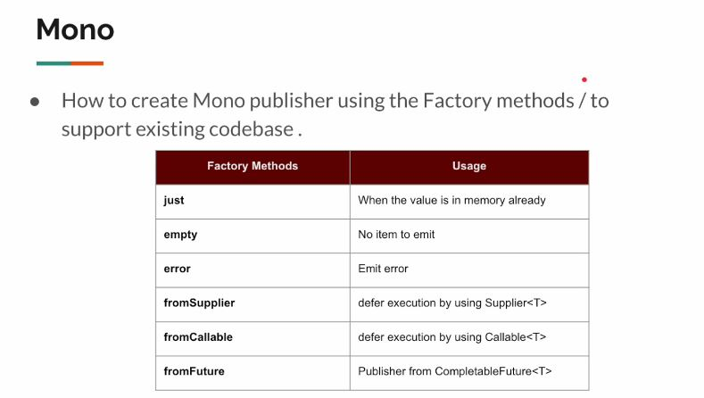
</div>

- **Reactive Stream** is the specification and **Project Reactor** is the library.
    - **Project Reactor** would be the same as the **Hibernate** for the **JPA**.

<div align="center">
    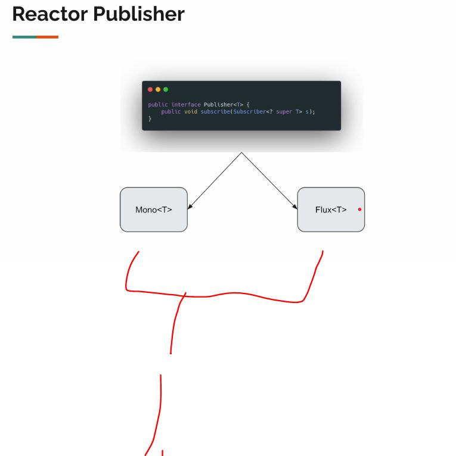
</div>

1. The **Project reactor** provides **two** different implementation of the
**Publisher<T>**.

<div align="center">
    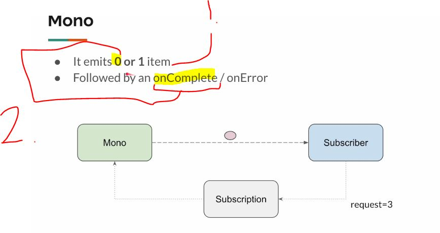
</div>

1. `Mono` can **emit** `0` or `1` item!
    - There can be case when there are **no items** to **emit**, then there will be the `onComplete()`.

<div align="center">
    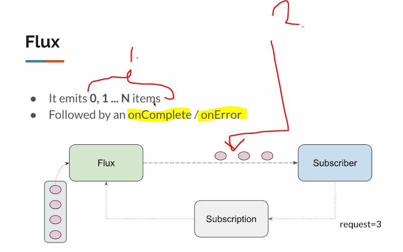
</div>

1. **Flux** can emit **multiple data**.
2. There can be **error** emitted at **any point** in the stream, when the emission is being happened!

# Why We Need Mono!

> [!TIP]
> Why we need to have **different** Mono and the Flux, if the Flux have the necessary things!

- Simple answer, it's **convenient**.

<div align="center">
    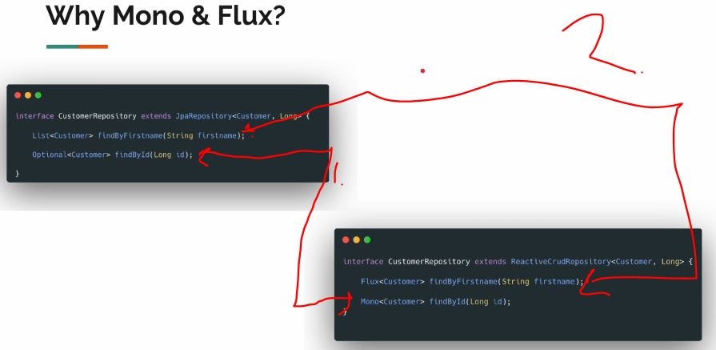
</div>

1. The **database** can return one or more data.
    - **Traditional way**, they have `Optional<Customer>`
    - **Reactive Stream way**, they have `Mono<Customer>`.

2. The same for the **many elements**, there will be 
    - **A Traditional way**, they have `List<Cusomer>`
    - **Reactive Stream way**, they have `Flux<Customer>`.

<div align="center">
    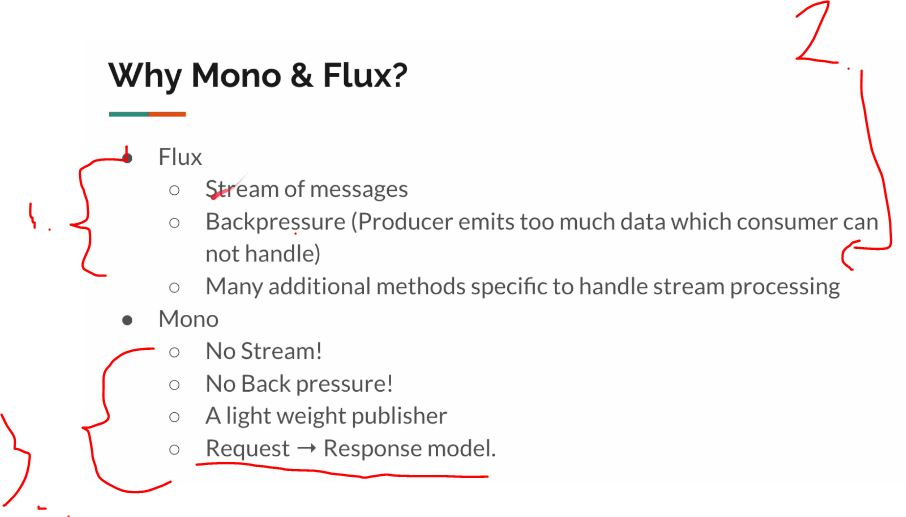
</div>

1. There will be many different methods in the `Flux`.
2. Example for handling the multiple data, **back pressure**.
3. The `Mono` is great for **simple cases**. 
    - For this case there can be **one value**, if its coming.
    - Request and response pattern.

# Stream Lazy Behavior.


- Like in below example, the **Java 8** streams are lazy. 
    - `.toList(); // This will be resolved as soon as there is terminal operator.`
        - This is one example of the terminal operator.

````
package org.java.reactive.sec02;


import org.slf4j.Logger;
import org.slf4j.LoggerFactory;

import java.util.stream.Stream;

public class Lec01LazyStream {
    private static final Logger log = LoggerFactory.getLogger(Lec01LazyStream.class);

    public static void main(String[] args) {

        // This is not reactive programming
        // Streams are Lazy.
        Stream.of("One", "Two")
                .peek(action -> log.info(" received : {}", action))
                .toList(); // This will be resolved as soon as there is terminal operator.
    }
}

````

- This same concept applies to the **Reactor Streams**, there will be no result, until there is **subscription**.  
    - Reactive Streams are **lazy**.

<div align="center">
    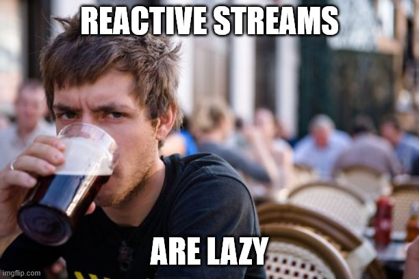
</div>

# Mono Just.

- `Mono.just<T value>` is the factory method for creating the exactly creating **Mono** of **one item**.

- This will **emit** the **value**, once **Publisher subscribes** for this **publisher**.
    - As following `Mono<String> mono = Mono.just("First");`.
        - This does not be any specific type. Example: `Mono.just(1); // Mono.just can be publisher of any type.`.

<div align="center">
    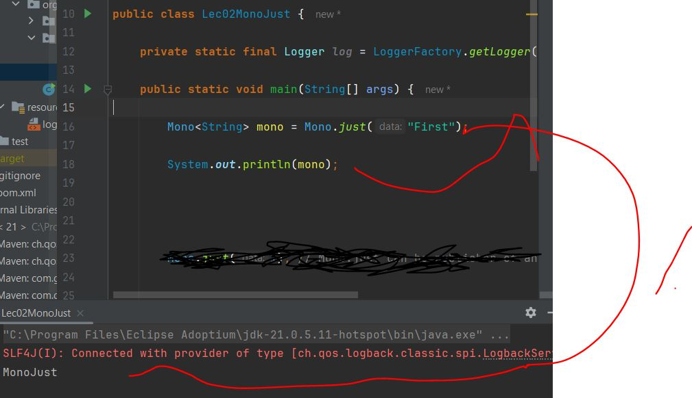
</div>

1. The logging would **not work** the `First`, since the publisher has not been **subscribed**.

- To get the logging working, we need to subscribe to the **Reactive Stream**.
    - Also notice, we are using our own **Reactive Stream** implementation with the **Project Reactor**. 

````
Mono<String> mono = Mono.just("First");
var subscriber = new SubscriberImpl();
mono.subscribe(subscriber);

subscriber.getSubscription().request(3);
````

- We can use the **Project Reactors** methods for logging, as following:

````
Mono<String> mono = Mono.just("First");
mono.subscribe(t -> System.out.println(t));
````

> [!NOTE]  
> In **Reactive World** we need to think in terms `Publisher`'s and `Subscriver`'s.

- `Mono.just()` is a **convenient** way to create a reactive Publisher
    - We need start passing these to **Reactive methods**.

# Mono Subscribe - Overloaded Methods.

<div align="center">
    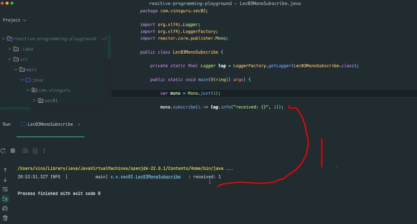
</div>

1. Two points to figure out:
    - There was no `completed` message this time?
    - We only `.subscribed()`, we did not `.request()`.

- We can use overloaded methods to solve these:

````
       mono.subscribe(
                i -> log.info("received: {}", i),
                err -> log.error("error", err),
                () -> log.info("Completed"),
                subscription -> subscription.request(1)
                );
````

- With following, we **transform** every data that is **emitted** by this **publisher**. 

````
        var mono = Mono.just(1)
                .map(i -> i + "a");

        mono.subscribe(
                i -> log.info("received: {}", i),
                err -> log.error("error", err),
                () -> log.info("Completed"),
                subscription -> subscription.request(1)
                );
````

- This will log:

````
00:03:03.101 INFO  [           main] o.j.r.sec02.Lec03MonoSubscribe : received: 1a
00:03:03.106 INFO  [           main] o.j.r.sec02.Lec03MonoSubscribe : Completed
````

- Illustrating the error handling also works:

````
        var mono = Mono.just(1)
                .map(i -> i / 0);

        mono.subscribe(
                i -> log.info("received: {}", i),
                err -> log.error("error", err),
                () -> log.info("Completed"),
                subscription -> subscription.request(1)
                );
````


# Creating Default Subscriber.


- TOdo 


# Mono - Empty / Error.

- We are going to make publisher that will emit empty value.

# On Error Dropped - Problem.

# Mono - From Supplier.

# Mono - From Callable.

# Mono - From Runnable.

# Mono - From Future.

# Publisher - Create Vs Execute.

# Mono - Defer.

# What About Data From Remote Service?  

# [Resource] - External Services.

# External Services.

# Non-Blocking IO Client.

# Non-Blocking IO Demo.

# ***FAQ*** - How Event Loop Works.

# ***FAQ*** - Why We Should NOT Use Block.

# Why Reactive Netty?

# ***Assignment***.

# Assignment Solution.

# What About Unit Testing?

# Summary.

# Quiz 2: Quiz.