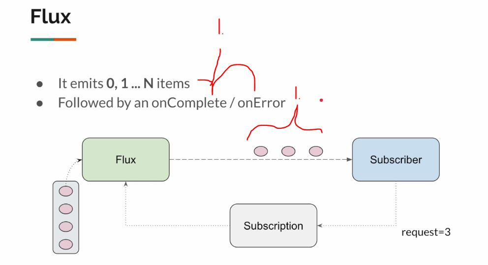
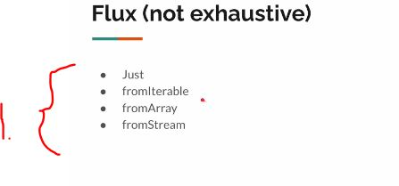
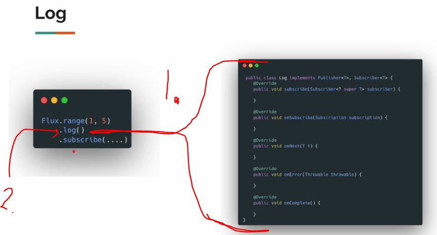
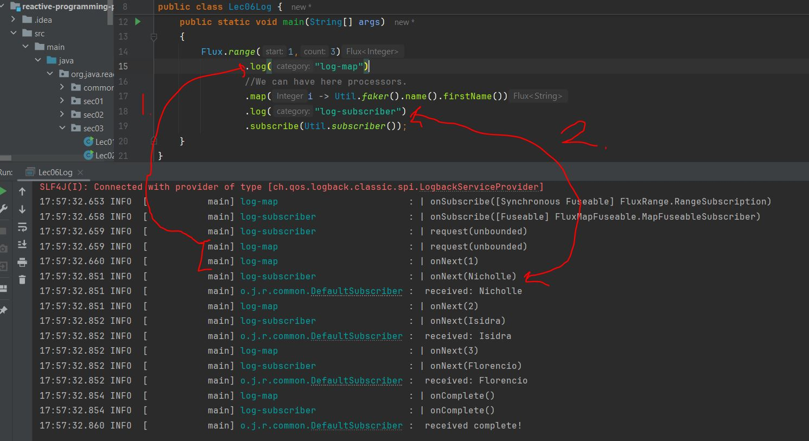
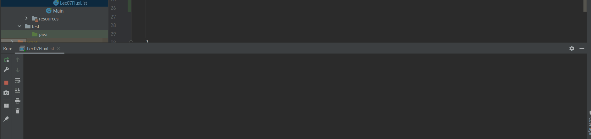
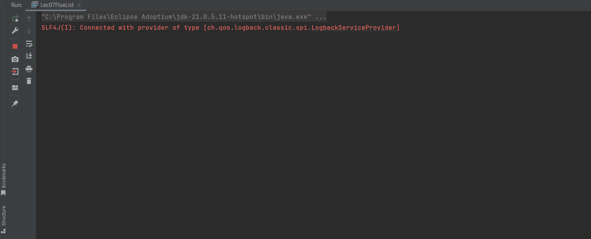

# Section 03: Flux.

Flux.

# What I learned.

# Flux - Just.

<div align="center">
    
</div>

1. **Flux** can emit 0 or more items followed by the `.onComplete()` or the `.onError()`!

<div align="center">
    
</div>

1. Some useful **Flux** factory methods, we can easily create **Flux** from:
    - `Flux.just(...)`. *Data already from the memory*.
    - `Flux.fromIterable(...)`. From *Java List*. 
    - `Flux.fromArray(...)`. From *Java Array*. 
    - `Flux.fromStream(...)`. . From *Java 8 Stream*.


- We can make **multiple** of something:
    - We can make **List** of using **Java 8** feature `List.of(1,2,3,4); `
    - Same, with the **Flux** 
    ```
    Flux.just(1,2 ,3 ) 
        .subscribe(Util.subscriber());`
    ````

- We are getting:

````
20:09:08.518 INFO  [           main] o.j.r.common.DefaultSubscriber :  received: 1
20:09:08.524 INFO  [           main] o.j.r.common.DefaultSubscriber :  received: 2
20:09:08.524 INFO  [           main] o.j.r.common.DefaultSubscriber :  received: 3
20:09:08.524 INFO  [           main] o.j.r.common.DefaultSubscriber :  received: sam
20:09:08.530 INFO  [           main] o.j.r.common.DefaultSubscriber :  received complete!
````

- The Exercise `Lec01FluxJust.java`:

````
package org.java.reactive.sec03;

import org.java.reactive.common.Util;
import org.slf4j.Logger;
import org.slf4j.LoggerFactory;
import reactor.core.publisher.Flux;

import java.util.List;

public class Lec01FluxJust {

    private static final Logger log = LoggerFactory.getLogger(Lec01FluxJust.class);

    public static void main(String[] args) {

        List.of(1,2,3,4); // We can make List of using Java 8 feature.

        Flux.just(1,2 ,3 , "sam") // Same concept applies for the Flux.
                .subscribe(Util.subscriber());
    }
}
````

# Flux - Multiple Subscribers.

> By **default**, **Flux** and **Mono** are **cold** — meaning each subscriber gets its *own independent data stream*!

- We can **filter** per **Subscriber**.

````
   var flux = Flux.just(1,2 ,3 , 4);

        flux.subscribe(Util.subscriber("sub1"));
        flux.subscribe(Util.subscriber("sub2"));
        // This Subscription will do some extra logic!
        flux.filter(i -> i % 2 == 0)
                .subscribe(Util.subscriber("sub3"));
````

- The logs:

````
17:56:47.698 INFO  [           main] o.j.r.common.DefaultSubscriber : sub1 received: 1
17:56:47.702 INFO  [           main] o.j.r.common.DefaultSubscriber : sub1 received: 2
17:56:47.702 INFO  [           main] o.j.r.common.DefaultSubscriber : sub1 received: 3
17:56:47.702 INFO  [           main] o.j.r.common.DefaultSubscriber : sub1 received: 4
17:56:47.707 INFO  [           main] o.j.r.common.DefaultSubscriber : sub1 received complete!
17:56:47.707 INFO  [           main] o.j.r.common.DefaultSubscriber : sub2 received: 1
17:56:47.707 INFO  [           main] o.j.r.common.DefaultSubscriber : sub2 received: 2
17:56:47.707 INFO  [           main] o.j.r.common.DefaultSubscriber : sub2 received: 3
17:56:47.707 INFO  [           main] o.j.r.common.DefaultSubscriber : sub2 received: 4
17:56:47.707 INFO  [           main] o.j.r.common.DefaultSubscriber : sub2 received complete!
17:56:47.713 INFO  [           main] o.j.r.common.DefaultSubscriber : sub3 received: 2
17:56:47.713 INFO  [           main] o.j.r.common.DefaultSubscriber : sub3 received: 4
17:56:47.713 INFO  [           main] o.j.r.common.DefaultSubscriber : sub3 received complete!
````

- The Exercise `Lec02MultipleSubscribers.java`:

````
package org.java.reactive.sec03;

import org.java.reactive.common.Util;
import org.slf4j.Logger;
import org.slf4j.LoggerFactory;
import reactor.core.publisher.Flux;

import java.util.List;

public class Lec02MultipleSubscribers {

    private static final Logger log = LoggerFactory.getLogger(Lec02MultipleSubscribers.class);

    public static void main(String[] args) {

        var flux = Flux.just(1,2 ,3 , 4);

        flux.subscribe(Util.subscriber("sub1"));
        flux.subscribe(Util.subscriber("sub2"));
        // This Subscription will do some extra logic!
        flux.filter(i -> i % 2 == 0)
                .subscribe(Util.subscriber("sub3"));

    }


}
````

# Flux - From Array / List.

- How to **convert** Array or List to **Flux**:

- Converting to from **Collection** to the **Flux**: 

````
   // From Java collection:
        var list = List.of("a","b","c");
        Flux.fromIterable(list)
                .subscribe(Util.subscriber());
````

- Converting to from **Array** to the **Flux**:

````
// Form Java array:
        Integer[] arr = {1,2,3,4,5,6,7};
        Flux.fromArray(arr)
                .subscribe(Util.subscriber());
````

- Logging:

````
18:11:29.544 INFO  [           main] o.j.r.common.DefaultSubscriber :  received: a
18:11:29.548 INFO  [           main] o.j.r.common.DefaultSubscriber :  received: b
18:11:29.548 INFO  [           main] o.j.r.common.DefaultSubscriber :  received: c
18:11:29.552 INFO  [           main] o.j.r.common.DefaultSubscriber :  received complete!
18:11:29.553 INFO  [           main] o.j.r.common.DefaultSubscriber :  received: 1
18:11:29.553 INFO  [           main] o.j.r.common.DefaultSubscriber :  received: 2
18:11:29.553 INFO  [           main] o.j.r.common.DefaultSubscriber :  received: 3
18:11:29.553 INFO  [           main] o.j.r.common.DefaultSubscriber :  received: 4
18:11:29.553 INFO  [           main] o.j.r.common.DefaultSubscriber :  received: 5
18:11:29.553 INFO  [           main] o.j.r.common.DefaultSubscriber :  received: 6
18:11:29.553 INFO  [           main] o.j.r.common.DefaultSubscriber :  received: 7
18:11:29.554 INFO  [           main] o.j.r.common.DefaultSubscriber :  received complete!
````


- The Exercise `Lec03FluxFromIterableOrArray.java`:

````
package org.java.reactive.sec03;

import org.java.reactive.common.Util;
import org.slf4j.Logger;
import org.slf4j.LoggerFactory;
import reactor.core.publisher.Flux;

import java.util.List;

public class Lec03FluxFromIterableOrArray {

    private static final Logger log = LoggerFactory.getLogger(Lec03FluxFromIterableOrArray.class);

    public static void main(String[] args) {

        // From Java collection:
        var list = List.of("a","b","c");
        Flux.fromIterable(list)
                .subscribe(Util.subscriber());
        // Form Java array:
        Integer[] arr = {1,2,3,4,5,6,7};
        Flux.fromArray(arr)
                .subscribe(Util.subscriber());
    }
}
````

# Flux - From Stream.

- We get *error* when **Subscribing** **two times** to the **Flux**, which have has data from the **Stream**:

````
    var list = List.of(1,2,3,4);
    var stream = list.stream();

    var flux = Flux.fromStream(stream);
    flux.subscribe(Util.subscriber("sub1"));
    flux.subscribe(Util.subscriber("sub2"));
````

- Would throw error:

````
18:26:36.297 INFO  [           main] o.j.r.common.DefaultSubscriber : sub1 received: 1
18:26:36.302 INFO  [           main] o.j.r.common.DefaultSubscriber : sub1 received: 2
18:26:36.302 INFO  [           main] o.j.r.common.DefaultSubscriber : sub1 received: 3
18:26:36.302 INFO  [           main] o.j.r.common.DefaultSubscriber : sub1 received: 4
18:26:36.307 INFO  [           main] o.j.r.common.DefaultSubscriber : sub1 received complete!
18:26:36.314 ERROR [           main] o.j.r.common.DefaultSubscriber : sub2 error
java.lang.IllegalStateException: stream has already been operated upon or closed
	at java.base/java.util.stream.AbstractPipeline.spliterator(AbstractPipeline.java:346)
	at reactor.core.publisher.FluxStream.subscribe(FluxStream.java:57)
	at reactor.core.publisher.Flux.subscribe(Flux.java:8891)
	at org.java.reactive.sec03.Lec04FluxFromStream.main(Lec04FluxFromStream.java:21)
````

> [!IMPORTANT]
> A **Java Stream** (from `list.stream()`) can only be consumed **once**.


- We can create **Flux** from **Stream** of **supplier**.
    - Example: `var flux = Flux.fromStream(() -> List.of().stream());`.

- The Exercise `Lec04FluxFromStream.java`:

````
package org.java.reactive.sec03;

import org.java.reactive.common.Util;
import org.slf4j.Logger;
import org.slf4j.LoggerFactory;
import reactor.core.publisher.Flux;

import java.util.List;

public class Lec04FluxFromStream {

    private static final Logger log = LoggerFactory.getLogger(Lec04FluxFromStream.class);

    public static void main(String[] args) {

    var list = List.of(1,2,3,4);
    var stream = list.stream();

    // This will be having error, when subscribing to multiple
//    var flux = Flux.fromStream(stream);

        var flux = Flux.fromStream(() -> List.of().stream());
    flux.subscribe(Util.subscriber("sub1"));
    flux.subscribe(Util.subscriber("sub2"));
    }
}
````

# Flux - Range.

- **Flux.range(...)** is for loop for Reactive Programming.

- Assignments **Faker** 10 random names: 

````
        Flux.range(1,10)
                .map(i -> Faker.instance().name().firstName())
                .subscribe(Util.subscriber());
````

- The Exercise `Lec05FluxFromRange.java`:

````
package org.java.reactive.sec03;

import com.github.javafaker.Faker;
import org.java.reactive.common.Util;
import org.slf4j.Logger;
import org.slf4j.LoggerFactory;
import reactor.core.publisher.Flux;

public class Lec05FluxFromRange {

    private static final Logger log = LoggerFactory.getLogger(Lec05FluxFromRange.class);

    public static void main(String[] args)
    {
        Flux.range(1,10)
                .subscribe(Util.subscriber());

        // Faker 10 random names
        Flux.range(1,10)
                .map(i -> Faker.instance().name().firstName())
                .subscribe(Util.subscriber());
    }
}
````

# Log Operator. 

- Reminder of the **Reactive Stream** roles:

| Interface | Role | Description |
|------------|------|-------------|
| `Publisher<T>` | 🟢 **Producer** | Emits data items (`onNext`), completion (`onComplete`), or errors (`onError`). |
| `Subscriber<T>` | 🟣 **Consumer** | Receives data from the publisher. |
| `Subscription` | 🔄 **Link** | Connects Publisher and Subscriber; allows backpressure control (`request(n)` / `cancel()`). |
| `Processor<T, R>` | ⚙️ **Both** | Acts as both a `Subscriber` (consuming) and a `Publisher` (producing) — used for data transformation. |
---

- Between `Publisher` and `Subcriber`, there can be multiple **Processors**!

````
Flux.range(1,5)
                //We can have here processors.
                .subscribe(Util.subscriber());
````

<div align="center">
    
</div>

1. Log implements `Publisher` and `Subscriber`.
2. `.log()` will act as **middleman**. **Producer** for `Flux.range(1,5)` and **Consumer** for `Subscriber(...)`.

- As below, the `.log()`:
    - Will be between **Producer** and **Consumer**.
        - Belows example it will be:
            - **Producer**: `Flux.range(1,5)`.
            - **Consumer**: `.map(i -> Util.faker().name().firstName())`.
                - ❌ Notice ❌, the `.subscribe(Util.subscriber());` will not be in scope!
````
Flux.range(1,3)
                .log("log-map")
                //We can have here processors.
                .map(i -> Util.faker().name().firstName())
                .subscribe(Util.subscriber());
````

- If you want full **logging** you need to add second `.log()` as following:
    - You can add also **names** for the **loggers**!

````
    Flux.range(1,3)
                .log("log-map")
                //We can have here processors.
                .map(i -> Util.faker().name().firstName())
                .log("log-subscriber")
                .subscribe(Util.subscriber());
````

<div align="center">
    
</div>

1. You can see these logging line **first**. Logger name: `log-map`.
2. **Second** comes this line. Logger name: `log-subscriber`.

- The Exercise `Lec06Log.java`:

````
package org.java.reactive.sec03;

import org.java.reactive.common.Util;
import org.slf4j.Logger;
import org.slf4j.LoggerFactory;
import reactor.core.publisher.Flux;

public class Lec06Log {

    private static final Logger log = LoggerFactory.getLogger(Lec06Log.class);

    public static void main(String[] args)
    {
        Flux.range(1,3)
                .log("log-map")
                //We can have here processors.
                .map(i -> Util.faker().name().firstName())
                .subscribe(Util.subscriber());
    }
}
````

# Flux Vs List.

- This example there will be **long waiting** line, and we don't know what **Producer** will be doing.

````
    var list = NameGenerator.getNameList(10);
    System.out.println(list);
````   

- After while the logging will be printing:

<div align="center">
    
</div>

- Logging with **Reactive Approach**.

````
        // This is the reactive way of logging
        NameGenerator.getNameListAsReactiveSecond(10)
                .subscribe(Util.subscriber());
````

- Will produce the logs, when they are ready.
    - We will be having idea what is happening under the hood.

<div align="center">
    
</div>


- The Exercise `.java`:

````


````


# ChatGPT vs Gemini.

# FAQ - Are Mono & Flux Data Structures?

# Flux - Non-Blocking IO Stream - Demo.

# Flux - Interval.

# Flux - Empty / Error.

# Flux - Defer.

# Mono/Flux Conversion.

# Assignment.

# Assignment Solution.

