# Section 09: Combining Publishers.

Combining Publishers.

# What I learned.

# Introduction.

<div align="center">
    
</div>

1. This is **super** important lecture. It's to **combine** the **multiple publishers**!

<div align="center">
    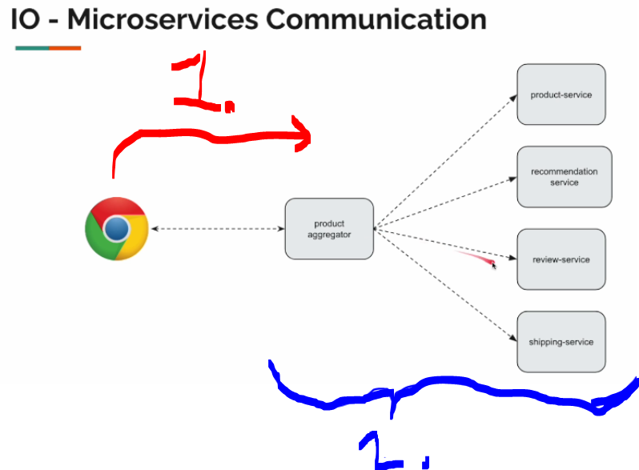
</div>

1. Let's image that the **front end** will be making one **request** to the `product aggregator` **microservice**. 
    - Let's say, its **product view** request!

2. Often times **microservice architecture** has **multiple sources of data**.
    - Many times' backend will ask from **multiple sources** and **aggregates** data and send it back to the **front end**!
    - Also, notice that returned types can be different, **Flux** or **Mono**!

> [!TIP]
> 💡 There is usually **multiple** smaller request in backend for **one** front end request! 💡
>    - These smaller requests can be in different shapes and sizes!  

<div align="center">
    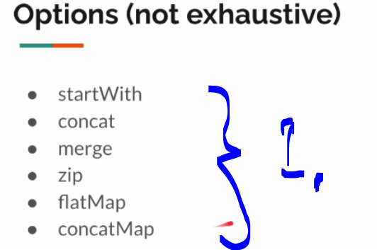
</div>

1. **Project Reactor** provides, operations to achieve the business requirements in **specific order**!

> [!IMPORTANT]
> Notice that `Mono` and `Flux` **share most methods**!

# Start With.

<div align="center">
    
</div>

> [!TIP]
> `.startWith(...)` adds values (or another Publisher) at the **beginning** of a reactive sequence.

<div align="center">
    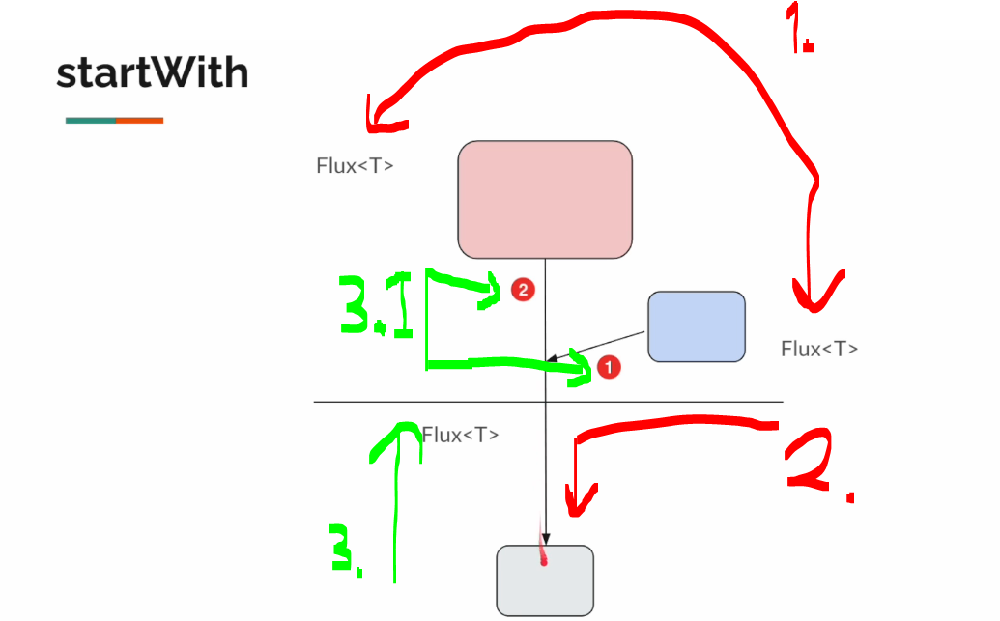
</div>

1. We have **two** publishers. They can be type `T`, any type!
2. With the `.startWith(...)` we can combine **two publishers** into **one publisher**!  
3. From **subscriber** point of view, it will be one **publisher**!
    - In `3.1`, if the **publisher** wants **6** items, it will check from **first publisher** in `1` and then get rest from **second publisher** in `2`!

- First experiment with the `.startWith(-1, 0)`, it should emit `-1, 0` **first**, before going into `.producer1(...)` and **then** emit `1, 2, 3`:

````Java
    public static void main(String[] args)
    {
        demo1();

        Util.sleepSeconds(3);
    }

    private static void demo1()
    {
        producer1()
                .startWith(-1, 0)
                .subscribe(Util.subscriber());
    }
    private static Flux<Integer> producer1()
    {
        return Flux.just(1, 2, 3)
                   .doOnSubscribe(s -> log.info("subscribing to producer1"))
                   .delayElements(Duration.ofMillis(10));
    }
````

<div align="center">
    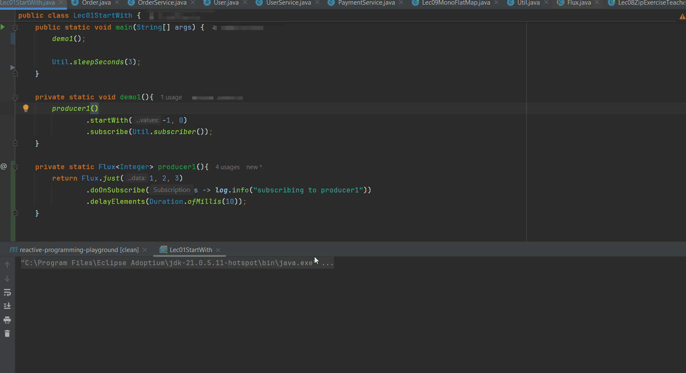
</div>

- You can see the logs:
    - `1.` **First** `received: -1` and `received: 0`.
    - `2.` **Second** logs `subscribing to producer1` and then `received: 1`, `received: 2`, `received: 3` and `received complete!`.

````Bash
00:14:48.089 INFO  [           main] o.j.r.common.DefaultSubscriber :  received: -1
00:14:48.100 INFO  [           main] o.j.r.common.DefaultSubscriber :  received: 0
00:14:48.108 INFO  [           main] o.j.r.sec09.Lec01StartWith     : subscribing to producer1
00:14:48.138 INFO  [     parallel-1] o.j.r.common.DefaultSubscriber :  received: 1
00:14:48.153 INFO  [     parallel-2] o.j.r.common.DefaultSubscriber :  received: 2
00:14:48.169 INFO  [     parallel-3] o.j.r.common.DefaultSubscriber :  received: 3
00:14:48.179 INFO  [     parallel-3] o.j.r.common.DefaultSubscriber :  received complete!
````


<details>
<summary id="reactive programming
" open="true" alt="reactive programming"> <b> Flux.startWith(...) and Mono.startWith(...) working source code!</b> </summary>

````Java

````

</details>


# Start With - Usecases.

<details>
<summary id="reactive programming
" open="true" alt="reactive programming"> <b> Flux.startWith(...) and Mono.startWith(...) usecases working source code!</b> </summary>

````Java

````

</details>

# Concat With.

<div align="center">
    
</div>

<details>
<summary id="reactive programming
" open="true" alt="reactive programming"> <b> Flux.concatWith(...) and Mono.concatWith(...) usecases working source code!</b> </summary>

````Java

````

</details>


# Concat Delay Error.

<div align="center">
    
</div>


<details>
<summary id="reactive programming
" open="true" alt="reactive programming"> <b> Flux.concatDelayError(...) use cases working source code!</b> </summary>

````Java

````

</details>


# Merge.

<div align="center">
    
</div>


<details>
<summary id="reactive programming
" open="true" alt="reactive programming"> <b> merge use cases working source code!</b> </summary>

````Java

````

</details>


# Merge - Usecases.

# Zip.

<div align="center">
    
</div>

<div align="center">
    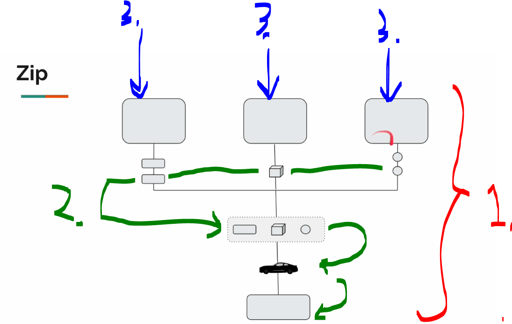
</div>

1. We are **illustrating** manufacturing **car** from pieces!
2. With, **these pieces** we are **building a car** and giving it to the **subscriber**!
3. Each **producer** is **producing pieces independently** and in various intervals!
    - **First** is producing **two** pieces! Car body!
    - **Second** is producing **one** pieces! Car engine!
    - **Third** is producing **two** pieces! Tires!

- With `.zip(...)` it will be **all or nothing**!
    - Meaning with following picture, we can build **one** car, since there is no pieces for the another car!

- **Zip**.
    - We will subscribe to all the producers at the same time!
    - All or nothing!
    - All producers will have to emit an item!

- Comparison to the **merge**, which we have been introduced before! 

    | Function | Waits for all sources?? | Notes |
    |----------|-----------------------------|-------|
    | **zip**      | ✅ Yes (one from each)       | Tuples |
    | **merge**    | ❌ No                        | Individual items |

- We can have multiple **publishers**, here we have **three**:
    - One for **body**.

        ````Java

            /**
             * This will emmit Body!
            */
            private static Flux<String> getBody() {
                return Flux.range(1, 5)
                        .map(i -> "body-" + i)
                        .delayElements(Duration.ofMillis(100));
            }
        ````
    - One for **engine**.
        ````Java
            /**
             * This emmit Engine!
            */
            private static Flux<String> getEngine() {
                return Flux.range(1, 3)
                        .map(i -> "engine-" + i)
                        .delayElements(Duration.ofMillis(200));
            }
        ````
    - One for **tires**.
        ````Java
            /**
             * This emmit Tires!
            */
            private static Flux<String> getTires() {
                return Flux.range(1, 10)
                        .map(i -> "tires-" + i)
                        .delayElements(Duration.ofMillis(300));
            }
        ````

- The data types can be **different** and the **rates** for the **publishers**.

- We can the **types** for each of the car parts!
    - `getBody()` → `Sting`.
    - `getTires()` → `String`.
    - `getEngine()` → `String`.

> [!TIP]
> **What is a Tuple?**
> A **tuple** is a small, ordered container that holds a fixed number of values, possibly of different types.

````Java
Flux<Tuple3<String, String, String>> zip = Flux.zip(getBody(), getTires(), getEngine());
````

<div align="center">
    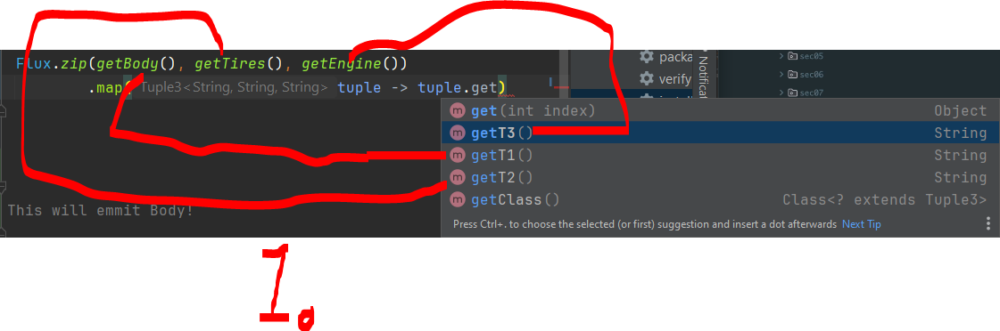
</div>

1. We can get items from the producer!
    - `getT1()` item created by **first** producer!
    - `getT2()` item created by **second** producer!
    - `getT3()` item created by **third** producer!

- We are building following `Car record`.

````Java
    record Car(String body, String engine, String tires)
    {

    }
````

- We are building **car** object, with `.zip(...)`.

````Java
Flux.zip(getBody(), getEngine(), getTires())
                .map(tuple -> new Car(tuple.getT1(), tuple.getT2(), tuple.getT3()))
                .subscribe(Util.subscriber());

        Util.sleepSeconds(5);
````

- Using `.zip(...)` illustration.

<div align="center">
    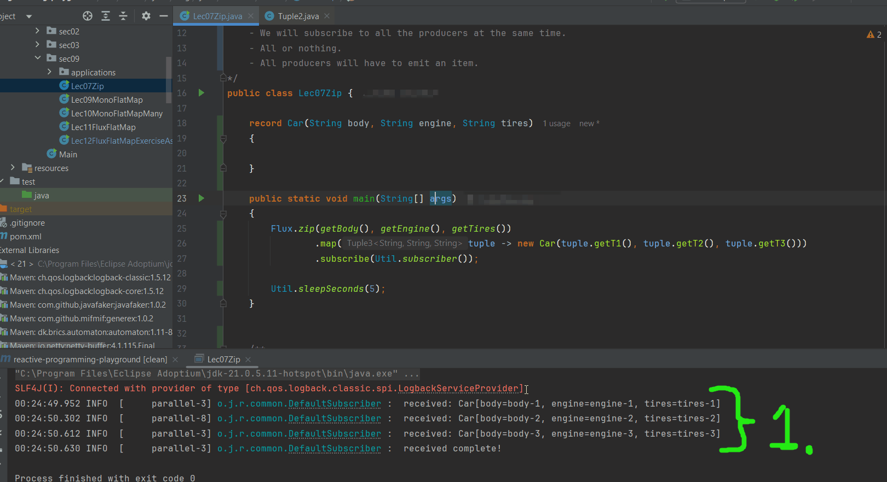
</div>

1. We can see **three** cars getting built!

````Bash
00:36:59.886 INFO  [     parallel-3] o.j.r.common.DefaultSubscriber :  received: Car[body=body-1, engine=engine-1, tires=tires-1]
00:37:00.234 INFO  [     parallel-7] o.j.r.common.DefaultSubscriber :  received: Car[body=body-2, engine=engine-2, tires=tires-2]
00:37:00.551 INFO  [     parallel-2] o.j.r.common.DefaultSubscriber :  received: Car[body=body-3, engine=engine-3, tires=tires-3]
00:37:00.555 INFO  [     parallel-2] o.j.r.common.DefaultSubscriber :  received complete!
````

- `.zip(...)` is **all or nothing**, if we change the emission to `Flux.empty()`:

````Java
    /**
     * This emmit Engine!
     */
    private static Flux<String> getEngine() {
        return Flux.empty()
                .map(i -> "engine-" + i)
                .delayElements(Duration.ofMillis(200));
    }
````

- We can see there is **car** done, if one **producer** is missing an item.

<div align="center">
    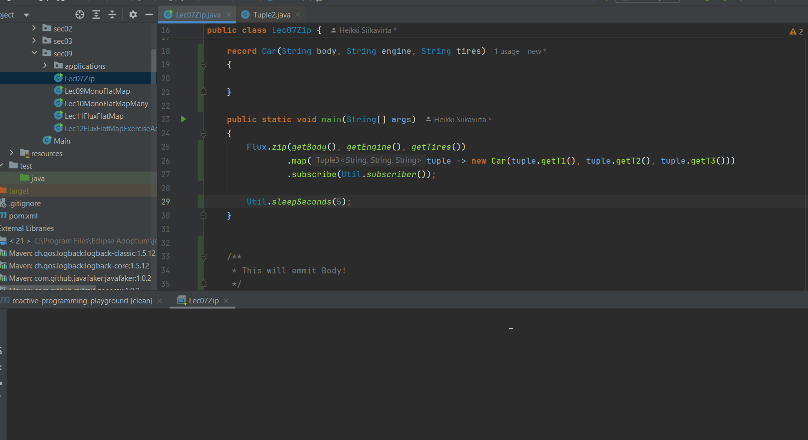
</div>

1. No **car** is being built in this case!

<details>
<summary id="reactive programming
" open="true" alt="reactive programming"> <b> zip code implementation!</b> </summary>

````Java
package org.java.reactive.sec09;

import org.java.reactive.common.Util;
import reactor.core.publisher.Flux;
import reactor.util.function.Tuple3;
import reactor.util.function.Tuple4;

import java.time.Duration;

/*
    Zip:
    - We will subscribe to all the producers at the same time.
    - All or nothing.
    - All producers will have to emit an item.
*/
public class Lec07Zip {

    record Car(String body, String engine, String tires)
    {

    }

    public static void main(String[] args)
    {
        Flux.zip(getBody(), getEngine(), getTires())
                .map(tuple -> new Car(tuple.getT1(), tuple.getT2(), tuple.getT3()))
                .subscribe(Util.subscriber());

        Util.sleepSeconds(5);
    }


    /**
     * This will emmit Body!
     */
    private static Flux<String> getBody() {
        return Flux.range(1, 5)
                .map(i -> "body-" + i)
                .delayElements(Duration.ofMillis(100));
    }

    /**
     * This emmit Engine!
     */
    private static Flux<String> getEngine() {
        return Flux.range(1, 3)
                .map(i -> "engine-" + i)
                .delayElements(Duration.ofMillis(200));
    }

    /**
     * This emmit Tires!
     */
    private static Flux<String> getTires() {
        return Flux.range(1, 10)
                .map(i -> "tires-" + i)
                .delayElements(Duration.ofMillis(300));
    }
}
````
</details>

# Zip - Assignment.

<div align="center">
    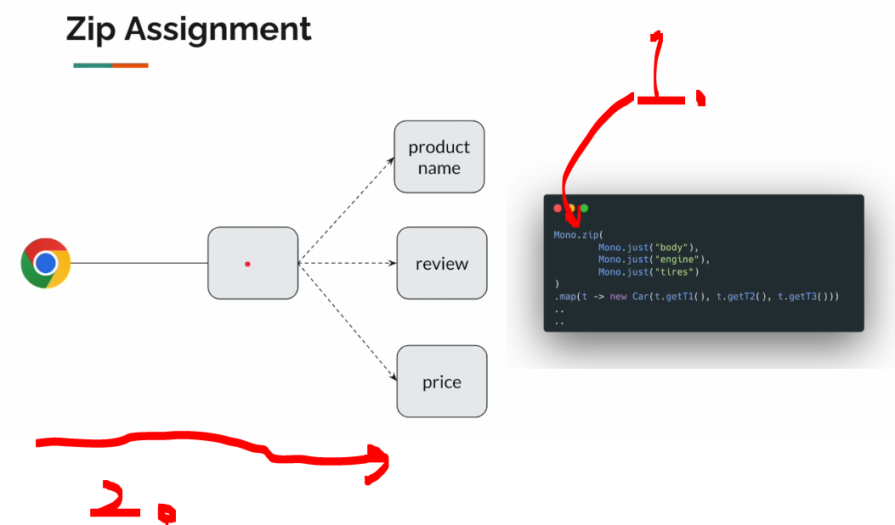
</div>

1. `Mono.zip(...)` is also possible, not just `Flux.zip()`.
2. We will call these services for **front end**.

<div align="center">
    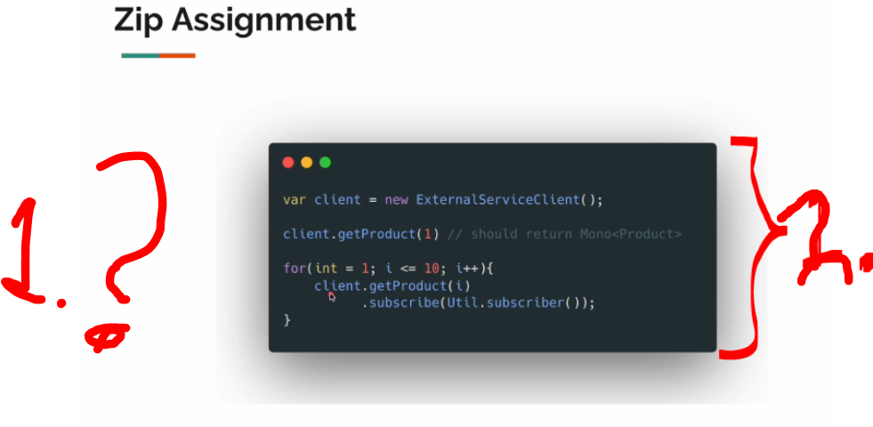
</div>

1. Code as following:
    ````Java
    var client = new ExternalServiceClient();

    client.getProduct(1) // should return Mono<Product>

    for(int i = 1; i <= 10; i++){
        client.getProduct(i)
            .subscribe(Util.subscriber());
    }
    ````

<div align="center">
    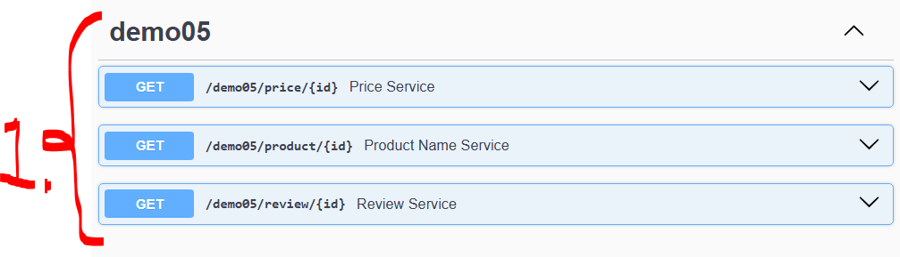
</div>

1. Task will be running against these endpoints!

<details>
<summary id="zip assignment my answer" open="true"> <b> zip - Assignment - My Answer!</b> </summary>
 
````Java
package org.java.reactive.sec09;

import org.java.reactive.common.Util;
import org.java.reactive.sec09.client.ExternalServiceClient;

/*
    Ensure that the external service is up and running!
 */
public class Lec07ZipExercise
{

    public static void main(String[] args)
    {
        var client = new ExternalServiceClient();

        for(int i = 1; i <= 10; i++){
            client.getProduct(i)
                    .subscribe(Util.subscriber());
        }

        Util.sleepSeconds(4);
    }
}
````

````Java
package org.java.reactive.sec09.client;

import org.java.reactive.common.AbstractHttpClient;
import reactor.core.publisher.Flux;
import reactor.core.publisher.Mono;

import java.util.zip.ZipEntry;

import static reactor.core.publisher.Flux.zip;

public class ExternalServiceClient extends AbstractHttpClient {

    public record Product(String productName, String review, String price)
    {

    }

    public Mono<Product> getProduct(int ammount) {

        for (int i = 0; i < ammount; i++) {

            return Mono.zip(
                    this.httpClient
                            .get() // for Get.
                            .uri("/demo05/product/" + ammount) // The Base URI, will be getted.
                            .responseContent() // Will be getting as Flux<ByteBuf>.
                            .asString() // We need to tell that its Flux of the String.
                            .next()
                    ,
                    this.httpClient
                            .get() // for Get.
                            .uri("/demo05/review/" + ammount) // The Base URI, will be getted.
                            .responseContent() // Will be getting as Flux<ByteBuf>.
                            .asString() // We need to tell that its Flux of the String.
                            .next()
                    ,
                    this.httpClient
                            .get() // for Get.
                            .uri("/demo05/price/" + ammount) // The Base URI, will be getted.
                            .responseContent() // Will be getting as Flux<ByteBuf>.
                            .asString() // We need to tell that its Flux of the String.
                            .next()

            ).map(tuple -> new Product(tuple.getT2(), tuple.getT3(), tuple.getT1()));

        }
        return null;
    }
}
````

````Java
package org.java.reactive.common;

import reactor.netty.http.client.HttpClient;
import reactor.netty.resources.LoopResources;

public abstract class AbstractHttpClient {

    private static final String BASE_URL = "http://localhost:7070";
    protected HttpClient httpClient;

    public AbstractHttpClient() {
        var loopResources = LoopResources.create("ScoopiDoo", 1 , true);

        // We can provide the other attributes in the HttpClient.create() section.
        this.httpClient = HttpClient.create().runOn(loopResources).baseUrl(BASE_URL);

    }
}
````
</details>


<details>
<summary id="zip assignment teacher answer" open="true"> <b> zip - Assignment - Teacher's Answer!</b> </summary>
 
 ````Java
 package com.vinsguru.sec09.assignment;

public record Product(String name,
                      String review,
                      String price) {
}
````

````Java
package com.vinsguru.sec09.assignment;

import com.vinsguru.common.AbstractHttpClient;
import reactor.core.publisher.Mono;

// just for demo
public class ExternalServiceClient extends AbstractHttpClient {

    public Mono<Product> getProduct(int productId) {
        return Mono.zip(
                           getProductName(productId),
                           getReview(productId),
                           getPrice(productId)
                   )
                   .map(t -> new Product(t.getT1(), t.getT2(), t.getT3()));
    }

    private Mono<String> getProductName(int productId) {
        return get("/demo05/product/" + productId);
    }

    private Mono<String> getReview(int productId) {
        return get("/demo05/review/" + productId);
    }

    private Mono<String> getPrice(int productId) {
        return get("/demo05/price/" + productId);
    }

    private Mono<String> get(String path) {
        return this.httpClient.get()
                              .uri(path)
                              .responseContent()
                              .asString()
                              .next();
    }

}
````
</details>

# FlatMap - Introduction.

<div align="center">
    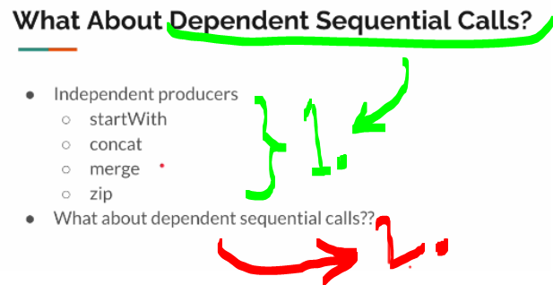
</div>

1. These operations will **not** work for the **dependent sequential calls!** 
    - These are producing results as **independent**! Meaning the results, **don't rely** on an others results!
        - Example of independent producers:
            - `.startWith(...)`. [StartWith operation](https://github.com/developersCradle/reactive-programming/tree/main/Mastering%20Java%20Reactive%20Programming%20From%20Scratch/Section%2009#start-with).
            - `.concat(...)`. [Concat operation](https://github.com/developersCradle/reactive-programming/tree/main/Mastering%20Java%20Reactive%20Programming%20From%20Scratch/Section%2009#concat-with).
            - `.merge(...)`. [Merge operation](https://github.com/developersCradle/reactive-programming/tree/main/Mastering%20Java%20Reactive%20Programming%20From%20Scratch/Section%2009#merge).
            - `.zip(...)`. [Zip operation](https://github.com/developersCradle/reactive-programming/tree/main/Mastering%20Java%20Reactive%20Programming%20From%20Scratch/Section%2009#zip).

- What **independent** means in this context:
    - **Request A** does not need data from **Request B**.
    - **Request B** does not need data from **Request A**.

2. What is happening when we want something from **previous call**? We can use `.flatMap()` in such cases!

- In **Project Reactor** `.flatMap()` is **often** used when the next call depends on a **value produced** by the previous call. Example below:

 ````Java
getUser()
.flatMap(user -> getOrdersByUserId(user.getId()))
.flatMap(orders -> calculateDiscount(orders))
.flatMap(discount -> saveDiscount(discount))
.subscribe();
````

- `getUser()` is executed and **emits** a `User`
    - The **first** `.flatMap()`:
        - Receives the `User`
        extracts `user.getId()` and
        calls `getOrdersByUserId(user.getId())` and emits `Orders`.
    - The **second** `.flatMap()`:
        - Receives the `Orders`
        passes them to `calculateDiscount(orders)` and emits a `Discount`
    - The **third** `.flatMap()`:
        - Receives the `Discount`
        passes it to `saveDiscount(discount)` emits the final result!

<div align="center">
    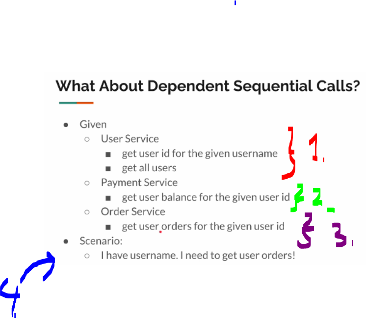
</div>

1. **User Service**, the endpoints:
    - Get user ID for the given username.
    - Get all users.

2. **Payment Service**
    - Get user balance for the given user ID.

3. **Order Service**
    - Get user orders for the given user ID.

4. The business scenario, as following:
    - I have a `username`, this is provided!
    - I need to get the user’s `orders`.
        - Here is the call sequence, to the **User's Orders** 
            -  First we need to get `user id`, with the `username`, from the service in `1.`.
            - Second we need to the **Orders** from the service `3.`.

> [!TIP]
> As reminder, Java **records** are **classes** whose **state does not change after creation**.

- The `User` Java `record` as following:
    ````Java
    package org.java.reactive.sec09.applications;

    public record User(Integer id, String username) {
    }
    ````
    - User object will have fields:
        - Integer `id`.
        - String `username`.

- We are having following `UserService` **class**:
    - We are simulating some `userTable`, where there will be **User** contained in!

    ````Java
        // We are simulating some user table!
        private static final Map<String, Integer> userTable = Map.of(
                "sam", 1,
                "mike", 2,
                "jake", 3
        );
    ````

    - Endpoint `Flux<User> getAllUsers()`:
    
        ````Java
            public static Flux<User> getAllUsers() {
                return Flux.fromIterable(userTable.entrySet())
                            // We need map here, since the entrySet is Map.Entry<String, Integer> from the map!
                            // We are mapping into User(id, username)
                        .map(entry -> new User(entry.getValue(), entry.getKey()));
            }
        ````
        - We need `.map()` here, since the `userTable.entrySet()` the emits `Map.Entry<String, Integer>`. We can transfer it to `User(id, username)` with the `.map()`.

    - Example of `getAllUsers()` working:

        <div align="center">
            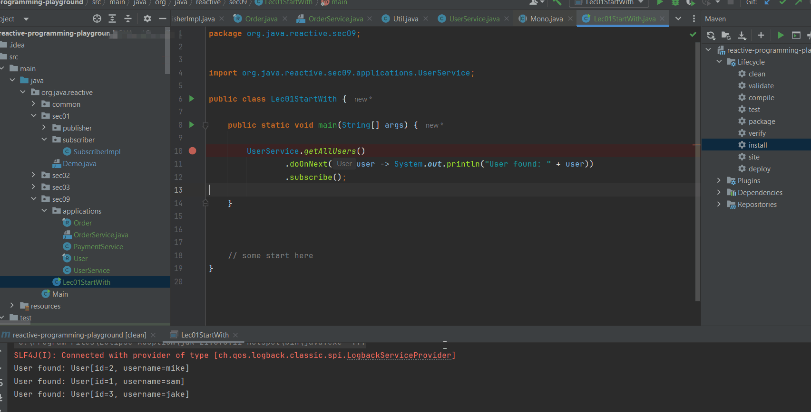
        </div>

        1. As you can see there are **three** different users returned!

        ````Bash
        User found: User[id=3, username=jake]
        User found: User[id=1, username=sam]
        User found: User[id=2, username=mike]
        ````

    - Endpoint `Mono<Integer> getUserId(String username)`:
        
        ````Java
        public static Mono<Integer> getUserId(String username){

            return Mono.fromSupplier(() -> userTable.get(username));
        }
        ````

    - Example of `getUserId()` working:

        <div align="center">
            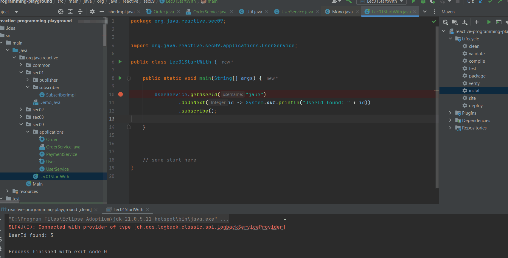
        </div>
        1. As you can see the `"Jake"`, is returning `3` as defined in the table!

<details>
<summary id="reactive programming
" open="true" alt="reactive programming"> <b> User Service implementation </b> </summary>

````Java
package org.java.reactive.sec09.applications;

import reactor.core.publisher.Flux;
import reactor.core.publisher.Mono;

import java.util.Map;

/*
    Just for demo.
    Imagine user-service, as an application, has 2 endpoints.
    This is a client class to make a call to those 2 endpoints (IO requests).
 */
public  class UserService {

    // We are simulating some user table!
    private static final Map<String, Integer> userTable = Map.of(
            "sam", 1,
            "mike", 2,
            "jake", 3
    );

    // Simulations of the webservice call!
    public static Flux<User> getAllUsers() {
        return Flux.fromIterable(userTable.entrySet())
                    // We need map here, since the entrySet is Map.Entry<String, Integer> from the map!
                    // We need map the Entry to the User(id, username)
                   .map(entry -> new User(entry.getValue(), entry.getKey()));
    }

    public static Mono<Integer> getUserId(String username){
        return Mono.fromSupplier(() -> userTable.get(username));
    }
}
````

</details>

- We are having following `OrderService` **class**:

    - The `Order` Java `record` as following:
        ````Java
        package org.java.reactive.sec09.applications;

        // Just for demo.
        // We have user id in the order to show that it belongs to the user.

        public record Order(Integer userId,
                            String productName,
                            Integer price) {
        }
        ````    
    - Order object, will have fields:
        - Integer `userId`.
        - String `productName`.
        - Integer `price`.

    - We are simulating some `userTorderTableable`, where there will be **Orders** contained in!
        ````Java
        private static final Map<Integer, List<Order>> orderTable = Map.of(
                1, List.of(
                        new Order(1, Util.faker().commerce().productName(), Util.faker().random().nextInt(10, 100)),
                        new Order(1, Util.faker().commerce().productName(), Util.faker().random().nextInt(10, 100))
                ),
                2, List.of(
                        new Order(2, Util.faker().commerce().productName(), Util.faker().random().nextInt(10, 100)),
                        new Order(2, Util.faker().commerce().productName(), Util.faker().random().nextInt(10, 100)),
                        new Order(2, Util.faker().commerce().productName(), Util.faker().random().nextInt(10, 100))
                ),
                3, List.of()
        );
        ````
    - Endpoint `getUserOrders(Integer userId)`:
        
        ````Java
        public static Flux<Order> getUserOrders(Integer userId) {
            return Flux.fromIterable(orderTable.get(userId))
                    .delayElements(Duration.ofMillis(500))
                    .transform(Util.fluxLogger("order-for-user" + userId));
        }
        ````

    - Example of `getUserOrders(Integer userId)` endpoint working:

        <div align="center">
            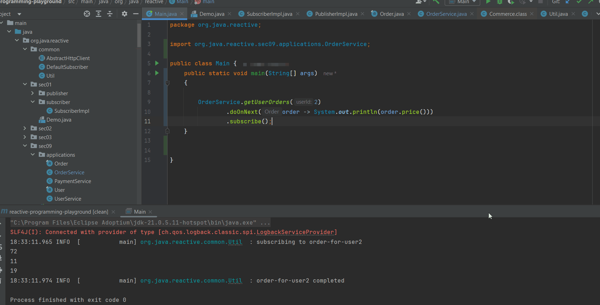
        </div>
        1. As you can see there are <b>three</b> orders returned!

    ````Bash
    18:33:39.875 INFO  [           main] org.java.reactive.common.Util  : subscribing to order-for-user2
    82
    73
    42
    18:33:39.880 INFO  [           main] org.java.reactive.common.Util  : order-for-user2 completed
    ````


<details>

<summary id="reactive programming
" open="true" alt="reactive programming"> <b>Order Service implementation!</b> </summary>

````Java
package org.java.reactive.sec09.applications;

import org.java.reactive.common.Util;
import reactor.core.publisher.Flux;

import java.time.Duration;
import java.util.List;
import java.util.Map;

/*
    Just for demo.
    Imagine order-service, as an application, has an endpoint.
    This is a client class to make a call to the endpoint (IO request).
 */
public class OrderService {

    private static final Map<Integer, List<Order>> orderTable = Map.of(
            1, List.of(
                    new Order(1, Util.faker().commerce().productName(), Util.faker().random().nextInt(10, 100)),
                    new Order(1, Util.faker().commerce().productName(), Util.faker().random().nextInt(10, 100))
            ),
            2, List.of(
                    new Order(2, Util.faker().commerce().productName(), Util.faker().random().nextInt(10, 100)),
                    new Order(2, Util.faker().commerce().productName(), Util.faker().random().nextInt(10, 100)),
                    new Order(2, Util.faker().commerce().productName(), Util.faker().random().nextInt(10, 100))
            ),
            3, List.of() // Third order does not any info!
    );

    /**
     *  Endpoint to get the {@link Order} for the given {@code userId}!
     */
    public static Flux<Order> getUserOrders(Integer userId) {
        return Flux.fromIterable(orderTable.get(userId))
                   .delayElements(Duration.ofMillis(500))
                   .transform(Util.fluxLogger("order-for-user" + userId));
    }

}
````
</details>

- We are having following `PaymentService` **class**:
    - We are simulating some `userBalanceTable`, where there will be **balances** contained in!

        ````Java
            // We are simulating some userBalanceTable table!
            private static final Map<Integer, Integer> userBalanceTable = Map.of(
                    1, 100,
                    2, 200,
                    3, 300
            );
        ````

    - Endpoint `getUserBalance(Integer userId)`:
    
        ````
        public static Mono<Integer> getUserBalance(Integer userId)
        {
            return Mono.fromSupplier(() -> userBalanceTable.get(userId));
        }
        ````

    - Example of `getUserBalance(Integer userId)` working:

        <div align="center">
            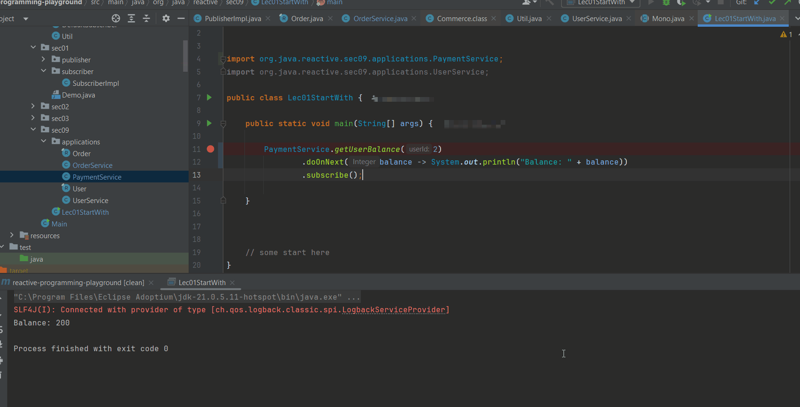
        </div>

<details>
<summary id="Reactive programming
" open="true" alt="reactive programming"> <b>Payment Service implementation!</b> </summary>

````Java
package org.java.reactive.sec09.applications;

import reactor.core.publisher.Mono;
import java.util.Map;

/*
    Just for demo.
    Imagine payment-service, as an application, has an endpoint.
    This is a client class to make a call to the endpoint (IO request).
 */
public class PaymentService {

    private static final Map<Integer, Integer> userBalanceTable = Map.of(
            1, 100,
            2, 200,
            3, 300
    );

    /**
     *  Endpoint to get the users balance form the given {@code userId}!
     */
    public static Mono<Integer> getUserBalance(Integer userId)
    {
        return Mono.fromSupplier(() -> userBalanceTable.get(userId));
    }
}
````
</details>

# Mono - flatMap.

<div align="center">
    
</div>

> [!NOTE]
> Avoid nested publishers (`Mono<Flux<T>>, Flux<Mono<T>>`) **unless** you have a very specific reason.

- Next we will be illustrating the **two sequential** calls:
    - **First** `UserService.getUserId(...)`
    - **Second** with that's **result** the `PaymentService.getUserBalance(...)` in called next!
        
- Next example is illustrating, when using the `.map` operation when calling two different services:

````Java
        /*
            We have the example of calling with the .map.
         */
        Mono<Mono<Integer>> problemCallingExampleOne = UserService.getUserId("sam")
                // Here it will be Mono<Interger>
                .map(userId -> PaymentService.getUserBalance(userId));
````

- We will be **subscribing** into such **Mono** of **Mono**, example below:

<div align="center">
    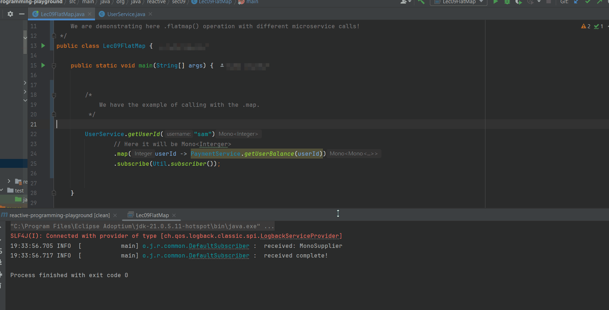
</div>

1. We are **not** getting the **user balance values**, we are getting the **inner publisher** `received: MonoSupplier`! 

- Same thing form **IDE**, it's trying to give hint:

<div align="center">
    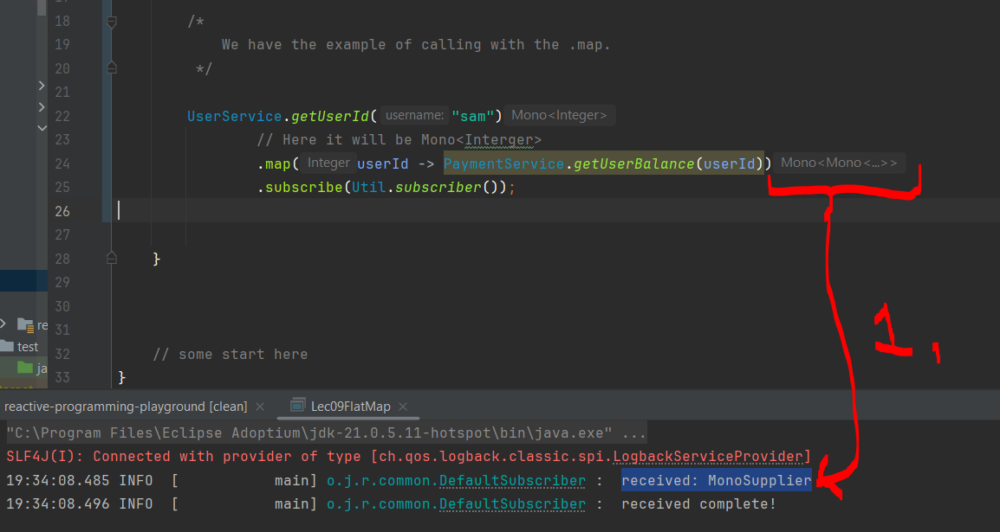
</div>

1. You can see the `Mono<Mono<...>>` coming out of the `.map(...)` and the log `received: MonoSupplier`.

> [!TIP]
> 💡 In context of **reactive programming** the operation `.map` is perfect for **in-memory**, **synchronous transformations** of the value **inside a Mono**. 💡

- Next, we will explore how `.map` should be used in **project reactor** context:

````Java
        /*
            We have the example of calling with the .map, where is supposed to be used! This is as 
         */
        UserService.getUserId("sam")
                // In memory computing
                .map(userId -> "Hello there user ID: " + userId)
                .subscribe(Util.subscriber());
````

- Illustration of `.map` how it should be used, in the context of `UserService.getUserId(...)`:

<div align="center">
    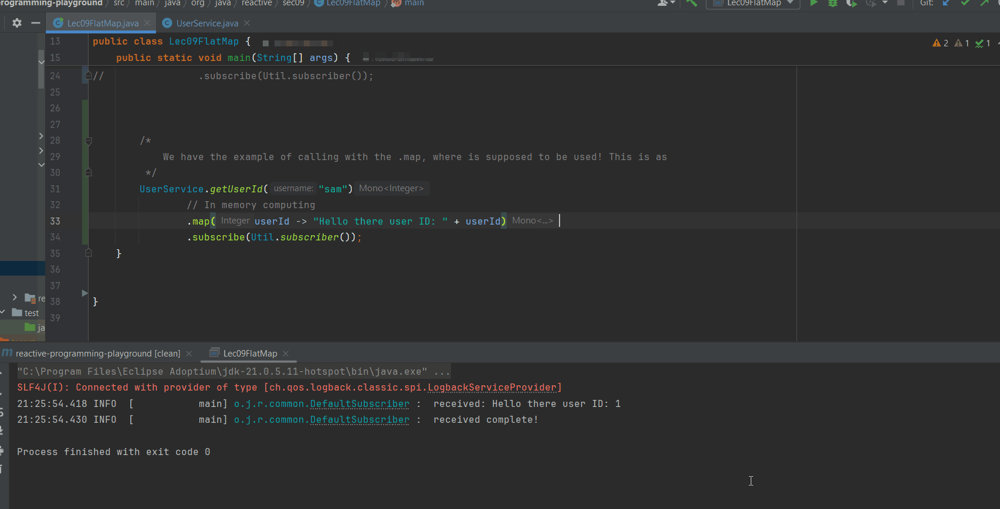
</div>

1. You can see that `received: Hello there user ID: 1` is successfully manipulated! 

- Another use case, where we make **Mono** inside of **Mono**, as below:

````Java
   /*
             We have the example of calling with the .map, with making it inside Mono, which is  also wrong!
        */
        UserService.getUserId("sam")
                // In memory computing
                .map(userId -> Mono.just("Hello there user ID: " + userId))
                .subscribe(Util.subscriber());
    }
````

- Example of `getUserId()` **not** working, where the **Mono** inside of **Mono**:

<div align="center">
    
</div>

1. When **Mono** inside **Mono**, the log `received: MonoSupplier`.

- We are using `.flatMap(...)` to flatten the inner publisher! Which makes from `Mono<Mono<String>>` to `Mono<String>`.  Example code below:

````Java
        /*
        * We are using flatMap to flatten the inner Publisher.
        */
        UserService.getUserId("sam")
                // In memory computing.
                .flatMap(userId -> Mono.just("Hello there user ID: " + userId))
                .subscribe(Util.subscriber());
````

- Example of `.flatMap(...)` in context of **reactive programming** working:

<div align="center">
    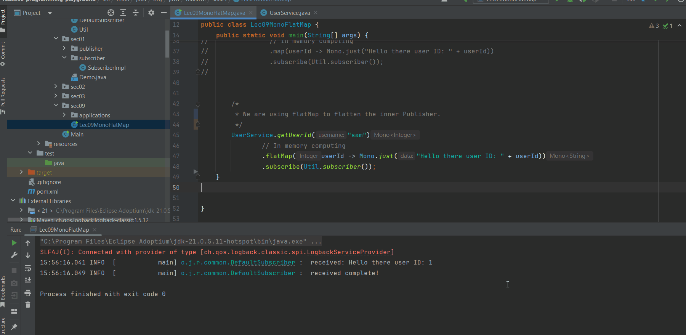
</div>

1. You can see that `.getUserId(...)` is working as it should. The returned value `received: Hello there user ID: 1` as **and not** the `received: MonoSupplier`.

<div align="center">
    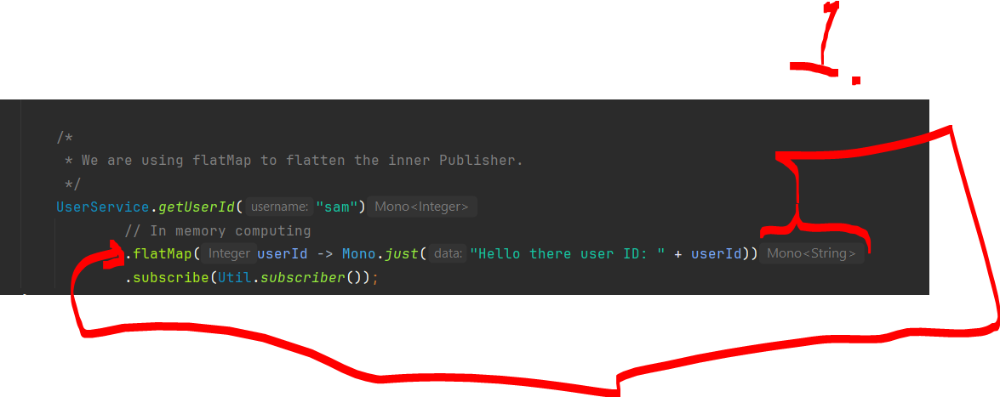
</div>

1. You can also see that the **IDE** is giving hint of the `.flatMap(...)` working. One can see the **two** publisher, being flattened as it written as `Mono<String>`!

- We are using the `.flatMap(...)` we were planning to use it in the beginning! 

````Java
/*
            Get user ID then fetch balance asynchronously, flattening nested streams with flatMap.
        */
        UserService.getUserId("sam")
                // In memory computing
                .flatMap(userId -> PaymentService.getUserBalance(userId))
                .subscribe(Util.subscriber());
````

- Example of using `.flatMap(..)` with the **two** different services being called! 

<div align="center">
    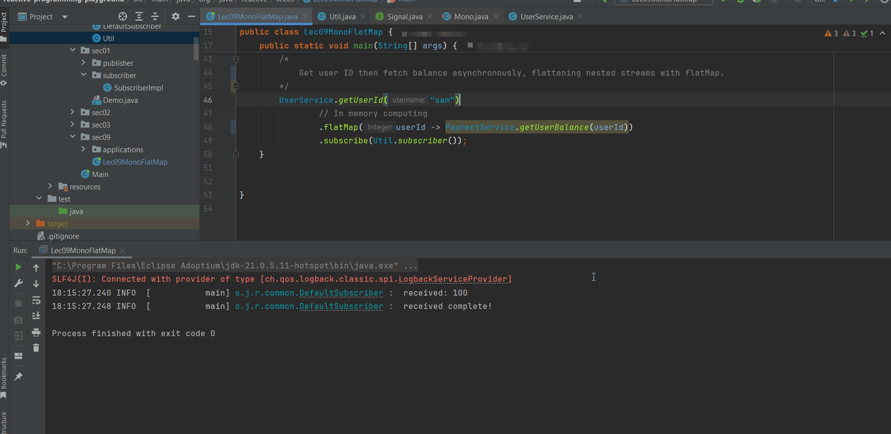
</div>

1. We can see that `.flatMap(...)` working, with `UserService.getUserId("sam")`, which returns the `userId` and feeds it to the `PaymentService.getUserBalance(userId)`, which in regards checks the **User Balance Service**, which returns as it was defined in the `Map<Integer, Integer> userBalanceTable` 
    - The returned value: `received: 100`.


<details>

<summary id="reactive programming
" open="true" alt="reactive programming"> <b> Mono.flatMap(...) working source code! </b> </summary>

````Java

package org.java.reactive.sec09;


import org.java.reactive.common.Util;
import org.java.reactive.sec09.applications.PaymentService;
import org.java.reactive.sec09.applications.UserService;
import reactor.core.publisher.Mono;

import static reactor.core.publisher.Signal.subscribe;


/*
    We are demonstrating here .flatmap() operation with different microservice calls!
*/
public class Lec09MonoFlatMap {

    public static void main(String[] args) {

        /*
            We have the example of calling with the .map, which is wrong!
         */
//       UserService.getUserId("sam")
//                // Here it will be Mono<Interger>
//                .map(userId -> PaymentService.getUserBalance(userId))
//                .subscribe(Util.subscriber());

        /*
            We have the example of calling with the .map, where is supposed to be used! This is as
         */
//       UserService.getUserId("sam")
//                // In memory computing
//                .map(userId -> "Hello there user ID: " + userId)
//                .subscribe(Util.subscriber());

        /*
             We have the example of calling with the .map, with making it inside Mono, which is  also wrong!
        */
//       UserService.getUserId("sam")
//                // In memory computing
//                .map(userId -> Mono.just("Hello there user ID: " + userId))
//                .subscribe(Util.subscriber());

        /*
            Get user ID then fetch balance asynchronously, flattening nested streams with flatMap.
        */
        UserService.getUserId("sam")
                // In memory computing
                .flatMap(userId -> PaymentService.getUserBalance(userId))
                .subscribe(Util.subscriber());
    }
}
````
</details>

# Mono - flatMapMany.

<div align="center">
    
</div>

> [!NOTE]
> `Mono.flatMap(...)` always expects the function to return a `Mono`, not a `Flux` or plain value. We will be **exploring** where there will be `Flux` publisher inside the `Mono` publisher!

- Illustration for the multiple **reactive types** below:

````Java
Mono<Flux<Order>> example = UserService.getUserId("sam")
                .map(userId -> OrderService.getUserOrders(userId));
````

- We can see that:
    - `UserService.getUserId("sam")` return the `Mono<Intger>`.
    - `OrderService.getUserOrders(userId)` returns the `Flux<Order>`.

- In the **end result** will be `Mono<Flux<Order>> exampleAnswerFirst`, which will be having nested type

<br>

- Todo add here why nested types are not wanted

<br>

- Add here picture of the identifying process.

<br>

- We can **identify** the **operation**, which will be correct, by checking the **source type** and the **lambda expression**.
    - **Step 1: Identify the source type**.
    Look at the expression **before the dot**.
    `UserService.getUserId("sam")`
    Check its return type:
    `Mono<Integer>`
        - ➡️ **source** is a **Mono**.
    - **Step 2: Identify what your lambda returns**.
    Look at the method inside your lambda.
    `userId -> OrderService.getUserOrders(userId)`
    Check its return type:
    `Flux<Order>`
        - ➡️ **Lambda returns** = **Flux**
    - **Step 3: Apply the operator rule**.

    | Source    | Lambda returns | Operator      | Result    |
    | --------- | -------------- | ------------- | --------- |
    | `Mono<T>` | `T`            | `map`         | `Mono<T>` |
    | `Mono<T>` | `Mono<R>`      | `flatMap`     | `Mono<R>` |
    | `Mono<T>` | `Flux<R>`      | `flatMapMany` | `Flux<R>` |
    | `Flux<T>` | `Publisher<R>` | `flatMap`     | `Flux<R>` |


- `.flatMap` is used to **flatten** an **inner publisher** so you don’t end up with nested `Mono<Mono<T>>` or `Flux<Flux<T>>`.
    - Notice that the both `Mono` and the `Flux` shares the same methods, and it's needed to identify, which one is going to be needed!

````Java
        /*
            We have username, we want to get all user orders!
            This case is not working, since the inner publisher is the Flux and we are using .flatMap(...).
            This will be giving the error!
         */
        UserService.getUserId("sam")
                .flatMap(userId -> OrderService.getUserOrders(userId));
````

- The ⚠️**error**⚠️ will be:
    ````Bash
    no instance(s) of type variable(s) R exist so that Flux<Order> conforms to Mono<? extends R>
    - There will be case, where the `.flatMap(...)` is not working since `Mono.flatMap(...)` expects the **result** being **Mono**. Example below:
    ````
<div align="center">
    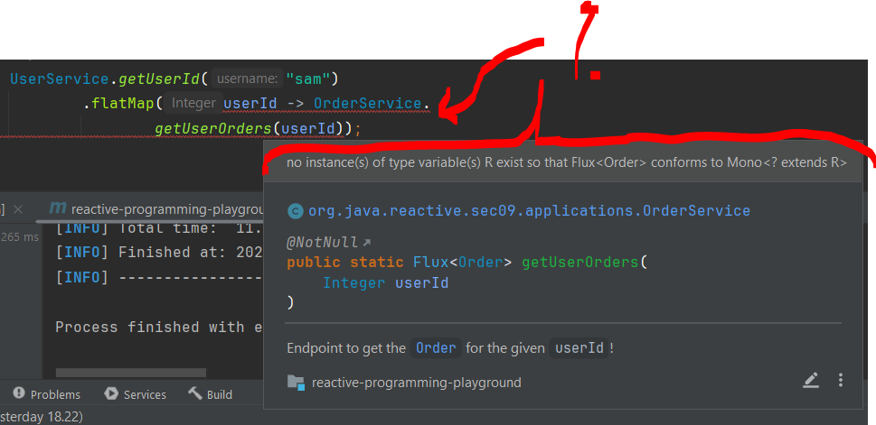
</div>

1. You can see that error coming from `Mono.flatMap(...)` **expects** the **lambda to return** a `Mono<R>`, not a `Flux<R>`
    - `UserService.getUserId("sam")` → returns `Mono<String>`
    - `OrderService.getUserOrders(userId)` → returns `Flux<Order>`

- We can solve this using `Mono.flatMapMany(...)`, we get `Flux<Order>`, as following:

````Java
    /*
            We have username, we want to get all user orders!
            We can solve this using Mono.flatMapMany(...) to return the Flux.
         */
        Flux<Order> resultWithTheFlatMapMany = UserService.getUserId("sam")
                .flatMapMany(userId -> OrderService.
                        getUserOrders(userId));
````

- You can see that `Flux<Order>`! Illustration below:

````Java
    /*
            We have username, we want to get all user orders!
            We can solve this using Mono.flatMapMany(...) to return the Flux.
         */
        UserService.getUserId("sam")
                .flatMapMany(userId -> OrderService.getUserOrders(userId))
                .subscribe(Util.subscriber());

        Util.sleepSeconds(5);
````

- We are illustrating `Mono.flatMapMany(...)` with **two** services, which have the different reactive types returned `Mono` and `Flux`!

<div align="center">
    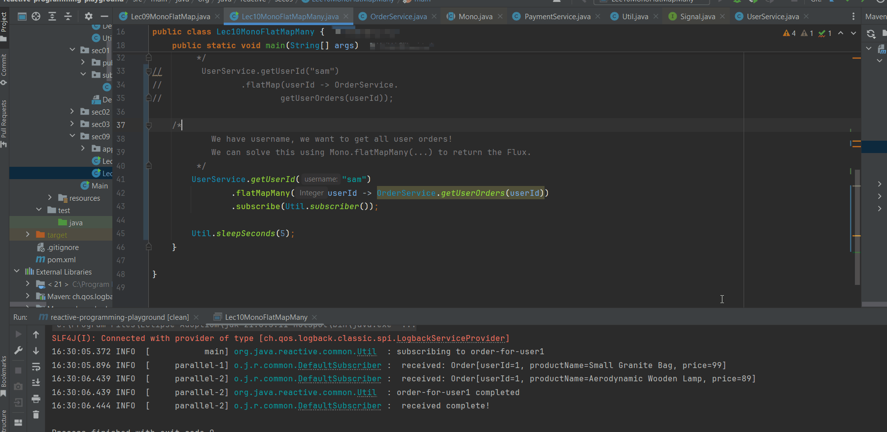
</div>

1. We can also see the logs is having **two order entries** for the `userId:1`!  

````Bash
16:32:07.500 INFO  [     parallel-1] o.j.r.common.DefaultSubscriber :  received: Order[userId=1, productName=Ergonomic Leather Hat, price=11]
16:32:08.054 INFO  [     parallel-2] o.j.r.common.DefaultSubscriber :  received: Order[userId=1, productName=Enormous Marble Plate, price=67]
````

<details>

<summary id="reactive programming
" open="true" alt="reactive programming"> <b> Mono.flatMapMany(...) working source code! </b> </summary>

````Java
package org.java.reactive.sec09;


import org.java.reactive.common.Util;
import org.java.reactive.sec09.applications.Order;
import org.java.reactive.sec09.applications.OrderService;
import org.java.reactive.sec09.applications.PaymentService;
import org.java.reactive.sec09.applications.UserService;
import reactor.core.publisher.Flux;
import reactor.core.publisher.Mono;


/*

*/
public class Lec10MonoFlatMapMany {

    public static void main(String[] args)
    {

        /*
            We have username, we want to get all user orders!
            This example has multiple publishers, which is not wanted!
         */
        Mono<Flux<Order>> sam = UserService.getUserId("sam")
                .map(userId -> OrderService.getUserOrders(userId));

        /*
            We have username, we want to get all user orders!
            This case is not working, since the inner publisher is the Flux, and we are using .flatMap(...).
            This will be giving the error!
         */
//        UserService.getUserId("sam")
//                .flatMap(userId -> OrderService.
//                        getUserOrders(userId));

    /*
            We have username, we want to get all user orders!
            We can solve this using Mono.flatMapMany(...) to return the Flux.
         */
        UserService.getUserId("sam")
                .flatMapMany(userId -> OrderService.getUserOrders(userId))
                .subscribe(Util.subscriber());

        Util.sleepSeconds(5);
    }
}
````
</details>

# Flux - flatMap.

<div align="center">
    
</div>

- The idea here is to get **all** the **Users**, and then get **all** the **Orders**, for them!

- We **explore** case, when there is two `Flux<Flux<Order>>`, perfect place for the `.flatMap(...)`.

````Java
        /*
            We can explore the that there is two Fluxes publishers inside.
        */
        Flux<Flux<Order>> map = UserService.getAllUsers()
                .map(user -> OrderService.getUserOrders(user.id()));

````

- We can flatten the `Flux<Flux<Order>>` to the `Flux<Order>`, with the `Flux.flatMap(...)`!

````Java
        /*
            Flux.flatMap can flatten Flux<Flux<Order>> into Flux<Order>
        */
        Flux<Order> orderFlux = UserService.getAllUsers()
                .flatMap(user -> OrderService.getUserOrders(user.id()));
````

- Even the more **elegant** version, where we don't send the `user`, we just **map** the needed fields for the next **publisher**. This will be `.map(user -> user.id())` and `.flatMap(...)` is receiving only the `userId`.

````Java
        /*
            Flux.flatMap can flatten Flux<Flux<Order>> into Flux<Order>.
            Just more elegant version!

        */
        UserService.getAllUsers()
                .map(user -> user.id())
                .flatMap(userId -> OrderService.getUserOrders(userId))
                .subscribe(Util.subscriber());

        Util.sleepSeconds(5);
````

- We will be illustration that this works as indented.

<div align="center">
    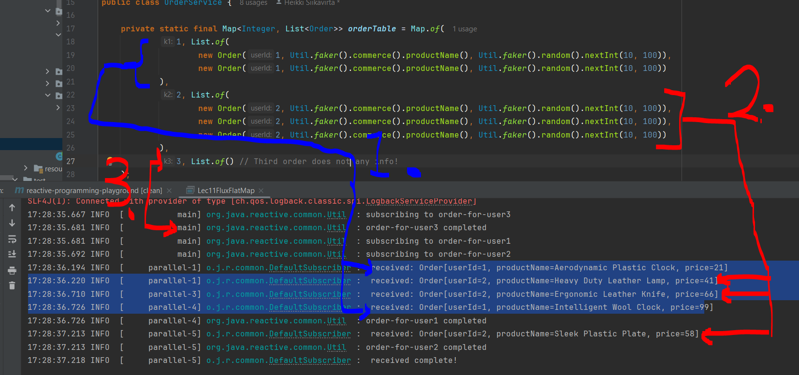
</div>

- Add the rest here todo

1. We are receiving **two** `Order`'s:
````Bash
 17:28:36.194 INFO  [     parallel-1] o.j.r.common.DefaultSubscriber :  received: Order[userId=1, productName=Aerodynamic Plastic Clock, price=21]
 ... logs here ...
 17:28:36.726 INFO  [     parallel-4] o.j.r.common.DefaultSubscriber :  received: Order[userId=1, productName=Intelligent Wool Clock, price=99]
````
2. We are receiving **three** `Order`'s:
````Bash
17:28:36.220 INFO  [     parallel-1] o.j.r.common.DefaultSubscriber :  received: Order[userId=2, productName=Heavy Duty Leather Lamp, price=41]
17:28:36.710 INFO  [     parallel-3] o.j.r.common.DefaultSubscriber :  received: Order[userId=2, productName=Ergonomic Leather Knife, price=66]
... logs here ...
17:28:37.213 INFO  [     parallel-5] o.j.r.common.DefaultSubscriber :  received: Order[userId=2, productName=Sleek Plastic Plate, price=58]
```` 
3. We are receiving **empty** `Order`'s:
````Bash
17:28:35.667 INFO  [           main] org.java.reactive.common.Util  : subscribing to order-for-user3
17:28:35.681 INFO  [           main] org.java.reactive.common.Util  : order-for-user3 completed
````

# FlatMap - How it works.

<div align="center">
    
</div>

> [!TIP]
> `.flatMap(...)` subscribes to **all inner publishers** at the same time!

<div align="center">
    
</div>

1. We have **multiple elements** in this `Flux`. `Flux` of `userId`'s, like in previous example `UserService.getAllUsers(...)`!
2. Then there will be `.flatMap(...)` operation!

<div align="center">
    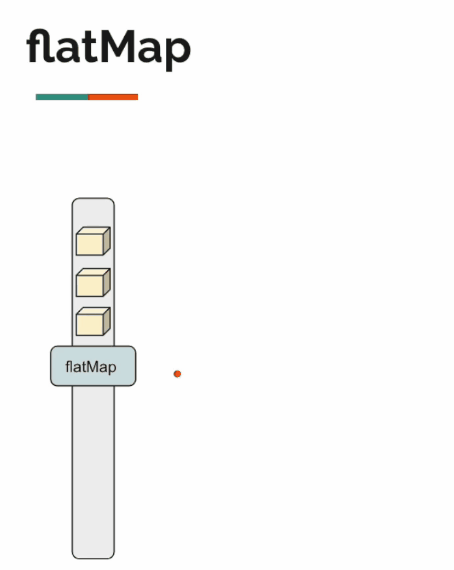
</div>

1. Each emitted `userId` triggers a call to `OrderService.getUserOrders(userId)`, which returns a `Flux<Order>`.
2. `OrderService.getUserOrders(userId)` will be **returning** `Flux` of `Order`'s.
    - When will this `Flux` request end, so the another can be processed?
        - `.flatMap(...)` operator will **not wait** for `Flux` to **complete**! Instead, as soon as another request comes to the `.flatMap(...)` operator, it will start the **query**!
3. `.flatMap(...)`: As soon as a `Flux` emits an item, it creates an **inner publisher** for that item and **immediately subscribes** to it.
    - It does **not wait** for one **inner publisher to finish** before starting the next!

<div align="center">
    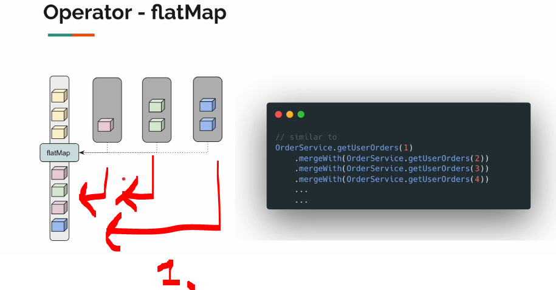
</div>

1. As soon as an inner publisher emits elements, they are immediately forwarded downstream to the subscriber.

- Todo check mergewith.

- We can define the `concurrency` for the `.flatmap(..)`, example as below:

````Java
        /*
            Flux.flatMap can flatten Flux<Flux<Order>> into Flux<Order>.
            Just more elegant version! We can also define the concurrency here, one subscription at the time!

        */
        UserService.getAllUsers()
                .map(user -> user.id())
                .flatMap(userId -> OrderService.getUserOrders(userId),1)
                .subscribe(Util.subscriber());

        Util.sleepSeconds(5);
````

- We are illustrating the **one** `concurrency` defined in the `.flatmap(...)`.

<div align="center">
    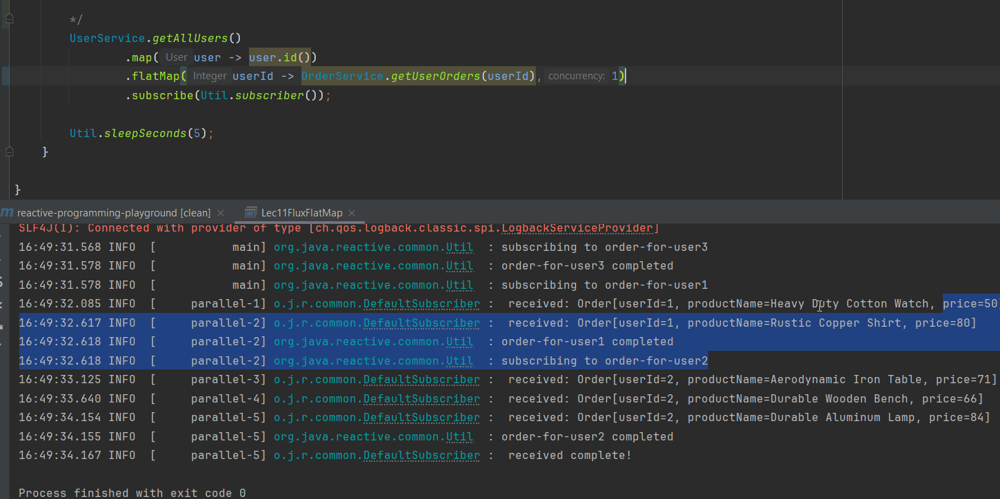
</div>

- As you can see there is one **connection** at the tine defined!

<details>

<summary id="reactive programming
" open="true" alt="reactive programming"> <b> Mono.flatMap(...) and Flux.flatMap(...) working source code! </b> </summary>

````Java
package org.java.reactive.sec09;

import org.java.reactive.common.Util;
import org.java.reactive.sec09.applications.Order;
import org.java.reactive.sec09.applications.OrderService;
import org.java.reactive.sec09.applications.UserService;
import reactor.core.publisher.Flux;

/*
    Sequential non-blocking IO calls!
    flatMap is used to flatten the inner publisher / to subscribe to the inner publisher
 */
public class Lec11FluxFlatMap {

    public static void main(String[] args)
    {
        /*
            The requirement is to get all the Users and then get all the Orders, which there are!
         */

        /*
            We can explore the that there is two Fluxes publishers inside.
        */
//        Flux<Flux<Order>> map = UserService.getAllUsers()
//                .map(user -> OrderService.getUserOrders(user.id()));

        /*
            Flux.flatMap can flatten Flux<Flux<Order>> into Flux<Order>
        */
        Flux<Order> orderFlux = UserService.getAllUsers()
                .flatMap(user -> OrderService.getUserOrders(user.id()));


        /*
            Flux.flatMap can flatten Flux<Flux<Order>> into Flux<Order>.
            Just more elegant version!

        */
//        UserService.getAllUsers()
//                .map(user -> user.id())
//                .flatMap(userId -> OrderService.getUserOrders(userId),1)
//                .subscribe(Util.subscriber());
//
//        Util.sleepSeconds(5);


        /*
            Flux.flatMap can flatten Flux<Flux<Order>> into Flux<Order>.
            Just more elegant version! We can also define the concurrency here, one subscription at the time!

        */
        UserService.getAllUsers()
                .map(user -> user.id())
                .flatMap(userId -> OrderService.getUserOrders(userId),1)
                .subscribe(Util.subscriber());

        Util.sleepSeconds(5);
    }

}
````
</details>

# FlatMap - Assignment.

```
Question 1: Make this for loop using FLux.
```

````Java
                var client = new ExternalServiceClient();

                for (int i = 1; i < 10; i++) {
                    client.getProduct(i)
                            .subscribe(Util.subscriber());
                }
                Util.sleepSeconds(2);
````

- My implementation for this `for` loop:

````Java
        // new way
        Flux.range(1, 10)
                .flatMap(number -> client.getProduct(number))
                .subscribe(Util.subscriber());
````

- We can see benefits using `.flatMap(...)` versus the regular call where the `public Mono<Product> getProduct(int ammount) `.
    - With `.flatMap(...)`:
        - We will be **subscribing** to only one **Flux**, instead of multiple separate ones!
        - We can see only **one complete** signal:
            - `23:54:33.771 INFO  [ScoopiDoo-nio-1] o.j.r.common.DefaultSubscriber :  received complete!`.
        <div align="center">
            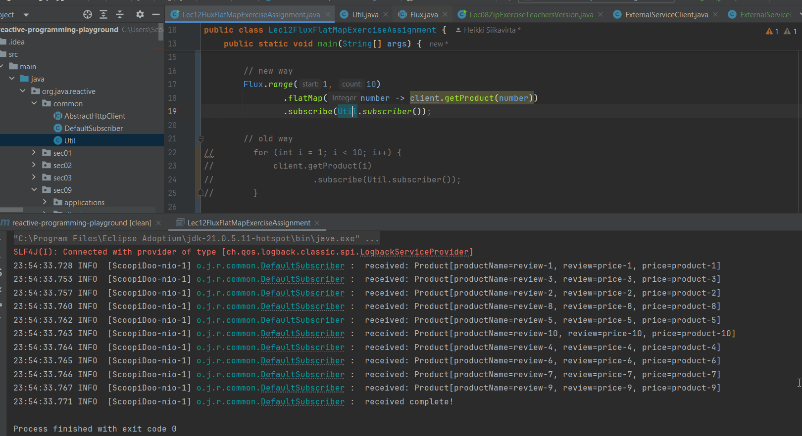
        </div>
        1. You can see <b>one complete</b> signal log!

        - We can see the logs:

        ````Bash
        23:54:33.728 INFO  [ScoopiDoo-nio-1] o.j.r.common.DefaultSubscriber :  received: Product[productName=review-1, review=price-1, price=product-1]
        23:54:33.753 INFO  [ScoopiDoo-nio-1] o.j.r.common.DefaultSubscriber :  received: Product[productName=review-3, review=price-3, price=product-3]
        23:54:33.757 INFO  [ScoopiDoo-nio-1] o.j.r.common.DefaultSubscriber :  received: Product[productName=review-2, review=price-2, price=product-2]
        23:54:33.760 INFO  [ScoopiDoo-nio-1] o.j.r.common.DefaultSubscriber :  received: Product[productName=review-8, review=price-8, price=product-8]
        23:54:33.762 INFO  [ScoopiDoo-nio-1] o.j.r.common.DefaultSubscriber :  received: Product[productName=review-5, review=price-5, price=product-5]
        23:54:33.763 INFO  [ScoopiDoo-nio-1] o.j.r.common.DefaultSubscriber :  received: Product[productName=review-10, review=price-10, price=product-10]
        23:54:33.764 INFO  [ScoopiDoo-nio-1] o.j.r.common.DefaultSubscriber :  received: Product[productName=review-4, review=price-4, price=product-4]
        23:54:33.765 INFO  [ScoopiDoo-nio-1] o.j.r.common.DefaultSubscriber :  received: Product[productName=review-6, review=price-6, price=product-6]
        23:54:33.766 INFO  [ScoopiDoo-nio-1] o.j.r.common.DefaultSubscriber :  received: Product[productName=review-7, review=price-7, price=product-7]
        23:54:33.767 INFO  [ScoopiDoo-nio-1] o.j.r.common.DefaultSubscriber :  received: Product[productName=review-9, review=price-9, price=product-9]
        23:54:33.771 INFO  [ScoopiDoo-nio-1] o.j.r.common.DefaultSubscriber :  received complete!
        ````
        - The same with **three** different **concurrent** calls.
        ````Java
            // New way.
            Flux.range(1, 10)
                    .flatMap(number -> client.getProduct(number), 3)
                    .subscribe(Util.subscriber());
        ````

        - We can see these calls being executed as in **groups**:

        <div align="center">
            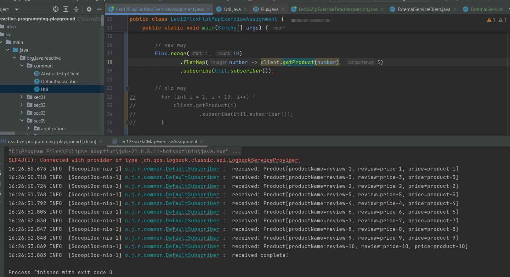
        </div>

    - With regular `client.getProduct(i)` inside `for` loop.
        - We will be **subscribing** to multiple **Monos** in the same time!
            - We can see **multiple complete** signal:
                <div align="center">
                    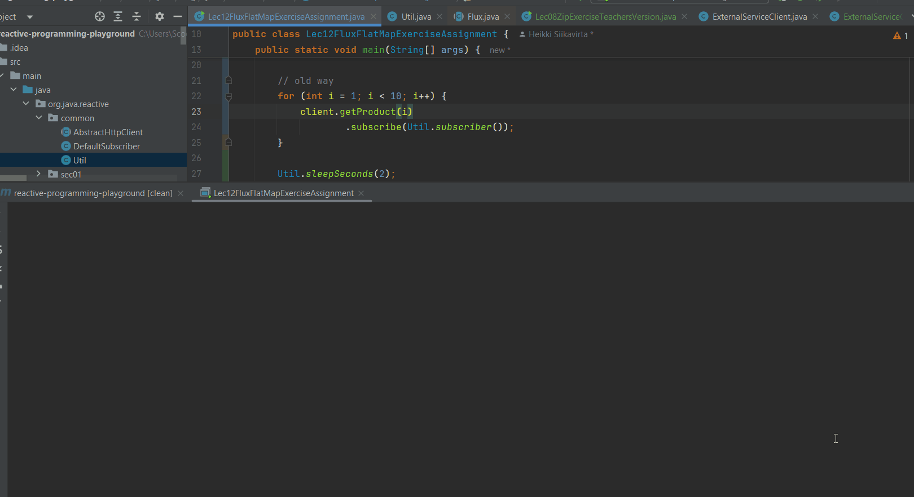
                </div>
                1. You can see <b>many completes</b> signal logs!

        - We can see the logs:

        ````Bash
        16:06:25.026 INFO  [ScoopiDoo-nio-1] o.j.r.common.DefaultSubscriber :  received: Product[productName=review-1, review=price-1, price=product-1]
        16:06:25.056 INFO  [ScoopiDoo-nio-1] o.j.r.common.DefaultSubscriber :  received complete!
        16:06:25.059 INFO  [ScoopiDoo-nio-1] o.j.r.common.DefaultSubscriber :  received: Product[productName=review-2, review=price-2, price=product-2]
        16:06:25.059 INFO  [ScoopiDoo-nio-1] o.j.r.common.DefaultSubscriber :  received complete!
        16:06:25.060 INFO  [ScoopiDoo-nio-1] o.j.r.common.DefaultSubscriber :  received: Product[productName=review-3, review=price-3, price=product-3]
        16:06:25.060 INFO  [ScoopiDoo-nio-1] o.j.r.common.DefaultSubscriber :  received complete!
        16:06:25.064 INFO  [ScoopiDoo-nio-1] o.j.r.common.DefaultSubscriber :  received: Product[productName=review-5, review=price-5, price=product-5]
        16:06:25.064 INFO  [ScoopiDoo-nio-1] o.j.r.common.DefaultSubscriber :  received complete!
        16:06:25.067 INFO  [ScoopiDoo-nio-1] o.j.r.common.DefaultSubscriber :  received: Product[productName=review-4, review=price-4, price=product-4]
        16:06:25.067 INFO  [ScoopiDoo-nio-1] o.j.r.common.DefaultSubscriber :  received complete!
        16:06:25.070 INFO  [ScoopiDoo-nio-1] o.j.r.common.DefaultSubscriber :  received: Product[productName=review-6, review=price-6, price=product-6]
        16:06:25.070 INFO  [ScoopiDoo-nio-1] o.j.r.common.DefaultSubscriber :  received complete!
        16:06:25.072 INFO  [ScoopiDoo-nio-1] o.j.r.common.DefaultSubscriber :  received: Product[productName=review-7, review=price-7, price=product-7]
        16:06:25.072 INFO  [ScoopiDoo-nio-1] o.j.r.common.DefaultSubscriber :  received complete!
        16:06:25.075 INFO  [ScoopiDoo-nio-1] o.j.r.common.DefaultSubscriber :  received: Product[productName=review-9, review=price-9, price=product-9]
        16:06:25.076 INFO  [ScoopiDoo-nio-1] o.j.r.common.DefaultSubscriber :  received complete!
        16:06:25.078 INFO  [ScoopiDoo-nio-1] o.j.r.common.DefaultSubscriber :  received: Product[productName=review-8, review=price-8, price=product-8]
        16:06:25.078 INFO  [ScoopiDoo-nio-1] o.j.r.common.DefaultSubscriber :  received complete!                        
        ````
<details>

<summary id="flatmap assigment - my answer
" open="true" alt="reactive programming"> <b> FlatMap assigment - my answer! </b> </summary>

````Java
package org.java.reactive.sec09;

import org.java.reactive.common.Util;
import org.java.reactive.sec09.client.ExternalServiceClient;
import reactor.core.publisher.Flux;

/*
    Ensure that the external service is up and running!
 */
public class Lec12FluxFlatMapExerciseAssignment {


    public static void main(String[] args) {
        var client = new ExternalServiceClient();

        // new way
        Flux.range(1,10)
                .flatMap(number -> client.getProduct(number))
                .subscribe(Util.subscriber());

        // old way
//      for (int i = 1; i < 10; i++) {
//            client.getProduct(i)
//                    .subscribe(Util.subscriber());
//        }

        Util.sleepSeconds(2);
    }

}
````
</details>

<details>

<summary id="flatmap assigment - teacher answer
" open="true" alt="reactive programming"> <b> FlatMap assigment - teacher answer! </b> </summary>

````Java
package com.vinsguru.sec09;

import com.vinsguru.common.Util;
import com.vinsguru.sec09.assignment.ExternalServiceClient;
import reactor.core.publisher.Flux;

/*
    Ensure that the external service is up and running!
 */
public class Lec12FluxFlatMapAssignment {

    public static void main(String[] args) {

        var client = new ExternalServiceClient();

        Flux.range(1, 10)
            .flatMap(client::getProduct, 3)
            .subscribe(Util.subscriber());

        Util.sleepSeconds(20);
    }
}
````

</details>

# ConcatMap.

<div align="center">
    
</div>

> [!NOTE]
> `.concatMap(...)` = map each item → Publisher (Mono/Flux) and then subscribe one-by-one in order. This is **sequential processing**!

<div align="center">
    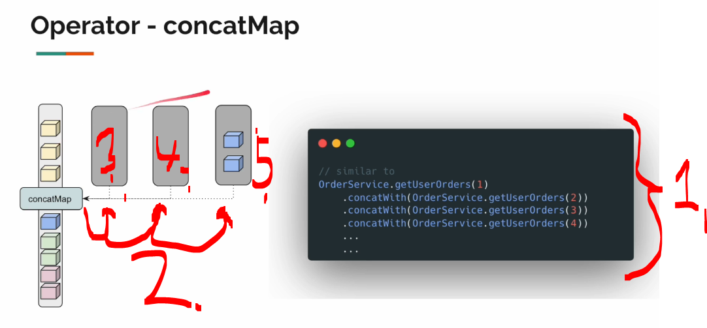
</div>

1. `.concatMap` will be **concatenating** the **inner fluxes** in sequential manner, these are in this order here!

2. The **Flux** processing order will be `3.` → `4.` → `5.`!
    - **In every step**, it will be waiting previous to finish first before going to next one!

- We can do **Sequential** calls, with the following `.concatMap(number -> client.getProduct(number))`.
    ````Java
            Flux.range(1, 10)
                .concatMap(number -> client.getProduct(number))
                .subscribe(Util.subscriber());
    ````

<div align="center">
    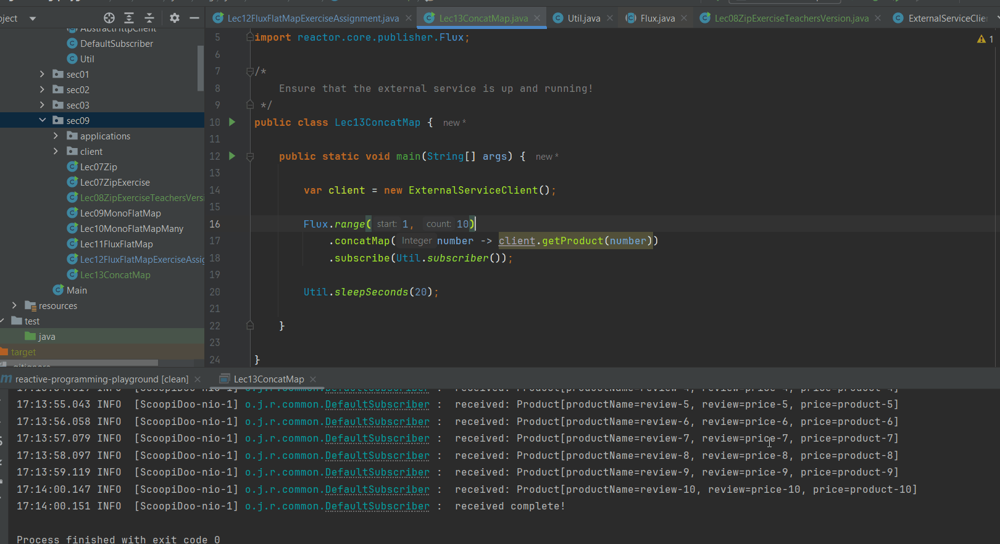
</div>

- We can see that now each **Mono** is subscribed to in **order**!

<details>

<summary id="concatMap" open="true" alt="reactive programming"> <b> Flux.concatMap(...) working source code! </b> </summary>

````Java
package org.java.reactive.sec09;

import org.java.reactive.common.Util;
import org.java.reactive.sec09.client.ExternalServiceClient;
import reactor.core.publisher.Flux;

/*
    Ensure that the external service is up and running!
 */
public class Lec13ConcatMap {

    public static void main(String[] args) {

        var client = new ExternalServiceClient();

        Flux.range(1, 10)
            .concatMap(number -> client.getProduct(number))
            .subscribe(Util.subscriber());

        Util.sleepSeconds(20);

    }

}
````
</details>

# Operator - Collect List.

<div align="center">
    
</div>

- Operator will collect items from the **Flux** to the **list** `.collectList()`.
    - `collectList()` is **non-blocking**.

````Java
Mono<List<Integer>> listMono = Flux.range(1, 10)
                .collectList();
````

- We can see the illustration below:

<div align="center">
    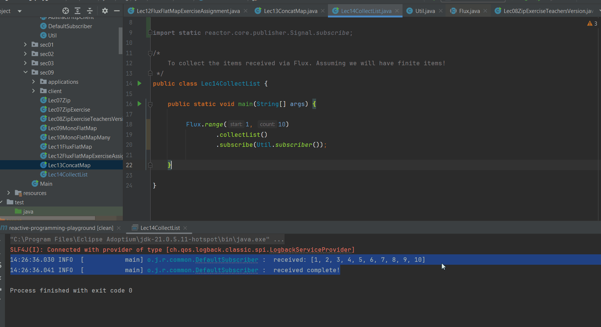
</div>

1. This will be as in `List`, like shown below:

- We can see that, these are as in the list:

````Bash
14:26:36.030 INFO  [           main] o.j.r.common.DefaultSubscriber :  received: [1, 2, 3, 4, 5, 6, 7, 8, 9, 10]
14:26:36.041 INFO  [           main] o.j.r.common.DefaultSubscriber :  received complete!
````

- Todo get back here when dealt with teh concatwith

- Some world from the **error** handling form the `.collectList()`.

````Java
         Flux.range(1, 10)
                 .concatWith(Flux.error(new UnexpectedException("Test")))
                 .collectList()
                 .subscribe(Util.subscriber());
````

- We can see that the `.collecToList()` does not collect if there is exception happened!
    - Here you can see that the `.concatWith(Flux.error(new UnexpectedException("Test")))` is **throwing exception**, before the `.collectList()` can happen! The logs below:


````Bash
SLF4J(I): Connected with provider of type [ch.qos.logback.classic.spi.LogbackServiceProvider]
14:35:56.613 ERROR [           main] o.j.r.common.DefaultSubscriber :  error
java.rmi.UnexpectedException: Test
	at org.java.reactive.sec09.Lec14CollectList.main(Lec14CollectList.java:19)
Process finished with exit code 0
````

<details>

<summary id="collect list" open="true" alt="reactive programming"> <b> Flux.collectToList() working source code! </b> </summary>

````Java
package org.java.reactive.sec09;

import org.java.reactive.common.Util;
import reactor.core.publisher.Flux;
import reactor.core.publisher.Mono;

import java.rmi.UnexpectedException;
import java.util.List;

import static reactor.core.publisher.Signal.subscribe;

/*
    To collect the items received via Flux. Assuming we will have finite items!
 */
public class Lec14CollectList {

    public static void main(String[] args) {

         Flux.range(1, 10)
                 .concatWith(Flux.error(new UnexpectedException("Test")))
                 .collectList()
                 .subscribe(Util.subscriber());

    }

}
````
</details>

# Operator - Then.

<div align="center">
    
</div>


<details>

<summary id="collect list" open="true" alt="reactive programming"> <b>  Mono.then(...) and Flux.then(...) working source code! </b> </summary>

````Java

````

</details>

# *** Assignment ***.

# Summary.

# Quiz 08.

<details>

<summary id="reactive programming
" open="true"> <b>Question 01.</b> </summary>

````Yaml
Question 01:
Add here the question
````

````Java
add here the code
````

- My answer:

<div align="center">
    
</div>

1. Add here the explanation

</details>

<details>

<summary id="Reactive programming course" open="true"> <b>Question 02.</b> </summary>

````Yaml
Question 02:
The question goes here
````

````Java
add here the code

````

- My answer:

<div align="center">
    
</div>

1. Add here the explanation.

</details>

<details>

<summary id="Reactive programming course" open="true"> <b>Question 03.</b> </summary>

````Yaml
Question 03:
Add here the question
````

````Java
add here the code
````
- My answer:

<div align="center">
    
</div>


1. add here the answer

</details>


<details>

<summary id="Reactive programming course" open="true"> <b>Question 04.</b> </summary>

````Yaml
Question 04:
Add here the question.
````

````Java
 add here the code
````
- My answer:

<div align="center">
    
</div>

1. Add here the answer.

</details>


