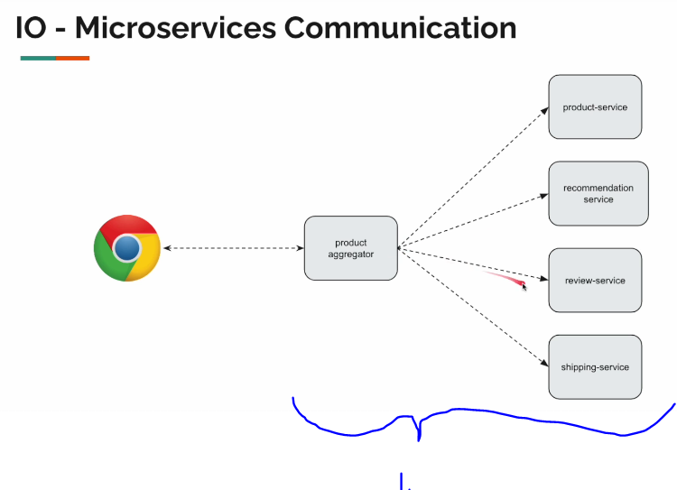
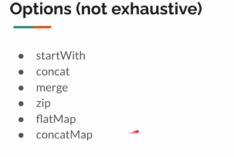
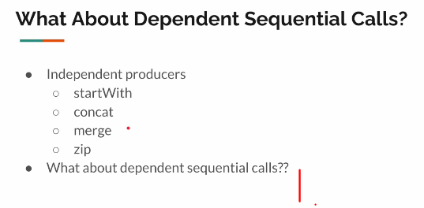
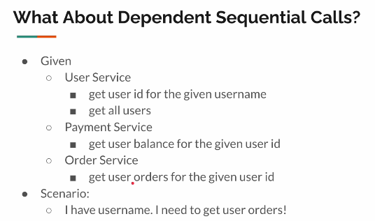

# Section 09: Combining Publishers.

Combining Publishers.

# What i learned.

# 128. Introduction

1. Many times **microarchitecture** has multiple sources of data.
    - Many time back end will ask **multiple sources** and collects aggregate data for the **front end**.

- The **point** here is that:
    - For one front end request.
        - There is usually multiple smaller request in backend.
            - These minor request can have specific order and shape of data.
            
- Some popular options for transforming data.

# 137. FlatMap - Introduction

1. These operations will **not** work, if there are multiple sources of calls.

1. We want user **ID**, do we need to wait previous one finish to call the next microservice call?