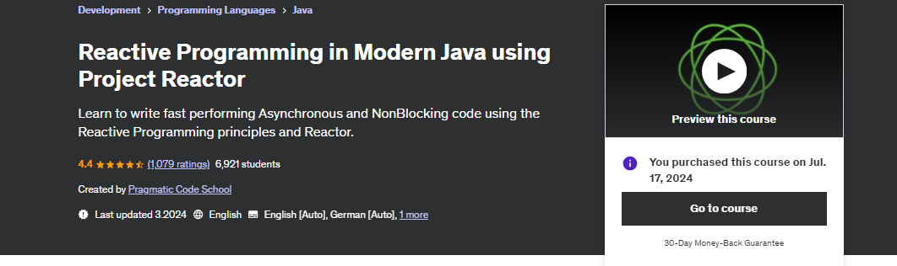
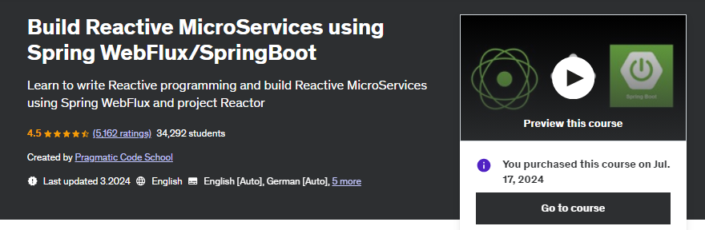
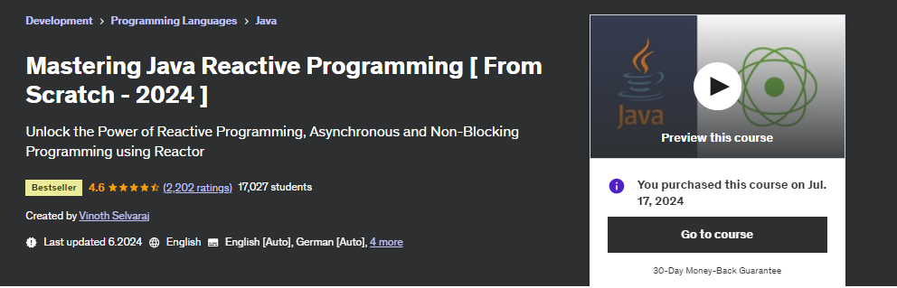

> Inspired to learn **reactive programming** after challenge from **Nordea**.

## Reactive Programming in Modern Java using Project Reactor

All course material from Reactive Programming in Modern Java using Project Reactor by **Pragmatic Code School**.

Contains my own notes with some course material to enforce learning experience.

If the content sparked :fire: your interest, please consider buying the course and start learning :book:.

This repository is made with **Eclipse**, therefore it will include configuration files which are related to this IDE this approach will be favored for now. ⚙️

[The course at Udemy](https://www.udemy.com/course/reactive-programming-in-modern-java-using-project-reactor/). 

[Website of maker](https://dilipsundarraj.com/).

<!-- 
Linkedin puts this shit front, when clicking from private mode x(. Need to put this to make jump working every case
?trk=public_profile_see-credential 
-->

Insert certificate here when completed

**Note: The material provided in this repository is only for helping those who may get stuck at any point of time in the course. It is very advised that no one should just copy the solutions(violation of Honor Code) presented here.**

## Progress/Curriculum

- [x] [Section 01](https://github.com/developersCradle/reactive-programming/tree/main/Reactive%20Programming%20in%20Modern%20Java%20using%20Project%20Reactor/Section%2001#section-1-introduction) - Introduction. ✅
- [x] [Section 02](https://github.com/developersCradle/reactive-programming/tree/main/Reactive%20Programming%20in%20Modern%20Java%20using%20Project%20Reactor/Section%2002#section-2-course-slides--source-code) - Course Slides & Source Code. ✅
- [x] [Section 03](https://github.com/developersCradle/reactive-programming/tree/main/Reactive%20Programming%20in%20Modern%20Java%20using%20Project%20Reactor/Section%2003#section-3-why-reactive-programming) - Introduction to Reactive Programming. ✅
- [x] [Section 04](https://github.com/developersCradle/reactive-programming/tree/main/Reactive%20Programming%20in%20Modern%20Java%20using%20Project%20Reactor/Section%2004#section-4-getting-started-with-project-reactor) - Getting Started with Project Reactor. ✅
- [x] [Section 05](https://github.com/developersCradle/reactive-programming/tree/main/Reactive%20Programming%20in%20Modern%20Java%20using%20Project%20Reactor/Section%2005#section-5-setting-up-the-project-for-this-course) - Setting up the Project for this course. ✅
- [x] [Section 06](https://github.com/developersCradle/reactive-programming/tree/main/Reactive%20Programming%20in%20Modern%20Java%20using%20Project%20Reactor/Section%2006#section-6-functional-programming-in-modern-java) - Functional Programming in Modern Java. ✅
- [x] [Section 07](https://github.com/developersCradle/reactive-programming/tree/main/Reactive%20Programming%20in%20Modern%20Java%20using%20Project%20Reactor/Section%2007#section-7-lets-create-our-very-first-flux-and-mono) - Lets create our very first Flux and Mono. ✅
- [x] [Section 08](https://github.com/developersCradle/reactive-programming/tree/main/Reactive%20Programming%20in%20Modern%20Java%20using%20Project%20Reactor/Section%2008#section-8-transforming-flux-and-mono) -  Transforming Flux and Mono. ✅
- [x] [Section 09](https://github.com/developersCradle/reactive-programming/tree/main/Reactive%20Programming%20in%20Modern%20Java%20using%20Project%20Reactor/Section%2009#section-9-combining-flux-and-mono) - Combining Flux and Mono. ✅
- [x] [Section 10](https://github.com/developersCradle/reactive-programming/tree/main/Reactive%20Programming%20in%20Modern%20Java%20using%20Project%20Reactor/Section%2010#section-10-build-movie-reactiveservice-using-project-reactor) - Build Movie ReactiveService using Project Reactor. ✅
- [x] [Section 11](https://github.com/developersCradle/reactive-programming/tree/main/Reactive%20Programming%20in%20Modern%20Java%20using%20Project%20Reactor/Section%2011#section-11-doon-callbacks---peeking-into-a-sequence) - doOn* CallBacks - Peeking into a Sequence. ✅
- [x] [Section 12](https://github.com/developersCradle/reactive-programming/tree/main/Reactive%20Programming%20in%20Modern%20Java%20using%20Project%20Reactor/Section%2012#section-12-exceptionerror-handling-in-flux-and-mono) - Exception/Error Handling in Flux and Mono. ✅
- [x] [Section 13](https://github.com/developersCradle/reactive-programming/tree/main/Reactive%20Programming%20in%20Modern%20Java%20using%20Project%20Reactor/Section%2013#section-13-implement-exception-handling-in-movies-reactive-service) - Implement Exception Handling in Movies Reactive Service. ✅
- [x] [Section 14](https://github.com/developersCradle/reactive-programming/tree/main/Reactive%20Programming%20in%20Modern%20Java%20using%20Project%20Reactor/Section%2014#section-14-retry-repeat-using-retry-retrywhen-repeat) - Retry, Repeat using retry(), retryWhen(), repeat(). ✅
- [ ] [Section 15](https://github.com/developersCradle/reactive-programming/tree/main/Reactive%20Programming%20in%20Modern%20Java%20using%20Project%20Reactor/Section%2015#section-15-reactors-execution-model---schedulers-threads-and-threadpool) - Reactors Execution Model - Schedulers, Threads and Threadpool.
- [ ] [Section 16](https://github.com/developersCradle/reactive-programming/tree/main/Reactive%20Programming%20in%20Modern%20Java%20using%20Project%20Reactor/Section%2016#section-16-making-blocking-calls-in-moviereactiveservice) - Making Blocking Calls in MovieReactiveService.
- [ ] [Section 17](https://github.com/developersCradle/reactive-programming/tree/main/Reactive%20Programming%20in%20Modern%20Java%20using%20Project%20Reactor/Section%2017#section-17-backpressure) - BackPressure.
- [ ] [Section 18](https://github.com/developersCradle/reactive-programming/tree/main/Reactive%20Programming%20in%20Modern%20Java%20using%20Project%20Reactor/Section%2018#section-18-explore-data-parallelism-in-project-reactor) - Explore Data Parallelism in Project Reactor.
- [ ] [Section 19](https://github.com/developersCradle/reactive-programming/tree/main/Reactive%20Programming%20in%20Modern%20Java%20using%20Project%20Reactor/Section%2019#section-19-cold--hot-streams) - Cold & Hot Streams.
- [ ] [Section 20](https://github.com/developersCradle/reactive-programming/tree/main/Reactive%20Programming%20in%20Modern%20Java%20using%20Project%20Reactor/Section%2020#section-20-testing-using-virtualtimescheduler) - Testing using VirtualTimeScheduler.
- [ ] [Section 21](https://github.com/developersCradle/reactive-programming/tree/main/Reactive%20Programming%20in%20Modern%20Java%20using%20Project%20Reactor/Section%2021#section-21-build-nonblocking-restclient-using-webclient) - Build NonBlocking RestClient using WebClient.
- [ ] [Section 22](https://github.com/developersCradle/reactive-programming/tree/main/Reactive%20Programming%20in%20Modern%20Java%20using%20Project%20Reactor/Section%2022#section-22-programmatically-creating-a-fluxmono) - Programmatically Creating a Flux/Mono.
- [ ] [Section 23](https://github.com/developersCradle/reactive-programming/tree/main/Reactive%20Programming%20in%20Modern%20Java%20using%20Project%20Reactor/Section%2023#section-23-debugging-in-project-reactor) - Debugging in Project Reactor.

### Additional stuff

- [ ] Get known to Asynchronous/Concurrency **Future**, **CompletableFuture** and Flow API.
- [ ] Read thought Reactor 3 Reference Guide. [Link](https://projectreactor.io/docs/core/release/reference/).
- [ ] Make some more test cases about `21. Asynchronous Operations using flatMap() Operator`.
- [ ] Make some concept to drive in `flatMapMany()` concept.
- [ ] Explore with more concepts `25. Transform using the transform() Operator`.
- [ ] Explore with more concepts `26. Handling empty data using defaultIfEmpty and switchIfEmpty() Operators`.

## Build Reactive MicroServices using Spring WebFlux/SpringBoot

All course material from Build Reactive MicroServices using Spring WebFlux/SpringBoot by **Pragmatic Code School**.

Contains my own notes with some course material to enforce learning experience.

If the content sparked :fire: your interest, please consider buying the course and start learning :book:.

This repository is made with **Eclipse**, therefore it will include configuration files which are related to this IDE this approach will be favored for now. ⚙️

Also will be using **Maven**, even thought in video there is **Gradle** in use.

[The course at Udemy](https://www.udemy.com/course/build-reactive-restful-apis-using-spring-boot-webflux). 

[Website of maker](https://dilipsundarraj.com/).

<!-- 
Linkedin puts this shit front, when clicking from private mode x(. Need to put this to make jump working every case
?trk=public_profile_see-credential 
-->

Insert certificate here when completed

**Note: The material provided in this repository is only for helping those who may get stuck at any point of time in the course. It is very advised that no one should just copy the solutions(violation of Honor Code) presented here.**

## Progress/Curriculum

- [x] [Section 01](https://github.com/developersCradle/reactive-programming/tree/main/Build%20Reactive%20MicroServices%20using%20Spring%20WebFlux%20and%20Spring%20Boot/Section%2001#section-1-getting-started-with-the-course) - Getting Started with the Course. ✅ 
- [x] [Section 02](https://github.com/developersCradle/reactive-programming/tree/main/Build%20Reactive%20MicroServices%20using%20Spring%20WebFlux%20and%20Spring%20Boot/Section%2002#section-2-source-code-and-course-slides-for-this-course) - Source Code and Course Slides for this Course. ✅
- [x] [Section 03](https://github.com/developersCradle/reactive-programming/tree/main/Build%20Reactive%20MicroServices%20using%20Spring%20WebFlux%20and%20Spring%20Boot/Section%2003#section-3-why-reactive-programming-) - Why Reactive Programming? ✅
- [x] [Section 04](https://github.com/developersCradle/reactive-programming/tree/main/Build%20Reactive%20MicroServices%20using%20Spring%20WebFlux%20and%20Spring%20Boot/Section%2004#section-04-introduction-to-reactive-programming) - Introduction to Reactive Programming. ✅
- [x] [Section 05](https://github.com/developersCradle/reactive-programming/tree/main/Build%20Reactive%20MicroServices%20using%20Spring%20WebFlux%20and%20Spring%20Boot/Section%2005#section-5-introduction-to-spring-webflux) - Introduction to Spring WebFlux. ✅
- [x] [Section 06](https://github.com/developersCradle/reactive-programming/tree/main/Build%20Reactive%20MicroServices%20using%20Spring%20WebFlux%20and%20Spring%20Boot/Section%2006#section-6-getting-started-with-project-reactor) - Getting Started with Project Reactor. ✅
- [x] [Section 07](https://github.com/developersCradle/reactive-programming/tree/main/Build%20Reactive%20MicroServices%20using%20Spring%20WebFlux%20and%20Spring%20Boot/Section%2007#section-7-setting-up-the-base-project-for-this-course) - Setting up the base project for this course. ✅
- [x] [Section 08](https://github.com/developersCradle/reactive-programming/tree/main/Build%20Reactive%20MicroServices%20using%20Spring%20WebFlux%20and%20Spring%20Boot/Section%2008#section-8-lets-explore-flux-and-mono---hands-on) - Lets Explore Flux and Mono - Hands On. Same as  in **Reactive Programming in Modern Java using Project Reactor** course. ✅
- [x] [Section 09](https://github.com/developersCradle/reactive-programming/tree/main/Build%20Reactive%20MicroServices%20using%20Spring%20WebFlux%20and%20Spring%20Boot/Section%2009#section-9-introduction-to-spring-webflux) - Introduction to Spring WebFlux. ✅
- [x] [Section 10](https://github.com/developersCradle/reactive-programming/tree/main/Build%20Reactive%20MicroServices%20using%20Spring%20WebFlux%20and%20Spring%20Boot/Section%2010#section-10-set-up-the-moviesinfoservice-service) - Build Movie ReactiveService using Project Reactor. ✅
- [x] [Section 11](https://github.com/developersCradle/reactive-programming/tree/main/Build%20Reactive%20MicroServices%20using%20Spring%20WebFlux%20and%20Spring%20Boot/Section%2011#section-11-simple-non-blocking-restful-api-using-annotated-controller-approach) - Simple Non Blocking RESTFUL API using Annotated Controller Approach. ✅
- [x] [Section 12](https://github.com/developersCradle/reactive-programming/tree/main/Build%20Reactive%20MicroServices%20using%20Spring%20WebFlux%20and%20Spring%20Boot/Section%2012#section-12-automated-tests-using-junit5-and-webfluxtest) - Automated Tests using JUnit5 and @WebFluxTest. ✅
- [x] [Section 13](https://github.com/developersCradle/reactive-programming/tree/main/Build%20Reactive%20MicroServices%20using%20Spring%20WebFlux%20and%20Spring%20Boot/Section%2013#section-13-reactive-programming-in-mongo-db-for-the-movieinfo-service) - Reactive Programming in Mongo DB for the MovieInfo Service. ✅
- [x] [Section 14](https://github.com/developersCradle/reactive-programming/tree/main/Build%20Reactive%20MicroServices%20using%20Spring%20WebFlux%20and%20Spring%20Boot/Section%2014#section-14-build-movieinfo-service-using-rest-controller-approach) - Build MovieInfo Service using Rest Controller Approach. ✅
- [x] [Section 15](https://github.com/developersCradle/reactive-programming/tree/main/Build%20Reactive%20MicroServices%20using%20Spring%20WebFlux%20and%20Spring%20Boot/Section%2015#section-15-unit-testing-in-spring-webflux) - Unit Testing in Spring WebFlux. ✅
- [x] [Section 16](https://github.com/developersCradle/reactive-programming/tree/main/Build%20Reactive%20MicroServices%20using%20Spring%20WebFlux%20and%20Spring%20Boot/Section%2016#section-16-bean-validation-using-validators-and-controlleradvice) - Bean Validation using Validators and ControllerAdvice. ✅
- [x] [Section 17](https://github.com/developersCradle/reactive-programming/tree/main/Build%20Reactive%20MicroServices%20using%20Spring%20WebFlux%20and%20Spring%20Boot/Section%2017#section-17-using-responseentity-with-reactive-types) - Using ResponseEntity with Reactive Types. ✅
- [ ] [Section 18](#) - Writing Custom Queries using ReactiveMongoRepository.
- [ ] [Section 19](#) - Spring WebFlux Under the Hood - Netty and Threading Model.
- [ ] [Section 20](#) - Introduction to Functional Web Module in Spring WebFlux.
- [ ] [Section 21](#) - Build MoviesReview Service using  Functional Web.
- [ ] [Section 22](#) - Unit Testing Functional Web.
- [ ] [Section 23](#) - Bean Validations using Functional Web.
- [ ] [Section 24](#) - Custom Global ErrorHandler in Functional Web.
- [ ] [Section 25](#) - Handling ResourceNotFound in Functional Web.
- [ ] [Section 26](#) - MoviesService - Rest Service connects the MovieInfo and MovieReview Service.
- [ ] [Section 27](#) - Handling Network Exceptions in WebClient.
- [ ] [Section 28](#) - Integration Testing External Services using WireMock.
- [ ] [Section 29](#) - Retrying Failed HTTP Calls.
- [ ] [Section 30](#) - Server Sent Events (SSE).
- [ ] [Section 31](#) - Bonus Section.

### Additional stuff

- [x] Example which using Maven. [Link To GitHub](https://github.com/ferfujikawa/reactive-spring?tab=readme-ov-file). 
- [ ] Do section 08 as refresher. Same content as in  **Reactive Programming in Modern Java using Project Reactor**.

## Mastering Java Reactive Programming [ From Scratch - 2024 ]

All course material from Mastering Java Reactive Programming [ From Scratch - 2024 ] by **Vinoth Selvaraj**.

Contains my own notes with some course material to enforce learning experience.

If the content sparked :fire: your interest, please consider buying the course and start learning :book:.

This repository is made with **Eclipse**, therefore it will include configuration files which are related to this IDE this approach will be favored for now. ⚙️

[The course at Udemy](https://www.udemy.com/course/complete-java-reactive-programming/). 

[Website of maker](https://www.vinsguru.com/).

<!-- 
Linkedin puts this shit front, when clicking from private mode x(. Need to put this to make jump working every case
?trk=public_profile_see-credential 
-->

Insert certificate here when completed

**Note: The material provided in this repository is only for helping those who may get stuck at any point of time in the course. It is very advised that no one should just copy the solutions(violation of Honor Code) presented here.**

## Progress/Curriculum new

- [ ] [Section 01](#) -
- [ ] [Section 02](#) -
- [ ] [Section 03](#) -
- [ ] [Section 04](#) -
- [ ] [Section 05](#) -
- [ ] [Section 06](#) -
- [ ] [Section 07](#) -
- [ ] [Section 08](#) -
- [ ] [Section 09](#) -
- [ ] [Section 10](#) -
- [ ] [Section 11](#) -
- [ ] [Section 12](#) -
- [ ] [Section 13](#) -
- [ ] [Section 14](#) -
- [ ] [Section 15](#) -

### Additional stuff

- [ ]

