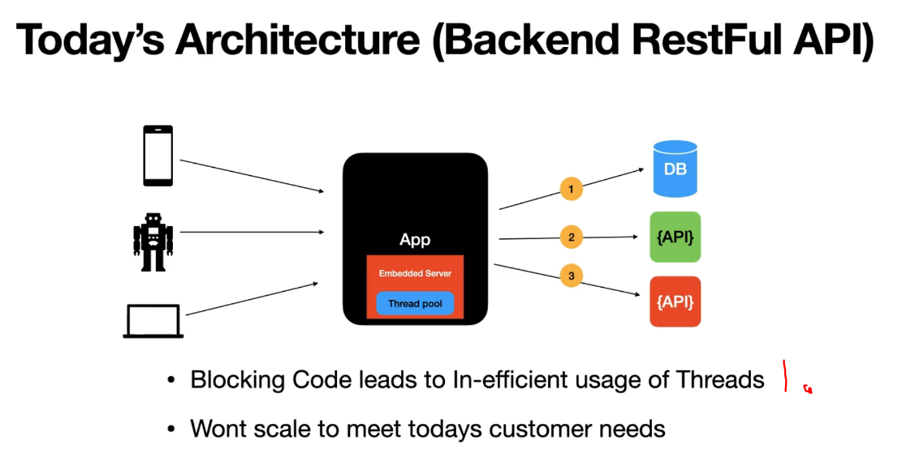
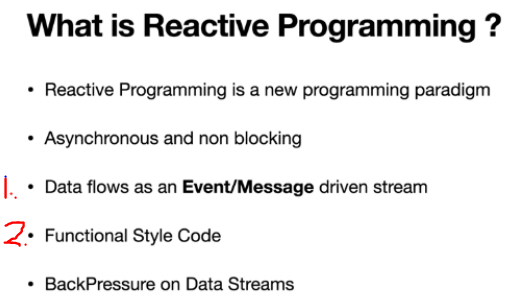

# Section 3: Why Reactive Programming

 Why Reactive Programming?

# What I Learned

# 5. Why Reactive Programming?

1. On **traditional programming** we make call to db and thread get blocked. We call this **Synchronous or Blocking style** of writing code.
2. This type of code **won't** scale well for todays standards needs.

- These are **expectations** application which are developed today:

1. This was not case 15years ago!

1. Common that App nowadays has **embedded server!**
2. Common that App has multiple data sources!
3. If these users would ask **App** something. Response time would be `Latency = Summation of (DB + API + API) response times`.
    - Traditional way to achieve **concurrency** is to put **Thread pool** layer to server and provide thread per request. This supports till certain point.
4. When there would be for example **100000** threads for each user. Why would we not have some big thread pool as **100000?**

- For this reason servers comes with fixed size of **thread pool**.

1. Blocking a **thread** makes thread to wait for response and **not** do any meaningful work.
    - This won't scale todays needs.

# Ask the question, What are tools/api which Java provides?

- From **Java** with Asynchronous/Concurrency APIs, we have:
    - **CallBacks**.
    - **Future**.

- Summary: Callbacks have more **minuses** than **plusses**, for todays needs.

1. Allowed to write **Asynchronous Code**.
2. `Future.get()` is getting **actual Result** of asynchronous call.
    - Its **problem** itself. Its **blocking call**, which blocks calling thread.
- Summary: Great addition, but was not for perfect for supporting this programming model.

 

- Are there any better way to solve this?
    - **YES**, **Reactive programming**

# 6. What is Reactive Programming ? 

1. Data flows as **Event/Message** stream.
2. This is like Java 8, **Stream API**(lambdas). Reactive programming is **extensions** of functional programming.

- `requestForData()` is received by **db** call is returned **immediately**.
    - This is **not a blocking call** anymore.
    - Calling **thread** is released to do useful work.

1. `request(n)` Request is made and **App** is ready to consume the data.
2. Its followed with **stream of events** when data is ready. This is called the **Reactor stream**. This data is send over with `onNext(n)` function where, **n = number as data**.
3. When data is **finished** `onComplete()` is sent.

- From developers perspective all these **states** are handled by **Reactive library**.

- You can think about this, that **data is pushed from datasource to the caller**, meaning **Push Based data streams model**.
    - Data from -> **DB** -> **App**.

## Backpressure

- If you look previous concept we can see that **App** can easily **overwhelmed** with data.
    - **Backpressure** is to solve this problem.

1. Concept where **App** is **controlling** the data flow, is called **Backpressure**. App is calling `cancel()` to end calling for more data. App also could be calling for more data.

1. With **Backpressure** reactive programming is called **Push-Pull based data flow model**.

 d

1. Requests at server level are needed to handle in **non-blocking** way. **Netty** is popular used for this.
2. Calls also needs to be non-blocking, we are using **Project Reactor**.
    - **Spring WebFlux** uses **Netty** and **Project Reactor** for building non blocking or reactive APIs.

# 7. Introduction to Reactive Streams

- **Reactive Streams** are the foundation for **Reactive programming**.

 
 
- Reactive Stream Specifications:
1. **Publisher**.
2. **Subscriber**.
3. **Subscription**.
4. **Processor**.

- Has one methods.

1. **Publisher** represents  any **DataSource**.
    - Or any which holds the data.

- Has 5 **methods**.

2. `onNext(T t)` when next data is send. 
4. `onComplete()` when data sending is finished.

- Has two methods.

1. `request()` when app requesting for data.
2. `cancel()` when app decides that data is not needed anymore.

### Reactive Stream works in successful scenario.

- No **error** or **fault** in this scenario.

1. Subscriber **invokes** `subscribe(this)` of the **Publisher**.
2. **Publisher** returns **Subscriber** object by invoking `onSubscribe()` on the **Subscriber**.
3. When **Subscriber** has hold of the **Subscription** object, it will invoke `request(n)` for **Publisher** to send the data.
4. When **Publisher** is rdy for sending data, it will send the data using `onNext()` as **events**.
5. When all data is sent,**Publisher** will send `onComplete()`.

### Reactive Stream works in error scenario.

**1.** It will be the same till steps form **1. to 3.**.
**4.** Now there will be `onError()`, this will be sent in form of **event** from **Publisher**.
**5.** This way of **throwing exception** is bit different than how exception is thrown in **traditional way**.
    - When error is noticed in **reactive stream** will be dead.
    - **Exceptions** are threaded like **the data**.

