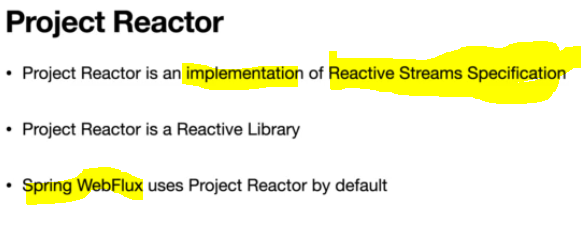
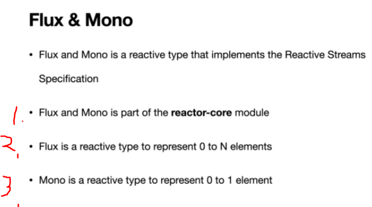
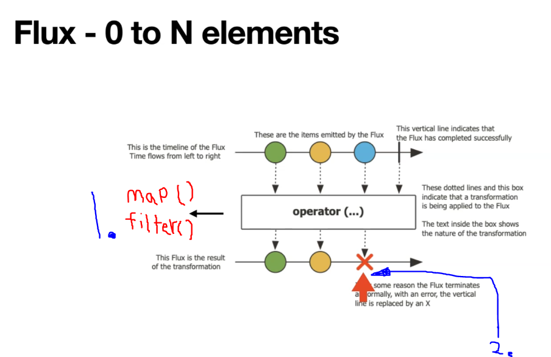
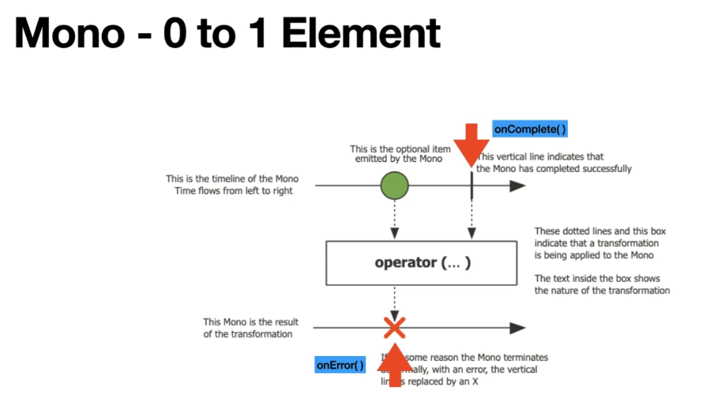

# Section 4: Getting Started with Project Reactor 

 Getting Started with Project Reactor

# What I Learned

# 8. Introduction to Project Reactor

- [Project Reactor](https://projectreactor.io/).
    - Good for looking what method to use form reactor programming.

- We are using **Reactor Core** and **Reactor Test**.

# 9. Reactor Reactive Types - Flux and Mono

 
 1. Flux and Mono are part of **reactor-core** module.
 2. You would use **Flux** when you want to represent **0 to multiple** types.
    - Will return more than one.
        - `0 to N` will be returned.
3. **Mono** is the type which represents `0 to 1` elements.
    
 - **Flux** and **Mono** basically classes.

1. Operation layer. Common operations are `map()` and `filter()`.
2. Error occurred.

 
 
 - Same, but some different in operations and for one data.

- [Flux](https://projectreactor.io/docs/core/release/api/reactor/core/publisher/Flux.html).

 - [Mono](https://projectreactor.io/docs/core/release/api/reactor/core/publisher/Mono.html).