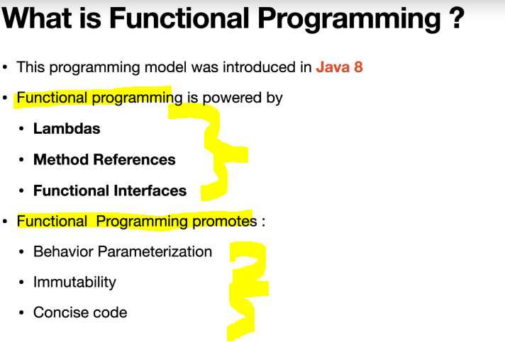

# Section 6: Functional Programming in Modern Java

 Functional Programming in Modern Java

# What I Learned

# 11. Imperative Style vs Functional Style


<br>



- Functional programming is huge topic and it can be made own code itself.

- What's the style of code that's written before Java 8?
    - Answer is **Imperative Style of Code**.

- We explore this with following case.


### Imperative Style of Code vs Functional Style of Code: **Imperative Style of Code**.

- **Before** Java 8. **Imperative Style**.

```
package com.learnreactiveprogramming.functional;

import java.util.ArrayList;
import java.util.List;

public class ImperativeExample {

    public static List<String> namesGreaterThanSize(List<String> namesList, int size){
        var newNamesList = new ArrayList<String>();
        for(String name : namesList){
            if(name.length()>size && !newNamesList.contains(name))
                //newNamesList.add(name.toUpperCase());
            newNamesList.add(name);
        }

        return newNamesList;
    }

    public static void main(String[] args) {

        var namesList = List.of("alex", "ben", "chloe", "adam","adam");
        var newNamesList = namesGreaterThanSize(namesList, 3);
        System.out.println("newNamesList  :"+ newNamesList);

    }
}
```

### Imperative Style of Code vs Functional Style of Code: **Functional Style of Code**.

- After Java 8. 

```
package com.learnreactiveprogramming.functional;

import java.util.ArrayList;
import java.util.List;
import java.util.stream.Collectors;

public class FunctionalExample {

    public static List<String> namesGreaterThanSize(List<String> namesList, int size) {
        return namesList.stream()
                //.parallel()
                .filter(s -> s.length() > size)
                //.sorted()
                //.distinct()
                .collect(Collectors.toList());
    }

    public static void main(String[] args) {

        var namesList = List.of("alex",/* "alex",*/ "ben", "chloe", "adam");
        var newNamesList = namesGreaterThanSize(namesList, 3);
        System.out.println("newNamesList  :"+ newNamesList);

    }
}
```

- **Functional style of programming** is more adaptive and easily adaptive than **Imperative Style** for business logic.