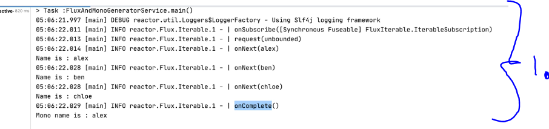
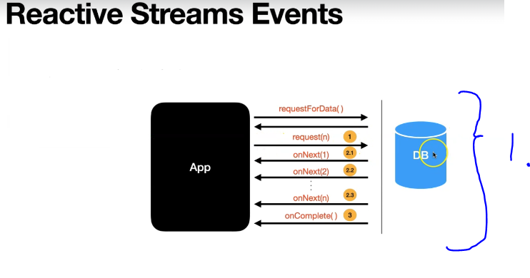

# Section 7: Lets create our very first Flux and Mono

Section 7: Lets create our very first Flux and Mono.

# What I Learned

# 12. Let's write our very first Flux

- Return **Flux** of Strings.

```
  public Flux<String> namesFlux() {

        return Flux.fromIterable(List.of("alex", "ben","chloe")); // db or a remote service call
    }

```

- Creates Flux out of Collection.

```

        FluxAndMonoGeneratorService fluxAndMonoGeneratorService = new FluxAndMonoGeneratorService();

```
- And get access to Flux `.namesFlux()` and only way to access after this is calling `.subscribe()` function with Lambda for example.
    - These will be send to **one by one**.
        - We will consume one by one and print them.
```
        fluxAndMonoGeneratorService.namesFlux()
                .subscribe(name -> {
                    System.out.println("Name is : " + name);
                });
```

## Simple example 

```
package com.learnreactiveprogramming.service;

import reactor.core.publisher.Flux;

import java.util.List;

public class FluxAndMonoGeneratorService {

    public Flux<String> namesFlux() {

        return Flux.fromIterable(List.of("alex", "ben","chloe")); // db or a remote service call
    }


    public static void main(String[] args) {

        FluxAndMonoGeneratorService fluxAndMonoGeneratorService = new FluxAndMonoGeneratorService();

        fluxAndMonoGeneratorService.namesFlux()
                .subscribe(name -> {
                    System.out.println("Name is : " + name);
                });

    }
}

```

# 13. Let's write our very first Mono

- Return **Mono** of type String.
    - Mono will return just one!
```
   public Mono<String> nameMono(){

        return Mono.just("alex");
    }
```

- And accessing it and consuming 

```
     fluxAndMonoGeneratorService.nameMono()
                .subscribe(name->{
                    System.out.println("Mono name is : " + name);
                });
```

# 14. Reactive Stream Events

- **Subscriber** is always attached to **Publisher**.

- Project Reactor library provides `.log()` to peek trough events between **Publisher** and **Subscriber**.



1. You can see the events which we discussed in previous lecture.
    - After `onSubscribe` hands back the **Subscription** Object we call `request(unbounded)` asking to request `unbounded`  amount of data.
> Hey, give me all the data.



1. These events will be logged.

- Reactive Stream Events with `.log()` in Mono and Flux.

```
[ INFO] (main) | onSubscribe([Synchronous Fuseable] FluxIterable.IterableSubscription)
[ INFO] (main) | request(unbounded)
[ INFO] (main) | onNext(alex)
Name is : alex
[ INFO] (main) | onNext(ben)
Name is : ben
[ INFO] (main) | onNext(chloe)
Name is : chloe
[ INFO] (main) | onComplete()
```

# 15. Testing Flux using JUnit5

- High quality software require test cases!

- We are using **StepVerifier** from package.

```
     <dependency>
            <groupId>io.projectreactor</groupId>
            <artifactId>reactor-test</artifactId>
            <scope>test</scope>
        </dependency>
```

```
package com.learnreactiveprogramming.service;

import org.junit.jupiter.api.Test;
import reactor.test.StepVerifier;

public class FluxAndMonoGeneratorServiceTest {

    FluxAndMonoGeneratorService fluxAndMonoGeneratorService =
            new FluxAndMonoGeneratorService();

    @Test
    void namesFlux() {
        //given

        //when
        var namesFlux = fluxAndMonoGeneratorService.namesFlux();

        //then
        StepVerifier.create(namesFlux)
                //.expectNext("alex", "ben","chloe")
                //.expectNextCount(3)
                .expectNext("alex")
                .expectNextCount(2)
                .verifyComplete();
    }
}

```

- We can verify that Flux is Giving uss ("alex", "ben","chloe") and in the end `.verifyComplete();` **onComplete** signal is received.

```
         //then
        StepVerifier.create(namesFlux)
                .expectNext("alex", "ben","chloe")
                .expectNextCount(3)
                .verifyComplete();
```

# Assignment 1: Testing Mono using JUnit5

- My Answer:

```
Test a Mono<String> using StepVerifier

Questions for this assignment
Test a Mono<String> using StepVerifier.

Function to write the test case against is namesMono.

public Mono<String> namesMono() {

    return Mono.just("alex");

}
```

- Instructor Answer:

```
@Test
void namesMono() {

    //given
    //when
    var stringMono = fluxAndMonoGeneratorService.namesMono();

    //then
    StepVerifier.create(stringMono)
            .expectNext("alex")
            .verifyComplete();

}
```
