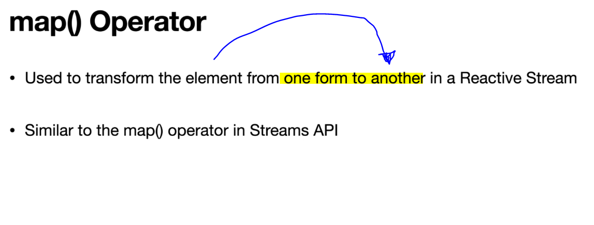
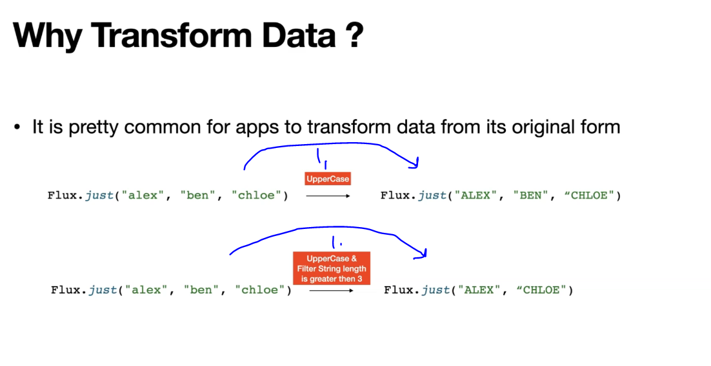
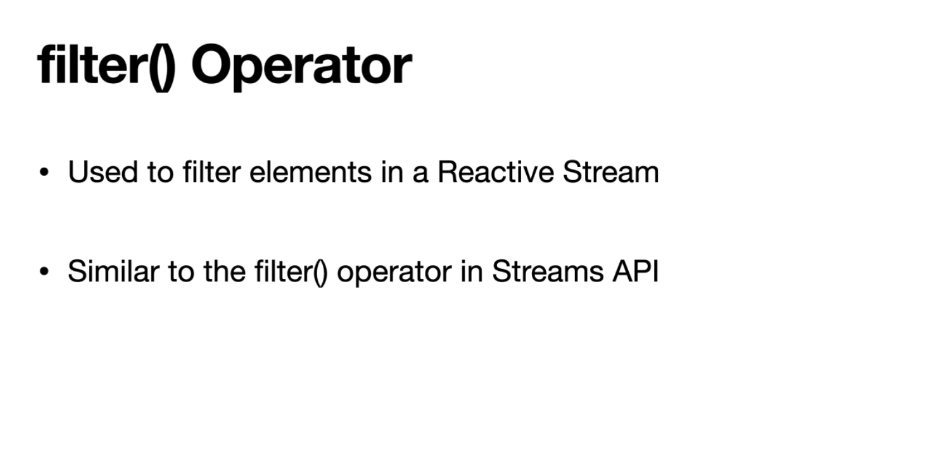
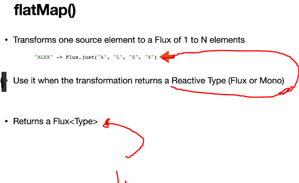
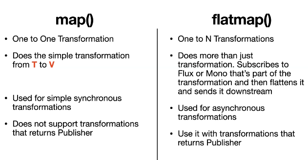

# Section 8: Transforming Flux and Mono

Section 8: Transforming Flux and Mono.

# What I Learned

# 16. Transform using map() Operator



- Flux `.map()` mapping operator.

```
    public Flux<String> nameFlux_map() {
    	return Flux.fromIterable(List.of("alex", "ben", "chloe"))
//    			.map(String::toUpperCase)  // We are transforming data to UPPER CASE.
    			.map(s -> s.toUpperCase()) // Same using Lambda.
    			.log();
    }
```

- Test for .map operation.

```
    @Test
    void namesFlux_map() {
    	//given
    	
    	//when
    	var namesFlux = fluxAndMonoGeneratorService.nameFlux_map();
    	
    	//then
    	
    	StepVerifier.create(namesFlux)
    	.expectNext("ALEX", "BEN", "CHLOE")    
    	.verifyComplete();
    }
```

# 17. Transforming Data Using Operators in Project Reactor



1. Sometimes we wan't transform data to another form.

# 18. Reactive Streams are Immutable

- Reactor Streams have **immutable** nature. 

```
    public Flux<String> nameFlux_immutability() {
    	var nameFlux = Flux.fromIterable(List.of("alex", "ben", "chloe"));
    	nameFlux.map(String::toUpperCase); //This won't work, since this is different Flux.
    	return nameFlux;
    }

```

- This is being applied to another flux `nameFlux.map(String::toUpperCase);` so returned value will be lowercase version.


- For this case, this would be working as test.

```
 @Test
    void nameFlux_immutability() 
    {
    	//given
    	
    	//when
    	var namesFlux = fluxAndMonoGeneratorService.nameFlux_immutability();
    	//then
    	StepVerifier.create(namesFlux)
    	.expectNext("alex", "ben","chloe")   
    	.verifyComplete();
    }
```
 
# 19. Filter using filter() Operator



-  We can chain operations to achieve wanted result. Here usage of `.filter()`.

```
    public Flux<String> nameFlux_map_with_filter(int stringLenght) {
    	return Flux.fromIterable(List.of("alex", "ben", "chloe"))
//    			.map(String::toUpperCase)  // We are transforming data to UPPER CASE.
    			.map(s -> s.toUpperCase()) // Same using Lambda.
    			.filter(s -> s.length() > stringLenght)
    			.map(s -> s.length() + "-" + s)
    			.log();
    }
```

- In **functional programming** chaining different **transformation operations** is called **Pipeline**.

- And example to test this method:

```
    @Test
    public void nameFlux_map_with_filter() {

    	//given
    	int stringLenght = 3;
    	
    	//when
    	var namesFlux = fluxAndMonoGeneratorService.nameFlux_map_with_filter(stringLenght);
    	
    	//then
    	StepVerifier.create(namesFlux)
    	.expectNext("4-ALEX","5-CHLOE")    
    	.verifyComplete();

    }

```


# Assignment 2: Map , Filter Operators in Mono

```
Create a function named namesMono_map_filter.

	- This function accepts the stringLength as an argument (int stirngLength).

	- This function returns a Mono<String> as an output.

Use the string "alex" and create a Mono inside the funciton.

Use the map operator to apply the uppercase operation on the string "alex"

Use the filter operator to apply the filtering operation on the string "alex" using the sting Length parameter.

Questions for this assignment:

	1. Create a function named namesMono_map_filter.

	This function accepts the stringLength as an argument (int stringLength).

	This function returns a Mono<String> as an output.

	Use the string "alex" and create a Mono inside the funciton.

	Use the map operator to apply the uppercase operation on the string "alex"

	Use the filter operator to apply the filtering operation on the string "alex" using the stringLength parameter.


	2. Write a test case for the function namesMono_map_filter.
```


- My Answer:

```
    public Mono<String> namesMono_map_filter(int stringLength) {
		return Mono.just("alex")
		.map(String::toUpperCase)
		.filter(s -> s.length() > stringLength);
		
	}
```
- And my Test:

```
 @Test
    void namesMono_map_filter()
    {
    	
    // given
    int stringLenght = 3;
    	
    // when
    var namesMono = fluxAndMonoGeneratorService.namesMono_map_filter(stringLenght);

    // then
    StepVerifier.create(namesMono)
            .expectNext("ALEX")
            .expectNextCount(0)
            .verifyComplete();
    }
```

- Instructor Answer:

```
public Mono<String> namesMono_map_filter(int stirngLength) {
    return Mono.just("alex")
            .map(String::toUpperCase)
            .filter(s-> s.length() > stirngLength);

}
```

- Instructor Test:

```
@Test
void namesMono_map_filter() {

    //given
    int stringLength = 3;

    //when
    var stringMono = fluxAndMonoGeneratorService.namesMono_map_filter(stringLength);

    //then
    StepVerifier.create(stringMono)
            .expectNext("ALEX")
            .verifyComplete();

}
```

# 20. Advanced transform using the flatMap() Operator



1. `flatMap()` return always **Flux** of given type.

- Splits string and return **Flux of individual elements**.

```

    // ALEX -> FLux(A,L,E,X)
    private Flux<String> splitString(String name) {
        var charArray = name.split("");
        return Flux.fromArray(charArray);
    }
    
```

- Flattens the Flux as individual elements.

```

    /**
    * @param stringLength
    */
    public Flux<String> namesFlux_flatmap(int stringLength) {
        var namesList = List.of("alex", "ben", "chloe"); // a, l, e , x
        return Flux.fromIterable(namesList)
                //.map(s -> s.toUpperCase())
                .map(String::toUpperCase)
                .filter(s -> s.length() > stringLength)
                // ALEX,CHLOE -> A, L, E, X, C, H, L , O, E
                .flatMap(s -> splitString(s));
    }		
    
```

- To test this. We want Flux which is flattened.

```
    @Test
    void namesFlux_flatmap() {

        //given
        int stringLength = 3;

        //when
        var namesFlux = fluxAndMonoGeneratorService.namesFlux_flatmap(stringLength).log();

        //then
        StepVerifier.create(namesFlux)
                .expectNext("A", "L", "E", "X", "C", "H", "L", "O", "E")
                .verifyComplete();

    }

```

# 21. Asynchronous Operations using flatMap() Operator

- FlatMap is Asynchronous nature. If we introduce timing into Flux. This will return randomly the characters.


- Feature:

```
    private Flux<String> splitString_withDelay(String name) {
        var delay = new Random().nextInt(1000);
        var charArray = name.split("");
        return Flux.fromArray(charArray)
                .delayElements(Duration.ofMillis(delay));
    }
    
    public Flux<String> namesFlux_flatmap_async(int stringLength) {
        var namesList = List.of("alex", "ben", "chloe"); // a, l, e , x
        return Flux.fromIterable(namesList)
                //.map(s -> s.toUpperCase())
                .map(String::toUpperCase)
                .filter(s -> s.length() > stringLength)
                .flatMap(this::splitString_withDelay);

    }
```

- Test:

```
    @Test
    void namesFlux_flatmap_async() {
    	
        //given
        int stringLength = 3;
        //when
        var namesFlux = fluxAndMonoGeneratorService.namesFlux_flatmap_async(stringLength).log();
        //then
        StepVerifier.create(namesFlux)
                /*.expectNext("0-A", "1-L", "2-E", "3-X")
                .expectNextCount(5)*/
                .expectNextCount(9)
                .verifyComplete();
    }
```


