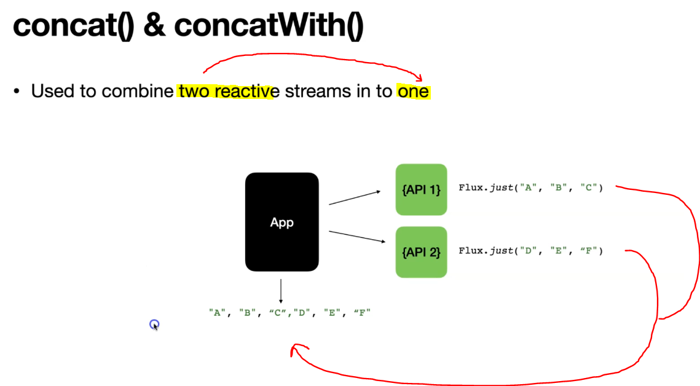

# Section 9: Combining Flux and Mono

Combining Flux and Mono.

# What I Learned

# 27. Introduction to Combining Reactive Streams


1. We need combine results from multiple sources. This is ver common in **microservice architecture**.
2. These are combined for result. **Project Reactor** has many operations for combining.


# 28. concat() & concatWith() operator



1. We can combine **fluxes** or **monos** into one stream.   

<br>


1.  These happen in **sequence**, meaning **first** one finishes and after this one second starts.
2. Mono does not need this.

- Difference between these are, other one is instance method.

- Logic with concat().

````
    // "A", "B", "C", "D", "E", "F"
    public Flux<String> explore_concat() {

        var abcFlux = Flux.just("A", "B", "C");

        var defFlux = Flux.just("D", "E", "F");

        return Flux.concat(abcFlux, defFlux).log();

    }
 
    // "A", "B", "C", "D", "E", "F"
    public Flux<String> explore_concatWith() {

        var abcFlux = Flux.just("A", "B", "C");

        var defFlux = Flux.just("D", "E", "F");

        return abcFlux.concatWith(defFlux).log();


    }
````

- And tests for these.

````
    
    @Test
    void explore_concat() {

        //given

        //when
        var value = fluxAndMonoGeneratorService.explore_concat();

        //then
        StepVerifier.create(value)
                .expectNext("A", "B", "C", "D", "E", "F")
                .verifyComplete();

    }
    

    @Test
    void explore_concatWith() {

        //given

        //when
        var value = fluxAndMonoGeneratorService.explore_concatWith();

        //then
        StepVerifier.create(value)
                .expectNext("A", "B", "C", "D", "E", "F")
                .verifyComplete();

    }

````

- We can combine results to one. This is common use case.

- Logic for making combination:

````  

    public Flux<String> explore_concatWith_mono() {

        var aMono = Mono.just("A");

        var bMono = Flux.just("B");

        return aMono.concatWith(bMono);

    }

````

- Test for this:

````

    @Test
    void explore_concat_mono() {

        //given

        //when
        var value = fluxAndMonoGeneratorService.explore_concatWith_mono();

        //then
        StepVerifier.create(value)
                .expectNext("A", "B")
                .verifyComplete();

    }    @Test
    void explore_concat_mono() {

        //given

        //when
        var value = fluxAndMonoGeneratorService.explore_concatWith_mono();

        //then
        StepVerifier.create(value)
                .expectNext("A", "B")
                .verifyComplete();

    }

````


# Assignment 4: Assignment for Writing JUnit5 Test Cases for concatWith() using Flux and Mono


```

Write the test case for explore_concatwith() and explore_concatwith_mono() methods in the FluxAndMonoGeneratorService class.


Questions for this assignment
    1. Write the test case for explore_concatwith() method in  FluxAndMonoGeneratorService class.


    2. Write the test case for explore_concatwith_mono() method in FluxAndMonoGeneratorService class.

```

- My answer:

````

    @Test
    void explore_concat_mono() {

        //given

        //when
        var value = fluxAndMonoGeneratorService.explore_concatWith_mono();

        //then
        StepVerifier.create(value)
                .expectNext("A", "B")
                .verifyComplete();

    }


        @Test
    void explore_concatWith() {

        //given

        //when
        var value = fluxAndMonoGeneratorService.explore_concatWith();

        //then
        StepVerifier.create(value)
                .expectNext("A", "B", "C", "D", "E", "F")
                .verifyComplete();

    }

````

# 29. Combining Reactive Streams using merge() and mergeWith() Operators

- `merge()` and `mergeWith()` are used to combine the publishers.


1. We will merge these two **Flux** to one. 
    - As you can see the two **Flux**:es are combined in interleaved fashion.


- The Logic:

```    public Flux<String> explore_merge() {

        var abcFlux = Flux.just("A", "B", "C")
        		.delayElements(Duration.ofMillis(100));

        var defFlux = Flux.just("D", "E", "F")
        		.delayElements(Duration.ofMillis(120));;

        return Flux.merge(abcFlux, defFlux).log();

    }
 
```

- The Test:

```

    @Test
    void explore_merge() {

        //given

        //when
        var value = fluxAndMonoGeneratorService.explore_merge();

        //then
        StepVerifier.create(value)
                .expectNext("A", "D", "B","E", "C", "F")
                .verifyComplete();

    }

```

- The Logic:

```
    public Flux<String> explore_mergeWith() {

        var abcFlux = Flux.just("A", "B", "C")
        		.delayElements(Duration.ofMillis(100));

        var defFlux = Flux.just("D", "E", "F")
        		.delayElements(Duration.ofMillis(120));;

        return abcFlux.mergeWith(defFlux).log(); // Yields same result as merge()

    }

```

- The Test:

```
@Test
void explore_mergeWith() {

    //given

    //when
    var value = fluxAndMonoGeneratorService.explore_mergeWith();

    //then
    StepVerifier.create(value)

            .expectNext("A", "D", "B", "E", "C", "F")
            .verifyComplete();

}
```

- The Logic:
 
```
    public Flux<String> explore_mergeWith_mono() {

        var aMono = Mono.just("A");

        var bMono = Flux.just("B");

        return aMono.mergeWith(bMono).log();

    }
```

- The Test:

```

    @Test
    void explore_mergeWith_mono() {

        //given

        //when
        var value = fluxAndMonoGeneratorService.explore_mergeWith_mono();

        //then
        StepVerifier.create(value)
                .expectNext("A", "B")
                .verifyComplete();

    }

```

# Assignment 5: Assignment for Writing JUnit5 Test Cases for mergeWith using Flux and Mono

```
Write the test case for explore_mergeWith() and explore_mergeWith_mono() methods in the FluxAndMonoGeneratorService class.

    Questions for this assignment

    1. Write the test case for explore_mergeWith() method in FluxAndMonoGeneratorService class.
    2. Write the test case for explore_mergeWith_mono() method in FluxAndMonoGeneratorService class.
```

- My Answers:

```

    @Test
    void explore_mergeWith_mono() {

        //given

        //when
        var value = fluxAndMonoGeneratorService.explore_mergeWith_mono();

        //then
        StepVerifier.create(value)
                .expectNext("A", "B")
                .verifyComplete();

    }

```

```
    @Test
    void explore_mergeWith() {

        //given

        //when
        var value = fluxAndMonoGeneratorService.explore_mergeWith();

        //then
        StepVerifier.create(value)
                .expectNext("A", "B", "C", "D", "E", "F")
                .verifyComplete();

    }
```

# 30. Combining Reactive Streams using mergeSequential() operator


- The Logic:

```
    public Flux<String> explore_mergeSequential() {

        var abcFlux = Flux.just("A", "B", "C")
        		.delayElements(Duration.ofMillis(100));

        var defFlux = Flux.just("D", "E", "F")
        		.delayElements(Duration.ofMillis(120));;

        return Flux.mergeSequential(abcFlux, defFlux).log(); // Yields same result as merge()

    }

```

- The Test:

```
    @Test
    void explore_mergeSequential() {

        //given

        //when
        var value = fluxAndMonoGeneratorService.explore_mergeSequential();

        //then
        StepVerifier.create(value)
                .expectNext("A", "B", "C", "D", "E", "F")
                .verifyComplete();
    }


```

# 31. Combining Reactive Streams using zip and zipWith() Operator

- `zip()` is used to zip multiple publishers into one.


1. Source **Flux**.
2. Combinator lambda.

- First one will be `AD` second `BE` third one `CF`.

- Difference with `zip()` is that, first emitting is waited for all element then its moved to second element.


<br>


1. Will return **Tuple** with 4 values.
    - This will make 4 values into one.
2. Will combine first values from each **Tuple**.

- Logic for `zip()`.

```
   
    public Flux<String> explore_zip(){

        var abcFlux = Flux.just("A","B","C");

        var defFlux = Flux.just("D","E","F");

        return Flux.zip(abcFlux,defFlux,(first, second)-> first+second)
                .log(); //AD, BE, CF

    }
    
```

- Test for `zip()`.

```
    @Test
    void explore_zip() {
    	//given
    	
    	//when
    	var value = fluxAndMonoGeneratorService.explore_zip();
    	
    	//then
    	
    	StepVerifier.create(value)
    	.expectNext("AD", "BE", "CF")    
    	.verifyComplete();
    }
    
```

- The Logic for  other `zip()`.

```
    public Flux<String> explore_zip_1(){

        var abcFlux = Flux.just("A","B","C");

        var defFlux = Flux.just("D","E","F");
        
        var _123Flux = Flux.just("1","2","3");
        var _456Flux = Flux.just("4","5","6");

        return Flux.zip(abcFlux,defFlux, _123Flux, _456Flux)
        		.map(tuple4 -> tuple4.getT1()+tuple4.getT2()+tuple4.getT3()+tuple4.getT4())
                .log(); 
        
        // Results will be AD14, BE25, CF36

    }

```

- Test with other type of `zip()`.

```
    @Test
    void explore_zip_1() {
    	//given
    	
    	//when
    	var value = fluxAndMonoGeneratorService.explore_zip_1();
    	
    	//then
    	
    	StepVerifier.create(value)
    	.expectNext("AD14", "BE25", "CF36")    
    	.verifyComplete();
    }
    
```

- These sames with `zipWith()`.
    - We are going to combine two publishers.

```
    public Flux<String> explore_zipWith(){

        var abcFlux = Flux.just("A","B","C");

        var defFlux = Flux.just("D","E","F");
        
        return abcFlux.zipWith(defFlux, (first, second) -> first+second).log();
        // return will be AD, BE, CF

    }
```

- The test with these logic:

```
    @Test
    void explore_zipWith() {

        //given

        //when
        var value = fluxAndMonoGeneratorService.explore_zipWith();

        //then
        StepVerifier.create(value)
                .expectNext("AD","BE","CF")
                .verifyComplete();
    }

```

- Making `zipWith` with **Mono**. The logic.

```

    public Mono<String> explore_ZipWith_mono(){

        var aMono = Mono.just("A"); //A

        var bMono = Mono.just("B"); //B
 
        return aMono.zipWith(bMono)
                .map(t2-> t2.getT1()+t2.getT2()) //AB
                .log(); // A, B

    }

```

- The test code for this.

```

    @Test
    void explore_ZipWith_mono(){

        //given

        //when
        var value = fluxAndMonoGeneratorService.explore_ZipWith_mono();

        //then
        StepVerifier.create(value)
                .expectNext("AB")
                .verifyComplete();

    }

```

 # Assignment 6: Assignment for Writing JUnit5 Test Cases for zipWith using Flux and Mono

 - Assignment: 
 
 ```

 Write the test case for explore_zipWith() and explore_zipWith_mono() methods in the FluxAndMonoGeneratorService class.

Questions for this assignment
    1. Write the test case for explore_zipWith() method in FluxAndMonoGeneratorService class.

    2. Write the test case for explore_zipWith_mono() method in FluxAndMonoGeneratorService class.

 ```

- My answers:

```
    @Test
    void explore_zipWith() {

        //given

        //when
        var value = fluxAndMonoGeneratorService.explore_zipWith();

        //then
        StepVerifier.create(value)
                .expectNext("AD","BE","CF")
                .verifyComplete();
    }

```

```
    @Test
    void explore_ZipWith_mono(){

    	//given

        //when
        var value = fluxAndMonoGeneratorService.explore_ZipWith_mono();

        //then
        StepVerifier.create(value)
                .expectNext("AB")
                .verifyComplete();

    }

```