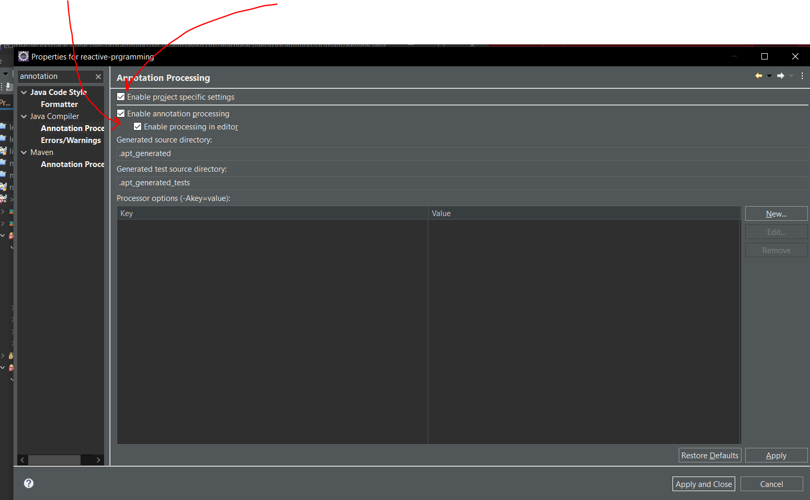
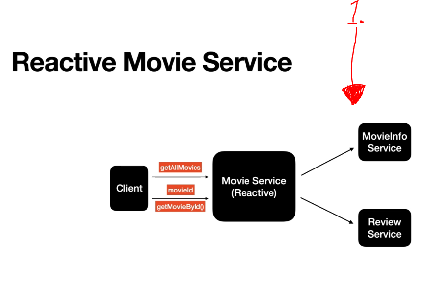

# Section 10: Build Movie ReactiveService using Project Reactor

Build Movie ReactiveService using Project Reactor.

# What I Learned

# 32. Overview of this MovieService

- To get this project working, member to enable annotation processing for **Lombok**.

- **REMEMBER**. `var` should be imported form Java JDK, not from **Lobmok** project.





1. One service calling two different service is pretty common in **Microservice architecture**.

# 33. Retrieve all of the MovieInfo

- Test for `getAllMovies()`.

````
public class MovieReactiveServiceTest {
	
    MovieInfoService mis = new MovieInfoService();
    ReviewService rs = new ReviewService();
    MovieReactiveService movieReactiveService = new MovieReactiveService(mis, rs);

	
    @Test
    void getAllMovieInfo() {
        //given

        //when
        var moviesInfo = movieReactiveService.getAllMovies();

        //then
        StepVerifier.create(moviesInfo)
                .assertNext(movieInfo -> {
                    assertEquals("Batman Begins", movieInfo.getMovieInfo().getName());
                    assertEquals(movieInfo.getReviewList().size(), 2);

                })
                .assertNext(movieInfo -> {
                    assertEquals("The Dark Knight", movieInfo.getMovieInfo().getName());
                    assertEquals(movieInfo.getReviewList().size(), 2);
                })
                .assertNext(movieInfo -> {
                    assertEquals("Dark Knight Rises", movieInfo.getMovieInfo().getName());
                    assertEquals(movieInfo.getReviewList().size(), 2);
                })
                .verifyComplete();

    }

}
````

- MovieReactiveService class.

````


public class MovieReactiveService {

    private MovieInfoService movieInfoService;
    private ReviewService reviewService;

    public MovieReactiveService(MovieInfoService movieInfoService, ReviewService reviewService) {
        this.movieInfoService = movieInfoService;
        this.reviewService = reviewService;
    }

    public Flux<Movie> getAllMovies(){

        var moviesInfoFlux = movieInfoService.retrieveMoviesFlux();
        return moviesInfoFlux
                .flatMap(movieInfo -> {
                    Mono<List<Review>> reviewsMono = reviewService.retrieveReviewsFlux(movieInfo.getMovieInfoId())
                    .collectList();
                    return reviewsMono
                            .map(reviewsList -> new Movie(movieInfo,reviewsList));
                })
                .log();
    }

}

````

# 34. Retrieve MovieInfo by movieId

- Test:

```
    @Test
    void getMovieById() {

    	// Given
        long movieId = 1L;
        // When
        Mono<Movie> movieMono = movieReactiveService.getMovieById(movieId);
        // Then
        StepVerifier.create(movieMono)
                .assertNext(movieInfo -> {
                    assertEquals("Batman Begins", movieInfo.getMovieInfo().getName());
                    assertEquals(movieInfo.getReviewList().size(), 2);
                })
                .verifyComplete();
    }

```

- Logic:

```
    //MovieId is only one, so Mono
    public Mono<Movie> getMovieById(long movieId)
    {
    	var movieInfoMono = movieInfoService.retrieveMovieInfoMonoUsingId(movieId);
    	var reviewsFlux = reviewService.retrieveReviewsFlux(movieId)
    			.collectList();
    	
    	return movieInfoMono.zipWith(reviewsFlux, (movieInfo, reviews) -> new Movie(movieInfo, reviews));
    }
```

# Assignment 7: Implement getMovieById using FlatMap operator in Mono

```
Use the getAllMovies function as an example and use the flatMap operator as it was used  and implement the getMovieById functionality

Questions for this assignment
    1.Implement the getMovieById using the flatMap operator in Mono.

    2.Write a test case for getMovieById function using flatMap operator
```

 
- My solution:

```
    public Mono<Movie> getMovieById_usingFlatMap(long movieId) {

        var movieInfoMono = movieInfoService.retrieveMovieInfoMonoUsingId(movieId);
        return movieInfoMono
                .flatMap(movieInfo -> {
                    Mono<List<Review>> reviewsMono = reviewService.retrieveReviewsFlux(movieInfo.getMovieInfoId())
                            .collectList();
                    return reviewsMono
                            .map(movieList -> new Movie(movieInfo, movieList));

                });
    }

```

- My test:

```
    @Test
    void getMovieById_usingFlatMap() {

        //given
        long movieId = 1L;

        //when
        Mono<Movie> movieMono = movieReactiveService.getMovieById_usingFlatMap(movieId);

        //then
        StepVerifier.create(movieMono)
                .assertNext(movieInfo -> {
                    assertEquals("Batman Begins", movieInfo.getMovieInfo().getName());
                    assertEquals(movieInfo.getReviewList().size(), 2);
                })
                .verifyComplete();
    }
```

- todo teachers.