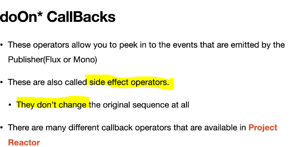
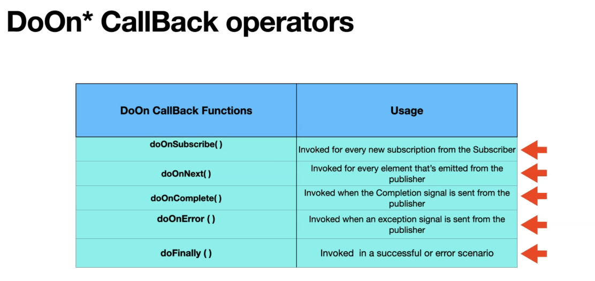
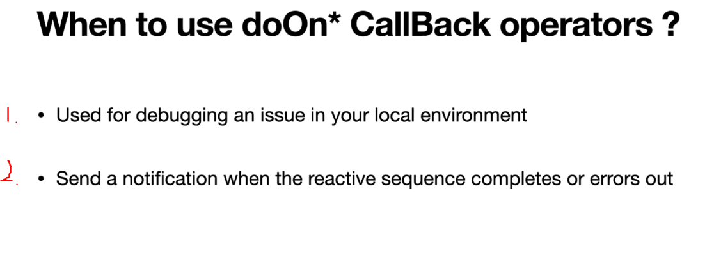

# Section 11: doOn* CallBacks - Peeking into a Sequence.

doOn* CallBacks - Peeking into a Sequence.

# What I Learned



<br>

- There is many other CallBacks operations.



<br>



1. We could use these for debugging purposes.
2. When sending message, when specific massage has ended.

```
    public Flux<String> namesFlux_map(int stringLength) {
        var namesList = List.of("alex", "ben", "chloe");
        //return Flux.just("alex", "ben", "chloe");

        //Flux.empty()
        return Flux.fromIterable(namesList)
                //.map(s -> s.toUpperCase())
                .map(String::toUpperCase)
                .delayElements(Duration.ofMillis(500))
                .filter(s -> s.length() > stringLength)
                .map(s -> s.length() + "-" + s)
                .doOnNext(name -> {
                    System.out.println("name is : " + name);
                    name = name.toLowerCase();
                })
                .doOnSubscribe(s -> {
                    System.out.println("Subscription  is : " + s);
                })
                .doOnComplete(() -> {
                    System.out.println("Completed sending all the items.");
                })
                .doFinally((signalType) -> {
                    System.out.println("value is : " + signalType);
                })
                .defaultIfEmpty("default");
    }

```

- We can for example logged values with `.doOnNext()`.

- These are **side effect operators**, they don't affect original source. Example `name = name.toLowerCase();`.

- So if we wan't to peak into reactive stream, we could use **callBack** operators.