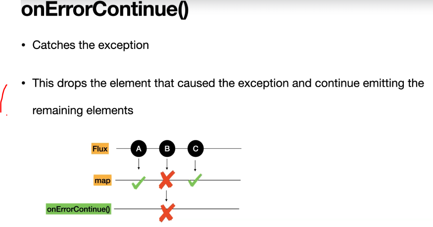

# Section 12: Exception/Error Handling in Flux and Mono

Exception/Error Handling in Flux and Mono

# What I Learned

# 36. Exceptions in Reactive Streams


- We are going to assume exception throwing is happing from such scenario.

- When **Exceptions** are thrown, we are not getting eny other event from the flux.

- Logic itself:

```
    public Flux<String> exception_flux() {

        var flux = Flux.just("A", "B", "C")
                .concatWith(Flux.error(new RuntimeException("Exception Occurred")))
                		.concatWith(Flux.just("D"));
     
        return flux;

    }

```

- Test itself:

```
    @Test
    void exception_flux() {

        //given

        //when
        var flux = fluxAndMonoGeneratorService.exception_flux();

        //then
        StepVerifier.create(flux)
                .expectNext("A", "B", "C")
                .expectError(RuntimeException.class)
                .verify(); // you cannot do a verify complete in here

    }
    
```


1. As you can see the the `D` us not coming from **flux**, since after exception flux is finished.
    - Notice, that we will use `.verify();` not `.verifyComplete();`, since there will be no complete message coming after exceptions.

- The other way write `@Test` for exception handling.

```
    # We don't need to provide the executions class.

    @Test
    void exception_flux_1() {

        //given

        //when
        var flux = fluxAndMonoGeneratorService.exception_flux();

        //then
        StepVerifier.create(flux)
                .expectNext("A", "B", "C")
                .expectError()
                .verify(); // you cannot do a verify complete in here

    }

# Or we can specify what kind of exception is being expected.


    @Test
    void exception_flux_2() {

        //given

        //when
        var flux = fluxAndMonoGeneratorService.exception_flux();

        //then
        StepVerifier.create(flux)
                .expectNext("A", "B", "C")
                .expectErrorMessage("Exception Occurred")
                .verify(); // you cannot do a verify complete in here

    }

```


# 37. Introduction to Exception Handling Operators


1. There is two main ways to handle exceptions:
    - **Category 1**: **Recovering**
    - **Category 2**: **Taking action**, this is something like throwing exception in traditional way.


# 38. onErrorReturn() : Exception Handling Operator


1. We can return **default value** for fallback method. This can be useful for **fault tolerance**.

- This is most **simplest** way how to recovery form exceptions.

- The Logic:

```
    public Flux<String> explore_OnErrorReturn() {

        var flux = Flux.just("A", "B", "C")
                .concatWith(Flux.error(new IllegalStateException("Exception Occurred")))
                .onErrorReturn("D"); // defualt value

        return flux;

    }

```

- Returning default exception `.onErrorReturn("D"); // defualt value`.

- The Test:

```
    @Test
    void explore_OnErrorReturn() {

        //given

        //when
        var flux = fluxAndMonoGeneratorService.explore_OnErrorReturn().log();

        //then
        StepVerifier.create(flux)
                .expectNext("A", "B", "C", "D")
                .verifyComplete();

    }
```

- This is for if you have **remote** service and you wish to call fall back service and deal with exceptions.

# 39. onErrorResume() : Exception Handling Operator


- `onErrorResume()` we can handle errors, how we want. We return **recovery flux**  with implement conditional recovery.

- The Logic:

```
    public Flux<String> explore_OnErrorResume(Exception e) {

        var recoveryFlux = Flux.just("D", "E", "F");

        var flux = Flux.just("A", "B", "C")
                .concatWith(Flux.error(e))
                .onErrorResume((exception) -> {
                    log.error("Exception is ", exception);
                    if (exception instanceof IllegalStateException)
                        return recoveryFlux; // We go with the recovery flux
                    else
                        return Flux.error(exception); // We throw error back
                });

        return flux;

    }
```

- The Test:

```

    @Test
    void explore_OnErrorResume() {

        //given
        var e = new IllegalStateException("Not a valid state");

        //when
        var flux = fluxAndMonoGeneratorService.explore_OnErrorResume(e).log();

        //then
        StepVerifier.create(flux)
                .expectNext("A", "B", "C", "D", "E", "F")
                .verifyComplete();

    }

    @Test
    void explore_OnErrorResume_1() {

        //given
        var e = new RuntimeException("Not a valid state");

        //when
        var flux = fluxAndMonoGeneratorService.explore_OnErrorResume(e).log();

        //then
        StepVerifier.create(flux)
                .expectNext("A", "B", "C")
                .expectError(RuntimeException.class)
                .verify();

    }
```


1. You can ee that flux is coming normally.
2. After exaction is noticed, `.onErrorResume` then recovery **flux** is being supplied. 

# 40. onErrorContinue() : Exception Handling Operator



1. This one drops the exception and continues the emitting. Normally if **flux** fail, whole stream fails. With this one we can continue the **Stream**.

- The Logic:

```
    public Flux<String> explore_OnErrorContinue() {

        var flux = Flux.just("A", "B", "C")
                .map(name -> {
                    if (name.equals("B")) {
                        throw new IllegalStateException("Exception Occurred");
                    }
                    return name;
                })
                .concatWith(Flux.just("D"))
                .onErrorContinue((exception, value) -> {
                    System.out.println("Value is : " + value);
                    System.out.println("Exception is : " + exception.getMessage());
                });


        return flux;

    }
```

- The Test:

```
    @Test
    void explore_OnErrorContinue() {

        //given

        //when
        var flux = fluxAndMonoGeneratorService.explore_OnErrorContinue().log();

        //then
        StepVerifier.create(flux)
                .expectNext("A", "C", "D")
                .verifyComplete();

    }
```

# 41. onErrorMap() : Exception Handling Operator


1. This is used to transfer **exceptions** to **business exceptions**.
    - The are used to transfer catched exceptions to **business related** ones and return back to caller.

- The Logic:

```
    /**
     * Used to tranform the error from one type to another
     *
     * @param e
     * @return
     */
    public Flux<String> explore_OnErrorMap(Exception e) {

        var flux = Flux.just("A", "B", "C")
                .map(name -> {
                    if (name.equals("B")) {
                        throw new IllegalStateException("Exception Occurred");
                    }
                    return name;
                })
                .onErrorMap((exception) -> {
                    // log.error("Exception is : " , exception);
                    // difference between errorResume and this one is that you dont need to add
                    // Flux.error() to throw the exception
                    return new ReactorException(exception, exception.getMessage());
                });

        return flux;

    }
```

- The Test:

```
    @Test
    void explore_OnErrorMap() {

        //given
        var e = new RuntimeException("Not a valid state");

        //when
        var flux = fluxAndMonoGeneratorService.explore_OnErrorMap(e)
                .log();

        //then
        StepVerifier.create(flux)
                .expectNext("A")
                .expectError(ReactorException.class)
                .verify();
    }
```


# 42. doOnError() : Catching Exceptions and Throw the error


1. `doOnError()` works like try-catch block in Java programming.

- The Logic:

```

    public Flux<String> explore_doOnError(Exception e) {

        var flux = Flux.just("A", "B", "C")
                .concatWith(Flux.error(e))
                .doOnError((exception) -> {
                    System.out.println("Exception is : " + e);
                    //Write any logic you would like to perform when an exception happens
                });

        return flux;

    }

```

- The Test:

```
    @Test
    void doOnError() {

        //given
        var e = new RuntimeException("Not a valid state");

        //when
        var flux = fluxAndMonoGeneratorService.explore_doOnError(e);

        //then
        StepVerifier.create(flux)
                .expectNext("A", "B", "C")
                .expectError(RuntimeException.class)
                .verify();


    }
```


- There is two ways to handle exceptions.

1. When **Recovering** from exceptions.
2. When **Catching** exception and doing something.

# 43. Error Handling Operators in Mono

- Flux and mono has the same error handling


- The Logic:

```
    public Mono<Object> exception_mono_onErrorReturn() {

        return Mono.just("B")
                .map(value -> {
                    throw new RuntimeException("Exception Occurred");
                }).onErrorReturn("abc");
    }

```

- The Test:


```
    @Test
    void exception_mono_onErrorReturn() {

        //given


        //when
        var mono = fluxAndMonoGeneratorService.exception_mono_onErrorReturn();

        //then
        StepVerifier.create(mono)
                .expectNext("abc")
                .verifyComplete();
    }

```


# Practice Test 1: Explore onErrorMap() in Mono


```
As part of this test, you need to write a function to implement the error handling in Mono using onErrorMap() operators and write a test case for the same.

Instructions:

- You can pause the test at any time and resume later.
- You can retake the test as many times as you would like.
- The progress bar at the top of the screen will show your progress as well as the time remaining in the test. If you run out of time, don’t worry; you will still be able to finish the test.
- You can skip a question to come back to at the end of the exam.
- You can also use “Mark for review” to come back to questions you are unsure about before you submit your test.
- If you want to finish the test and see your results immediately, press the stop button.
```

# Q1

```

Write a function named exception_mono_onErrorMap in FluxAndMonoGeneratorService class and implement the exception handling using the onErrorMap.

Follow the below instructions to complete the function

1) Name of the function should be exception_mono_onErrorMap() and the input argument to the function should be of type Exception

2) Using the Mono.just("B") create a Mono

3) The next step is using the map() function throw an exception

4) Handle the exception using the OnErrorMap() function and throw the ReactorException

```


# Assignment 8: Explore onErrorContinue() Operator in Mono

```

Create a function named exception_mono_onErrorContinue() and it accepts a String as an input

Create a Mono using the Mono.just(<input String to the function>)

In the map function throw a RuntimeException if the input is abc otherwise return the input

Using the onErrorContinut handle the exception and log the exception and the input value in the onErrorContinue block

Questions for this assignment
Implement the exception_mono_onErrorContinue using the instructions provided in the Instructions page.

Implement a test case by passing the input as "abc" and write the appropriate assertions.

Implement a test case by passing the input as "reactor" and write the appropriate assertions.

```

- Logic itself:

```
    public Mono<String> exception_mono_onErrorContinue(String input) {
        return Mono.just(input).
                map(data -> {
                    if (data.equals("abc"))
                        throw new RuntimeException("Exception Occurred");
                    else
                        return data;
                }).
                onErrorContinue((ex, val) -> {
                    log.error("Exception is " + ex);
                    log.error("Value that caused the exception is " + val);

                });
    	
    }
```

- Test logic 1:

```
    @Test
    void exception_mono_onErrorContinue() {

        //given
        var input = "abc";

        //when
        var mono = fluxAndMonoGeneratorService.exception_mono_onErrorContinue(input);

        //then
        StepVerifier.create(mono)
                .verifyComplete();
    }
```

- Test logic 2:

```
    @Test
    void exception_mono_onErrorContinue_1() {

        //given
        var input = "reactor";

        //when
        var mono = fluxAndMonoGeneratorService.exception_mono_onErrorContinue(input);

        //then
        StepVerifier.create(mono)
                .expectNext(input)
                .verifyComplete();
    }
```