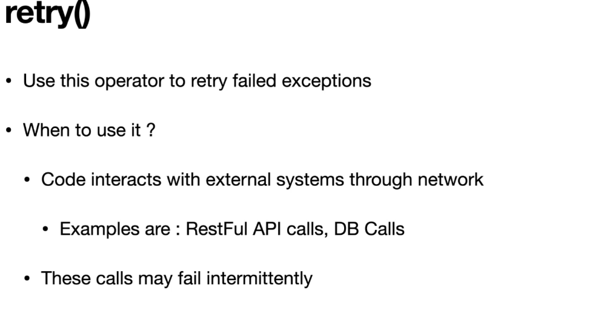
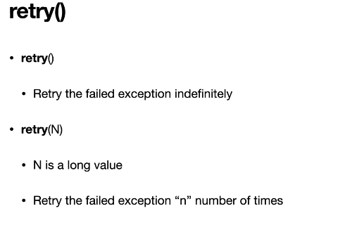
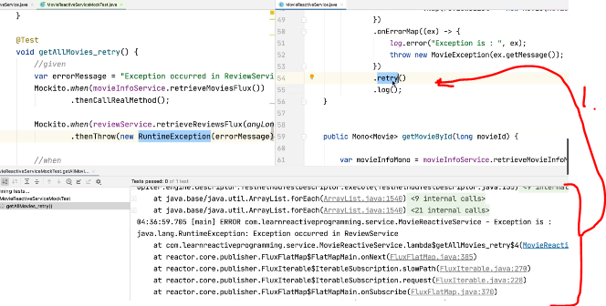
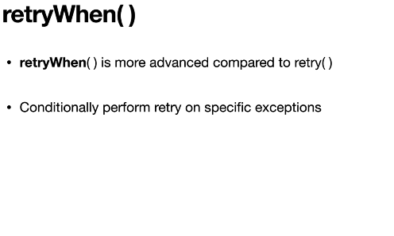
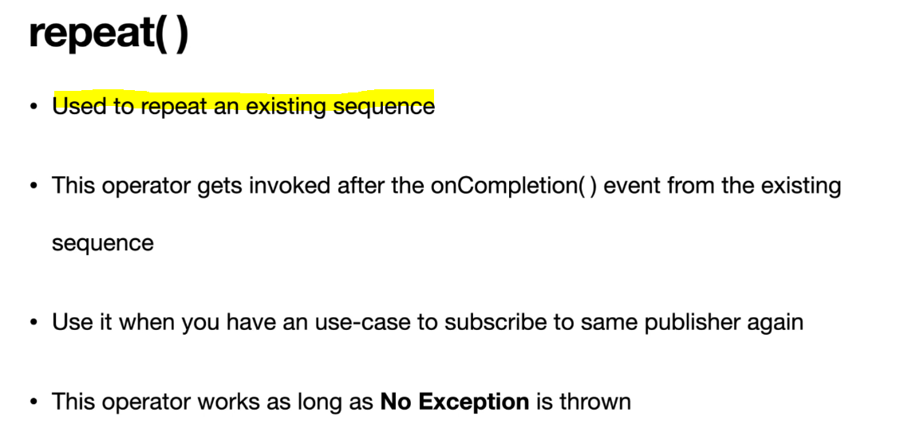
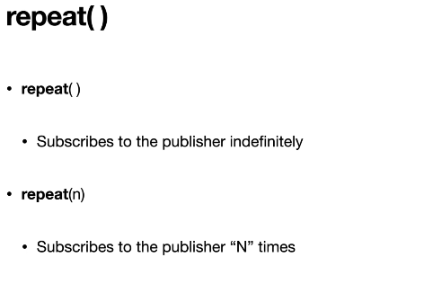

# Section 14: Retry, Repeat using retry(), retryWhen(), repeat(). 

Retry, Repeat using retry(), retryWhen(), repeat().

Its important in **microservice architecture** to recover from intermediate network failures.

# What I Learned

# 46. Retry Exceptions using retry() and retry(n)



- Its common to have application to communicate with external servers.



- Two main ways to retry.

- The Logic:

```

    public Flux<Movie> getAllMovies_retry() {

        var moviesInfoFlux = movieInfoService.retrieveMoviesFlux();
        return moviesInfoFlux
                .flatMap(movieInfo -> {
                    Mono<List<Review>> reviewsMono = reviewService.retrieveReviewsFlux(movieInfo.getMovieInfoId())
                    .collectList();
                    return reviewsMono
                            .map(reviewsList -> new Movie(movieInfo,reviewsList));
                })
                .onErrorMap( (ex) ->{
                	log.error("Expection is : ", ex);
                	throw new MovieException(ex.getMessage());
                })
                .retry()
                .log();
    }
    

```

- The Test:

```
    @Test
    void getAllMovie_retry() {

        //given
    	String errorMessage = "Exception occured in ReviewService";

    	when(movieInfoService.retrieveMoviesFlux()).thenCallRealMethod();
        
		when(reviewService.retrieveReviewsFlux(anyLong())).thenThrow(new RuntimeException(errorMessage));

        //when
        var movieFlux  =  reactiveMovieService.getAllMovies_retry();

        //then
        StepVerifier.create(movieFlux)
                .expectError(RuntimeException.class)
                .verify();

    }
```



1. As you can see the **retry** will try infinitely. 

- We are testing with **4** times.
    - First one is original and **three** last are with retry.

- Logic with **4** times **3+1**.

```
    public Flux<Movie> getAllMovies_retry() {

        var moviesInfoFlux = movieInfoService.retrieveMoviesFlux();
        return moviesInfoFlux
                .flatMap(movieInfo -> {
                    Mono<List<Review>> reviewsMono = reviewService.retrieveReviewsFlux(movieInfo.getMovieInfoId())
                    .collectList();
                    return reviewsMono
                            .map(reviewsList -> new Movie(movieInfo,reviewsList));
                })
                .onErrorMap( (ex) ->{
                	log.error("Expection is : ", ex);
                	throw new MovieException(ex.getMessage());
                })
                .retry(3)
                .log();
    }

```

-  The Test:

```

    @Test
    void getAllMovie_retry() {

        //given
    	String errorMessage = "Exception occured in ReviewService";

    	when(movieInfoService.retrieveMoviesFlux()).thenCallRealMethod();
        
		when(reviewService.retrieveReviewsFlux(anyLong())).thenThrow(new RuntimeException(errorMessage));

        //when
        var movieFlux  =  reactiveMovieService.getAllMovies_retry();

        //then
        StepVerifier.create(movieFlux)
                .expectError(RuntimeException.class)
                .verify();

        verify(reviewService, times(4)).retrieveReviewsFlux(isA(Long.class));
    }

```

# 47. Retry Specific Exceptions using retryWhen()



- We can use **Retry** with backoff `var retryWhen = Retry.backoff(3, Duration.ofMillis(500));`.

- The Logic for `retryWhen`:

```
   public Flux<Movie> getAllMovies_retryWhen() {

    	var retryWhen = Retry.backoff(3, Duration.ofMillis(500));
    	
        var moviesInfoFlux = movieInfoService.retrieveMoviesFlux();
        return moviesInfoFlux
                .flatMap(movieInfo -> {
                    Mono<List<Review>> reviewsMono = reviewService.retrieveReviewsFlux(movieInfo.getMovieInfoId())
                    .collectList();
                    return reviewsMono
                            .map(reviewsList -> new Movie(movieInfo,reviewsList));
                })
                .onErrorMap( (ex) ->{
                	log.error("Expection is : ", ex);
                	throw new MovieException(ex.getMessage());
                })
                .retryWhen(retryWhen)
                .log();
    }
```

- Test with `retryWhen`:

```
    @Test
    void getAllMovie_retryWhen() {

        //given
    	String errorMessage = "Exception occured in ReviewService";

    	when(movieInfoService.retrieveMoviesFlux()).thenCallRealMethod();
        
		when(reviewService.retrieveReviewsFlux(anyLong())).thenThrow(new RuntimeException(errorMessage));

        //when
        var movieFlux  =  reactiveMovieService.getAllMovies_retryWhen();

        //then
        StepVerifier.create(movieFlux)
                .expectError(RuntimeException.class)
                .verify();

        verify(reviewService, times(4)).retrieveReviewsFlux(isA(Long.class));
    }
```

- And with `backoff` and `fixeDelay`.

```
    public Flux<Movie> getAllMovies_retryWhen() {

//    	var retryWhen = Retry.backoff(3, Duration.ofMillis(500));
    	
    	var retryWhen = Retry.fixedDelay(3, Duration.ofMillis(500));
        
    	var moviesInfoFlux = movieInfoService.retrieveMoviesFlux();
        return moviesInfoFlux
                .flatMap(movieInfo -> {
                    Mono<List<Review>> reviewsMono = reviewService.retrieveReviewsFlux(movieInfo.getMovieInfoId())
                    .collectList();
                    return reviewsMono
                            .map(reviewsList -> new Movie(movieInfo,reviewsList));
                })
                .onErrorMap( (ex) ->{
                	log.error("Expection is : ", ex);
                	throw new MovieException(ex.getMessage());
                })
                .retryWhen(retryWhen)
                .log();
    }

```

- We can get `RetryExhaustedException` from service test if we cannot query fast enough.
    -  We can tell to original exception to handle it based on following code.

```
    	var retryWhen = Retry.backoff(3, Duration.ofMillis(500))
    			.onRetryExhaustedThrow((retryBackoffSpec, retrySignal) ->
    			Exceptions.propagate(retrySignal.failure())
```

- The full Test.

```

    public Flux<Movie> getAllMovies_retryWhen() {

    	var retryWhen = Retry.backoff(3, Duration.ofMillis(500))
    			.onRetryExhaustedThrow((retryBackoffSpec, retrySignal) ->
    			Exceptions.propagate(retrySignal.failure())
    					);
    	
//    	var retryWhen = Retry.fixedDelay(3, Duration.ofMillis(500))
        
    	var moviesInfoFlux = movieInfoService.retrieveMoviesFlux();
        return moviesInfoFlux
                .flatMap(movieInfo -> {
                    Mono<List<Review>> reviewsMono = reviewService.retrieveReviewsFlux(movieInfo.getMovieInfoId())
                    .collectList();
                    return reviewsMono
                            .map(reviewsList -> new Movie(movieInfo,reviewsList));
                })
                .onErrorMap( (ex) ->{
                	log.error("Expection is : ", ex);
                	throw new MovieException(ex.getMessage());
                })
                .retryWhen(retryWhen)
                .log();
    }

```

- We can filter based on Exceptions. Meaning we will **re-try** if Exception is `MovieException`.

```
    	var retryWhen = Retry.fixedDelay(3, Duration.ofMillis(500))
    			.filter(ex -> ex instanceof MovieException) // We will try only if Exceptions is MoviesExpection
    			.onRetryExhaustedThrow((retryBackoffSpec, retrySignal) ->
    			Exceptions.propagate(retrySignal.failure())
    					);
    	
```

- Test that retry should happen only once.

```
   @Test
    void getAllMovies_retry_when_1() {

        //given
        var errorMessage = "Exception Occurred in Review Service";
        when(movieInfoService.retrieveMoviesFlux()).thenCallRealMethod();
        when(reviewService.retrieveReviewsFlux(anyLong())).thenThrow(new ServiceException(errorMessage));

        //when
        var movieFlux = reactiveMovieService.getAllMovies_retryWhen().log();

        //then
        StepVerifier.create(movieFlux)
                .expectErrorMessage(errorMessage)
                .verify();

        verify(reviewService, times(1)).retrieveReviewsFlux(isA(Long.class));

    }
```

# 48. Repeat a Sequence using repeat() and repeat(n)



- We have two variance of `repeat()`.




- Test with `repeat()`

```
    @Test
    public void getAllMovies_repeat() {
    	 //given
        var errorMessage = "Exception Occurred in Review Service";
        when(movieInfoService.retrieveMoviesFlux()).thenCallRealMethod();
        when(reviewService.retrieveReviewsFlux(anyLong())).thenCallRealMethod();

        //when
        var movieFlux = reactiveMovieService.getAllMovies_repeat().log();

        //then
        StepVerifier.create(movieFlux)
                .expectNextCount(6)
                .thenCancel()
                .verify();

        verify(reviewService, times(6)).retrieveReviewsFlux(isA(Long.class));

    }
```

- Logic for `repeat()`

```
public Flux<Movie> getAllMovies_repeat() {

    	var retryWhen = Retry.fixedDelay(3, Duration.ofMillis(500))
    			.filter(ex -> ex instanceof MovieException) // We will try only if Exceptions is MoviesExpection
    			.onRetryExhaustedThrow((retryBackoffSpec, retrySignal) ->
    			Exceptions.propagate(retrySignal.failure())
    					);
    	
//    	var retryWhen = Retry.fixedDelay(3, Duration.ofMillis(500))
        
    	var moviesInfoFlux = movieInfoService.retrieveMoviesFlux();
        return moviesInfoFlux
                .flatMap(movieInfo -> {
                    Mono<List<Review>> reviewsMono = reviewService.retrieveReviewsFlux(movieInfo.getMovieInfoId())
                    .collectList();
                    return reviewsMono
                            .map(reviewsList -> new Movie(movieInfo,reviewsList));
                })
                .onErrorMap((ex) -> {
                	log.error("Expection is : ", ex);
                	if (ex instanceof NetworkException) {
                		throw new MovieException(ex.getMessage());
					}
                	else
                		throw new ServiceException(ex.getMessage());
                })
                .repeat()
                .log();
    }
```

- Test with `repeat(n)`.

```
 @Test
    public void getAllMovies_repeat_n() {
    	 //given
        var errorMessage = "Exception Occurred in Review Service";
        when(movieInfoService.retrieveMoviesFlux()).thenCallRealMethod();
        when(reviewService.retrieveReviewsFlux(anyLong())).thenCallRealMethod();

        var noOfTImes = 2L;
        
        //when
        var movieFlux = reactiveMovieService.getAllMovies_repeat_n(noOfTImes).log();

        //then
        StepVerifier.create(movieFlux)
                .expectNextCount(9)
                .expectComplete();

        verify(reviewService, times(6)).retrieveReviewsFlux(isA(Long.class));

    }
```

- Logic for `repeat(n)`

```
 public Flux<Movie> getAllMovies_repeat_n(long n) {

    	var retryWhen = Retry.fixedDelay(3, Duration.ofMillis(500))
    			.filter(ex -> ex instanceof MovieException) // We will try only if Exceptions is MoviesExpection
    			.onRetryExhaustedThrow((retryBackoffSpec, retrySignal) ->
    			Exceptions.propagate(retrySignal.failure())
    					);
    	
//    	var retryWhen = Retry.fixedDelay(3, Duration.ofMillis(500))
        
    	var moviesInfoFlux = movieInfoService.retrieveMoviesFlux();
        return moviesInfoFlux
                .flatMap(movieInfo -> {
                    Mono<List<Review>> reviewsMono = reviewService.retrieveReviewsFlux(movieInfo.getMovieInfoId())
                    .collectList();
                    return reviewsMono
                            .map(reviewsList -> new Movie(movieInfo,reviewsList));
                })
                .onErrorMap((ex) -> {
                	log.error("Expection is : ", ex);
                	if (ex instanceof NetworkException) {
                		throw new MovieException(ex.getMessage());
					}
                	else
                		throw new ServiceException(ex.getMessage());
                })
                .repeat(n)
                .log();
    }
```