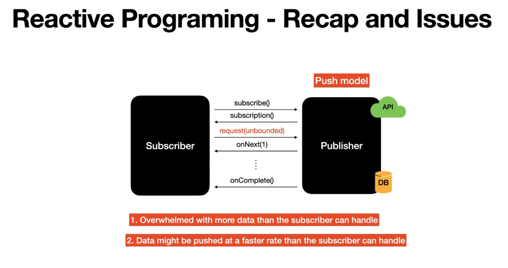
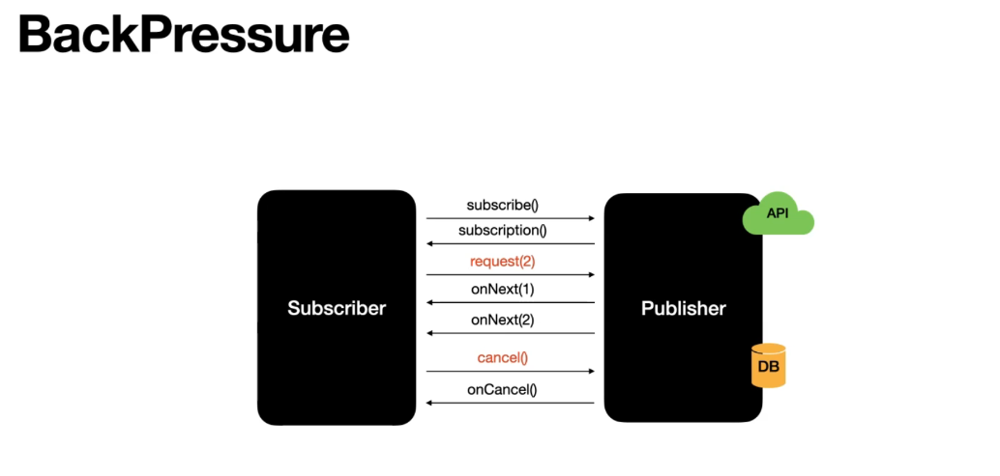

# Section 17: BackPressure.

BackPressure.

# What I Learned

# 53. Introduction to BackPressure



1. Too much data for **Subscriber** to handle.
2. Too fast data is pushed to **Subscriber**.



# 54. Let's implement BackPressure

- Note how flux is asked to give unbounded data `20:16:02.840 [main] INFO  reactor.Flux.Range.1 - | request(unbounded)`.

- Modifying backPressure. Example below:

```
package com.learnreactiveprogramming;

import lombok.extern.slf4j.Slf4j;
import org.junit.jupiter.api.Test;
import org.reactivestreams.Subscription;
import reactor.core.publisher.BaseSubscriber;
import reactor.core.publisher.BufferOverflowStrategy;
import reactor.core.publisher.Flux;
import reactor.core.publisher.SignalType;

import java.util.concurrent.CountDownLatch;
import java.util.concurrent.TimeUnit;

import static com.learnreactiveprogramming.util.CommonUtil.delay;
import static org.junit.jupiter.api.Assertions.assertTrue;

@Slf4j
public class BackpressureTest {

    @Test
    public void testBackPressure() throws Exception {

        var numberRange = Flux.range(1, 100).log();

        numberRange
                .subscribe(new BaseSubscriber<Integer>() {

					@Override
					protected void hookOnSubscribe(Subscription subscription) {
						request(2);
					}

					@Override
					protected void hookOnNext(Integer value) {
						// TODO Auto-generated method stub
//						super.hookOnNext(value);
						log.info("hookOnNext : {}", value);
						
						
						if (value == 2) {
							cancel();
						}
					}

					@Override
					protected void hookOnComplete() {
						// TODO Auto-generated method stub
//						super.hookOnComplete();
					}

					@Override
					protected void hookOnError(Throwable throwable) {
						// TODO Auto-generated method stub
//						super.hookOnError(throwable);
					}

					@Override
					protected void hookOnCancel() {
						// TODO Auto-generated method stub
//						super.hookOnCancel();
						
						log.info("Inside OnCancel");
					}

					@Override
					protected void hookFinally(SignalType type) {
						// TODO Auto-generated method stub
//						super.hookFinally(type);
					}
                	
                	
				});
//                		num -> {
//                	log.info("Number is : {}", num);
//                });
    }
}package com.learnreactiveprogramming;

import lombok.extern.slf4j.Slf4j;
import org.junit.jupiter.api.Test;
import org.reactivestreams.Subscription;
import reactor.core.publisher.BaseSubscriber;
import reactor.core.publisher.BufferOverflowStrategy;
import reactor.core.publisher.Flux;
import reactor.core.publisher.SignalType;

import java.util.concurrent.CountDownLatch;
import java.util.concurrent.TimeUnit;

import static com.learnreactiveprogramming.util.CommonUtil.delay;
import static org.junit.jupiter.api.Assertions.assertTrue;

@Slf4j
public class BackpressureTest {

    @Test
    public void testBackPressure() throws Exception {

        var numberRange = Flux.range(1, 100).log();

        numberRange
                .subscribe(new BaseSubscriber<Integer>() {

					@Override
					protected void hookOnSubscribe(Subscription subscription) {
						request(2);
					}

					@Override
					protected void hookOnNext(Integer value) {
						// TODO Auto-generated method stub
//						super.hookOnNext(value);
						log.info("hookOnNext : {}", value);
						
						
						if (value == 2) {
							cancel();
						}
					}

					@Override
					protected void hookOnComplete() {
						// TODO Auto-generated method stub
//						super.hookOnComplete();
					}

					@Override
					protected void hookOnError(Throwable throwable) {
						// TODO Auto-generated method stub
//						super.hookOnError(throwable);
					}

					@Override
					protected void hookOnCancel() {
						// TODO Auto-generated method stub
//						super.hookOnCancel();
						
						log.info("Inside OnCancel");
					}

					@Override
					protected void hookFinally(SignalType type) {
						// TODO Auto-generated method stub
//						super.hookFinally(type);
					}
                	
                	
				});
//                		num -> {
//                	log.info("Number is : {}", num);
//                });
    }
}

```

 # 55. Write a JUnit test for backPressure

 - We are writing **Junit** for testing **backPressure.**