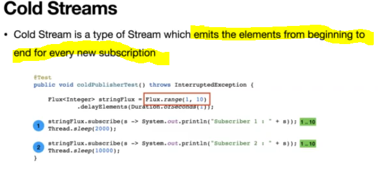
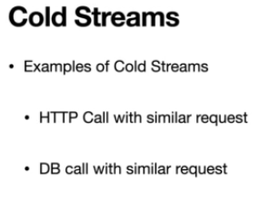
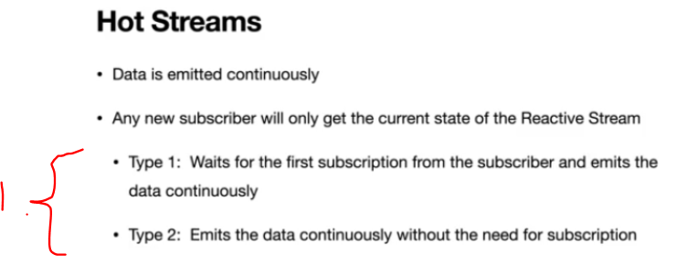

# Section 19: Cold & Hot Streams.

Cold & Hot Streams.

# What I Learned

# 62. Cold & Hot Streams



- We been using **Cold Streams** so far.



<br>



1. There are two types of **Hot Streams**.

# 63. Cold Streams

- Testing **Cold Streams**.
    - Any subscriber get values form beginning to end.

```
    @Test
    public void coldPublisherTest() throws InterruptedException {

        var flux = Flux.range(1, 10);

        flux.subscribe(s -> System.out.println("Subscriber 1 : " + s)); //emits the value from beginning
        flux.subscribe(s -> System.out.println("Subscriber 2 : " + s));//emits the value from beginning
    }
```

# 64. Hot Streams - ConnectableFlux

- Todo