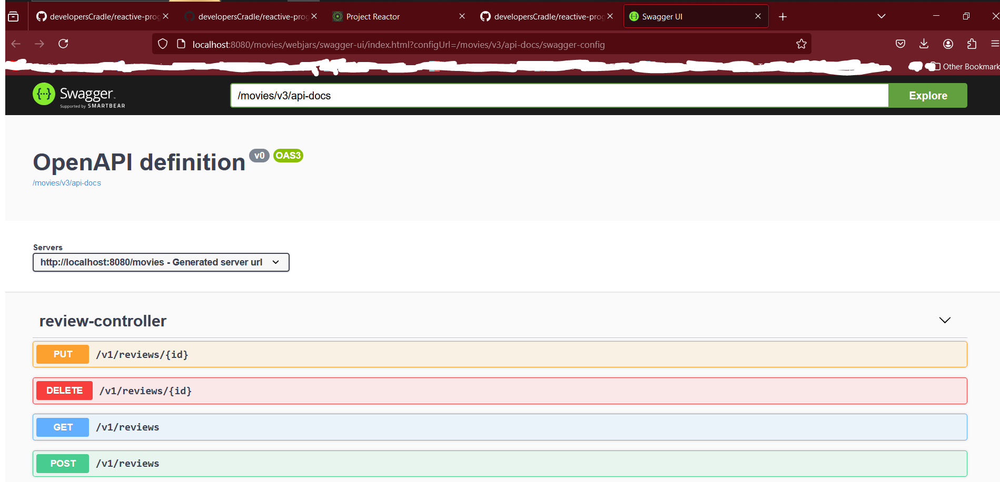
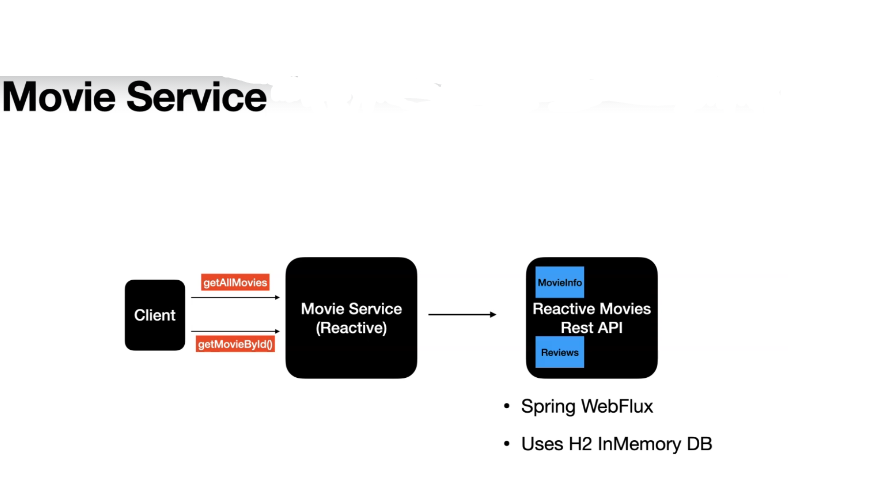
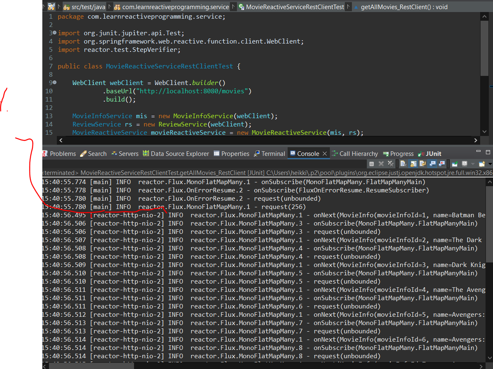

# Section 21: Build NonBlocking RestClient using WebClient

Build NonBlocking RestClient using WebClient.

# What I Learned

# 67. Overview of the Reactive Movie API

- **Swagger** link for documentation. [Swagger Link](http://localhost:8080/movies/swagger-ui.html).

- Movie Service. 

- To run **.jar** file for external API `java -jar reactive-movies-restful-api.jar`.



- **Movie Service** will be following.



# 68. Build the non-blocking MovieInfoService RestClient

- Logic for making the call.

```
    public Flux<MovieInfo> retrieveAllMovieInfo()
    {
    	return client.get().uri("/v1/movie_infos")
    	.retrieve()
    	.bodyToFlux(MovieInfo.class);
    }
```

- We need to have same names, what are returned from API. Its for getting **serialization** and **deserialization** working.

# Unit Test NonBlocking Client using StepVerifier and JUnit.

- The logic for **service**.

```
public class MovieInfoService {

    private WebClient webClient;

    public MovieInfoService(WebClient webClient) {
        this.webClient = webClient;
    }

    public MovieInfoService() {
    }

    public Flux<MovieInfo> retrieveAllMovieInfo_RestClient(){

        return webClient.get().uri("/v1/movie_infos")
                .retrieve()
                .bodyToFlux(MovieInfo.class)
                .log();
    }
}    
```

- Test to test external API with **WebClient**.

```
    WebClient webClient = WebClient.builder()
	            .baseUrl("http://localhost:8080/movies")
	            .build();

	    MovieInfoService movieInfoService
	            =new MovieInfoService(webClient);

	    @Test
	    void retrieveAllMovieInfo_RestClient() {
	        //given

	        //when
	        var movieInfoFlux = movieInfoService.retrieveAllMovieInfo_RestClient();

	        //then
	        StepVerifier.create(movieInfoFlux)
	                .expectNextCount(7)
	                .verifyComplete();
	    }
	    
```

# 70. Build the non-blocking MovieInfoService RestClient - getMovieInfoById

- Logic for this.

```
    public Mono<MovieInfo> retrieveAllMovieInfo_RestClient(Long movieInfoId){

        return webClient.get().uri("/v1/movie_infos/{id}", movieInfoId)
                .retrieve()
                .bodyToMono(MovieInfo.class)
                .log();
    }
    
```

- Test for this.

```
	    @Test
	    void retrieveMovieInfo_WithId_RestClient() {
	        
	    	//Given
	    	Long movieId = 1L;
	    	
	        //When
	        var movieInfoFlux = movieInfoService.retrieveAllMovieInfo_RestClient(movieId);

	        //Then
	        StepVerifier.create(movieInfoFlux)
	                .expectNextCount(1)
	                .verifyComplete();
	    }
```

# Assignment 9: Write a test case for retrieveMovieInfoById_RestClient function

- My answer:

```
	    @Test
	    void retrieveMovieInfo_WithId_RestClient() {
	        
	    	//Given
	    	Long movieId = 1L;
	    	
	        //When
	        var movieInfoFlux = movieInfoService.retrieveAllMovieInfo_RestClient(movieId);

	        //Then
	        StepVerifier.create(movieInfoFlux)
	                .expectNextCount(1)
	                .verifyComplete();
	    }
```

- Teacher answers:

```
@Test
    void retrieveMovieInfoById_RestClient() {

        //given
        Long movieInfoId = 1L;

        //when
        var movieInfoFlux = movieInfoService.retrieveMovieInfoById_RestClient(movieInfoId);

        //then
        StepVerifier.create(movieInfoFlux)
                //.expectNextCount(7)
                .assertNext( movieInfo ->
                        assertEquals("Batman Begins", movieInfo.getName())

                )
                .verifyComplete();
    }
```

# 71. Build the non-blocking Review RestClient


- When dealing with **Query Parameter**, we are using Springs **UriComponentsBuilder**.

```
   public Flux<Review> retrieveReviewsFlux_RestClient(long movieInfoId)
    {
    	//When dealing with query param, we are using Springs UriComponentsBuilder.
    	
    	var uri = UriComponentsBuilder.fromUriString("/v1/reviews")
    	.queryParam("movieInfoId", movieInfoId)
    	.buildAndExpand()
    	.toUriString();
    	
    	return webClient.get().uri(uri)
    			.retrieve()
    			.bodyToFlux(Review.class).log();
    }
```

# Assignment 10: Write a test case for retrieveReviewsFlux_RestClient function

- Test.

```
	    @Test
	    void retrieveReviewsFlux_RestClient() {
		        
		    	//Given
		    	Long movieInfoId = 1L;
		    	
		        //When
		        var reviewsFlux = reviewService.retrieveReviewsFlux_RestClient(movieInfoId);

		        //Then
		        StepVerifier.create(reviewsFlux)
		                .assertNext(reviews -> {
		                	assertEquals("Nolan is the real superhero", reviews.getComment());
		                })
		                .expectNextCount(0)
		                .verifyComplete();
		}

```

- Teacher answer:

```
class ReviewServiceTest {

    WebClient webClient = WebClient.builder()
            .baseUrl("http://localhost:8080/movies")
            .build();

    ReviewService reviewService= new ReviewService(webClient);

 
    @Test
    void retrieveReviewsFlux_RestClient() {
        //given
        Long reviewId = 1L;

        //when
        var reviewsFlux = reviewService.retrieveReviewsFlux_RestClient(reviewId);

        //then
        StepVerifier.create(reviewsFlux)
                .assertNext(review -> {
                    assertEquals("Nolan is the real superhero", review.getComment());
                })
                .verifyComplete();
    }
}
```

# 72. Build getAllMovies non-blocking MovieReactiveService Client



1. As you can see, Reactor calls are non blocking. You can see, as soon as call is made to backend. Call is getting own **thread**.

- Test reactive service non-blocking for **REST** client. 

```
package com.learnreactiveprogramming.service;

import org.junit.jupiter.api.Test;
import org.springframework.web.reactive.function.client.WebClient;
import reactor.test.StepVerifier;

public class MovieReactiveServiceRestClientTest {

    WebClient webClient = WebClient.builder()
            .baseUrl("http://localhost:8080/movies")
            .build();
    
    MovieInfoService mis = new MovieInfoService(webClient);
    ReviewService rs = new ReviewService(webClient);
    MovieReactiveService movieReactiveService = new MovieReactiveService(mis, rs);

    @Test
    void getAllMovies_RestClient() {
        //given

        //when
        var moviesFlux = movieReactiveService.getAllMovies_restClient();

        //then
        StepVerifier.create(moviesFlux)
                .expectNextCount(7)
                .verifyComplete();
    }
}
```

- The logic for querying actual data.

```
/*
     * These functions returns actual data.
     */
    public Flux<Movie> getAllMovies_restClient() {
		
        var moviesInfoFlux = movieInfoService.retrieveAllMovieInfo_RestClient();
        return moviesInfoFlux
                .flatMap(movieInfo -> {
                    Mono<List<Review>> reviewsMono = reviewService.retrieveReviewsFlux_RestClient(movieInfo.getMovieInfoId())
                    .collectList();
                    return reviewsMono
                            .map(reviewsList -> new Movie(movieInfo,reviewsList));
                })
                .onErrorMap( (ex) ->{
                	log.error("Expection is : ", ex);
                	throw new MovieException(ex.getMessage());
                })
                .log();
    }
```

# 73. Build getMovieById non-blocking MovieReactiveService Client

- Test logic:

```
 @Test
    void getMovieById_RestClient() {

        //given
        var movieInfoId = 1 ;

        //when
        var movieMono = movieReactiveService.getMovieById_RestClient(movieInfoId);

        //then
        StepVerifier.create(movieMono)
                .assertNext(movie -> {
                    assertEquals("Batman Begins", movie.getMovieInfo().getName());
                    assertEquals(movie.getReviewList().size(), 1);
                    //assertNotNull(movie.getRevenue());
                })
                .verifyComplete();
    }
```

- The Logic:

```
    public Mono<Movie> getMovieById_RestClient(long movieId)
    {
    	var movieInfoMono = movieInfoService.retrieveMovieInfoById_RestClient(movieId);
    	var reviewsFlux = reviewService.retrieveReviewsFlux_RestClient(movieId)
    			.collectList();
    	
    	return movieInfoMono.zipWith(reviewsFlux, (movieInfo, reviews) -> new Movie(movieInfo, reviews)).log();
    }
```