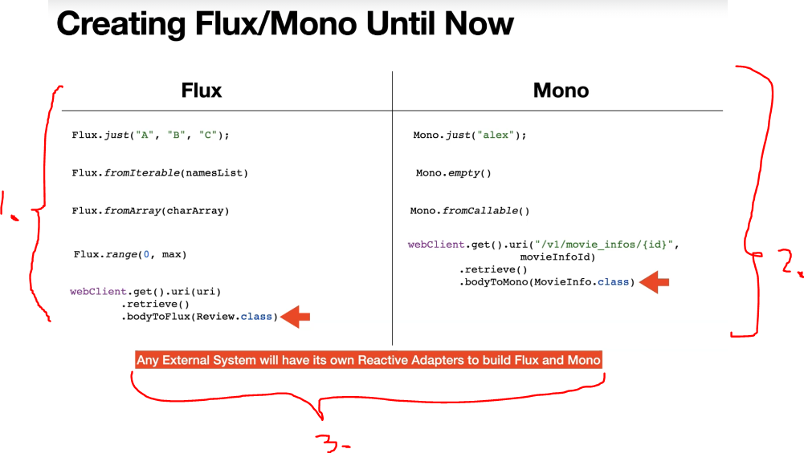
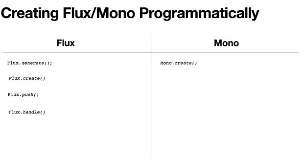

# Section 22: Programmatically Creating a Flux/Mono

Programmatically Creating a Flux/Mono

# What I Learned

# 74. Different options of Creating Flux/Mono

1. Operations to create a **Flux**.
2. Operations to create a **Mono**.
3. **Flux** and **Mono** are created out of the data that have been supplied to them. Like in example, **Flux** and **Mono** has their own adapters to create **Flux** and  **Mono**.

- These are advanced operators.
    - With making these by hand, means we need to emit `OnNext`, `OnComplete` and `OnError` events **from our code**.

- Reference for creating **Flux and Mono** programmatically. [Reference](https://projectreactor.io/docs/core/release/reference/#producing)

- These are not very popular, but good to know.