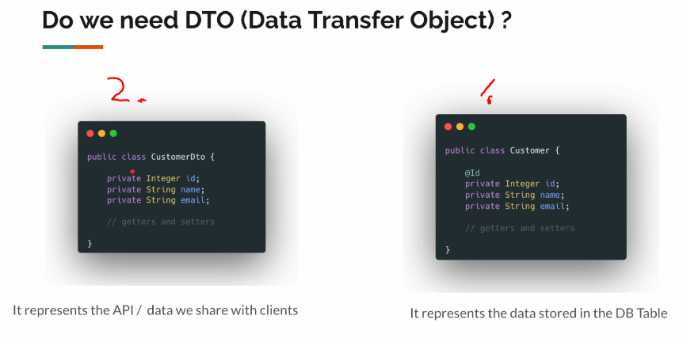
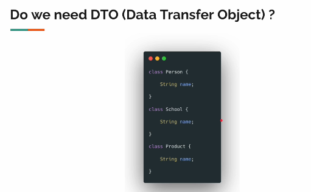
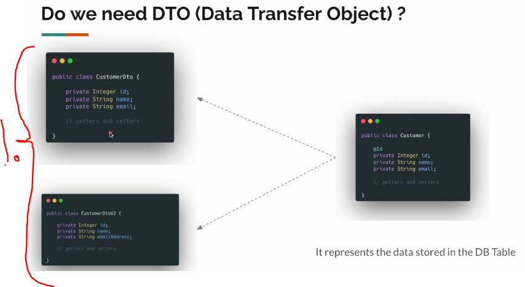
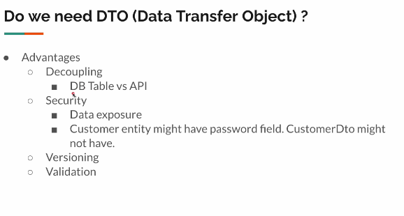

# Section 05: Reactive CRUD APIs.

Reactive CRUD APIs.

# What I learned.

# FAQ - Do We Need DTOs?

1. **Entity**. They represent database table. 
2. **DTO**. API/data we share with the clients.

- These can look the same as Entity. They look duplicate!

- So question is not about reusability. If we `name` for different classes, they still represent something different.

1. We can have two versions of **DTO** for different versions of API!

- So in not question of usability.

- Some kind of Advantages of different **DTO**.

# DTO / Entity / Repository.