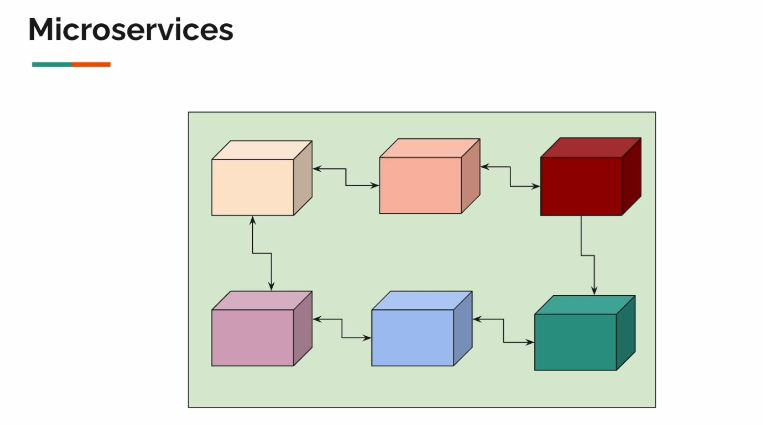
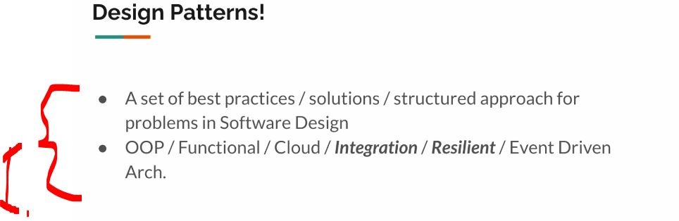
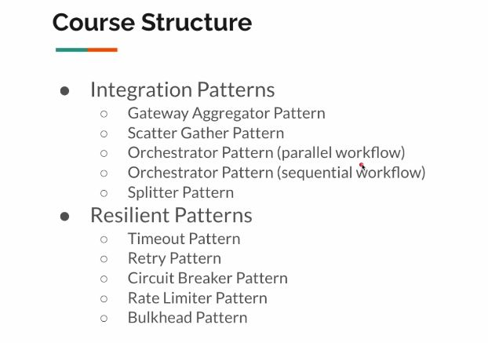

# Section 01: Welcome: Why Master Advanced Microservices Patterns.

Welcome: Why Master Advanced Microservices Patterns.

# What I Learned.

- We are running the project `java -jar external-services-v2.jar`!

    

    

- We need these to make robust integrations! 

    

1. These are needed to **solve common problems**!

    

1. This will cover: **10 Patterns** in common!