# Section 02: API Composition: Gateway Aggregator Pattern. 

Section 02: API Composition: Gateway Aggregator Pattern. 

# What I Learned.

# Resource.

- URL for the [repo](https://github.com/vinsguru/webflux-patterns).

# Gateway Aggregator Pattern - Intro.

<div align="center">
    
</div>

1. Let's see **Gateway Aggregator Pattern**!

<div align="center">
    
</div>

1. These are called **separately**!
2. Problems in this approach is:
    - Browser needs to make multiple call! In point `3.`!
        - Browsers has **limits** to call simultaneity!
    - There can be situation where, **client** is EU, **servers** in **USA**!
    - When we update the new service, this needs to be updated to everywhere!

<div align="center">
    
</div>

1. Front end calls the **aggregator microservice** and its **responsibility is to call** and **collect all** the **upstream services**! 
    - From **client** perspective is just **one call**!

<div align="center">
    
</div>

1. In this product, there is multiple part where to retrieve the details!

# Jar Download.

- **Jar** to download: [.jar](https://vins-udemy.s3.amazonaws.com/webflux-design-patterns/external-services-v2.jar)!
    - From local [repo](https://github.com/developersCradle/reactive-programming/blob/main/Spring%20WebFlux%20Microservices%20Patterns%20and%20Advanced%20Resilience/Section%2002/external-services-v2.jar)!

# External Services.

- We can access the **Swagger**: `http://localhost:7070/swagger-ui/`!
    - We can use this for this in project!

- This chapter we will be working on the following endpoints:

<div align="center">
    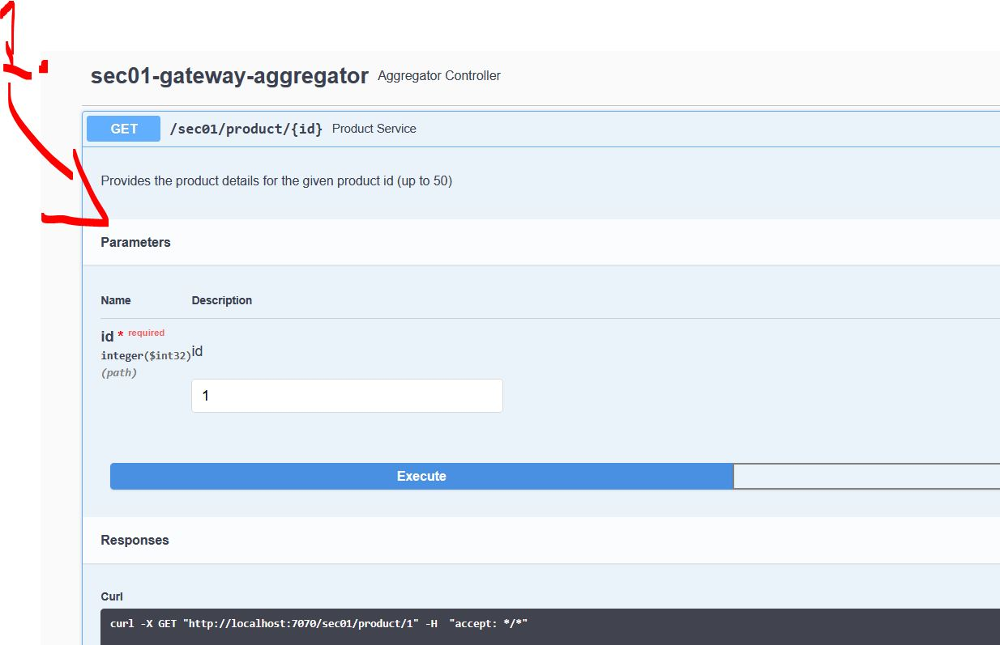
</div>

1. This endpoint has the following characteristics: `Provides the product details for the given product id (up to 50)`!

<div align="center">
    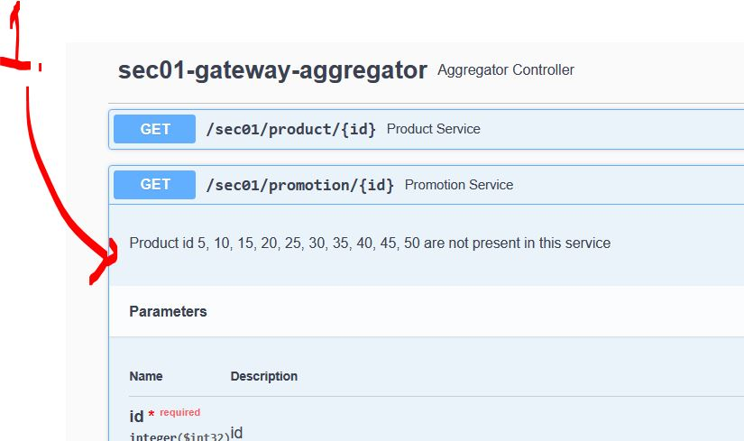
</div>

1. This endpoint has the following characteristics: `Product id 5, 10, 15, 20, 25, 30, 35, 40, 45, 50 are not present in this service`!

<div align="center">
    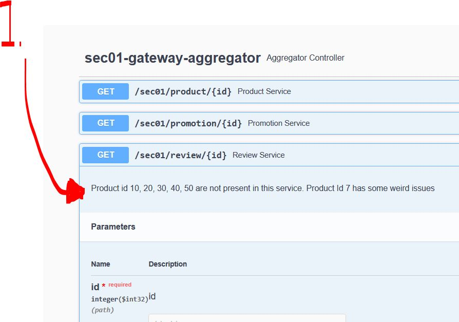
</div>

1. This endpoint has the following characteristics: `Product id 10, 20, 30, 40, 50 are not present in this service. Product Id 7 has some weird issues`!

<div align="center">
    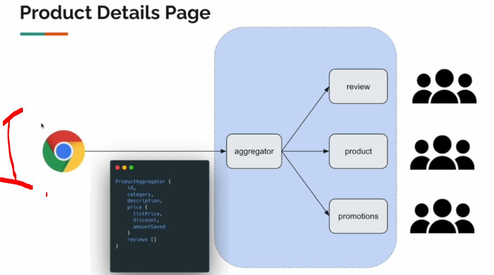
</div>

1. We will be developing this service!

# Project Setup.

- We will have `webflux-patterns` following project!
    - Every chapter will have own chapter!

# Creating DTO.

- DTO are created:

````Java
package com.vinsguru.webfluxpatterns.sec01.dto;

import lombok.Data;
import lombok.ToString;

import java.time.LocalDate;

@Data
@ToString
public class Price {
    private Integer listPrice;
    private Double discount;
    private Double discountedPrice;
    private Double amountSaved;
    private LocalDate endDate;
}
````

````Java
package com.vinsguru.webfluxpatterns.sec01.dto;

import lombok.AllArgsConstructor;
import lombok.Data;
import lombok.NoArgsConstructor;
import lombok.ToString;

import java.util.List;

@Data
@ToString
@NoArgsConstructor
@AllArgsConstructor(staticName = "create")
public class ProductAggregate {
    private Integer id;
    private String category;
    private String description;
    private Price price;
    private List<Review> reviews;
}
````
````Java
package com.vinsguru.webfluxpatterns.sec01.dto;

import lombok.Data;
import lombok.ToString;

@Data
@ToString
public class ProductResponse {
    private Integer id;
    private String category;
    private String description;
    private Integer price;
}
````
````Java
package com.vinsguru.webfluxpatterns.sec01.dto;

import lombok.AllArgsConstructor;
import lombok.Data;
import lombok.NoArgsConstructor;
import lombok.ToString;

import java.time.LocalDate;

@Data
@ToString
@NoArgsConstructor
@AllArgsConstructor(staticName = "create")
public class PromotionResponse {
    private Integer id;
    private String type;
    private Double discount;
    private LocalDate endDate;
}
````

````Java
package com.vinsguru.webfluxpatterns.sec01.dto;

import lombok.Data;
import lombok.ToString;

@Data
@ToString
public class Review {
    private Integer id;
    private String user;
    private Integer rating;
    private String comment;
}
````

# Creating External Service Clients.

- Here we create the clients:

````Java
package com.vinsguru.webfluxpatterns.sec01.client;

import com.vinsguru.webfluxpatterns.sec01.dto.ProductResponse;
import org.springframework.beans.factory.annotation.Value;
import org.springframework.stereotype.Service;
import org.springframework.web.reactive.function.client.WebClient;
import reactor.core.publisher.Mono;

@Service
public class ProductClient {

    private final WebClient client;

    public ProductClient(@Value("${sec01.product.service}") String baseUrl){
        this.client = WebClient.builder()
                               .baseUrl(baseUrl)
                               .build();
    }

    public Mono<ProductResponse> getProduct(Integer id){
        return this.client
                .get()
                .uri("{id}", id)
                .retrieve()
                .bodyToMono(ProductResponse.class)
                .onErrorResume(ex -> Mono.empty());
    }
}
````

<br>

````Java
package com.vinsguru.webfluxpatterns.sec01.client;

import com.vinsguru.webfluxpatterns.sec01.dto.PromotionResponse;
import org.springframework.beans.factory.annotation.Value;
import org.springframework.stereotype.Service;
import org.springframework.web.reactive.function.client.WebClient;
import reactor.core.publisher.Mono;

import java.time.LocalDate;

@Service
public class PromotionClient {

    private final PromotionResponse noPromotion = PromotionResponse.create(-1, "no promotion", 0.0, LocalDate.now());
    private final WebClient client;

    public PromotionClient(@Value("${sec01.promotion.service}") String baseUrl){
        this.client = WebClient.builder()
                               .baseUrl(baseUrl)
                               .build();
    }

    public Mono<PromotionResponse> getPromotion(Integer id){
        return this.client
                .get()
                .uri("{id}", id)
                .retrieve()
                .bodyToMono(PromotionResponse.class)
                .onErrorReturn(noPromotion);
    }
}
````

<br>

````Java
package com.vinsguru.webfluxpatterns.sec01.client;

import com.vinsguru.webfluxpatterns.sec01.dto.Review;
import org.springframework.beans.factory.annotation.Value;
import org.springframework.stereotype.Service;
import org.springframework.web.reactive.function.client.WebClient;
import reactor.core.publisher.Mono;

import java.util.Collections;
import java.util.List;

@Service
public class ReviewClient {

    private final WebClient client;

    public ReviewClient(@Value("${sec01.review.service}") String baseUrl){
        this.client = WebClient.builder()
                               .baseUrl(baseUrl)
                               .build();
    }

    public Mono<List<Review>> getReviews(Integer id){
        return this.client
                .get()
                .uri("{id}", id)
                .retrieve()
                .bodyToFlux(Review.class)
                .collectList()
                .onErrorReturn(Collections.emptyList());
    }
}
````

- Remember what did the `revivew` endpoint **returned**!

<div align="center">
    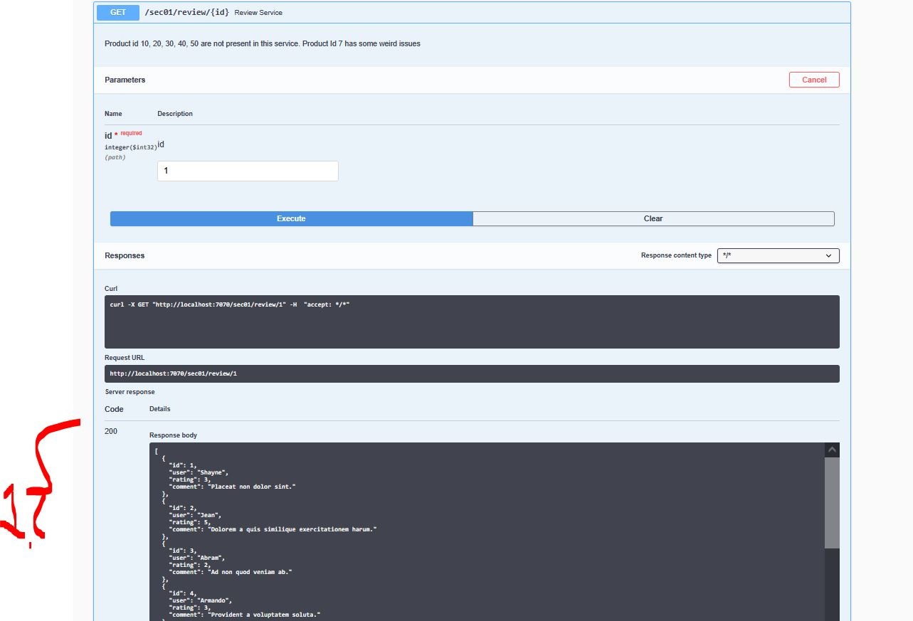
</div>

1. We can see that, there are **multiple responses**! 

- We can make this also use following in **Mono**:

````Java

    public Mono<Review> getReviews(Integer id){
        return this.client
                .get()
                .uri("{id}", id)
                .retrieve()
                .bodyToMono(Review.class);
//                .collectList()
//                .onErrorReturn(Collections.emptyList());
    }
````

- Or we can use `Mono<List<Review>>` with the `.collectList();`:

````Java
    public Mono<List<Review>> getReviews(Integer id){
        return this.client
                .get()
                .uri("{id}", id)
                .retrieve()
                .bodyToFlux(Review.class)
                .collectList();
    }
````

# Aggregator Service.

<div align="center">
    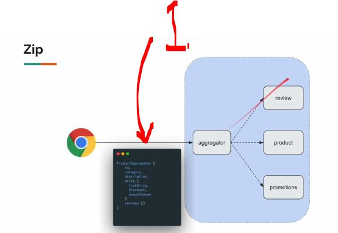
</div>

- We need to **collect DTO** with the **aggregator**, with `.zip(...)`
    - **.zip**, will call these services parallel!

````Java
package com.vinsguru.webfluxpatterns.sec01.service;

import com.vinsguru.webfluxpatterns.sec01.client.ProductClient;
import com.vinsguru.webfluxpatterns.sec01.client.PromotionClient;
import com.vinsguru.webfluxpatterns.sec01.client.ReviewClient;
import com.vinsguru.webfluxpatterns.sec01.dto.*;
import org.springframework.beans.factory.annotation.Autowired;
import org.springframework.stereotype.Service;
import reactor.core.publisher.Mono;

import java.util.List;

@Service
public class ProductAggregatorService {

    @Autowired
    private ProductClient productClient;

    @Autowired
    private PromotionClient promotionClient;

    @Autowired
    private ReviewClient reviewClient;

    // Here we aggregate info!
    public Mono<ProductAggregate> aggregate(Integer id){
        return Mono.zip(
               this.productClient.getProduct(id),
               this.promotionClient.getPromotion(id),
               this.reviewClient.getReviews(id)
        )
        .map(t -> toDto(t.getT1(), t.getT2(), t.getT3()));
    }

    private ProductAggregate toDto(ProductResponse product, PromotionResponse promotion, List<Review> reviews){
        var price = new Price();
        var amountSaved = product.getPrice() * promotion.getDiscount() / 100;
        var discountedPrice = product.getPrice() - amountSaved;
        price.setListPrice(product.getPrice());
        price.setAmountSaved(amountSaved);
        price.setDiscountedPrice(discountedPrice);
        price.setDiscount(promotion.getDiscount());
        price.setEndDate(promotion.getEndDate());
        return ProductAggregate.create(
                product.getId(),
                product.getCategory(),
                product.getDescription(),
                price,
                reviews
        );
    }
}
````

# Aggregator Controller.

````Java
package com.vinsguru.webfluxpatterns.sec01.controller;

import com.vinsguru.webfluxpatterns.sec01.dto.ProductAggregate;
import com.vinsguru.webfluxpatterns.sec01.service.ProductAggregatorService;
import org.springframework.beans.factory.annotation.Autowired;
import org.springframework.http.ResponseEntity;
import org.springframework.web.bind.annotation.GetMapping;
import org.springframework.web.bind.annotation.PathVariable;
import org.springframework.web.bind.annotation.RequestMapping;
import org.springframework.web.bind.annotation.RestController;
import reactor.core.publisher.Mono;

@RestController
@RequestMapping("sec01")
public class ProductAggregateController {

    @Autowired
    private ProductAggregatorService service;

    @GetMapping("product/{id}")
    public Mono<ResponseEntity<ProductAggregate>> getProductAggregate(@PathVariable Integer id){
        return this.service.aggregate(id)
                .map(ResponseEntity::ok)
                .defaultIfEmpty(ResponseEntity.notFound().build());
    }
}
````

- `.map(ResponseEntity::ok)`
    - Take the value inside the Mono and wrap it in an **HTTP 200 OK** response.

- `.defaultIfEmpty(ResponseEntity.notFound().build());`
    - If the **product** is not found, return empty! 

# Gateway Aggregator Pattern Demo.

- Our aggregator working!

<div align="center">
    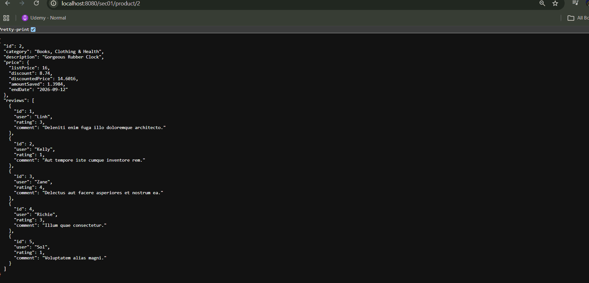
</div>

- Next we will see that, when the **downstream service** is **not working**!

<div align="center">
    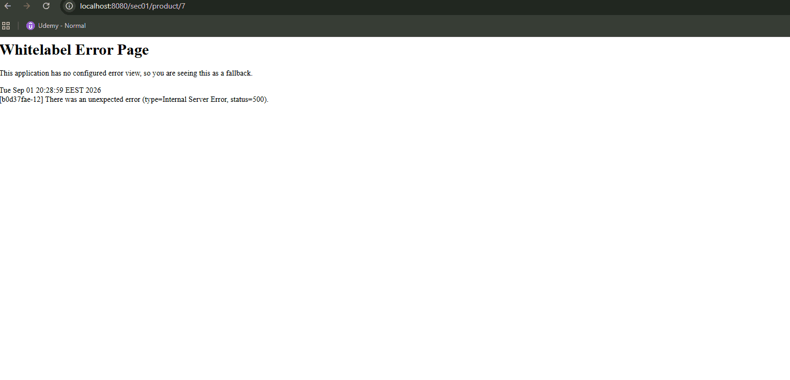
</div>

- We are seeing our **aggregator service** failing when calling `/sec01/product/7`.

````Bash
2026-09-01T20:28:59.951+03:00 ERROR 14064 --- [ctor-http-nio-3] a.w.r.e.AbstractErrorWebExceptionHandler : [b0d37fae-12]  500 Server Error for HTTP GET "/sec01/product/7"

org.springframework.web.reactive.function.client.WebClientResponseException$InternalServerError: 500 Internal Server Error from GET http://localhost:7070/sec01/review/7
	at org.springframework.web.reactive.function.client.WebClientResponseException.create(WebClientResponseException.java:332) ~[spring-webflux-6.2.7.jar:6.2.7]
	Suppressed: reactor.core.publisher.FluxOnAssembly$OnAssemblyException: 
Error has been observed at the following site(s):
	*__checkpoint ⇢ 500 INTERNAL_SERVER_ERROR from GET http://localhost:7070/sec01/review/7 [DefaultWebClient]
	*__checkpoint ⇢ Handler com.vinsguru.webfluxpatterns.sec01.controller.ProductAggregateController#getProductAggregate(Integer) [DispatcherHandler]
	*__checkpoint ⇢ HTTP GET "/sec01/product/7" [ExceptionHandlingWebHandler]
Original Stack Trace:
		at org.springframework.web.reactive.function.client.WebClientResponseException.create(WebClientResponseException.java:332) ~[spring-webflux-6.2.7.jar:6.2.7]
		at org.springframework.web.reactive.function.client.DefaultClientResponse.lambda$createException$1(DefaultClientResponse.java:214) ~[spring-webflux-6.2.7.jar:6.2.7]
		at reactor.core.publisher.FluxMap$MapSubscriber.onNext(FluxMap.java:106) ~[reactor-core-3.7.6.jar:3.7.6]
		at reactor.core.publisher.FluxOnErrorReturn$ReturnSubscriber.onNext(FluxOnErrorReturn.java:162) ~[reactor-core-3.7.6.jar:3.7.6]
		at reactor.core.publisher.FluxDefaultIfEmpty$DefaultIfEmptySubscriber.onNext(FluxDefaultIfEmpty.java:122) ~[reactor-core-3.7.6.jar:3.7.6]
		at reactor.core.publisher.FluxMapFuseable$MapFuseableSubscriber.onNext(FluxMapFuseable.java:129) ~[reactor-core-3.7.6.jar:3.7.6]
		at reactor.core.publisher.FluxContextWrite$ContextWriteSubscriber.onNext(FluxContextWrite.java:107) ~[reactor-core-3.7.6.jar:3.7.6]
		at reactor.core.publisher.FluxMapFuseable$MapFuseableConditionalSubscriber.onNext(FluxMapFuseable.java:299) ~[reactor-core-3.7.6.jar:3.7.6]
		at reactor.core.publisher.FluxFilterFuseable$FilterFuseableConditionalSubscriber.onNext(FluxFilterFuseable.java:337) ~[reactor-core-3.7.6.jar:3.7.6]
		at reactor.core.publisher.Operators$BaseFluxToMonoOperator.completePossiblyEmpty(Operators.java:2096) ~[reactor-core-3.7.6.jar:3.7.6]
		at reactor.core.publisher.MonoCollect$CollectSubscriber.onComplete(MonoCollect.java:145) ~[reactor-core-3.7.6.jar:3.7.6]
		at reactor.core.publisher.FluxMap$MapSubscriber.onComplete(FluxMap.java:144) ~[reactor-core-3.7.6.jar:3.7.6]
		at reactor.core.publisher.FluxPeek$PeekSubscriber.onComplete(FluxPeek.java:260) ~[reactor-core-3.7.6.jar:3.7.6]
		at reactor.core.publisher.FluxMap$MapSubscriber.onComplete(FluxMap.java:144) ~[reactor-core-3.7.6.jar:3.7.6]
		at reactor.netty.channel.FluxReceive.onInboundComplete(FluxReceive.java:413) ~[reactor-netty-core-1.2.6.jar:1.2.6]
		at reactor.netty.channel.ChannelOperations.onInboundComplete(ChannelOperations.java:455) ~[reactor-netty-core-1.2.6.jar:1.2.6]
		at reactor.netty.channel.ChannelOperations.terminate(ChannelOperations.java:509) ~[reactor-netty-core-1.2.6.jar:1.2.6]
		at reactor.netty.http.client.HttpClientOperations.onInboundNext(HttpClientOperations.java:821) ~[reactor-netty-http-1.2.6.jar:1.2.6]
		at reactor.netty.channel.ChannelOperationsHandler.channelRead(ChannelOperationsHandler.java:115) ~[reactor-netty-core-1.2.6.jar:1.2.6]
		at io.netty.channel.AbstractChannelHandlerContext.invokeChannelRead(AbstractChannelHandlerContext.java:444) ~[netty-transport-4.1.121.Final.jar:4.1.121.Final]
		at io.netty.channel.AbstractChannelHandlerContext.invokeChannelRead(AbstractChannelHandlerContext.java:420) ~[netty-transport-4.1.121.Final.jar:4.1.121.Final]
		at io.netty.channel.AbstractChannelHandlerContext.fireChannelRead(AbstractChannelHandlerContext.java:412) ~[netty-transport-4.1.121.Final.jar:4.1.121.Final]
		at io.netty.handler.codec.MessageToMessageDecoder.channelRead(MessageToMessageDecoder.java:107) ~[netty-codec-4.1.121.Final.jar:4.1.121.Final]
		at io.netty.channel.AbstractChannelHandlerContext.invokeChannelRead(AbstractChannelHandlerContext.java:444) ~[netty-transport-4.1.121.Final.jar:4.1.121.Final]
		at io.netty.channel.AbstractChannelHandlerContext.invokeChannelRead(AbstractChannelHandlerContext.java:420) ~[netty-transport-4.1.121.Final.jar:4.1.121.Final]
		at io.netty.channel.AbstractChannelHandlerContext.fireChannelRead(AbstractChannelHandlerContext.java:412) ~[netty-transport-4.1.121.Final.jar:4.1.121.Final]
		at io.netty.channel.CombinedChannelDuplexHandler$DelegatingChannelHandlerContext.fireChannelRead(CombinedChannelDuplexHandler.java:436) ~[netty-transport-4.1.121.Final.jar:4.1.121.Final]
		at io.netty.handler.codec.ByteToMessageDecoder.fireChannelRead(ByteToMessageDecoder.java:346) ~[netty-codec-4.1.121.Final.jar:4.1.121.Final]
		at io.netty.handler.codec.ByteToMessageDecoder.channelRead(ByteToMessageDecoder.java:318) ~[netty-codec-4.1.121.Final.jar:4.1.121.Final]
		at io.netty.channel.CombinedChannelDuplexHandler.channelRead(CombinedChannelDuplexHandler.java:251) ~[netty-transport-4.1.121.Final.jar:4.1.121.Final]
		at io.netty.channel.AbstractChannelHandlerContext.invokeChannelRead(AbstractChannelHandlerContext.java:442) ~[netty-transport-4.1.121.Final.jar:4.1.121.Final]
		at io.netty.channel.AbstractChannelHandlerContext.invokeChannelRead(AbstractChannelHandlerContext.java:420) ~[netty-transport-4.1.121.Final.jar:4.1.121.Final]
		at io.netty.channel.AbstractChannelHandlerContext.fireChannelRead(AbstractChannelHandlerContext.java:412) ~[netty-transport-4.1.121.Final.jar:4.1.121.Final]
		at io.netty.channel.DefaultChannelPipeline$HeadContext.channelRead(DefaultChannelPipeline.java:1357) ~[netty-transport-4.1.121.Final.jar:4.1.121.Final]
		at io.netty.channel.AbstractChannelHandlerContext.invokeChannelRead(AbstractChannelHandlerContext.java:440) ~[netty-transport-4.1.121.Final.jar:4.1.121.Final]
		at io.netty.channel.AbstractChannelHandlerContext.invokeChannelRead(AbstractChannelHandlerContext.java:420) ~[netty-transport-4.1.121.Final.jar:4.1.121.Final]
		at io.netty.channel.DefaultChannelPipeline.fireChannelRead(DefaultChannelPipeline.java:868) ~[netty-transport-4.1.121.Final.jar:4.1.121.Final]
		at io.netty.channel.nio.AbstractNioByteChannel$NioByteUnsafe.read(AbstractNioByteChannel.java:166) ~[netty-transport-4.1.121.Final.jar:4.1.121.Final]
		at io.netty.channel.nio.NioEventLoop.processSelectedKey(NioEventLoop.java:796) ~[netty-transport-4.1.121.Final.jar:4.1.121.Final]
		at io.netty.channel.nio.NioEventLoop.processSelectedKeysOptimized(NioEventLoop.java:732) ~[netty-transport-4.1.121.Final.jar:4.1.121.Final]
		at io.netty.channel.nio.NioEventLoop.processSelectedKeys(NioEventLoop.java:658) ~[netty-transport-4.1.121.Final.jar:4.1.121.Final]
		at io.netty.channel.nio.NioEventLoop.run(NioEventLoop.java:562) ~[netty-transport-4.1.121.Final.jar:4.1.121.Final]
		at io.netty.util.concurrent.SingleThreadEventExecutor$4.run(SingleThreadEventExecutor.java:998) ~[netty-common-4.1.121.Final.jar:4.1.121.Final]
		at io.netty.util.internal.ThreadExecutorMap$2.run(ThreadExecutorMap.java:74) ~[netty-common-4.1.121.Final.jar:4.1.121.Final]
		at io.netty.util.concurrent.FastThreadLocalRunnable.run(FastThreadLocalRunnable.java:30) ~[netty-common-4.1.121.Final.jar:4.1.121.Final]
		at java.base/java.lang.Thread.run(Thread.java:1583) ~[na:na]
````

- We can see when the **aggregator** is trying to get the **review of 07**, from the downstream, which does not have it!

<div align="center">
    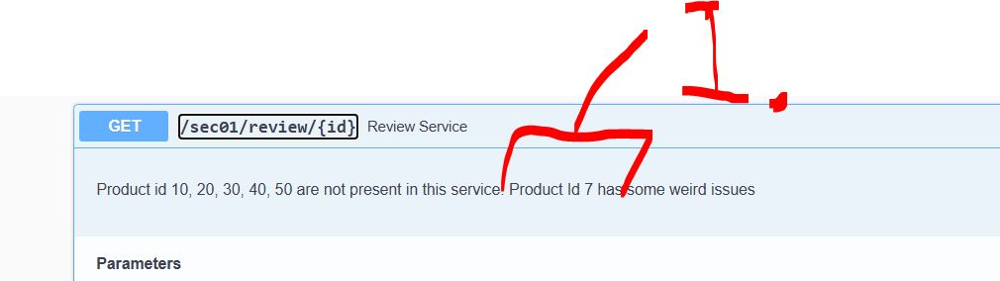
</div>

1. We can see that `Product 07` is having some error!


# Is our Aggregator resilient?

<div align="center">
    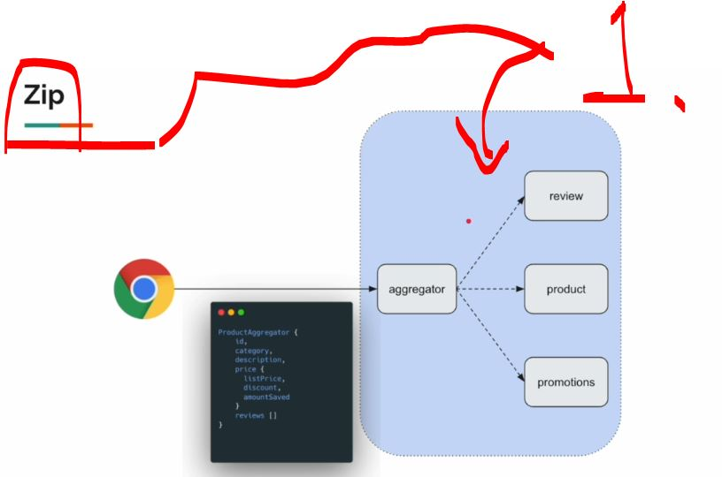
</div>

1. The `.zip(...)` is needed to be fixed, since it will **throw error**, if there are **no components** from the **downstream services**!
    - We will fix this!


- The **Review client** that will is throwing the error:

````Java
package com.vinsguru.webfluxpatterns.sec01.client;

import com.vinsguru.webfluxpatterns.sec01.dto.Review;
import org.springframework.beans.factory.annotation.Value;
import org.springframework.stereotype.Service;
import org.springframework.web.reactive.function.client.WebClient;
import reactor.core.publisher.Mono;

import java.util.Collections;
import java.util.List;

@Service
public class ReviewClient {

    private final WebClient client;

    public ReviewClient(@Value("${sec01.review.service}") String baseUrl){
        this.client = WebClient.builder()
                               .baseUrl(baseUrl)
                               .build();
    }

    public Mono<List<Review>> getReviews(Integer id){
        return this.client
                .get()
                .uri("{id}", id)
                .retrieve()
                .bodyToFlux(Review.class)
                .collectList();
    }
}
````

- The new handler, which will fix this is the: `.onErrorReturn(Collections.emptyList());`!
    - If the upstream reactive operation throws an error, replace the error with `Collections.emptyList()`.

- The new client handler, which handles the error!

````Java
package com.vinsguru.webfluxpatterns.sec01.client;

import com.vinsguru.webfluxpatterns.sec01.dto.Review;
import org.springframework.beans.factory.annotation.Value;
import org.springframework.stereotype.Service;
import org.springframework.web.reactive.function.client.WebClient;
import reactor.core.publisher.Mono;

import java.util.Collections;
import java.util.List;

@Service
public class ReviewClient {

    private final WebClient client;

    public ReviewClient(@Value("${sec01.review.service}") String baseUrl){
        this.client = WebClient.builder()
                               .baseUrl(baseUrl)
                               .build();
    }

    public Mono<List<Review>> getReviews(Integer id){
        return this.client
                .get()
                .uri("{id}", id)
                .retrieve()
                .bodyToFlux(Review.class)
                .collectList()
                .onErrorReturn(Collections.emptyList());
    }
}
````

- We will be making the `.onErrorReturn(Collections.emptyList());` handler for every upstream service, only then the `.zip(...)` will work!


# Making Aggregator more resilient!

```Java
package com.vinsguru.webfluxpatterns.sec01.client;

import com.vinsguru.webfluxpatterns.sec01.dto.PromotionResponse;
import org.springframework.beans.factory.annotation.Value;
import org.springframework.stereotype.Service;
import org.springframework.web.reactive.function.client.WebClient;
import reactor.core.publisher.Mono;

import java.time.LocalDate;

@Service
public class PromotionClient {

    private final PromotionResponse noPromotion = PromotionResponse.create(-1, "no promotion", 0.0, LocalDate.now());
    private final WebClient client;

    public PromotionClient(@Value("${sec01.promotion.service}") String baseUrl){
        this.client = WebClient.builder()
                               .baseUrl(baseUrl)
                               .build();
    }

    public Mono<PromotionResponse> getPromotion(Integer id){
        return this.client
                .get()
                .uri("{id}", id)
                .retrieve()
                .bodyToMono(PromotionResponse.class)
                .onErrorReturn(noPromotion);
    }
}
```

- In this context, where the `.zip(...)` where the **all responses** the is being waited, it is still better to have the default handlers! 
    - `Mono.just(noPromotion)` is often better than `Mono.empty()` if "no promotion" is a valid business state and the combined response requires a promotion value. 
        - The default handler:
            ```Java
            private final PromotionResponse noPromotion = PromotionResponse.create(-1, "no promotion", 0.0, LocalDate.now());
            ```

- We can see the having **default error handler** in place:

<div align="center">
    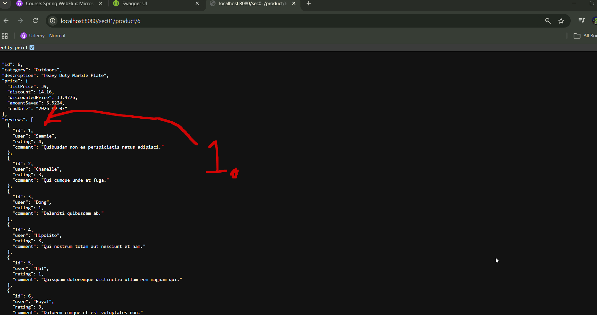
</div>

1. We can see the **Reviews** when there **are answers**!
2. We can see the **Default*Reviews** when there are **no answers**!

- Now this service is **more resilient**!

# Are we making parallel calls?

- Ideally it works as such:

````
Sequential:
Product     ██████████  1s
Promotion              ██████████  1s
Total                  ≈ 2s


zip:
Product     ██████████  1s
Promotion   ██████████  1s
Total       ≈ 1s
````

- So to make call its **1s**!

# Product Service error handling.

<div align="center">
    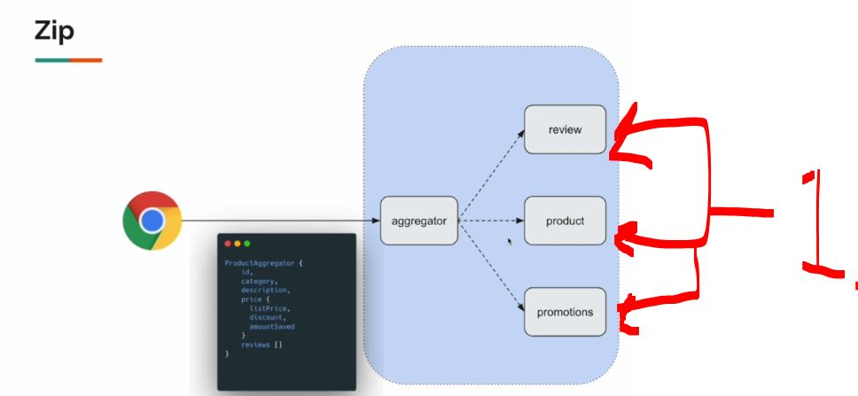
</div>

1. We need to **decide**, will the error in **one of those**, brake whole thing!

<div align="center">
    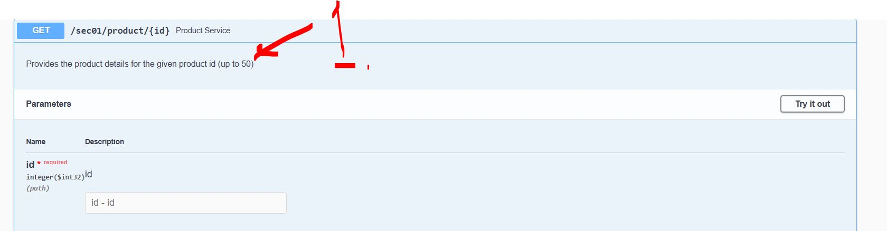
</div>

1. We are fixing this **Product** endpoint, as one can see that over the **50** will have some error! 

- Lest see that we are having error coming!

<div align="center">
    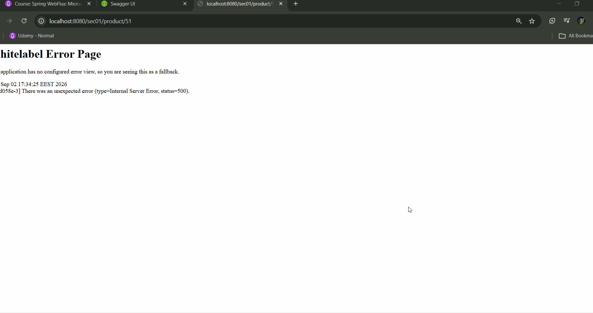
</div>

````Java
2026-09-02T17:34:25.647+03:00 ERROR 588 --- [ctor-http-nio-2] a.w.r.e.AbstractErrorWebExceptionHandler : [667d058e-3]  500 Server Error for HTTP GET "/sec01/product/51"

org.springframework.web.reactive.function.client.WebClientResponseException$NotFound: 404 Not Found from GET http://localhost:7070/sec01/product/51
	at org.springframework.web.reactive.function.client.WebClientResponseException.create(WebClientResponseException.java:324) ~[spring-webflux-6.2.7.jar:6.2.7]
	Suppressed: reactor.core.publisher.FluxOnAssembly$OnAssemblyException: 
Error has been observed at the following site(s):
	*__checkpoint ⇢ 404 NOT_FOUND from GET http://localhost:7070/sec01/product/51 [DefaultWebClient]
	*__checkpoint ⇢ Handler com.vinsguru.webfluxpatterns.sec01.controller.ProductAggregateController#getProductAggregate(Integer) [DispatcherHandler]
	*__checkpoint ⇢ HTTP GET "/sec01/product/51" [ExceptionHandlingWebHandler]
Original Stack Trace:
		at org.springframework.web.reactive.function.client.WebClientResponseException.create(WebClientResponseException.java:324) ~[spring-webflux-6.2.7.jar:6.2.7]
		at org.springframework.web.reactive.function.client.DefaultClientResponse.lambda$createException$1(DefaultClientResponse.java:214) ~[spring-webflux-6.2.7.jar:6.2.7]
		at reactor.core.publisher.FluxMap$MapSubscriber.onNext(FluxMap.java:106) ~[reactor-core-3.7.6.jar:3.7.6]
		at reactor.core.publisher.FluxOnErrorReturn$ReturnSubscriber.onNext(FluxOnErrorReturn.java:162) ~[reactor-core-3.7.6.jar:3.7.6]
		at reactor.core.publisher.Operators$BaseFluxToMonoOperator.completePossiblyEmpty(Operators.java:2096) ~[reactor-core-3.7.6.jar:3.7.6]
		at reactor.core.publisher.FluxDefaultIfEmpty$DefaultIfEmptySubscriber.onComplete(FluxDefaultIfEmpty.java:134) ~[reactor-core-3.7.6.jar:3.7.6]
		at reactor.core.publisher.FluxMapFuseable$MapFuseableSubscriber.onComplete(FluxMapFuseable.java:152) ~[reactor-core-3.7.6.jar:3.7.6]
		at reactor.core.publisher.FluxContextWrite$ContextWriteSubscriber.onComplete(FluxContextWrite.java:126) ~[reactor-core-3.7.6.jar:3.7.6]
		at reactor.core.publisher.FluxMapFuseable$MapFuseableConditionalSubscriber.onComplete(FluxMapFuseable.java:350) ~[reactor-core-3.7.6.jar:3.7.6]
		at reactor.core.publisher.FluxFilterFuseable$FilterFuseableConditionalSubscriber.onComplete(FluxFilterFuseable.java:391) ~[reactor-core-3.7.6.jar:3.7.6]
		at reactor.core.publisher.Operators$BaseFluxToMonoOperator.completePossiblyEmpty(Operators.java:2097) ~[reactor-core-3.7.6.jar:3.7.6]
		at reactor.core.publisher.MonoCollect$CollectSubscriber.onComplete(MonoCollect.java:145) ~[reactor-core-3.7.6.jar:3.7.6]
		at reactor.core.publisher.FluxMap$MapSubscriber.onComplete(FluxMap.java:144) ~[reactor-core-3.7.6.jar:3.7.6]
		at reactor.core.publisher.FluxPeek$PeekSubscriber.onComplete(FluxPeek.java:260) ~[reactor-core-3.7.6.jar:3.7.6]
		at reactor.core.publisher.FluxMap$MapSubscriber.onComplete(FluxMap.java:144) ~[reactor-core-3.7.6.jar:3.7.6]
		at reactor.netty.channel.FluxReceive.onInboundComplete(FluxReceive.java:413) ~[reactor-netty-core-1.2.6.jar:1.2.6]
		at reactor.netty.channel.ChannelOperations.onInboundComplete(ChannelOperations.java:455) ~[reactor-netty-core-1.2.6.jar:1.2.6]
		at reactor.netty.channel.ChannelOperations.terminate(ChannelOperations.java:509) ~[reactor-netty-core-1.2.6.jar:1.2.6]
		at reactor.netty.http.client.HttpClientOperations.onInboundNext(HttpClientOperations.java:821) ~[reactor-netty-http-1.2.6.jar:1.2.6]
		at reactor.netty.channel.ChannelOperationsHandler.channelRead(ChannelOperationsHandler.java:115) ~[reactor-netty-core-1.2.6.jar:1.2.6]
		at io.netty.channel.AbstractChannelHandlerContext.invokeChannelRead(AbstractChannelHandlerContext.java:444) ~[netty-transport-4.1.121.Final.jar:4.1.121.Final]
		at io.netty.channel.AbstractChannelHandlerContext.invokeChannelRead(AbstractChannelHandlerContext.java:420) ~[netty-transport-4.1.121.Final.jar:4.1.121.Final]
		at io.netty.channel.AbstractChannelHandlerContext.fireChannelRead(AbstractChannelHandlerContext.java:412) ~[netty-transport-4.1.121.Final.jar:4.1.121.Final]
		at io.netty.handler.codec.MessageToMessageDecoder.channelRead(MessageToMessageDecoder.java:107) ~[netty-codec-4.1.121.Final.jar:4.1.121.Final]
		at io.netty.channel.AbstractChannelHandlerContext.invokeChannelRead(AbstractChannelHandlerContext.java:444) ~[netty-transport-4.1.121.Final.jar:4.1.121.Final]
		at io.netty.channel.AbstractChannelHandlerContext.invokeChannelRead(AbstractChannelHandlerContext.java:420) ~[netty-transport-4.1.121.Final.jar:4.1.121.Final]
		at io.netty.channel.AbstractChannelHandlerContext.fireChannelRead(AbstractChannelHandlerContext.java:412) ~[netty-transport-4.1.121.Final.jar:4.1.121.Final]
		at io.netty.channel.CombinedChannelDuplexHandler$DelegatingChannelHandlerContext.fireChannelRead(CombinedChannelDuplexHandler.java:436) ~[netty-transport-4.1.121.Final.jar:4.1.121.Final]
		at io.netty.handler.codec.ByteToMessageDecoder.fireChannelRead(ByteToMessageDecoder.java:346) ~[netty-codec-4.1.121.Final.jar:4.1.121.Final]
		at io.netty.handler.codec.ByteToMessageDecoder.channelRead(ByteToMessageDecoder.java:318) ~[netty-codec-4.1.121.Final.jar:4.1.121.Final]
		at io.netty.channel.CombinedChannelDuplexHandler.channelRead(CombinedChannelDuplexHandler.java:251) ~[netty-transport-4.1.121.Final.jar:4.1.121.Final]
		at io.netty.channel.AbstractChannelHandlerContext.invokeChannelRead(AbstractChannelHandlerContext.java:442) ~[netty-transport-4.1.121.Final.jar:4.1.121.Final]
		at io.netty.channel.AbstractChannelHandlerContext.invokeChannelRead(AbstractChannelHandlerContext.java:420) ~[netty-transport-4.1.121.Final.jar:4.1.121.Final]
		at io.netty.channel.AbstractChannelHandlerContext.fireChannelRead(AbstractChannelHandlerContext.java:412) ~[netty-transport-4.1.121.Final.jar:4.1.121.Final]
		at io.netty.channel.DefaultChannelPipeline$HeadContext.channelRead(DefaultChannelPipeline.java:1357) ~[netty-transport-4.1.121.Final.jar:4.1.121.Final]
		at io.netty.channel.AbstractChannelHandlerContext.invokeChannelRead(AbstractChannelHandlerContext.java:440) ~[netty-transport-4.1.121.Final.jar:4.1.121.Final]
		at io.netty.channel.AbstractChannelHandlerContext.invokeChannelRead(AbstractChannelHandlerContext.java:420) ~[netty-transport-4.1.121.Final.jar:4.1.121.Final]
		at io.netty.channel.DefaultChannelPipeline.fireChannelRead(DefaultChannelPipeline.java:868) ~[netty-transport-4.1.121.Final.jar:4.1.121.Final]
		at io.netty.channel.nio.AbstractNioByteChannel$NioByteUnsafe.read(AbstractNioByteChannel.java:166) ~[netty-transport-4.1.121.Final.jar:4.1.121.Final]
		at io.netty.channel.nio.NioEventLoop.processSelectedKey(NioEventLoop.java:796) ~[netty-transport-4.1.121.Final.jar:4.1.121.Final]
		at io.netty.channel.nio.NioEventLoop.processSelectedKeysOptimized(NioEventLoop.java:732) ~[netty-transport-4.1.121.Final.jar:4.1.121.Final]
		at io.netty.channel.nio.NioEventLoop.processSelectedKeys(NioEventLoop.java:658) ~[netty-transport-4.1.121.Final.jar:4.1.121.Final]
		at io.netty.channel.nio.NioEventLoop.run(NioEventLoop.java:562) ~[netty-transport-4.1.121.Final.jar:4.1.121.Final]
		at io.netty.util.concurrent.SingleThreadEventExecutor$4.run(SingleThreadEventExecutor.java:998) ~[netty-common-4.1.121.Final.jar:4.1.121.Final]
		at io.netty.util.internal.ThreadExecutorMap$2.run(ThreadExecutorMap.java:74) ~[netty-common-4.1.121.Final.jar:4.1.121.Final]
		at io.netty.util.concurrent.FastThreadLocalRunnable.run(FastThreadLocalRunnable.java:30) ~[netty-common-4.1.121.Final.jar:4.1.121.Final]
		at java.base/java.lang.Thread.run(Thread.java:1583) ~[na:na]
````

- We can see that once, `404 Not Found from GET http://localhost:7070/sec01/product/51`:

- We will be having the **following logic** to fix this!
    - `.onErrorResume(ex -> Mono.empty());`.

````Java
package com.vinsguru.webfluxpatterns.sec01.client;

import com.vinsguru.webfluxpatterns.sec01.dto.ProductResponse;
import org.springframework.beans.factory.annotation.Value;
import org.springframework.stereotype.Service;
import org.springframework.web.reactive.function.client.WebClient;
import reactor.core.publisher.Mono;

@Service
public class ProductClient {

    private final WebClient client;

    public ProductClient(@Value("${sec01.product.service}") String baseUrl){
        this.client = WebClient.builder()
                               .baseUrl(baseUrl)
                               .build();
    }

    public Mono<ProductResponse> getProduct(Integer id){
        return this.client
                .get()
                .uri("{id}", id)
                .retrieve()
                .bodyToMono(ProductResponse.class)
                .onErrorResume(ex -> Mono.empty());
    }
}
````


# Summary.

<div align="center">
    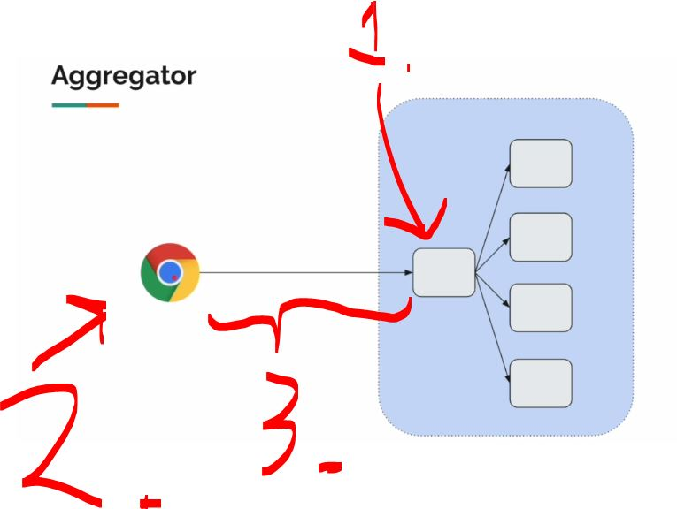
</div>

1. The **aggregator** is going to collect all the answer form **downstream system**!
    - It requests one request from the front end and the queries the all the **downs stream systems**!
2. The browser is making **one call**!
    - The **browser** can have **some restrictions** on the **amount of call** that can handle!
3. We have reduced a lot of network latency, when we are calling all these **services back** and **forth**, with **aggregator service**!

<details>
<summary id="gateway_aggregator_pattern" open="true"> <b>Gateway aggregator patterns project files!</b> </summary>

## Client

#### ProductClient.java

````Java
package com.vinsguru.webfluxpatterns.sec01.client;

import com.vinsguru.webfluxpatterns.sec01.dto.ProductResponse;
import org.springframework.beans.factory.annotation.Value;
import org.springframework.stereotype.Service;
import org.springframework.web.reactive.function.client.WebClient;
import reactor.core.publisher.Mono;

@Service
public class ProductClient {

    private final WebClient client;

    public ProductClient(@Value("${sec01.product.service}") String baseUrl){
        this.client = WebClient.builder()
                               .baseUrl(baseUrl)
                               .build();
    }

    public Mono<ProductResponse> getProduct(Integer id){
        return this.client
                .get()
                .uri("{id}", id)
                .retrieve()
                .bodyToMono(ProductResponse.class)
                .onErrorResume(ex -> Mono.empty());
    }

}
````

#### PromotionClient.java

````Java
package com.vinsguru.webfluxpatterns.sec01.client;

import com.vinsguru.webfluxpatterns.sec01.dto.PromotionResponse;
import org.springframework.beans.factory.annotation.Value;
import org.springframework.stereotype.Service;
import org.springframework.web.reactive.function.client.WebClient;
import reactor.core.publisher.Mono;

import java.time.LocalDate;

@Service
public class PromotionClient {

    private final PromotionResponse noPromotion = PromotionResponse.create(-1, "no promotion", 0.0, LocalDate.now());
    private final WebClient client;

    public PromotionClient(@Value("${sec01.promotion.service}") String baseUrl){
        this.client = WebClient.builder()
                               .baseUrl(baseUrl)
                               .build();
    }

    public Mono<PromotionResponse> getPromotion(Integer id){
        return this.client
                .get()
                .uri("{id}", id)
                .retrieve()
                .bodyToMono(PromotionResponse.class)
                .onErrorReturn(noPromotion);
    }

}
````

#### ReviewClient.java

````Java
package com.vinsguru.webfluxpatterns.sec01.client;

import com.vinsguru.webfluxpatterns.sec01.dto.Review;
import org.springframework.beans.factory.annotation.Value;
import org.springframework.stereotype.Service;
import org.springframework.web.reactive.function.client.WebClient;
import reactor.core.publisher.Mono;

import java.util.Collections;
import java.util.List;

@Service
public class ReviewClient {

    private final WebClient client;

    public ReviewClient(@Value("${sec01.review.service}") String baseUrl){
        this.client = WebClient.builder()
                               .baseUrl(baseUrl)
                               .build();
    }

    public Mono<List<Review>> getReviews(Integer id){
        return this.client
                .get()
                .uri("{id}", id)
                .retrieve()
                .bodyToFlux(Review.class)
                .collectList()
                .onErrorReturn(Collections.emptyList());
    }

}
````

## Controller

#### ProductAggregateController.java

```Java
package com.vinsguru.webfluxpatterns.sec01.controller;

import com.vinsguru.webfluxpatterns.sec01.dto.ProductAggregate;
import com.vinsguru.webfluxpatterns.sec01.service.ProductAggregatorService;
import org.springframework.beans.factory.annotation.Autowired;
import org.springframework.http.ResponseEntity;
import org.springframework.web.bind.annotation.GetMapping;
import org.springframework.web.bind.annotation.PathVariable;
import org.springframework.web.bind.annotation.RequestMapping;
import org.springframework.web.bind.annotation.RestController;
import reactor.core.publisher.Mono;

@RestController
@RequestMapping("sec01")
public class ProductAggregateController {

    @Autowired
    private ProductAggregatorService service;

    @GetMapping("product/{id}")
    public Mono<ResponseEntity<ProductAggregate>> getProductAggregate(@PathVariable Integer id){
        return this.service.aggregate(id)
                .map(ResponseEntity::ok)
                .defaultIfEmpty(ResponseEntity.notFound().build());
    }

}
```

## DTO

#### Price.java 

````Java
package com.vinsguru.webfluxpatterns.sec01.dto;

import lombok.Data;
import lombok.ToString;

import java.time.LocalDate;

@Data
@ToString
public class Price {

    private Integer listPrice;
    private Double discount;
    private Double discountedPrice;
    private Double amountSaved;
    private LocalDate endDate;

}
````

#### ProductAggregate.java

````Java
package com.vinsguru.webfluxpatterns.sec01.dto;

import lombok.AllArgsConstructor;
import lombok.Data;
import lombok.NoArgsConstructor;
import lombok.ToString;

import java.util.List;

@Data
@ToString
@NoArgsConstructor
@AllArgsConstructor(staticName = "create")
public class ProductAggregate {

    private Integer id;
    private String category;
    private String description;
    private Price price;
    private List<Review> reviews;

}
````

#### ProductResponse.java

````Java
package com.vinsguru.webfluxpatterns.sec01.dto;

import lombok.Data;
import lombok.ToString;

@Data
@ToString
public class ProductResponse {
    private Integer id;
    private String category;
    private String description;
    private Integer price;
}
````

#### PromotionResponse.java 

````Java
package com.vinsguru.webfluxpatterns.sec01.dto;

import lombok.AllArgsConstructor;
import lombok.Data;
import lombok.NoArgsConstructor;
import lombok.ToString;

import java.time.LocalDate;

@Data
@ToString
@NoArgsConstructor
@AllArgsConstructor(staticName = "create")
public class PromotionResponse {

    private Integer id;
    private String type;
    private Double discount;
    private LocalDate endDate;

}
````

#### Review.java

````Java
package com.vinsguru.webfluxpatterns.sec01.dto;

import lombok.Data;
import lombok.ToString;

@Data
@ToString
public class Review {

    private Integer id;
    private String user;
    private Integer rating;
    private String comment;

}
````

## Service

#### ProductAggregatorService.java

```Java
package com.vinsguru.webfluxpatterns.sec01.service;

import com.vinsguru.webfluxpatterns.sec01.client.ProductClient;
import com.vinsguru.webfluxpatterns.sec01.client.PromotionClient;
import com.vinsguru.webfluxpatterns.sec01.client.ReviewClient;
import com.vinsguru.webfluxpatterns.sec01.dto.*;
import org.springframework.beans.factory.annotation.Autowired;
import org.springframework.stereotype.Service;
import reactor.core.publisher.Mono;

import java.util.List;

@Service
public class ProductAggregatorService {

    @Autowired
    private ProductClient productClient;

    @Autowired
    private PromotionClient promotionClient;

    @Autowired
    private ReviewClient reviewClient;

    public Mono<ProductAggregate> aggregate(Integer id){
        return Mono.zip(
               this.productClient.getProduct(id),
               this.promotionClient.getPromotion(id),
               this.reviewClient.getReviews(id)
        )
        .map(t -> toDto(t.getT1(), t.getT2(), t.getT3()));
    }

    private ProductAggregate toDto(ProductResponse product, PromotionResponse promotion, List<Review> reviews){
        var price = new Price();
        var amountSaved = product.getPrice() * promotion.getDiscount() / 100;
        var discountedPrice = product.getPrice() - amountSaved;
        price.setListPrice(product.getPrice());
        price.setAmountSaved(amountSaved);
        price.setDiscountedPrice(discountedPrice);
        price.setDiscount(promotion.getDiscount());
        price.setEndDate(promotion.getEndDate());
        return ProductAggregate.create(
                product.getId(),
                product.getCategory(),
                product.getDescription(),
                price,
                reviews
        );
    }
}
```

</details>
