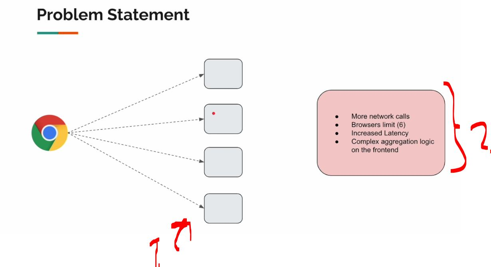
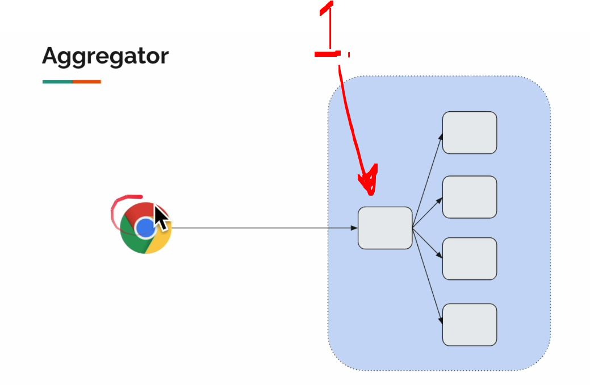
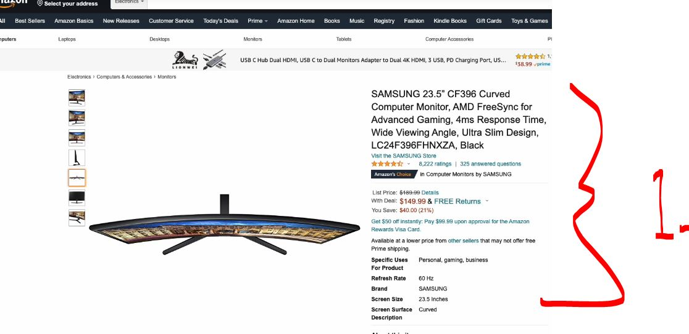

# Section 02: API Composition: Gateway Aggregator Pattern. 

Section 02: API Composition: Gateway Aggregator Pattern. 

# What I Learned.

# Resource.

- URL for the [repo](https://github.com/vinsguru/webflux-patterns).


# Gateway Aggregator Pattern - Intro.

<div align="center">
    
</div>

1. Let's see **Gateway Aggregator Pattern**!

<div align="center">
    
</div>

1. Gateway is needed to call all these services!
2. Problems brings:
    - Browser needs to make multiple call!
        - Browsers has **limits** to call simultaneity!
    - **Client** is EU, servers in **USA**!
    - When we update the new service, this needs to be updated to everywhere!

<div align="center">
    
</div>

1. Front end calls the **aggregator microservice** and its **responsibility is to call** and **collect all** the **upstream services**! 
    - From **client** perspective is just **one call**!

<div align="center">
    
</div>

1. In this product, there is multiple part where to retrieve the details!

# Jar Download.


- Jar to download: [.jar](https://vins-udemy.s3.amazonaws.com/webflux-design-patterns/external-services-v2.jar)!
# External Services.

# Project Setup.

# Creating DTO.

# Creating External Service Clients.

# Aggregator Service.

# Aggregator Controller.

# Gateway Aggregator Pattern Demo.

# Is our Aggregator resilient?

# Making Aggregator more resilient!

# Are we making parallel calls?

# Product Service error handling.

# Summary.


- The project code, for **add here** below!

<details>
<summary id="changeThis_patter" open="true"> <b> change this pattern project files!</b> </summary>

#### ReviewClient.java

````Java

````

#### ProductClient.java

````Java

````

#### ProductAggregatorService.java

```Java

```

#### ProductAggregateController.java

```Java

```

#### Product.java

````Java

````

#### ProductAggregate.java

````Java

````

#### Review.java 

````Java

````

</details>
