# Section 03: Scatter Gather Pattern: High-Performance Service Composition.

Section 03: Scatter Gather Pattern: High-Performance Service Composition.

# What I Learned.

# Scatter Gather Pattern - Intro.

<div align="center">
    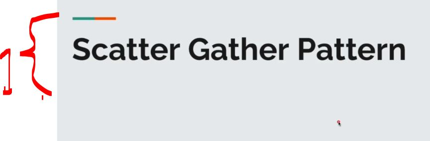
</div>

1. We will go thought the **scatter gather pattern**!

<div align="center">
    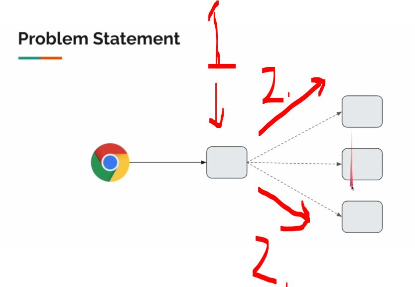
</div>

1. We have the service!
2. We will need to be asking information from the downstream services!

<div align="center">
    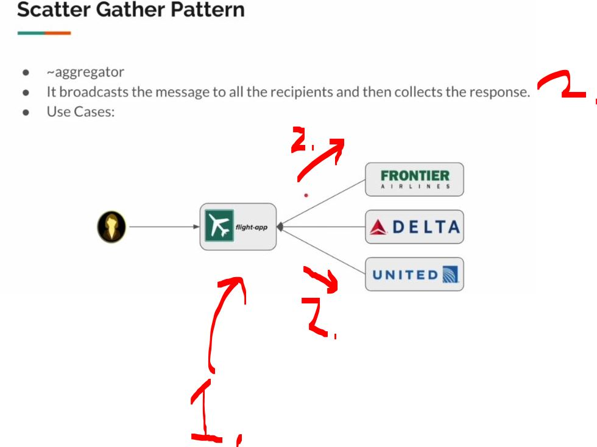
</div>

1. It will be acting as agent that will be **querying** the **details**, from all the underlying **airline carriers**!

<div align="center">
    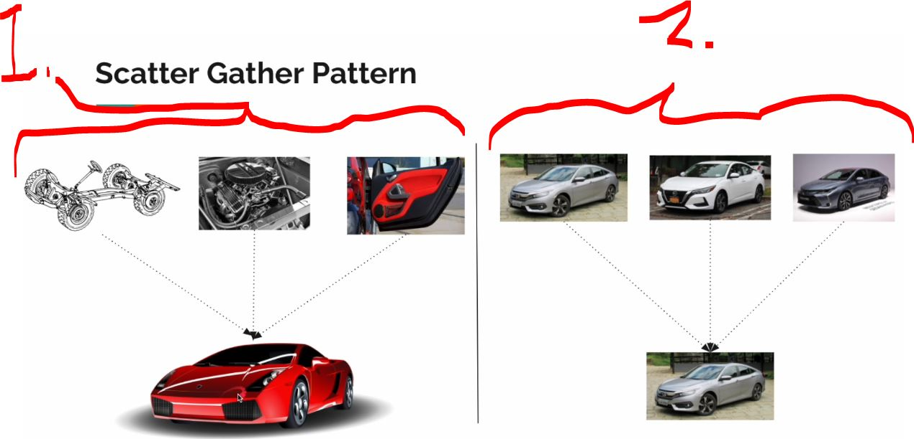
</div>

1. **Aggregator pattern**, with `.zip(...)`! We will be this operation to combine this **whole thing**!
2. **Scatter Gather Pattern** asks **car** from **multiple providers**!

# External Services.

<div align="center">
    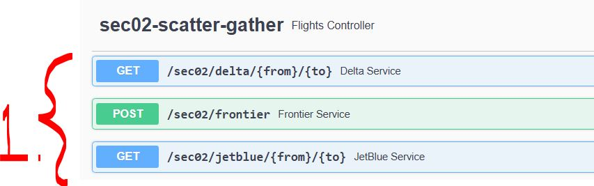
</div>

1. We will be dealing with following endpoints.
    - Here we have every **airline carrier** is providing different response.
        - **Scatter Gather Pattern** hides all these **complexities**!

- We will see **delta service** endpoint returning answer:

<div align="center">
    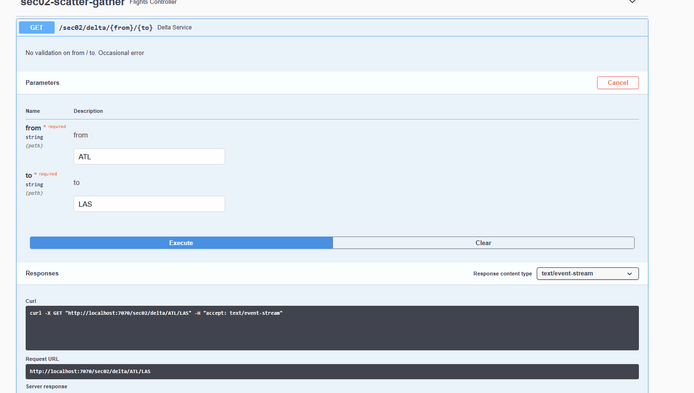
</div>

- We can see that **endpoint characteristics**! It is `text/event-stream`!

<div align="center">
    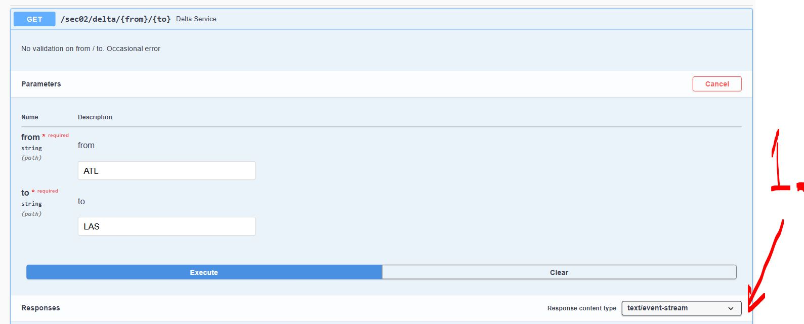
</div>

- We will see **delta service** endpoint returning answer:

<div align="center">
    
</div> 


<div align="center">
    
</div>

- We can see that this **delta** is stream!

<div align="center">
    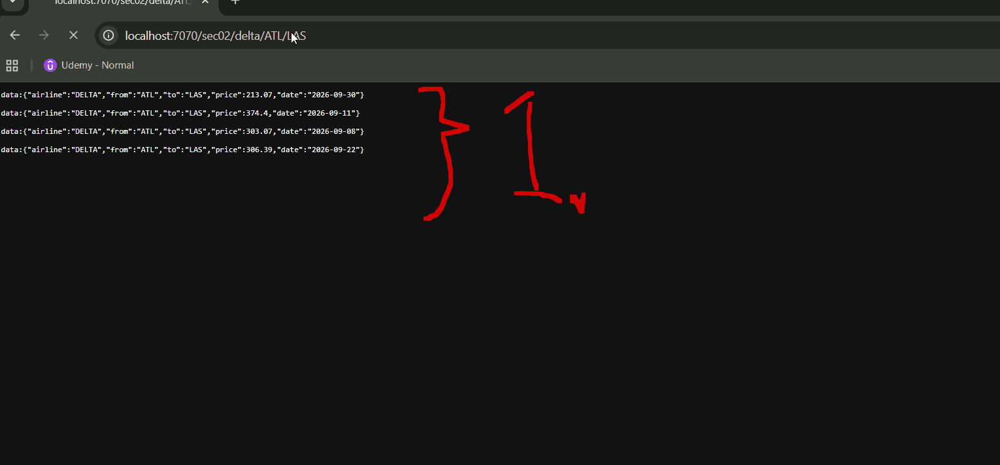
</div>

1. Stream data is showing as following!

- We will see **frontier** endpoint returning answer:

<div align="center">
    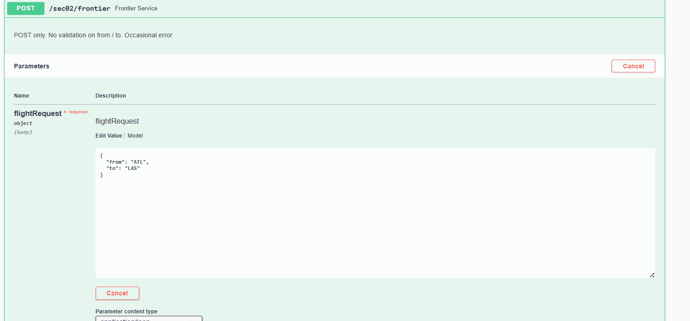
</div>

- We will see **JetBlue** endpoint returning answer:

<div align="center">
    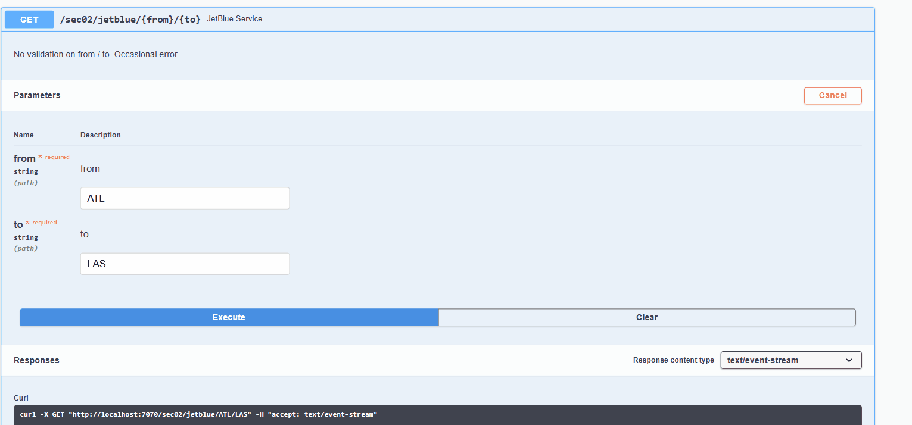
</div>

> [!NOTE]
> We can see that, every answer is different structure!

# Creating DTO.

````Java
package com.vinsguru.webfluxpatterns.sec02.dto;

import lombok.Data;
import lombok.ToString;

import java.time.LocalDate;

@Data
@ToString
public class FlightResult {

    private String airline;
    private String from;
    private String to;
    private Double price;
    private LocalDate date;
}
````

# Creating Delta Service Client.

- We will be creating the **downstream service**, **Delta Service**:

````Java
package com.vinsguru.webfluxpatterns.sec02.client;

import com.vinsguru.webfluxpatterns.sec02.dto.FlightResult;
import org.springframework.beans.factory.annotation.Value;
import org.springframework.stereotype.Service;
import org.springframework.web.reactive.function.client.WebClient;
import reactor.core.publisher.Flux;
import reactor.core.publisher.Mono;

@Service
public class DeltaClient {

    private final WebClient client;

    public DeltaClient(@Value("${sec02.delta.service}") String baseUrl){
        this.client = WebClient.builder()
                               .baseUrl(baseUrl)
                               .build();
    }

    public Flux<FlightResult> getFlights(String from, String to){
        return this.client
                .get()
                .uri("{from}/{to}", from, to)
                .retrieve()
                .bodyToFlux(FlightResult.class)
                .onErrorResume(ex -> Mono.empty());
    }
}
````

- We will get these as `Flux<FlightResult>`, like there was multiple results!

# Creating JetBlue / Frontier Service Client.

- We will be creating the **downstream service**, **JetBlue**!

````Java
package com.vinsguru.webfluxpatterns.sec02.client;

import com.vinsguru.webfluxpatterns.sec02.dto.FlightResult;
import org.springframework.beans.factory.annotation.Value;
import org.springframework.stereotype.Service;
import org.springframework.web.reactive.function.client.WebClient;
import reactor.core.publisher.Flux;
import reactor.core.publisher.Mono;

@Service
public class JetBlueClient {

    private static final String JETBLUE = "JETBLUE";
    private final WebClient client;

    public JetBlueClient(@Value("${sec02.jetblue.service}") String baseUrl){
        this.client = WebClient.builder()
                               .baseUrl(baseUrl)
                               .build();
    }

    public Flux<FlightResult> getFlights(String from, String to){
        return this.client
                .get()
                .uri("{from}/{to}", from, to)
                .retrieve()
                .bodyToFlux(FlightResult.class)
                .doOnNext(fr -> this.normalizeResponse(fr, from, to))
                .onErrorResume(ex -> Mono.empty());
    }

    private void normalizeResponse(FlightResult result, String from, String to){
        result.setFrom(from);
        result.setTo(to);
        result.setAirline(JETBLUE);
    }
}
````

- We will be creating the **downstream service**, **FrontierClient**!

````Java
package com.vinsguru.webfluxpatterns.sec02.client;

import com.vinsguru.webfluxpatterns.sec02.dto.FlightResult;
import lombok.AllArgsConstructor;
import lombok.Data;
import lombok.ToString;
import org.springframework.beans.factory.annotation.Value;
import org.springframework.stereotype.Service;
import org.springframework.web.reactive.function.client.WebClient;
import reactor.core.publisher.Flux;
import reactor.core.publisher.Mono;

@Service
public class FrontierClient {

    private final WebClient client;

    public FrontierClient(@Value("${sec02.frontier.service}") String baseUrl){
        this.client = WebClient.builder()
                               .baseUrl(baseUrl)
                               .build();
    }

    public Flux<FlightResult> getFlights(String from, String to){
        return this.client
                .post()
                .bodyValue(FrontierRequest.create(from, to))
                .retrieve()
                .bodyToFlux(FlightResult.class)
                .onErrorResume(ex -> Mono.empty());
    }
    @Data
    @ToString
    @AllArgsConstructor(staticName = "create")
    private static class FrontierRequest{
        private String from;
        private String to;
    }
}
````

# Creating Service.

```Java
package com.vinsguru.webfluxpatterns.sec02.service;

import com.vinsguru.webfluxpatterns.sec02.client.DeltaClient;
import com.vinsguru.webfluxpatterns.sec02.client.FrontierClient;
import com.vinsguru.webfluxpatterns.sec02.client.JetBlueClient;
import com.vinsguru.webfluxpatterns.sec02.dto.FlightResult;
import org.springframework.beans.factory.annotation.Autowired;
import org.springframework.stereotype.Service;
import reactor.core.publisher.Flux;

import java.time.Duration;

@Service
public class FlightSearchService {

    @Autowired
    private DeltaClient deltaClient;

    @Autowired
    private FrontierClient frontierClient;

    @Autowired
    private JetBlueClient jetBlueClient;

    public Flux<FlightResult> getFlights(String from, String to){
        return Flux.merge(
                this.deltaClient.getFlights(from, to),
                this.frontierClient.getFlights(from, to),
                this.jetBlueClient.getFlights(from, to)
        )
        .take(Duration.ofSeconds(3));
    }
}
```

- This code **merges** the **three flight streams**, then stops the resulting stream after **3 seconds**:

````Java
return Flux.merge(
        this.deltaClient.getFlights(from, to),
        this.frontierClient.getFlights(from, to),
        this.jetBlueClient.getFlights(from, to)
)
.take(Duration.ofSeconds(3));
````

- `Flux.merge()` combines **multiple Fluxes** into one Flux and emits values as soon as they arrive.

- Without this the `.take(Duration.ofSeconds(3));` this will wait and keep emitting!

# Creating Controller.

- We will be creating the controller:

````Java
package com.vinsguru.webfluxpatterns.sec02.controller;

import com.vinsguru.webfluxpatterns.sec02.dto.FlightResult;
import com.vinsguru.webfluxpatterns.sec02.service.FlightSearchService;
import org.springframework.beans.factory.annotation.Autowired;
import org.springframework.http.MediaType;
import org.springframework.web.bind.annotation.GetMapping;
import org.springframework.web.bind.annotation.PathVariable;
import org.springframework.web.bind.annotation.RequestMapping;
import org.springframework.web.bind.annotation.RestController;
import reactor.core.publisher.Flux;

@RestController
@RequestMapping("sec02")
public class FlightsController {

    @Autowired
    private FlightSearchService service;

    @GetMapping(value = "flights/{from}/{to}", produces = MediaType.TEXT_EVENT_STREAM_VALUE)
    public Flux<FlightResult> getFlights(@PathVariable String from, @PathVariable String to){
        return this.service.getFlights(from, to);
    }
}
````

# Scatter Gather Demo.

<div align="center">
    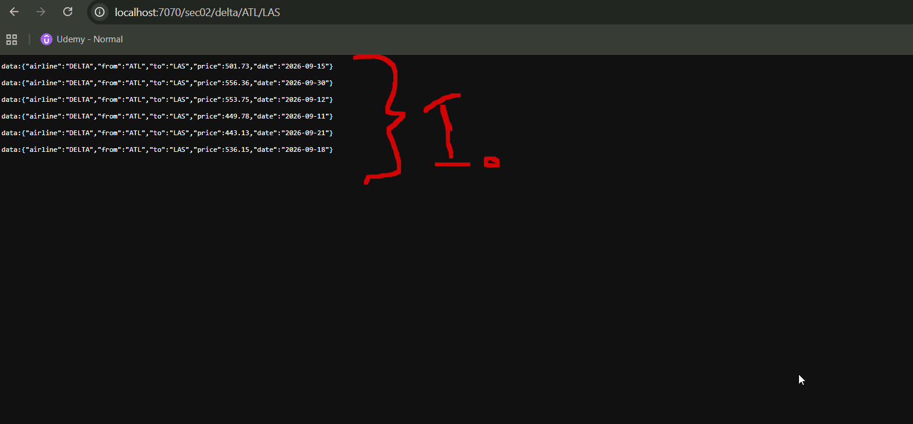
</div>

1. We can see this working, it is the same structure!

# Summary.

<div align="center">
    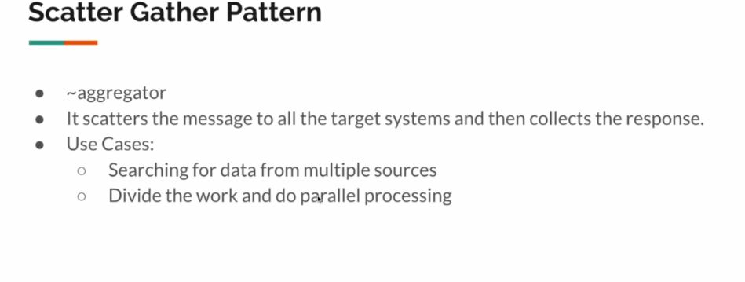
</div>

- Idea is **scattering the request** and **gathering the response**!

<details>

<summary id="scatter_gather_pattern" open="true"> <b>Scatter gather patterns project files!</b> </summary>

## Client

#### DeltaClient.java

````Java
package com.vinsguru.webfluxpatterns.sec02.client;

import com.vinsguru.webfluxpatterns.sec02.dto.FlightResult;
import org.springframework.beans.factory.annotation.Value;
import org.springframework.stereotype.Service;
import org.springframework.web.reactive.function.client.WebClient;
import reactor.core.publisher.Flux;
import reactor.core.publisher.Mono;

@Service
public class DeltaClient {

    private final WebClient client;

    public DeltaClient(@Value("${sec02.delta.service}") String baseUrl){
        this.client = WebClient.builder()
                               .baseUrl(baseUrl)
                               .build();
    }

    public Flux<FlightResult> getFlights(String from, String to){
        return this.client
                .get()
                .uri("{from}/{to}", from, to)
                .retrieve()
                .bodyToFlux(FlightResult.class)
                .onErrorResume(ex -> Mono.empty());
    }
}
````

#### FrontierClient.java 

````Java
package com.vinsguru.webfluxpatterns.sec02.client;

import com.vinsguru.webfluxpatterns.sec02.dto.FlightResult;
import lombok.AllArgsConstructor;
import lombok.Data;
import lombok.ToString;
import org.springframework.beans.factory.annotation.Value;
import org.springframework.stereotype.Service;
import org.springframework.web.reactive.function.client.WebClient;
import reactor.core.publisher.Flux;
import reactor.core.publisher.Mono;

@Service
public class FrontierClient {

    private final WebClient client;

    public FrontierClient(@Value("${sec02.frontier.service}") String baseUrl){
        this.client = WebClient.builder()
                               .baseUrl(baseUrl)
                               .build();
    }

    public Flux<FlightResult> getFlights(String from, String to){
        return this.client
                .post()
                .bodyValue(FrontierRequest.create(from, to))
                .retrieve()
                .bodyToFlux(FlightResult.class)
                .onErrorResume(ex -> Mono.empty());
    }

    @Data
    @ToString
    @AllArgsConstructor(staticName = "create")
    private static class FrontierRequest{
        private String from;
        private String to;
    }
}
````

#### JetBlueClient.java

````Java
package com.vinsguru.webfluxpatterns.sec02.client;

import com.vinsguru.webfluxpatterns.sec02.dto.FlightResult;
import org.springframework.beans.factory.annotation.Value;
import org.springframework.stereotype.Service;
import org.springframework.web.reactive.function.client.WebClient;
import reactor.core.publisher.Flux;
import reactor.core.publisher.Mono;

@Service
public class JetBlueClient {

    private static final String JETBLUE = "JETBLUE";
    private final WebClient client;

    public JetBlueClient(@Value("${sec02.jetblue.service}") String baseUrl){
        this.client = WebClient.builder()
                               .baseUrl(baseUrl)
                               .build();
    }

    public Flux<FlightResult> getFlights(String from, String to){
        return this.client
                .get()
                .uri("{from}/{to}", from, to)
                .retrieve()
                .bodyToFlux(FlightResult.class)
                .doOnNext(fr -> this.normalizeResponse(fr, from, to))
                .onErrorResume(ex -> Mono.empty());
    }

    private void normalizeResponse(FlightResult result, String from, String to){
        result.setFrom(from);
        result.setTo(to);
        result.setAirline(JETBLUE);
    }
}
````

## Controller

#### FlightsController.java

````Java
package com.vinsguru.webfluxpatterns.sec02.controller;

import com.vinsguru.webfluxpatterns.sec02.dto.FlightResult;
import com.vinsguru.webfluxpatterns.sec02.service.FlightSearchService;
import org.springframework.beans.factory.annotation.Autowired;
import org.springframework.http.MediaType;
import org.springframework.web.bind.annotation.GetMapping;
import org.springframework.web.bind.annotation.PathVariable;
import org.springframework.web.bind.annotation.RequestMapping;
import org.springframework.web.bind.annotation.RestController;
import reactor.core.publisher.Flux;

@RestController
@RequestMapping("sec02")
public class FlightsController {

    @Autowired
    private FlightSearchService service;

    @GetMapping(value = "flights/{from}/{to}", produces = MediaType.TEXT_EVENT_STREAM_VALUE)
    public Flux<FlightResult> getFlights(@PathVariable String from, @PathVariable String to){
        return this.service.getFlights(from, to);
    }
}
````

## DTO

#### FlightResult.java

````Java
package com.vinsguru.webfluxpatterns.sec02.dto;

import lombok.Data;
import lombok.ToString;

import java.time.LocalDate;

@Data
@ToString
public class FlightResult {

    private String airline;
    private String from;
    private String to;
    private Double price;
    private LocalDate date;
}
````

## Service

#### FlightSearchService.java

````Java
package com.vinsguru.webfluxpatterns.sec02.service;

import com.vinsguru.webfluxpatterns.sec02.client.DeltaClient;
import com.vinsguru.webfluxpatterns.sec02.client.FrontierClient;
import com.vinsguru.webfluxpatterns.sec02.client.JetBlueClient;
import com.vinsguru.webfluxpatterns.sec02.dto.FlightResult;
import org.springframework.beans.factory.annotation.Autowired;
import org.springframework.stereotype.Service;
import reactor.core.publisher.Flux;

import java.time.Duration;

@Service
public class FlightSearchService {

    @Autowired
    private DeltaClient deltaClient;

    @Autowired
    private FrontierClient frontierClient;

    @Autowired
    private JetBlueClient jetBlueClient;

    public Flux<FlightResult> getFlights(String from, String to){
        return Flux.merge(
                this.deltaClient.getFlights(from, to),
                this.frontierClient.getFlights(from, to),
                this.jetBlueClient.getFlights(from, to)
        )
        .take(Duration.ofSeconds(3));
    }
}
````

</details>

