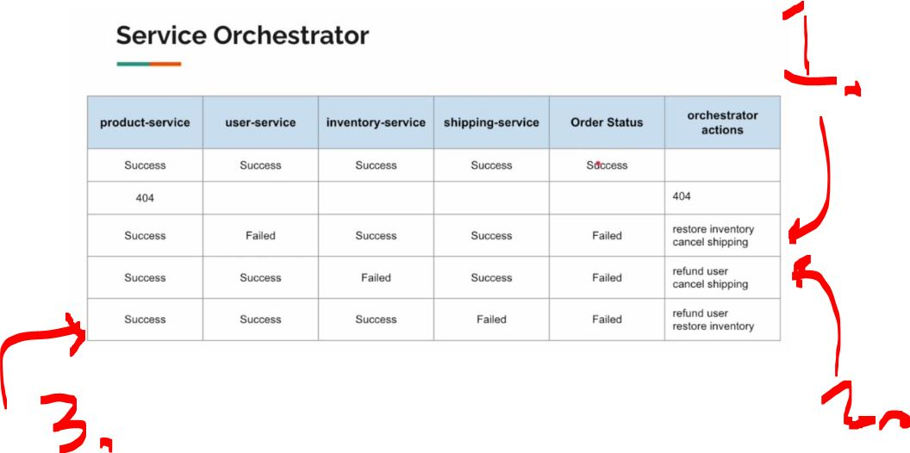
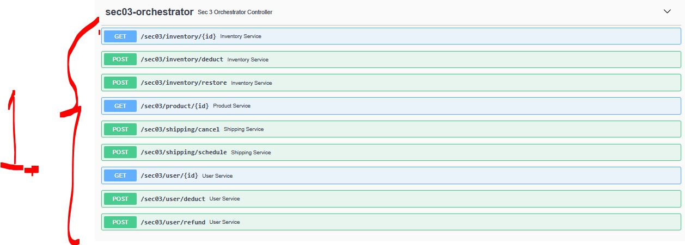
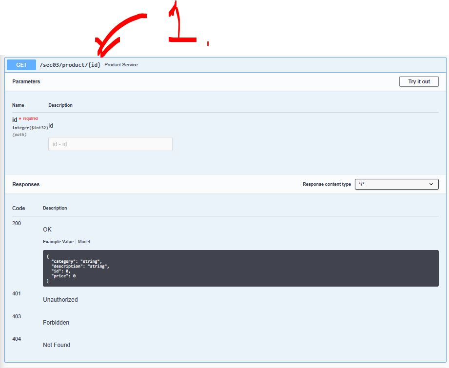
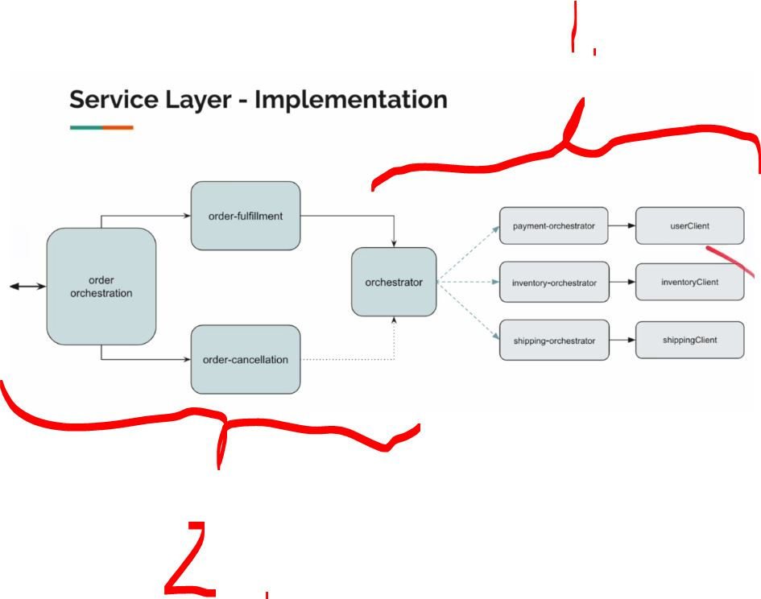

# Section 04: Orchestrator Saga: Distributed Transactions & Parallel Workflow.

Section 04: Orchestrator Saga: Distributed Transactions & Parallel Workflow.

# What I Learned.

<div align="center">
    
</div>

1. We will be going thought **Orchestrator Pattern**! 

<div align="center">
    
</div>

1. The **order** is **being queried**, the is **multiple downstream services**!
2. There is different order service logic regards to these

<div align="center">
    
</div>

1. There will be some **validation** and **saved into database**!
    - Notice the order is saved as `created`, not `successful` or `failed`! 
2. We can **separate logic** into another service!
    - This can make as **parallel calls**! 
    - Now, if in the `2.1` some service fails, example of the `inventory` is failing!
        - The **orchestrator** needs to coordinate to **roll back** the `shipping` and the `payment`!
            - Cancel the **shipping** and refund the **payment**!

<div align="center">
    
</div>

1. We will be implementing this **orchestrator**!

<div align="center">
    
</div>

1. We have the matrix for actions that will be taken!
2. There is the **orchestrator actions**, which is being taken!
3. If, the `product-service` is having the **success** status, all the other should be also be **successful**!
4. **404** from `product-service`, the orchestrator will take **404** action! 

<div align="center">
    
</div>

1. When the `user-service` is failing, We need to **restore inventory** and the **cancel the shipping**!
2. When the `inventory-service` is failing, We need to **refund the user** and the **cancel shipping**!
3. add here

# Orchestrator Pattern - Intro.

<div align="center">
    
</div>

1. To illustrate this, we will have **multiple endpoints**!

<div align="center">
    
</div>

1. We have simple product endpoint for **GET**!
    ````Java
    {
    "id": 1,
    "category": "Books",
    "description": "Heavy Duty Paper Table",
    "price": 37
    }
    ````


add user


# Orchestrator Scope.

# External Services.

# Creating DTO - Part 01.

# Creating DTO - Part 02.

# Creating Service Clients - Part 01.

# Creating Service Clients - Part 02.

# Orchestrator Request Context.

# Util Class.

# Orchestrator Pattern Implementation - High Level Architecture.

# Payment Handler.

# Inventory and Shipping Handlers.

# Order Fulfillment Service.

# Order Cancellation Service.

# Order Orchestrator Service.

... add here the other captions


# Summary.

- add here the first pic


<div align="center">
    
</div>

1. **Upstream** services! 
2. The different implementations of the **orchestration implementations**! 


- The project code, for **add here** below!


<details>
<summary id="changeThis_patter" open="true"> <b> change this pattern project files!</b> </summary>

#### ReviewClient.java

````Java

````

#### ProductClient.java

````Java

````

#### ProductAggregatorService.java

```Java

```

#### ProductAggregateController.java

```Java

```

#### Product.java

````Java

````

#### ProductAggregate.java

````Java

````

#### Review.java 

````Java

````

</details>
