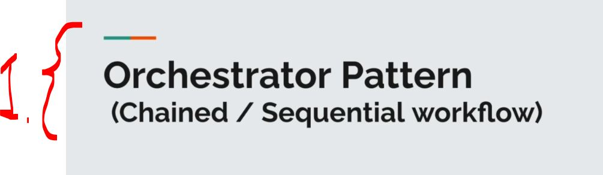

# Section 05: Orchestrator Saga: Distributed Transactions & Sequential Workflow.

Section 05: Orchestrator Saga: Distributed Transactions & Sequential Workflow.

# What I Learned.

<div align="center">
    
</div>

1. This is **small variation** of **orchestration patter**! This **chained patter**!


- The project code, for **add here** below!


<details>
<summary id="changeThis_patter" open="true"> <b> change this pattern project files!</b> </summary>

#### ReviewClient.java

````Java

````

#### ProductClient.java

````Java

````

#### ProductAggregatorService.java

```Java

```

#### ProductAggregateController.java

```Java

```

#### Product.java

````Java

````

#### ProductAggregate.java

````Java

````

#### Review.java 

````Java

````

</details>
