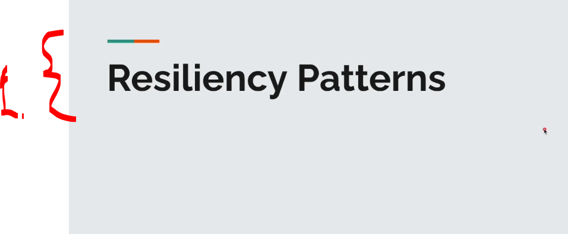
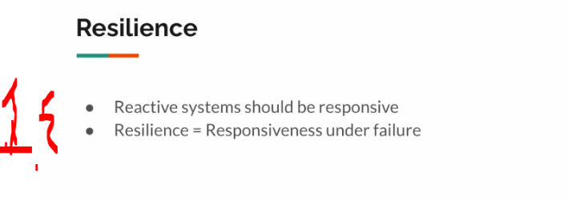
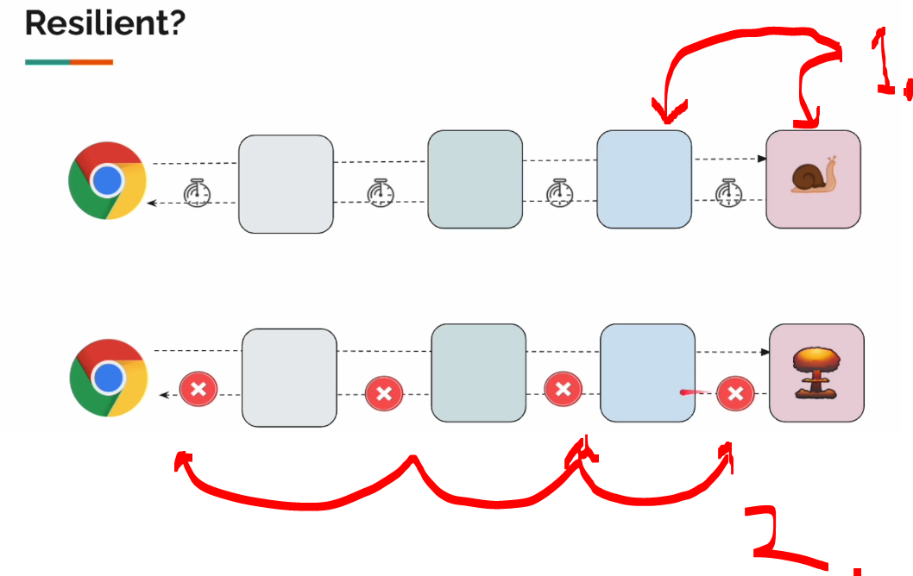
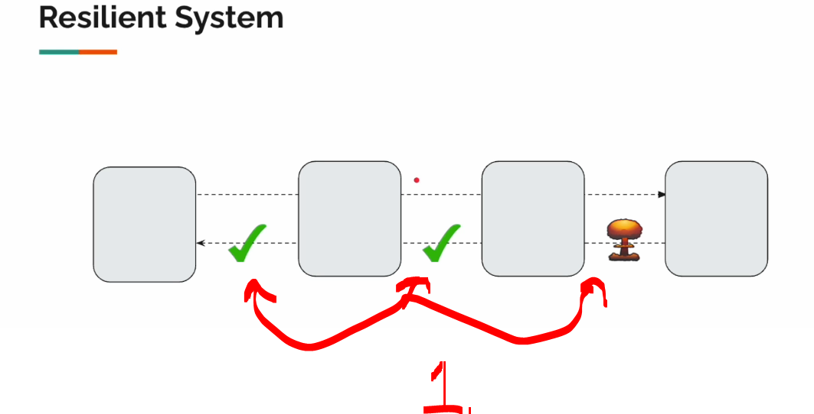
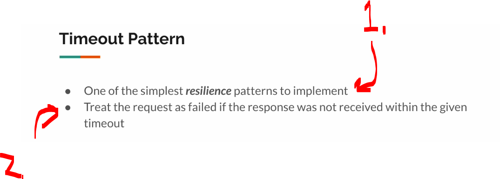
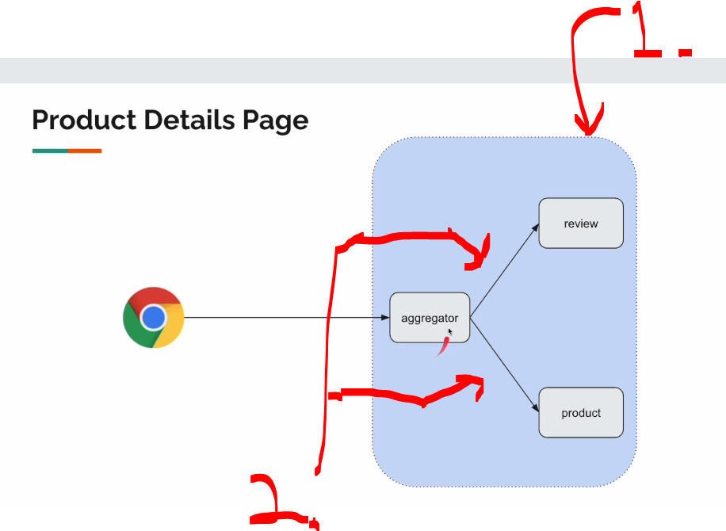

# Section 07: Reactive Resilience: Timeout Pattern.

Section 07: Reactive Resilience: Timeout Pattern.

# What I Learned.

# Resiliency Pattern - Intro.

<div align="center">
    
</div>

1. Now will focus from **integration patters** to the **resilience patterns**!

<div align="center">
    
</div>

1. What is resilience:
    - It means to **respond** even in **case of the failure**!

<div align="center">
    
</div>

1. If there is **slow responding** or **malfunctioning service**!
    - The **previous service** would be waiting this service to **respond**!
        - Our **browser** will wait for the answer!
2. If there is error in one of service, it would be **propagated** to **others services** ... etc!

<div align="center">
    
</div>

1. Our system response timely manner, even if there will be error!
    - **500 error** will be thrown, the previous will handle it goodly!
        - This can be handled with **default values**, or **cached values** etc!

# Timeout Pattern.

<div align="center">
    
</div>

1. This is **simple pattern** to implement!
2. There will be some **timeout**, in which after we are expected to react, with either **default value** or some other way!

<div align="center">
    
</div>

1. In large organization, there are **multiple services** with the teams!
2. We can set **timeouts**, into these calls which are going to be called!
    - If no response, we can define **behavior** for `aggregator` to react!

- return here after gateway aggrigator


# Project Setup.

# Timeout Pattern Implementation.

# Timeout Pattern Demo.

# Summary.


- The project code, for **add here** below!


<details>
<summary id="changeThis_patter" open="true"> <b> change this pattern project files!</b> </summary>

#### ReviewClient.java

````Java

````

#### ProductClient.java

````Java

````

#### ProductAggregatorService.java

```Java

```

#### ProductAggregateController.java

```Java

```

#### Product.java

````Java

````

#### ProductAggregate.java

````Java

````

#### Review.java 

````Java

````

</details>
