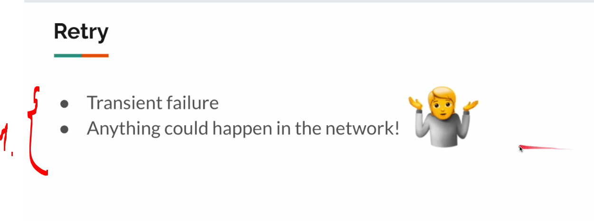
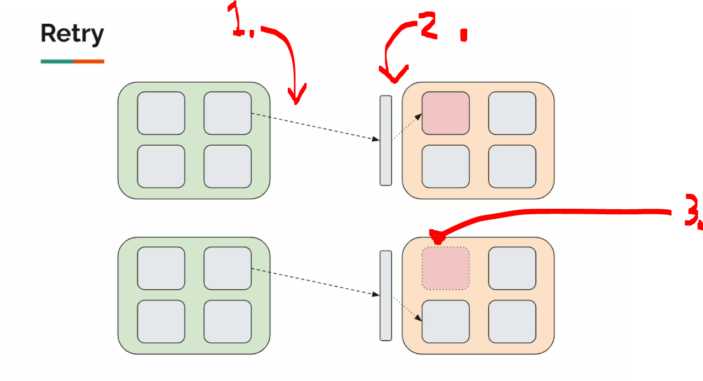
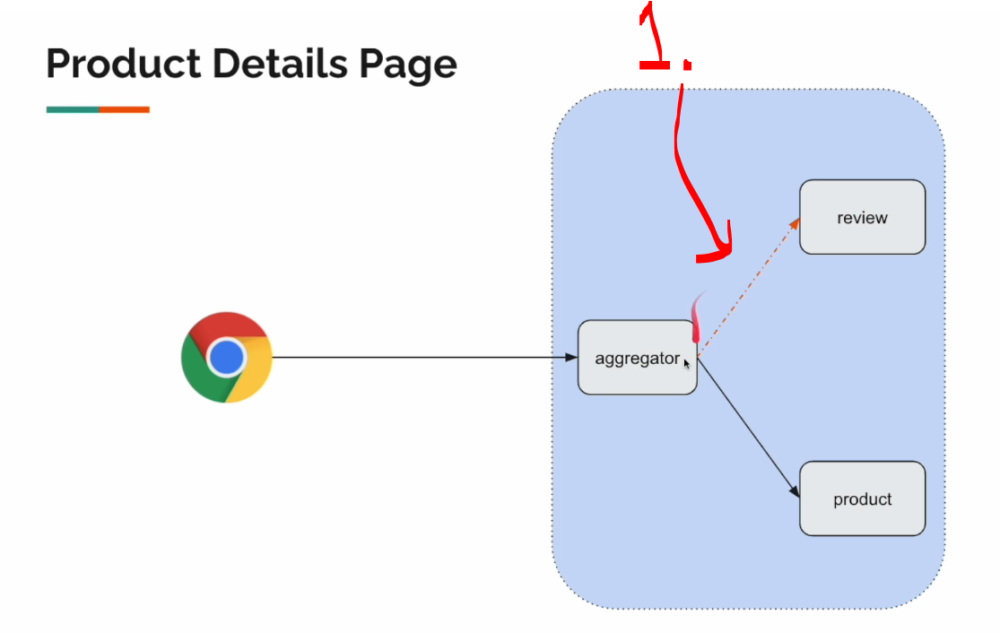
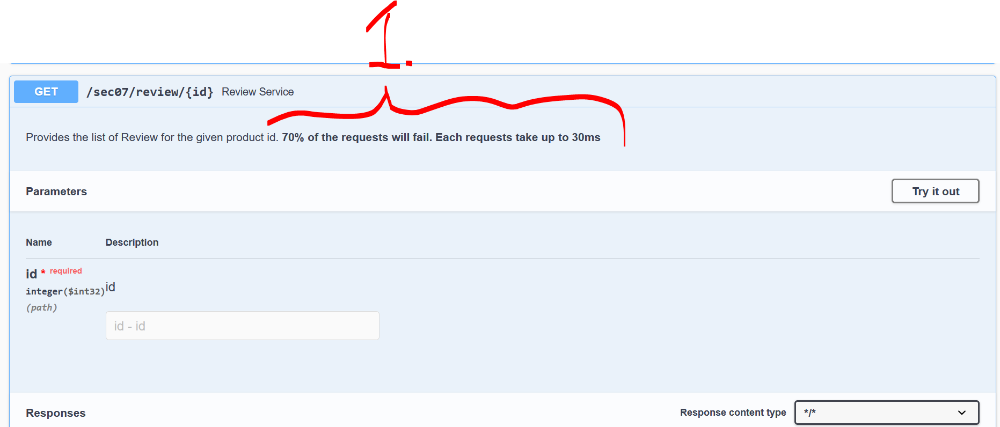
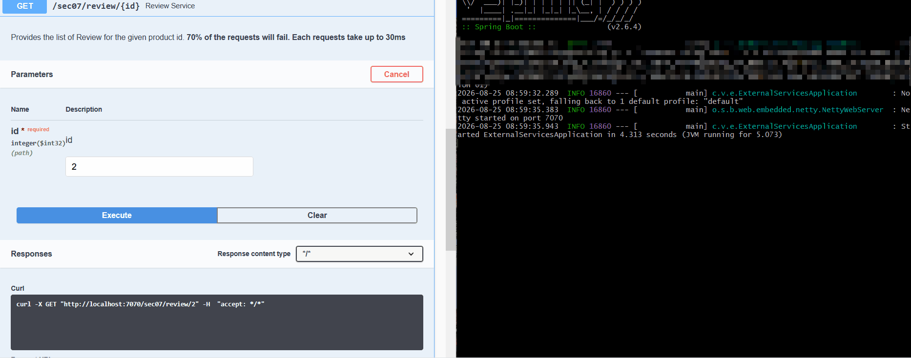

# Section 08: Reactive Resilience: Retry Pattern for Fault Tolerance.

Section 08: Reactive Resilience: Retry Pattern for Fault Tolerance.

# What I Learned.

# Retry Pattern - Intro.

    

1. Retry is just one resilience pattern!

    

1. In microservice world, there can be **multiple network** calls! There can be multiple calls.

    

1. Service.
2. Load Balancer.
3. If one instance of service is down, might try to make the **retry** to **another instance**!
    - Same error is not happing from same service!

    

1. There will be **some issues** in ether to review service!
    - We will be implementing the retry pattern!

    

1. We will be testing this endpoint:
    - `70%` of the requests will fail. Each requests take up to `30ms`!

    

1. We can see most of these failing, it should be around the **70%** times!

# External Services.

# Project Setup.

# Retry Pattern Implementation Demo.

# 4XX Issue Fix.

# Quick Note On Retry Spec.

# Summary.