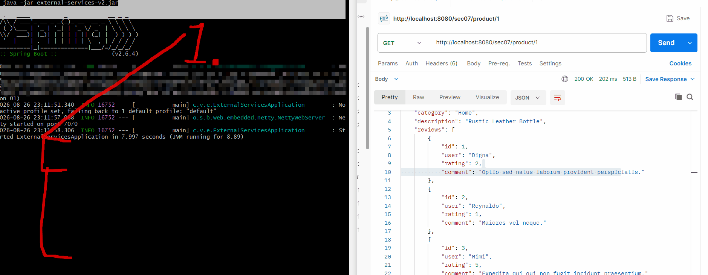
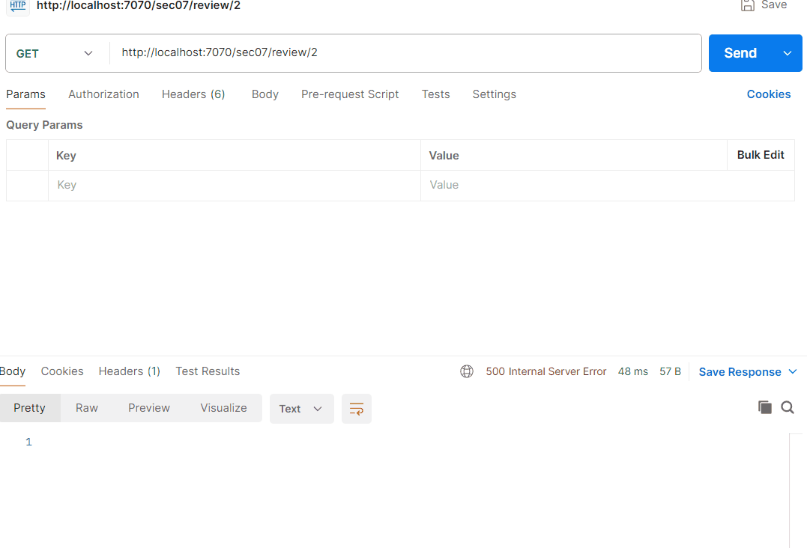
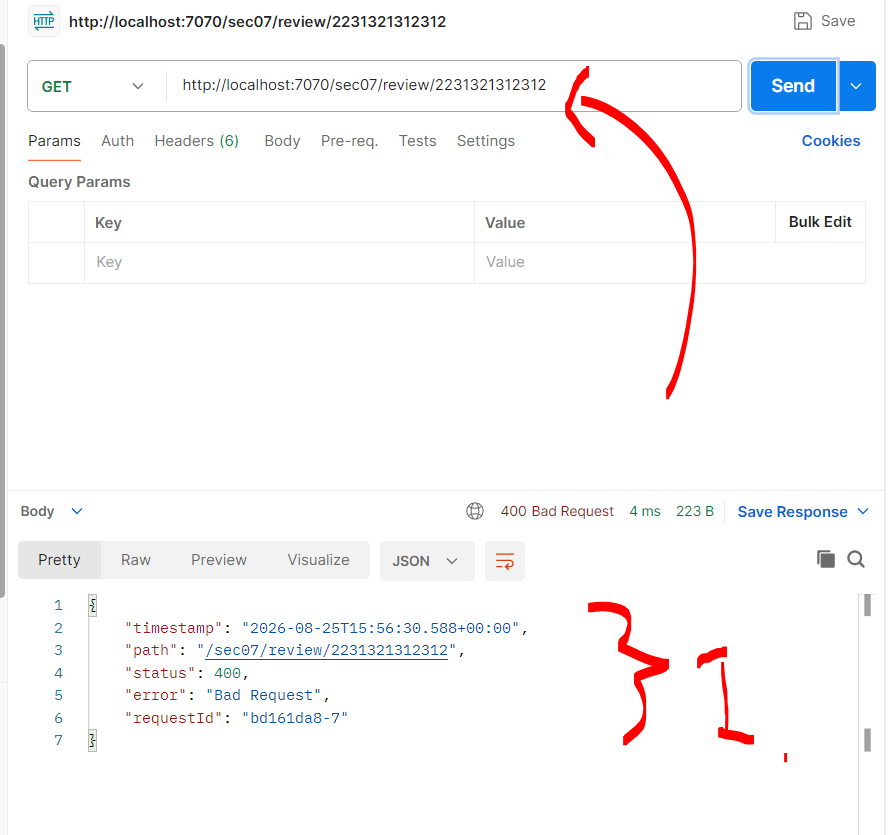
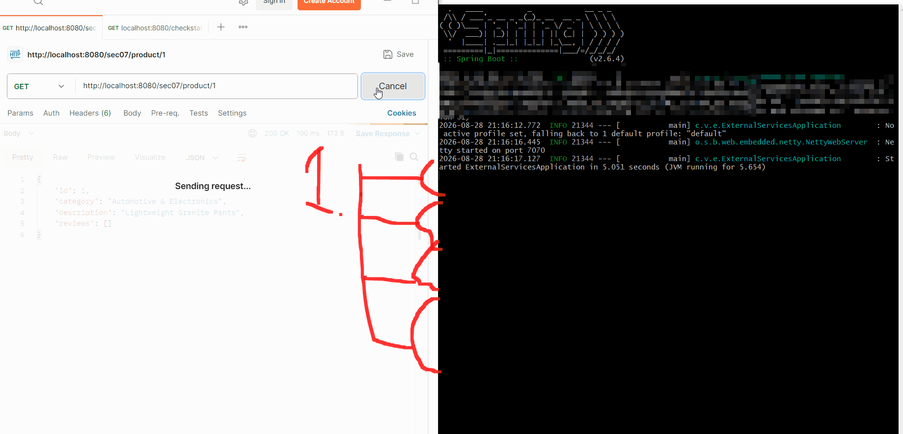
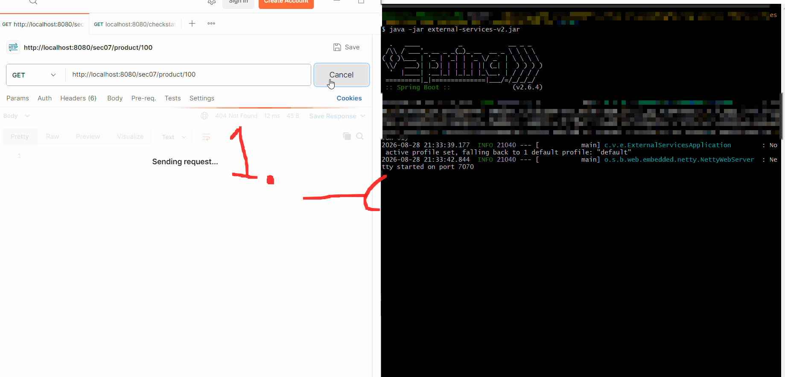
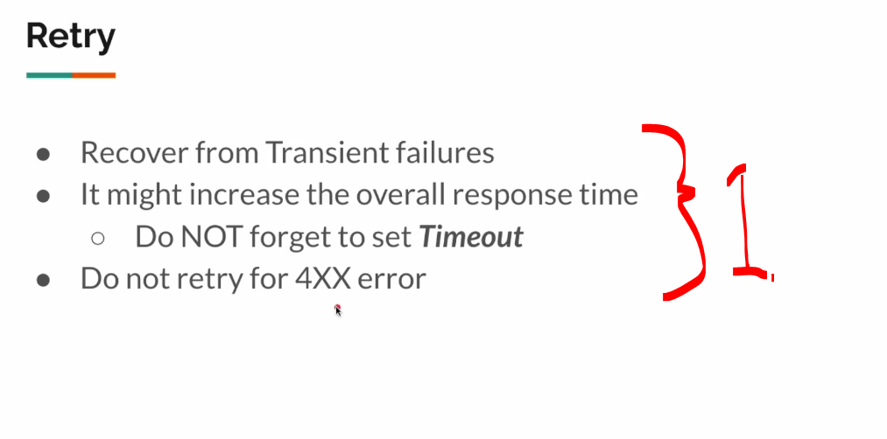

# Section 08: Reactive Resilience: Retry Pattern for Fault Tolerance.

Section 08: Reactive Resilience: Retry Pattern for Fault Tolerance.

# What I Learned.

# Retry Pattern - Intro.

<div align="center">
    
</div>

1. Retry is just one resilience pattern!

<div align="center">
    
</div>

1. In microservice world, there can be **multiple network** calls! There can be multiple calls.

<div align="center">
    
</div>

1. Service.
2. Load Balancer.
3. If one instance of service is down, might try to make the **retry** to **another instance**!
    - Same error is not happing from same service!

<div align="center">
    
</div>

1. There will be **some issues** in ether to review service!
    - We will be implementing the retry pattern!

# External Services.

<div align="center">
    
</div>

1. We will be testing this endpoint:
    - `70%` of the requests will fail. All requests take up to `30ms`!

<div align="center">
    
</div>

1. We can see most of these failing, it should be around the **70%** times!

# Project Setup.

- We are testing this, with the external service:

<div align="center">
    
</div>

1. We can see it fails sometimes!

<details>
<summary id="retry_patter" open="true"> <b> Retry pattern project files!</b> </summary>

#### ReviewClient.java

````Java
package com.vinsguru.webfluxpatterns.sec07.client;

import com.vinsguru.webfluxpatterns.sec07.dto.Review;
import org.springframework.beans.factory.annotation.Value;
import org.springframework.http.HttpStatus;
import org.springframework.http.HttpStatusCode;
import org.springframework.stereotype.Service;
import org.springframework.web.reactive.function.client.WebClient;
import reactor.core.publisher.Mono;

import java.time.Duration;
import java.util.Collections;
import java.util.List;

@Service
public class ReviewClient {

    private final WebClient client;

    public ReviewClient(@Value("${sec07.review.service}") String baseUrl){
        this.client = WebClient.builder()
                               .baseUrl(baseUrl)
                               .build();
    }
    public Mono<List<Review>> getReviews(Integer id){
        return this.client
                .get()
                .uri("{id}", id)
                .retrieve()
                .onStatus(HttpStatusCode::is4xxClientError, response -> Mono.empty())
                .bodyToFlux(Review.class)
                .collectList()
                .retry(5)
//                .timeout(Duration.ofMillis(300)) We will focus on retry!
                .onErrorReturn(Collections.emptyList());
    }
}
````

#### ProductClient.java

````Java
package com.vinsguru.webfluxpatterns.sec07.client;

import com.vinsguru.webfluxpatterns.sec07.dto.Product;
import org.springframework.beans.factory.annotation.Value;
import org.springframework.stereotype.Service;
import org.springframework.web.reactive.function.client.WebClient;
import reactor.core.publisher.Mono;
import java.time.Duration;

@Service
public class ProductClient {

    private final WebClient client;

    public ProductClient(@Value("${sec07.product.service}") String baseUrl){
        this.client = WebClient.builder()
                               .baseUrl(baseUrl)
                               .build();
    }
    public Mono<Product> getProduct(Integer id){
        return this.client
                .get()
                .uri("{id}", id)
                .retrieve()
                .bodyToMono(Product.class)
                .onErrorResume(ex -> Mono.empty());
    }
}
````

#### ProductAggregatorService.java

```Java
package com.vinsguru.webfluxpatterns.sec07.service;

import com.vinsguru.webfluxpatterns.sec07.client.ProductClient;
import com.vinsguru.webfluxpatterns.sec07.client.ReviewClient;
import com.vinsguru.webfluxpatterns.sec07.dto.Product;
import com.vinsguru.webfluxpatterns.sec07.dto.ProductAggregate;
import com.vinsguru.webfluxpatterns.sec07.dto.Review;
import org.springframework.beans.factory.annotation.Autowired;
import org.springframework.stereotype.Service;
import reactor.core.publisher.Mono;
import java.util.List;

@Service
public class ProductAggregatorService {
    @Autowired
    private ProductClient productClient;
    @Autowired
    private ReviewClient reviewClient;

    public Mono<ProductAggregate> aggregate(Integer id){
        return Mono.zip(
               this.productClient.getProduct(id),
               this.reviewClient.getReviews(id)
        )
        .map(t -> toDto(t.getT1(), t.getT2()));
    }

    private ProductAggregate toDto(Product product, List<Review> reviews){
        return ProductAggregate.create(
                product.getId(),
                product.getCategory(),
                product.getDescription(),
                reviews
        );
    }
}
```

#### ProductAggregateController.java

```Java

package com.vinsguru.webfluxpatterns.sec07.controller;

import com.vinsguru.webfluxpatterns.sec07.dto.ProductAggregate;
import com.vinsguru.webfluxpatterns.sec07.service.ProductAggregatorService;
import org.springframework.beans.factory.annotation.Autowired;
import org.springframework.http.ResponseEntity;
import org.springframework.web.bind.annotation.GetMapping;
import org.springframework.web.bind.annotation.PathVariable;
import org.springframework.web.bind.annotation.RequestMapping;
import org.springframework.web.bind.annotation.RestController;
import reactor.core.publisher.Mono;

@RestController
@RequestMapping("sec07")
public class ProductAggregateController {

    @Autowired
    private ProductAggregatorService service;

    @GetMapping("product/{id}")
    public Mono<ResponseEntity<ProductAggregate>> getProductAggregate(@PathVariable Integer id){
        return this.service.aggregate(id)
                .map(ResponseEntity::ok)
                .defaultIfEmpty(ResponseEntity.notFound().build());
    }
}
```

#### Product.java

````Java
package com.vinsguru.webfluxpatterns.sec07.dto;

import lombok.Data;
import lombok.ToString;

@Data
@ToString
public class Product {
    private Integer id;
    private String category;
    private String description;
    private Integer price;
}
````

#### ProductAggregate.java

````Java
package com.vinsguru.webfluxpatterns.sec07.dto;

import lombok.AllArgsConstructor;
import lombok.Data;
import lombok.NoArgsConstructor;
import lombok.ToString;

import java.util.List;

@Data
@ToString
@NoArgsConstructor
@AllArgsConstructor(staticName = "create")
public class ProductAggregate {
    private Integer id;
    private String category;
    private String description;
    private List<Review> reviews;
}
````

#### Review.java 

````Java
package com.vinsguru.webfluxpatterns.sec07.dto;

import lombok.Data;
import lombok.ToString;

@Data
@ToString
public class Review {

    private Integer id;
    private String user;
    private Integer rating;
    private String comment;
}
````

</details>

# Retry Pattern Implementation Demo.

- We are testing this, with the external service:

<div align="center">
    
</div>

- We can see that this endpoint not always returning something!
    - It is `70%` of the **time failing**!

<div align="center">
    
</div>

1. We can see that there is no point of **retrying** something that is not found!
    - Such as client side of error!

# 4XX Issue Fix.

- Lets fix the client side error!

#### ReviewClient.java

````Java
    public Mono<List<Review>> getReviews(Integer id){
        return this.client
                .get()
                .uri("{id}", id)
                .retrieve()
                .onStatus(HttpStatusCode::is4xxClientError, response -> Mono.empty())
                .bodyToFlux(Review.class)
                .collectList()
                .retry(5)
//                .timeout(Duration.ofMillis(300)) We will focus on retry!
                .onErrorReturn(Collections.emptyList());
    }
````

- We can use the:
    - `.onStatus(...)` can match many different HTTP status codes, depending on your predicate.

- We will use:
    - `.onStatus(HttpStatusCode::is4xxClientError, response -> Mono.empty())` If the server responds with any **4xx status**, just return `Mono.empty()`.

- `.collectList()` transform the `Flux<Review>` to `Mono<List<Review>>`!
    ````Bash
    HTTP response
        ↓
    bodyToFlux(Review.class)
        ↓
    Flux<Review>
        ↓
    collectList()
        ↓
    Mono<List<Review>>
    ````

- When ever we are using the `.retry(5)`, it will add **5 seconds** extra to time executed!
    - For that It's recommended to add **timeouts**!
        - Example of timeout: `.timeout(Duration.ofMillis(300))`!
            - We give every request of **300 milliseconds**, treat it as an error!

- We will be illustrating **retry** happening:

<div align="center">
    
</div>

1. We can see that if there is **error** happening, we are still **retrying**! In the end it will be **success**!
    - `.retry(5)`!

- We will be illustrating **retry** should not be happening!

<div align="center">
    
</div>

1. If there is **Client Error** we are not trying to retry this! 
    - `.onStatus(HttpStatusCode::is4xxClientError, response -> Mono.empty())`!

# Quick Note On Retry Spec.

- Sometimes we would want to **wait** some time, **before** trying to **retry!
    - We can use `.retryWhen(Retry.fixedDelay(5, Duration.ofSeconds(1)))`!
        - When there is **error**, retry up to 5 times, but wait **1 second** between each retry!

- Example of the client call:

````Java

    public Mono<List<Review>> getReviews(Integer id){
        return this.client
                .get()
                .uri("{id}", id)
                .retrieve()
                .onStatus(HttpStatusCode::is4xxClientError, response -> Mono.empty())
                .bodyToFlux(Review.class)
                .collectList()
                .retryWhen(Retry.fixedDelay(5, Duration.ofSeconds(1)))
                .retry(5)
                .timeout(Duration.ofMillis(300))
                .onErrorReturn(Collections.emptyList());
    }
````

# Summary.

<div align="center">
    
</div>

1. The summary:
    - Recover from transient failures!
    - It might increase the overall response time!
        - Do **NOT** forget to set **Timeout**⚠️
    - Do not retry for **4XX** error!

- The project code, for **retry patter** below!


<details>
<summary id="retry_patter" open="true"> <b> Retry pattern project files!</b> </summary>

#### ReviewClient.java

````Java
package com.vinsguru.webfluxpatterns.sec07.client;

import com.vinsguru.webfluxpatterns.sec07.dto.Review;
import org.springframework.beans.factory.annotation.Value;
import org.springframework.http.HttpStatus;
import org.springframework.http.HttpStatusCode;
import org.springframework.stereotype.Service;
import org.springframework.web.reactive.function.client.WebClient;
import reactor.core.publisher.Mono;

import java.time.Duration;
import java.util.Collections;
import java.util.List;

@Service
public class ReviewClient {

    private final WebClient client;

    public ReviewClient(@Value("${sec07.review.service}") String baseUrl){
        this.client = WebClient.builder()
                               .baseUrl(baseUrl)
                               .build();
    }
    public Mono<List<Review>> getReviews(Integer id){
        return this.client
                .get()
                .uri("{id}", id)
                .retrieve()
                .onStatus(HttpStatusCode::is4xxClientError, response -> Mono.empty())
                .bodyToFlux(Review.class)
                .collectList()
                .retry(5)
//                .timeout(Duration.ofMillis(300)) We will focus on retry!
                .onErrorReturn(Collections.emptyList());
    }
}
````

#### ProductClient.java

````Java
package com.vinsguru.webfluxpatterns.sec07.client;

import com.vinsguru.webfluxpatterns.sec07.dto.Product;
import org.springframework.beans.factory.annotation.Value;
import org.springframework.stereotype.Service;
import org.springframework.web.reactive.function.client.WebClient;
import reactor.core.publisher.Mono;
import java.time.Duration;

@Service
public class ProductClient {

    private final WebClient client;

    public ProductClient(@Value("${sec07.product.service}") String baseUrl){
        this.client = WebClient.builder()
                               .baseUrl(baseUrl)
                               .build();
    }
    public Mono<Product> getProduct(Integer id){
        return this.client
                .get()
                .uri("{id}", id)
                .retrieve()
                .bodyToMono(Product.class)
                .onErrorResume(ex -> Mono.empty());
    }
}
````

#### ProductAggregatorService.java

```Java
package com.vinsguru.webfluxpatterns.sec07.service;

import com.vinsguru.webfluxpatterns.sec07.client.ProductClient;
import com.vinsguru.webfluxpatterns.sec07.client.ReviewClient;
import com.vinsguru.webfluxpatterns.sec07.dto.Product;
import com.vinsguru.webfluxpatterns.sec07.dto.ProductAggregate;
import com.vinsguru.webfluxpatterns.sec07.dto.Review;
import org.springframework.beans.factory.annotation.Autowired;
import org.springframework.stereotype.Service;
import reactor.core.publisher.Mono;
import java.util.List;

@Service
public class ProductAggregatorService {
    @Autowired
    private ProductClient productClient;
    @Autowired
    private ReviewClient reviewClient;

    public Mono<ProductAggregate> aggregate(Integer id){
        return Mono.zip(
               this.productClient.getProduct(id),
               this.reviewClient.getReviews(id)
        )
        .map(t -> toDto(t.getT1(), t.getT2()));
    }

    private ProductAggregate toDto(Product product, List<Review> reviews){
        return ProductAggregate.create(
                product.getId(),
                product.getCategory(),
                product.getDescription(),
                reviews
        );
    }
}
```

#### ProductAggregateController.java

```Java

package com.vinsguru.webfluxpatterns.sec07.controller;

import com.vinsguru.webfluxpatterns.sec07.dto.ProductAggregate;
import com.vinsguru.webfluxpatterns.sec07.service.ProductAggregatorService;
import org.springframework.beans.factory.annotation.Autowired;
import org.springframework.http.ResponseEntity;
import org.springframework.web.bind.annotation.GetMapping;
import org.springframework.web.bind.annotation.PathVariable;
import org.springframework.web.bind.annotation.RequestMapping;
import org.springframework.web.bind.annotation.RestController;
import reactor.core.publisher.Mono;

@RestController
@RequestMapping("sec07")
public class ProductAggregateController {

    @Autowired
    private ProductAggregatorService service;

    @GetMapping("product/{id}")
    public Mono<ResponseEntity<ProductAggregate>> getProductAggregate(@PathVariable Integer id){
        return this.service.aggregate(id)
                .map(ResponseEntity::ok)
                .defaultIfEmpty(ResponseEntity.notFound().build());
    }
}
```

#### Product.java

````Java
package com.vinsguru.webfluxpatterns.sec07.dto;

import lombok.Data;
import lombok.ToString;

@Data
@ToString
public class Product {
    private Integer id;
    private String category;
    private String description;
    private Integer price;
}
````

#### ProductAggregate.java

````Java
package com.vinsguru.webfluxpatterns.sec07.dto;

import lombok.AllArgsConstructor;
import lombok.Data;
import lombok.NoArgsConstructor;
import lombok.ToString;

import java.util.List;

@Data
@ToString
@NoArgsConstructor
@AllArgsConstructor(staticName = "create")
public class ProductAggregate {
    private Integer id;
    private String category;
    private String description;
    private List<Review> reviews;
}
````

#### Review.java 

````Java
package com.vinsguru.webfluxpatterns.sec07.dto;

import lombok.Data;
import lombok.ToString;

@Data
@ToString
public class Review {

    private Integer id;
    private String user;
    private Integer rating;
    private String comment;
}
````

</details>
